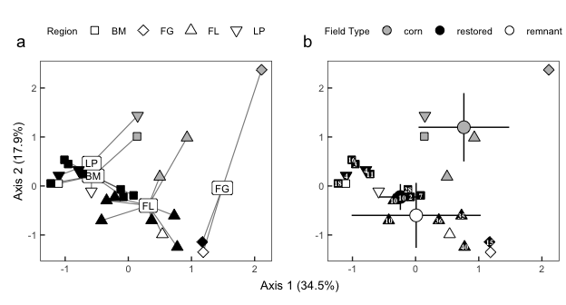

Soil properties
================
Beau Larkin

Last updated: 23 May, 2025

- [Description](#description)
- [Packages and libraries](#packages-and-libraries)
  - [Root path function](#root-path-function)
  - [Soil properties](#soil-properties)
- [Results](#results)
  - [Quantities in field types](#quantities-in-field-types)
  - [PCA ordination, variable correlations, and
    PERMANOVA](#pca-ordination-variable-correlations-and-permanova)
  - [Soil variable loadings and
    correlations](#soil-variable-loadings-and-correlations)

# Description

Soil nutrients were analyzed by [Ward Laboratories,
Inc.](https://www.wardlab.com/services/soil-health-analysis/), analysis
methods available in local files or at the link included here. Soil
organic matter is in percent determined by the loss-on-ignition method.
Soil pH is in a log scale as is typical, and all the other minerals are
in parts per million. This may need to be converted to $mg*kg^{-1}$ or
other unit.

This script provides a quick overview of the soil abiotic property data
and tests differences among field types based on soil properties.

# Packages and libraries

``` r
packages_needed <- c("tidyverse", "knitr", "vegan", "patchwork", "conflicted")

to_install <- setdiff(packages_needed, rownames(installed.packages()))
if (length(to_install)) install.packages(to_install)
invisible(lapply(packages_needed, library, character.only = TRUE))
```

## Root path function

``` r
root_path <- function(...) rprojroot::find_rstudio_root_file(...)
```

``` r
conflict_prefer("filter", "dplyr")
conflict_prefer("select", "dplyr")
conflict_prefer("diversity", "vegan")
```

``` r
source(root_path("resources", "styles.R"))
```

``` r
source(root_path("code", "functions.R"))
```

\#’ \# Data \## Site metadata and design

``` r
sites <- read_csv(root_path("clean_data/sites.csv"), show_col_types = FALSE) %>% 
    mutate(field_type = factor(field_type, levels = c("corn", "restored", "remnant")))
```

## Soil properties

``` r
soil <- read_csv(root_path("clean_data/soil.csv"), show_col_types = FALSE)[-c(26:27), ]
soil_units <- read_csv(root_path("clean_data/soil_units.csv"), show_col_types = FALSE)
```

# Results

## Quantities in field types

``` r
soil_ft_avg <- 
    soil %>% 
    left_join(sites %>% select(field_name, field_type), by = join_by(field_name)) %>% 
    select(-field_key) %>% 
    pivot_longer(pH:Na, names_to = "soil_property", values_to = "qty") %>% 
    group_by(field_type, soil_property) %>% 
    summarize(avg_qty = mean(qty), .groups = "drop") %>% 
    pivot_wider(names_from = "field_type", values_from = "avg_qty") %>% 
    left_join(soil_units, by = join_by(soil_property)) %>% 
    select(soil_property, units, everything()) %>% 
  rowwise() %>% mutate(cv = sd(c_across(corn:remnant)) / mean(c_across(corn:remnant)),
                       across(where(is.numeric), ~ round(.x, 2))) %>% 
  arrange(-cv)
```

## PCA ordination, variable correlations, and PERMANOVA

``` r
soil_z <- decostand(data.frame(soil[, -1], row.names = 1), "standardize")
soil_pca <- rda(soil_z)
summary(soil_pca)
```

    ## 
    ## Call:
    ## rda(X = soil_z) 
    ## 
    ## Partitioning of variance:
    ##               Inertia Proportion
    ## Total              13          1
    ## Unconstrained      13          1
    ## 
    ## Eigenvalues, and their contribution to the variance 
    ## 
    ## Importance of components:
    ##                          PC1    PC2    PC3    PC4     PC5     PC6     PC7     PC8     PC9     PC10     PC11    PC12     PC13
    ## Eigenvalue            4.4790 2.3301 1.7896 1.4132 1.16188 0.70120 0.38467 0.27747 0.20308 0.129286 0.069183 0.04186 0.019432
    ## Proportion Explained  0.3445 0.1792 0.1377 0.1087 0.08938 0.05394 0.02959 0.02134 0.01562 0.009945 0.005322 0.00322 0.001495
    ## Cumulative Proportion 0.3445 0.5238 0.6614 0.7701 0.85952 0.91346 0.94305 0.96440 0.98002 0.989963 0.995285 0.99851 1.000000

``` r
plot(soil_pca)
```

<!-- -->

Axes 1 and 2 explain 52% of the variation in sites. Axes 1 through 6
account for 91%.

## Soil variable loadings and correlations

Which soil properties explain the most variation among sites?

``` r
site_sco <- scores(soil_pca, display = "sites", choices = c(1,2))
soil_cor <- 
    data.frame(cor(soil_z, site_sco)) %>% 
    mutate(PCA_correlation = sqrt(PC1^2 + PC2^2)) %>% 
    arrange(-PCA_correlation) %>% 
    rownames_to_column(var = "soil_property") %>% 
  mutate(across(where(is.numeric), ~ round(.x, 2)))
```

Use the variable correlations to sort the soil property averages in a
table highlighting field types:

``` r
soil_ft_avg %>% 
    left_join(soil_cor %>% select(soil_property, PCA_cor = PCA_correlation), by = join_by(soil_property)) %>% 
  rowwise() %>% 
    mutate(cv = sd(c_across(corn:remnant)) / mean(c_across(corn:remnant)), 
           across(where(is.numeric), ~ round(.x, 2))) %>% 
  arrange(-cv) %>% 
    kable(format = "pandoc")
```

| soil_property | units                |    corn | restored | remnant |   cv | PCA_cor |
|:--------------|:---------------------|--------:|---------:|--------:|-----:|--------:|
| P             | mg/L (Mehlich P-III) |   64.40 |     8.06 |    5.50 | 1.28 |    0.95 |
| NO3           | mg/L                 |   21.54 |     5.07 |    4.38 | 0.94 |    0.85 |
| K             | mg/L                 |  214.40 |   111.62 |   96.00 | 0.46 |    0.57 |
| OM            | % LOI                |    4.68 |     5.26 |    7.28 | 0.24 |    0.95 |
| Ca            | mg/L                 | 2803.20 |  1992.75 | 2856.50 | 0.19 |    0.91 |
| Zn            | mg/L                 |    2.72 |     3.60 |    2.61 | 0.18 |    0.40 |
| SO4           | mg/L                 |   21.20 |    16.69 |   16.00 | 0.16 |    0.79 |
| Cu            | mg/L                 |    2.90 |     2.73 |    2.15 | 0.15 |    0.33 |
| Mn            | mg/L                 |   15.42 |    20.36 |   16.70 | 0.15 |    0.79 |
| Fe            | mg/L                 |   47.34 |    50.16 |   55.92 | 0.09 |    0.27 |
| Na            | mg/L                 |   15.00 |    13.31 |   13.75 | 0.06 |    0.52 |
| Mg            | mg/L                 |  562.40 |   556.56 |  512.75 | 0.05 |    0.87 |
| pH            | NULL                 |    6.88 |     6.42 |    6.68 | 0.03 |    0.72 |

Axis 1 & 2 eigenvalue proportions

``` r
eig_prop <- round(summary(soil_pca)$cont$importance[2, 1:2] * 100, 1)
soil_ord_scores <-
    site_sco %>%
    data.frame() %>% 
    rownames_to_column(var = "field_name") %>%
    left_join(sites, by = join_by(field_name))
```

PERMANOVA and plots with sites clustered in regions

``` r
soilperm_region <- soilperm(soil_ord_scores$region, "region")
```

    ## Set of permutations < 'minperm'. Generating entire set.

``` r
soilperm_region$mvdisper
```

    ## 
    ## Permutation test for homogeneity of multivariate dispersions
    ## Permutation: free
    ## Number of permutations: 1999
    ## 
    ## Response: Distances
    ##           Df  Sum Sq Mean Sq      F N.Perm Pr(>F)
    ## Groups     3  2.1805 0.72682 0.9061   1999  0.464
    ## Residuals 21 16.8447 0.80213                     
    ## 
    ## Pairwise comparisons:
    ## (Observed p-value below diagonal, permuted p-value above diagonal)
    ##         BM      FG      FL     LP
    ## BM         0.25100 0.60950 0.9195
    ## FG 0.24801         0.30550 0.5850
    ## FL 0.49846 0.32847         0.8060
    ## LP 0.90173 0.50644 0.76747

``` r
soilperm_region$gl_permtest
```

<div data-pagedtable="false">

<script data-pagedtable-source type="application/json">
{"columns":[{"label":[""],"name":["_rn_"],"type":[""],"align":["left"]},{"label":["Df"],"name":[1],"type":["dbl"],"align":["right"]},{"label":["SumOfSqs"],"name":[2],"type":["dbl"],"align":["right"]},{"label":["R2"],"name":[3],"type":["dbl"],"align":["right"]},{"label":["F"],"name":[4],"type":["dbl"],"align":["right"]},{"label":["Pr(>F)"],"name":[5],"type":["dbl"],"align":["right"]}],"data":[{"1":"3","2":"14.37445","3":"0.4068966","4":"4.802326","5":"0.001","_rn_":"region"},{"1":"21","2":"20.95259","3":"0.5931034","4":"NA","5":"NA","_rn_":"Residual"},{"1":"24","2":"35.32704","3":"1.0000000","4":"NA","5":"NA","_rn_":"Total"}],"options":{"columns":{"min":{},"max":[10]},"rows":{"min":[10],"max":[10]},"pages":{}}}
  </script>

</div>

``` r
soilperm_region$contrasts
```

<div data-pagedtable="false">

<script data-pagedtable-source type="application/json">
{"columns":[{"label":["group1"],"name":[1],"type":["chr"],"align":["left"]},{"label":["group2"],"name":[2],"type":["chr"],"align":["left"]},{"label":["R2"],"name":[3],"type":["dbl"],"align":["right"]},{"label":["F_value"],"name":[4],"type":["dbl"],"align":["right"]},{"label":["df1"],"name":[5],"type":["dbl"],"align":["right"]},{"label":["df2"],"name":[6],"type":["dbl"],"align":["right"]},{"label":["p_value"],"name":[7],"type":["dbl"],"align":["right"]},{"label":["p_value_adj"],"name":[8],"type":["dbl"],"align":["right"]}],"data":[{"1":"BM","2":"FG","3":"0.422","4":"7.307","5":"1","6":"10","7":"0.0035","8":"0.0105"},{"1":"BM","2":"FL","3":"0.350","4":"8.608","5":"1","6":"16","7":"0.0015","8":"0.0090"},{"1":"BM","2":"LP","3":"0.031","4":"0.348","5":"1","6":"11","7":"0.7685","8":"0.7685"},{"1":"FG","2":"FL","3":"0.184","4":"2.251","5":"1","6":"10","7":"0.0995","8":"0.1194"},{"1":"FG","2":"LP","3":"0.403","4":"3.381","5":"1","6":"5","7":"0.0330","8":"0.0495"},{"1":"FL","2":"LP","3":"0.353","4":"5.999","5":"1","6":"11","7":"0.0060","8":"0.0120"}],"options":{"columns":{"min":{},"max":[10]},"rows":{"min":[10],"max":[10]},"pages":{}}}
  </script>

</div>

``` r
soil_ord_reg_centers <- soil_ord_scores %>% 
  group_by(region) %>% 
  summarize(across(starts_with("PC"), list(mean = mean, ci_l = ci_l, ci_u = ci_u), .names = "{.fn}_{.col}"), .groups = "drop") %>% 
  mutate(across(c(ci_l_PC1, ci_u_PC1), ~ mean_PC1 + .x),
         across(c(ci_l_PC2, ci_u_PC2), ~ mean_PC2 + .x))
segs_regions <- soil_ord_scores %>%
  left_join(soil_ord_reg_centers, by = join_by(region)) %>% 
  select(x = PC1, y = PC2, xend = mean_PC1, yend = mean_PC2)

soil_ord_regions <- 
ggplot(soil_ord_scores, aes(x = PC1, y = PC2)) +
  geom_segment(data = segs_regions, aes(x = x, y = y, xend = xend, yend = yend), color = "gray30", linewidth = .4, alpha = .7) +
  geom_label(data = soil_ord_reg_centers, aes(x = mean_PC1, y = mean_PC2, label = region), size = 3) +
    geom_point(aes(fill = field_type, shape = region), size = sm_size, stroke = lw, show.legend = c(fill = FALSE, shape = TRUE)) +
    scale_fill_manual(name = "Field Type", values = c("gray", "black", "white")) +
    scale_shape_manual(name = "Region", values = c(22:25)) +
  xlab(paste0("Axis 1 (", eig_prop[1], "%)")) +
  ylab(paste0("Axis 2 (", eig_prop[2], "%)")) +
    theme_ord +
  guides(fill = guide_legend(override.aes = list(shape = 21))) +
  theme(legend.title = element_text(size = 8), legend.position = "top",
        plot.tag = element_text(size = 14, face = 1),
        plot.tag.position = c(0.03, 0.90))
```

PERMANOVA and plots with sites clustered in field types

``` r
soilperm_ft <- soilperm(soil_ord_scores$field_type, "field_type")
soilperm_ft$mvdisper
```

    ## 
    ## Permutation test for homogeneity of multivariate dispersions
    ## Permutation: free
    ## Number of permutations: 1999
    ## 
    ## Response: Distances
    ##           Df Sum Sq Mean Sq      F N.Perm Pr(>F)
    ## Groups     2 0.6288 0.31442 0.9035   1999  0.406
    ## Residuals 22 7.6560 0.34800                     
    ## 
    ## Pairwise comparisons:
    ## (Observed p-value below diagonal, permuted p-value above diagonal)
    ##             corn restored remnant
    ## corn              0.50300  0.6490
    ## restored 0.51780           0.1745
    ## remnant  0.65358  0.17408

``` r
soilperm_ft$gl_permtest
```

<div data-pagedtable="false">

<script data-pagedtable-source type="application/json">
{"columns":[{"label":[""],"name":["_rn_"],"type":[""],"align":["left"]},{"label":["Df"],"name":[1],"type":["dbl"],"align":["right"]},{"label":["SumOfSqs"],"name":[2],"type":["dbl"],"align":["right"]},{"label":["R2"],"name":[3],"type":["dbl"],"align":["right"]},{"label":["F"],"name":[4],"type":["dbl"],"align":["right"]},{"label":["Pr(>F)"],"name":[5],"type":["dbl"],"align":["right"]}],"data":[{"1":"2","2":"13.27672","3":"0.3758232","4":"6.623213","5":"0.001","_rn_":"field_type"},{"1":"22","2":"22.05032","3":"0.6241768","4":"NA","5":"NA","_rn_":"Residual"},{"1":"24","2":"35.32704","3":"1.0000000","4":"NA","5":"NA","_rn_":"Total"}],"options":{"columns":{"min":{},"max":[10]},"rows":{"min":[10],"max":[10]},"pages":{}}}
  </script>

</div>

``` r
soilperm_ft$contrasts
```

<div data-pagedtable="false">

<script data-pagedtable-source type="application/json">
{"columns":[{"label":["group1"],"name":[1],"type":["chr"],"align":["left"]},{"label":["group2"],"name":[2],"type":["chr"],"align":["left"]},{"label":["R2"],"name":[3],"type":["dbl"],"align":["right"]},{"label":["F_value"],"name":[4],"type":["dbl"],"align":["right"]},{"label":["df1"],"name":[5],"type":["dbl"],"align":["right"]},{"label":["df2"],"name":[6],"type":["dbl"],"align":["right"]},{"label":["p_value"],"name":[7],"type":["dbl"],"align":["right"]},{"label":["p_value_adj"],"name":[8],"type":["dbl"],"align":["right"]}],"data":[{"1":"restored","2":"corn","3":"0.399","4":"12.616","5":"1","6":"19","7":"0.0005","8":"0.0015"},{"1":"restored","2":"remnant","3":"0.037","4":"0.695","5":"1","6":"18","7":"0.4255","8":"0.4255"},{"1":"corn","2":"remnant","3":"0.462","4":"6.009","5":"1","6":"7","7":"0.0175","8":"0.0263"}],"options":{"columns":{"min":{},"max":[10]},"rows":{"min":[10],"max":[10]},"pages":{}}}
  </script>

</div>

``` r
soil_ord_ft_centers <- soil_ord_scores %>% 
  group_by(field_type) %>% 
  summarize(across(starts_with("PC"), list(mean = mean, ci_l = ci_l, ci_u = ci_u), .names = "{.fn}_{.col}"), .groups = "drop") %>% 
  mutate(across(c(ci_l_PC1, ci_u_PC1), ~ mean_PC1 + .x),
         across(c(ci_l_PC2, ci_u_PC2), ~ mean_PC2 + .x))

soil_ord_ftypes <- 
    ggplot(soil_ord_scores, aes(x = PC1, y = PC2)) +
    geom_linerange(data = soil_ord_ft_centers, aes(x = mean_PC1, y = mean_PC2, xmin = ci_l_PC1, xmax = ci_u_PC1), linewidth = lw) +
    geom_linerange(data = soil_ord_ft_centers, aes(x = mean_PC1, y = mean_PC2, ymin = ci_l_PC2, ymax = ci_u_PC2), linewidth = lw) +
    geom_point(data = soil_ord_ft_centers, aes(x = mean_PC1, y = mean_PC2, fill = field_type), size = lg_size, stroke = lw, shape = 21, show.legend = c(fill = FALSE, shape = TRUE)) +
  geom_point(aes(fill = field_type, shape = region), size = sm_size, stroke = lw, show.legend = c(fill = TRUE, shape = FALSE)) +
  geom_text(aes(label = yr_since), size = yrtx_size, family = "serif", fontface = 2, color = "white") +
    scale_fill_manual(name = "Field Type", values = c("gray", "black", "white")) +
    scale_shape_manual(name = "Region", values = c(22:25)) +
  xlab(paste0("Axis 1 (", eig_prop[1], "%)")) +
  ylab(paste0("Axis 2 (", eig_prop[2], "%)")) +
    theme_ord +
  guides(fill = guide_legend(override.aes = list(shape = 21))) +
  theme(legend.title = element_text(size = 8), legend.position = "top",
        plot.tag = element_text(size = 14, face = 1),
        plot.tag.position = c(-0.03, 0.90))
```

``` r
figS2 <- (soil_ord_regions | plot_spacer() | soil_ord_ftypes) +
  plot_layout(widths = c(1, 0.1, 1), axis_titles = "collect") +
  plot_annotation(tag_levels = 'a')
figS2
```

<!-- -->

``` r
ggsave(root_path("figs", "figS2.png"),
       plot = figS2,
       width = 7.5,
       height = 4.25,
       units = "in",
       dpi = 600)
```
