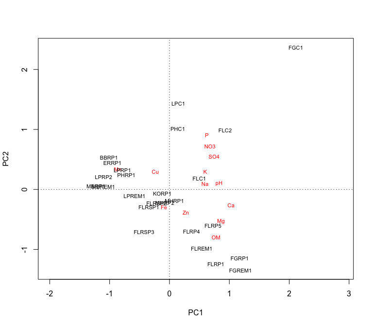
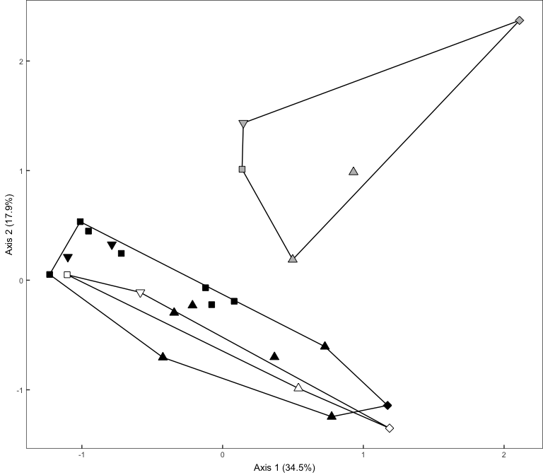
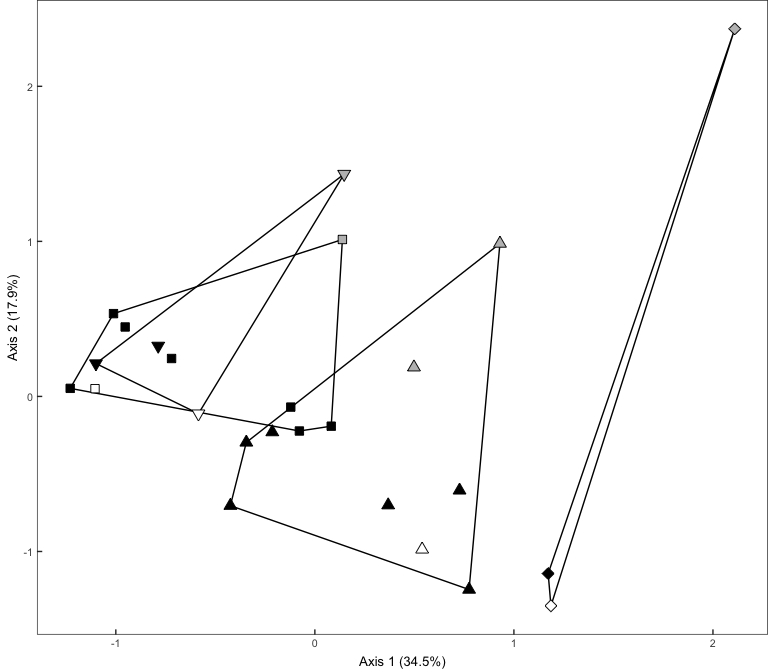
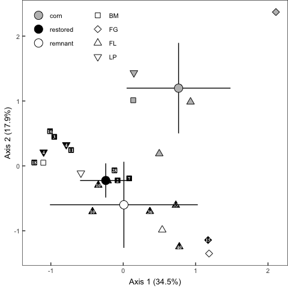

Soil properties
================
Beau Larkin

Last updated: 15 May, 2025

- [Description](#description)
- [Packages and libraries](#packages-and-libraries)
  - [Root path function](#root-path-function)
- [Functions](#functions)
  - [Confidence intervals](#confidence-intervals)
  - [Soil properties](#soil-properties)
- [Results](#results)
  - [Quantities in field types](#quantities-in-field-types)
  - [PCA ordination, variable correlations, and
    PERMANOVA](#pca-ordination-variable-correlations-and-permanova)
  - [Soil variable loadings and
    correlations](#soil-variable-loadings-and-correlations)

# Description

Soil nutrients were analyzed by [Ward Laboratories,
Inc.](https://www.wardlab.com/services/soil-health-analysis/), analysis
methods available in local files or at the link included here. Soil
organic matter is in percent determined by the loss-on-ignition method.
Soil pH is in a log scale as is typical, and all the other minerals are
in parts per million. This may need to be converted to $mg*kg^{-1}$ or
other unit.

This script provides a quick overview of the soil abiotic property data
and tests differences among field types based on soil properties.

# Packages and libraries

``` r
packages_needed <- c("tidyverse", "knitr", "vegan")

to_install <- setdiff(packages_needed, rownames(installed.packages()))
if (length(to_install)) install.packages(to_install)
invisible(lapply(packages_needed, library, character.only = TRUE))
```

## Root path function

``` r
root_path <- function(...) rprojroot::find_rstudio_root_file(...)
```

``` r
conflict_prefer("filter", "dplyr")
conflict_prefer("select", "dplyr")
conflict_prefer("diversity", "vegan")
```

``` r
source(root_path("resources", "styles.R"))
```

# Functions

## Confidence intervals

Calculate upper and lower confidence intervals with alpha=0.05

``` r
ci_u <- function(x) {(sd(x) / sqrt(length(x))) * qnorm(0.975)}
ci_l <- function(x) {(sd(x) / sqrt(length(x))) * qnorm(0.025)}
```

\#’ \# Data \## Site metadata and design

``` r
sites <- read_csv(root_path("clean_data/sites.csv"), show_col_types = FALSE) %>% 
    mutate(field_type = factor(field_type, levels = c("corn", "restored", "remnant")))
```

## Soil properties

``` r
soil <- read_csv(root_path("clean_data/soil.csv"), show_col_types = FALSE)[-c(26:27), ]
soil_units <- read_csv(root_path("clean_data/soil_units.csv"), show_col_types = FALSE)
```

# Results

## Quantities in field types

``` r
soil_ft_avg <- 
    soil %>% 
    left_join(sites %>% select(field_name, field_type), by = join_by(field_name)) %>% 
    select(-field_key) %>% 
    pivot_longer(pH:Na, names_to = "soil_property", values_to = "qty") %>% 
    group_by(field_type, soil_property) %>% 
    summarize(avg_qty = mean(qty), .groups = "drop") %>% 
    pivot_wider(names_from = "field_type", values_from = "avg_qty") %>% 
    left_join(soil_units, by = join_by(soil_property)) %>% 
    select(soil_property, units, everything())
```

## PCA ordination, variable correlations, and PERMANOVA

``` r
soil_z <- decostand(data.frame(soil[, -1], row.names = 1), "standardize")
soil_pca <- rda(soil_z)
summary(soil_pca)
```

    ## 
    ## Call:
    ## rda(X = soil_z) 
    ## 
    ## Partitioning of variance:
    ##               Inertia Proportion
    ## Total              13          1
    ## Unconstrained      13          1
    ## 
    ## Eigenvalues, and their contribution to the variance 
    ## 
    ## Importance of components:
    ##                          PC1    PC2    PC3    PC4     PC5     PC6     PC7     PC8     PC9     PC10     PC11    PC12     PC13
    ## Eigenvalue            4.4790 2.3301 1.7896 1.4132 1.16188 0.70120 0.38467 0.27747 0.20308 0.129286 0.069183 0.04186 0.019432
    ## Proportion Explained  0.3445 0.1792 0.1377 0.1087 0.08938 0.05394 0.02959 0.02134 0.01562 0.009945 0.005322 0.00322 0.001495
    ## Cumulative Proportion 0.3445 0.5238 0.6614 0.7701 0.85952 0.91346 0.94305 0.96440 0.98002 0.989963 0.995285 0.99851 1.000000

``` r
plot(soil_pca)
```

<!-- -->

Axes 1 and 2 explain 52% of the variation in sites. Axes 1 through 6
account for 91%.

## Soil variable loadings and correlations

Which soil properties explain the most variation among sites?

``` r
site_sco <- scores(soil_pca, display = "sites", choices = c(1,2))

soil_cor <- 
    data.frame(cor(soil_z, site_sco)) %>% 
    mutate(PCA_correlation = sqrt(PC1^2 + PC2^2)) %>% 
    arrange(-PCA_correlation) %>% 
    rownames_to_column(var = "soil_property")
```

Use the variable correlations to sort the soil property averages in a
table highlighting field types:

``` r
soil_ft_avg %>% 
    left_join(soil_cor %>% select(soil_property, PCA_correlation), by = join_by(soil_property)) %>% 
    arrange(-PCA_correlation) %>% 
    mutate(across(where(is.numeric), ~ round(.x, 2))) %>% 
    select(PCA_correlation, everything()) %>% 
    kable(format = "pandoc")
```

| PCA_correlation | soil_property | units                |    corn | restored | remnant |
|----------------:|:--------------|:---------------------|--------:|---------:|--------:|
|            0.95 | OM            | % LOI                |    4.68 |     5.26 |    7.28 |
|            0.95 | P             | mg/L (Mehlich P-III) |   64.40 |     8.06 |    5.50 |
|            0.91 | Ca            | mg/L                 | 2803.20 |  1992.75 | 2856.50 |
|            0.87 | Mg            | mg/L                 |  562.40 |   556.56 |  512.75 |
|            0.85 | NO3           | mg/L                 |   21.54 |     5.07 |    4.38 |
|            0.79 | Mn            | mg/L                 |   15.42 |    20.36 |   16.70 |
|            0.79 | SO4           | mg/L                 |   21.20 |    16.69 |   16.00 |
|            0.72 | pH            | NULL                 |    6.88 |     6.42 |    6.68 |
|            0.57 | K             | mg/L                 |  214.40 |   111.62 |   96.00 |
|            0.52 | Na            | mg/L                 |   15.00 |    13.31 |   13.75 |
|            0.40 | Zn            | mg/L                 |    2.72 |     3.60 |    2.61 |
|            0.33 | Cu            | mg/L                 |    2.90 |     2.73 |    2.15 |
|            0.27 | Fe            | mg/L                 |   47.34 |    50.16 |   55.92 |

Axis 1 & 2 eigenvalue proportions

``` r
eig_prop <- round(summary(soil_pca)$cont$importance[2, 1:2] * 100, 1)


soil_ord_scores <-
    site_sco %>%
    data.frame() %>% 
    rownames_to_column(var = "field_name") %>%
    left_join(sites, by = join_by(field_name))


soilperm <- function(clust_vec, clust_var) {
    #' ### Permanova
    soil_d <- dist(site_sco)
    
    # Test multivariate dispersions
    soil_disper <- betadisper(soil_d, clust_vec, bias.adjust = TRUE)
    soil_mvdisper <- permutest(soil_disper, pairwise = TRUE, permutations = 1999)
    # Global PERMANOVA
    soil_gl_permtest <- adonis2(
        as.formula(paste("soil_d ~", clust_var)),
        data = soil_ord_scores,
        permutations = 1999,
        by = "terms")
    # Pairwise PERMANOVA
    group_var <- as.character(clust_vec)
    groups <- as.data.frame(t(combn(unique(group_var), m = 2)))
    soil_contrasts <- data.frame(
        group1 = groups$V1,
        group2 = groups$V2,
        R2 = NA,
        F_value = NA,
        df1 = NA,
        df2 = NA,
        p_value = NA
    )
    for (i in seq(nrow(soil_contrasts))) {
        group_subset <-
            group_var == soil_contrasts$group1[i] |
            group_var == soil_contrasts$group2[i]
        contrast_d <- as.matrix(soil_d)[group_subset, group_subset]
        fit <- adonis2(
            contrast_d ~ group_var[group_subset],
            permutations = 1999,
            by = "terms")
        # Prepare contrasts table
        soil_contrasts$R2[i] <- round(fit[grep("group_var", rownames(fit)), "R2"], digits = 3)
        soil_contrasts$F_value[i] <- round(fit[grep("group_var", rownames(fit)), "F"], digits = 3)
        soil_contrasts$df1[i] <- fit[grep("group_var", rownames(fit)), "Df"]
        soil_contrasts$df2[i] <- fit[grep("Residual", rownames(fit)), "Df"]
        soil_contrasts$p_value[i] <- fit[grep("group_var", rownames(fit)), 5]
    }
    soil_contrasts$p_value_adj <- p.adjust(soil_contrasts$p_value, method = "fdr") %>% round(., 4)
    
    out = list(
        mvdisper = soil_mvdisper,
        gl_permtest = soil_gl_permtest,
        contrasts = soil_contrasts
    )
    
    return(out)
}


soilperm_field_type <- soilperm(soil_ord_scores$field_type, "field_type")
soilperm_field_type$gl_permtest
```

<div data-pagedtable="false">

<script data-pagedtable-source type="application/json">
{"columns":[{"label":[""],"name":["_rn_"],"type":[""],"align":["left"]},{"label":["Df"],"name":[1],"type":["dbl"],"align":["right"]},{"label":["SumOfSqs"],"name":[2],"type":["dbl"],"align":["right"]},{"label":["R2"],"name":[3],"type":["dbl"],"align":["right"]},{"label":["F"],"name":[4],"type":["dbl"],"align":["right"]},{"label":["Pr(>F)"],"name":[5],"type":["dbl"],"align":["right"]}],"data":[{"1":"2","2":"13.27672","3":"0.3758232","4":"6.623213","5":"5e-04","_rn_":"field_type"},{"1":"22","2":"22.05032","3":"0.6241768","4":"NA","5":"NA","_rn_":"Residual"},{"1":"24","2":"35.32704","3":"1.0000000","4":"NA","5":"NA","_rn_":"Total"}],"options":{"columns":{"min":{},"max":[10]},"rows":{"min":[10],"max":[10]},"pages":{}}}
  </script>

</div>

``` r
ggplot(soil_ord_scores, aes(x = PC1, y = PC2)) +
    geom_polygon(data = soil_ord_scores %>% group_by(field_type) %>% slice(chull(PC1, PC2)),
                 aes(group = field_type), fill = "transparent", color = "black") +
    geom_point(aes(fill = field_type, shape = region), size = sm_size, stroke = lw) +
    scale_fill_manual(values = c("gray", "black", "white")) +
    scale_shape_manual(values = c(22:25)) +
    labs(
        x = paste0("Axis 1 (", eig_prop[1], "%)"),
        y = paste0("Axis 2 (", eig_prop[2], "%)")) +
    theme_ord +
    theme(legend.position = "none")
```

<!-- -->

``` r
soilperm_region <- soilperm(soil_ord_scores$region, "region")
```

    ## Set of permutations < 'minperm'. Generating entire set.

``` r
soilperm_region$gl_permtest
```

<div data-pagedtable="false">

<script data-pagedtable-source type="application/json">
{"columns":[{"label":[""],"name":["_rn_"],"type":[""],"align":["left"]},{"label":["Df"],"name":[1],"type":["dbl"],"align":["right"]},{"label":["SumOfSqs"],"name":[2],"type":["dbl"],"align":["right"]},{"label":["R2"],"name":[3],"type":["dbl"],"align":["right"]},{"label":["F"],"name":[4],"type":["dbl"],"align":["right"]},{"label":["Pr(>F)"],"name":[5],"type":["dbl"],"align":["right"]}],"data":[{"1":"3","2":"14.37445","3":"0.4068966","4":"4.802326","5":"0.0015","_rn_":"region"},{"1":"21","2":"20.95259","3":"0.5931034","4":"NA","5":"NA","_rn_":"Residual"},{"1":"24","2":"35.32704","3":"1.0000000","4":"NA","5":"NA","_rn_":"Total"}],"options":{"columns":{"min":{},"max":[10]},"rows":{"min":[10],"max":[10]},"pages":{}}}
  </script>

</div>

``` r
ggplot(soil_ord_scores, aes(x = PC1, y = PC2)) +
    geom_polygon(data = soil_ord_scores %>% group_by(region) %>% slice(chull(PC1, PC2)),
                 aes(group = region), fill = "transparent", color = "black") +
    geom_point(aes(fill = field_type, shape = region), size = sm_size, stroke = lw) +
    scale_fill_manual(values = c("gray", "black", "white")) +
    scale_shape_manual(values = c(22:25)) +
    labs(
        x = paste0("Axis 1 (", eig_prop[1], "%)"),
        y = paste0("Axis 2 (", eig_prop[2], "%)")) +
    theme_ord +
    theme(legend.position = "none")
```

<!-- -->

Plotting results:

``` r
soil_ord_centers <- soil_ord_scores %>% 
    group_by(field_type) %>% 
    summarize(across(starts_with("PC"), list(mean = mean, ci_l = ci_l, ci_u = ci_u), .names = "{.fn}_{.col}"), .groups = "drop") %>% 
    mutate(across(c(ci_l_PC1, ci_u_PC1), ~ mean_PC1 + .x),
           across(c(ci_l_PC2, ci_u_PC2), ~ mean_PC2 + .x))
soil_ord <- 
    ggplot(soil_ord_scores, aes(x = PC1, y = PC2)) +
    geom_point(aes(fill = field_type, shape = region), size = sm_size, stroke = lw) +
    geom_text(aes(label = yr_since), size = yrtx_size, family = "serif", fontface = 2, color = "white") +
    geom_linerange(data = soil_ord_centers, aes(x = mean_PC1, y = mean_PC2, xmin = ci_l_PC1, xmax = ci_u_PC1), linewidth = lw) +
    geom_linerange(data = soil_ord_centers, aes(x = mean_PC1, y = mean_PC2, ymin = ci_l_PC2, ymax = ci_u_PC2), linewidth = lw) +
    geom_point(data = soil_ord_centers, aes(x = mean_PC1, y = mean_PC2, fill = field_type), size = lg_size, stroke = lw, shape = 21) +
    scale_fill_manual(values = c("gray", "black", "white")) +
    scale_shape_manual(values = c(22:25)) +
    labs(
        x = paste0("Axis 1 (", eig_prop[1], "%)"),
        y = paste0("Axis 2 (", eig_prop[2], "%)")) +
    theme_ord +
    guides(fill = guide_legend(position = "inside"),
           shape = guide_legend(position = "inside")) +
    theme(legend.justification = c(0.03, 0.98),
          legend.box = "horizontal")
```


