Results: Soil Fungal Communities
================
Beau Larkin

Last updated: 11 September, 2026

- [Description](#description)
  - [Notes](#notes)
- [Packages and libraries](#packages-and-libraries)
  - [Root path function](#root-path-function)
- [Functions](#functions)
- [Data](#data)
  - [Site metadata](#site-metadata)
  - [Fatty Acids: Biomass](#fatty-acids-biomass)
  - [Sites-species tables](#sites-species-tables)
  - [Inter-site distance](#inter-site-distance)
  - [Environmental data](#environmental-data)
- [Composition in guilds](#composition-in-guilds)
  - [Fungi](#fungi)
  - [AM fungi](#am-fungi)
  - [Dominant taxa](#dominant-taxa)
- [Alpha diversity](#alpha-diversity)
  - [Richness](#richness)
  - [Shannon diversity](#shannon-diversity)
  - [Unified results](#unified-results)
- [Abundance](#abundance)
  - [ITS fungi (PLFA)](#its-fungi-plfa)
  - [AM fungi (NLFA)](#am-fungi-nlfa)
  - [Pathogens](#pathogens-4)
  - [Saprotrophs](#saprotrophs-4)
  - [Unified results](#unified-results-1)
- [Beta diversity](#beta-diversity)
  - [ITS fungi](#its-fungi-4)
  - [AM fungi](#am-fungi-3)
  - [Pathogens](#pathogens-5)
  - [Saprotrophs](#saprotrophs-5)
  - [Beta diversity summary](#beta-diversity-summary)
- [Fungal communities and the
  environment](#fungal-communities-and-the-environment)
  - [Wrangle explanatory vars](#wrangle-explanatory-vars)
  - [Constrained analyses](#constrained-analyses)
- [Fungal abundance and the
  environment](#fungal-abundance-and-the-environment)
  - [ITS fungi](#its-fungi-6)
  - [AM fungi](#am-fungi-5)
  - [Pathogens](#pathogens-7)
  - [Saprotrophs](#saprotrophs-7)

# Description

**Scope** – Biomass (PLFA/NLFA), OTU richness and diversity, and
β‑diversity of soil fungi across corn, restored, and remnant prairie
fields.

**Alpha diversity** – 97 %-OTUs (ITS & 18S); site means are replicates;
means separation model selection based on response and residuals
distributions; sequencing depth used as covariate per [Bálint
2015](https://onlinelibrary.wiley.com/doi/abs/10.1111/mec.13018) when
warranted; pairwise LSMs via *emmeans*.

**Beta diversity** – Workflow after [Song
2015](https://doi.org/10.1371/journal.pone.0127234):\
1. PCoA of Bray (ITS) or UNIFRAC (18S) distances 1. homogeneity test
diagnostics 1. PERMANOVA (+ pairwise)

Inter‑site distance enters models as a covariate per [Redondo
2020](https://doi.org/10.1093/femsec/fiaa082); Moran’s eigenvalues
tested and used where significant.

## Notes

Fermilab biofuel plots are replicate units from a single restoration
study. Data from these plots must be collapsed into single values for
most analyses here, but this is accomplished differently depending on
the analysis. See annotations in code below.

# Packages and libraries

``` r
# Libraries ———————— ####
```

``` r
packages_needed <- c(
  # Analysis
  "emmeans", "vegan", "phyloseq", "ape", "phangorn", "geosphere", 
  "car", "rlang", "rsq", "sandwich", "lmtest", "performance", "boot",
  "MASS", "DHARMa", "broom", "adespatial", "randomForest",
  "see", "sf",
  # Scripting
  "rprojroot", "conflicted", "purrr", "knitr", "tidyverse", 
  # Graphics
  "colorspace", "grid", "gridExtra", "ggpubr", "patchwork", "ggpattern"
)

to_install <- setdiff(packages_needed, rownames(installed.packages()))
if (length(to_install)) install.packages(to_install)
invisible(lapply(packages_needed, library, character.only = TRUE))
```

## Root path function

``` r
root_path <- function(...) rprojroot::find_rstudio_root_file(...)
```

``` r
conflicts_prefer(
  dplyr::filter(),
  dplyr::select(),
  dplyr::where(),
  vegan::diversity(),
  purrr::map(),
  ggplot2::margin()
)
```

``` r
source(root_path("resources", "styles.R"))
```

# Functions

Executed from a separate script to save lines here; to view the function
navigate to `functions.R` in the code folder, accessible from the root
dir of the repo.

``` r
# Functions ———————— ####
source(root_path("code", "functions.R"))
```

# Data

``` r
# Data ———————— ####
```

Loading order reflects downstream dependencies

## Site metadata

All sampled plots

``` r
sites_all <- read_csv(root_path("clean_data/sites.csv"), show_col_types = FALSE) %>% 
  mutate(field_type = factor(field_type, levels = c("corn", "restored", "remnant")))
```

Collapse biofuel plots into a single replicate site. Average location
data from collapsed plots.

``` r
biofuel_plots <- c("FLRSP1", "FLRSP2", "FLRSP3")
sites_reps <- sites_all %>% 
  mutate(
    biofuel = field_name %in% biofuel_plots,
    field_key = if_else(biofuel, 12, field_key),
    field_name = if_else(biofuel, "FLRSP1", field_name),
    field_code = if_else(biofuel, "FL-6", field_code)
  ) %>% 
  group_by(field_key, field_name, field_code, field_type, region, yr_restore, yr_since) %>% 
  summarize(across(where(is.numeric), mean), .groups = "drop")
```

Wisconsin sites only (unaffected by biofuel plots)

``` r
sites_wi <- sites_all %>% 
  filter(region != "FL", field_type != "corn")
```

## Fatty Acids: Biomass

Use only 18.2 for soil fungi.

``` r
fa_all <- read_csv(root_path("clean_data/plfa.csv"), show_col_types = FALSE) %>% 
  rename(fungi_18.2 = fa_18.2) %>% 
  select(field_name, fungi_18.2, amf) %>%
  left_join(
    sites_all %>% select(field_name, field_type),
    by = join_by(field_name)
  )
```

Biofuel plots at Fermi are replicate control plots within a single
experimental field. Collapse to a single replicate.

``` r
fa_reps <- fa_all %>% 
  mutate(field_name = if_else(field_name %in% biofuel_plots, "FLRSP1", field_name)) %>% 
  group_by(field_name) %>% 
  summarize(across(where(is.numeric), mean), .groups = "drop") %>% 
  left_join(
    sites_reps %>% select(field_name, field_type),
    by = join_by(field_name)
  )
```

## Sites-species tables

CSV files were produced in `sequence_data.R` and comprise average
sequence abundance of subsamples at sites.

``` r
its_all <- read_csv(root_path("clean_data/spe_ITS_avg.csv"), show_col_types = FALSE)
amf_all <- read_csv(root_path("clean_data/spe_18S_avg.csv"), show_col_types = FALSE)
```

Derive analytical replicate objects: convert each plot to sequence
proportions, then average proportions across the three Fermi biofuel
control plots.

``` r
its_reps <- its_all %>%
  rowwise() %>%
  mutate(
    total = sum(c_across(starts_with("otu"))),
    across(starts_with("otu"), ~ if_else(total > 0, .x / total, 0)),
    field_name = if_else(field_name %in% biofuel_plots, "FLRSP1", field_name)
  ) %>%
  ungroup() %>%
  group_by(field_name) %>%
  summarize(across(starts_with("otu"), mean), .groups = "drop")
amf_reps <- amf_all %>% 
  rowwise() %>%
  mutate(
    total = sum(c_across(starts_with("otu"))),
    across(starts_with("otu"), ~ if_else(total > 0, .x / total, 0)),
    field_name = if_else(field_name %in% biofuel_plots, "FLRSP1", field_name)
  ) %>%
  ungroup() %>%
  group_by(field_name) %>%
  summarize(across(starts_with("otu"), mean), .groups = "drop")
```

Subset Wisconsin sites; unaffected by Fermi biofuel plots. Filter
zero-count OTUs.

``` r
its_wi <- its_all %>% 
  filter(field_name %in% sites_wi$field_name) %>% 
  select(field_name, where(~ is.numeric(.x) && sum(.x) > 0))
amf_wi <- amf_all %>% 
  filter(field_name %in% sites_wi$field_name) %>% 
  select(field_name, where(~ is.numeric(.x) && sum(.x) > 0))
```

### Microbial species metadata

``` r
its_meta <- read_csv(root_path("clean_data/spe_ITS_metadata.csv"), show_col_types = FALSE) %>% 
  mutate(primary_lifestyle = case_when(str_detect(primary_lifestyle, "_saprotroph$") ~ "saprotroph",
                                       str_detect(primary_lifestyle, "unspecified_path") ~ "unidentified",
                                       TRUE ~ primary_lifestyle),
         across(everything(), ~ replace_na(., "unidentified")))
amf_meta <- read_csv(root_path("clean_data/spe_18S_metadata.csv"), show_col_types = FALSE) %>% 
  mutate(across(everything(), ~ replace_na(., "unidentified")))
```

### Spe subsets for guilds, regions

Including all plots

``` r
patho_all <- guildseq(its_all, its_meta, "plant_pathogen")
sapro_all <- guildseq(its_all, its_meta, "saprotroph")
```

Guild subsets retain the scale of their parent objects: \_all = sequence
abundance; \_reps = whole-community sequence proportions.

``` r
patho_reps <- guildseq(its_reps, its_meta, "plant_pathogen")
sapro_reps <- guildseq(its_reps, its_meta, "saprotroph")
```

Subset Wisconsin sites only

``` r
patho_wi <- guildseq(its_wi, its_meta, "plant_pathogen")
sapro_wi <- guildseq(its_wi, its_meta, "saprotroph")
```

### Additional community-data objects

Create:

1.  Biomass-scaled OTU abundances for ITS fungi and AM fungi.
2.  Replicate-level biomass-scaled abundance tables, with Fermi biofuel
    control plots averaged after plot-level biomass scaling.
3.  A phyloseq object for calculating weighted UniFrac distances among
    AM fungal communities.

#### Biomass-scaled OTU abundance

Convert each sampled plot to sequence proportions and multiply by its
corresponding fungal biomass measurement.

``` r
its_all_ma <- its_all %>%
  rowwise() %>%
  mutate(total = sum(c_across(starts_with("otu"))),
         across(starts_with("otu"), ~ if_else(total > 0, .x / total, 0))) %>%
  ungroup() %>%
  left_join(fa_all %>% select(field_name, fungi_18.2), by = join_by(field_name)) %>%
  mutate(across(starts_with("otu"), ~ .x * fungi_18.2)) %>%
  select(field_name, starts_with("otu"))
amf_all_ma <- amf_all %>% 
  rowwise() %>%
  mutate(total = sum(c_across(starts_with("otu"))),
         across(starts_with("otu"), ~ if_else(total > 0, .x / total, 0))) %>%
  ungroup() %>%
  left_join(fa_all %>% select(field_name, amf), by = join_by(field_name)) %>%
  mutate(across(starts_with("otu"), ~ .x * amf)) %>%
  select(field_name, starts_with("otu"))
```

Collapse the three Fermi biofuel control plots after biomass scaling.

``` r
its_reps_ma <- its_all_ma %>%
  mutate(field_name = if_else(field_name %in% biofuel_plots, "FLRSP1", field_name)) %>%
  group_by(field_name) %>%
  summarize(across(starts_with("otu"), mean), .groups = "drop")
amf_reps_ma <- amf_all_ma %>%
  mutate(field_name = if_else(field_name %in% biofuel_plots, "FLRSP1", field_name)) %>%
  group_by(field_name) %>%
  summarize(across(starts_with("otu"), mean), .groups = "drop")
```

#### AM fungal phylogenetic community distances

Build a phyloseq object from replicate-level AM fungal sequence
proportions. Fermi biofuel control plots have already been averaged in
`amf_reps`, so each row represents one independent analytical replicate.
The phyloseq object is used to calculate weighted UniFrac distances.

``` r
amf_reps_uni <- amf_reps %>%
  column_to_rownames("field_name") %>%
  t() %>% as.data.frame() %>% rownames_to_column("otu_num") %>%
  left_join(amf_meta %>% select(otu_num, otu_ID), by = "otu_num") %>%
  select(otu_ID, everything(), -otu_num) %>% 
  as_tibble()
```

``` r
amf_reps_ps <- phyloseq(
  otu_table(amf_reps_uni %>% column_to_rownames("otu_ID"), taxa_are_rows = TRUE),
  tax_table(amf_meta %>% column_to_rownames("otu_ID") %>% as.matrix()),
  read.dna(root_path("otu_tables/18S/18S_sequences.fasta"), format = "fasta") %>%
    phyDat(type = "DNA") %>% dist.hamming() %>% NJ(),
  sample_data(sites_reps %>% column_to_rownames(var = "field_name"))
)
```

### Species distance matrices

#### Independent analytical replicates

Bray–Curtis distances use previously standardized sequence proportions
or biomass-scaled abundances. Weighted UniFrac is used for AM fungal
sequence composition.

``` r
d_reps <- list(
  d_its = its_reps,
  d_amf_ma = amf_reps_ma, # biomass-scaled for comparison with UniFrac
  d_patho = patho_reps,
  d_sapro = sapro_reps
) %>% map(\(df) df %>% 
            column_to_rownames("field_name") %>%
            vegdist("bray"))
d_reps$d_amf_uni <- UniFrac(amf_reps_ps, weighted = TRUE, normalized = TRUE)
```

#### Wisconsin sites

Wisconsin-only sequence tables retain abundances, so standardize to
proportions before calculating Bray–Curtis distances.

``` r
d_wi <- 
  list(
    d_its_wi   = its_wi,
    d_patho_wi = patho_wi,
    d_sapro_wi = sapro_wi
  ) %>% 
  map(\(df) df %>% 
        column_to_rownames("field_name") %>%
        decostand("total") %>% 
        vegdist("bray"))
```

Prune phyloseq object to use UniFrac on Wisconsin sites

``` r
amf_ps_wi <- prune_samples(sites_wi %>% pull(field_name), amf_reps_ps) %>% 
  prune_taxa(taxa_sums(.) > 0, .)
```

    ## Found more than one class "phylo" in cache; using the first, from namespace 'phyloseq'

    ## Also defined by 'RNeXML'

``` r
d_wi$d_amf_wi <- UniFrac(amf_ps_wi, weighted = TRUE, normalized = TRUE)
```

## Inter-site distance

Spatial structure in fungal community composition is evaluated using
distance-based Moran’s eigenvector maps (dbMEMs), calculated separately
for the full set of independent analytical replicates and for restored
and remnant sites in Wisconsin.

### Independent analytical replicates

db-MEM

``` r
sites_reps_sf <- st_as_sf(
  sites_reps,
  coords = c("long", "lat"),
  crs = 4326
) %>%
  st_transform(26916)  # NAD83 / UTM zone 16N
coord_tbl <- st_coordinates(sites_reps_sf)
rownames(coord_tbl) <- sites_reps$field_name
mem <- dbmem(coord_tbl) %>% as.data.frame()
identical(labels(d_reps$d_its), rownames(mem))
```

    ## [1] TRUE

``` r
identical(labels(d_reps$d_amf_uni), rownames(mem))
```

    ## [1] TRUE

``` r
identical(labels(d_reps$d_patho), rownames(mem))
```

    ## [1] TRUE

``` r
identical(labels(d_reps$d_sapro), rownames(mem))
```

    ## [1] TRUE

#### ITS fungi

``` r
mem_null_its <- dbrda(d_reps$d_its ~ 1, data = mem)
mem_full_its <- dbrda(d_reps$d_its ~ ., data = mem)
set.seed(20260211)
mem_step_its <- ordistep(mem_null_its, scope = formula(mem_full_its), direction = "forward", 
                         permutations = 1999, trace = FALSE)
RsquareAdj(mem_step_its, permutations = 1999)$adj.r.squared
```

    ## numeric(0)

``` r
anova(mem_step_its, by = "margin", permutations = 1999) %>% 
  as.data.frame() %>% 
  mutate(p.adj = p.adjust(`Pr(>F)`, "fdr")) %>% 
  kable(, format = "pandoc")
```

|          |  Df | SumOfSqs |   F | Pr(\>F) | p.adj |
|----------|----:|---------:|----:|--------:|------:|
| Model    |   0 | 0.000000 |   0 |      NA |    NA |
| Residual |  22 | 6.227631 |  NA |      NA |    NA |

None

#### AMF

Unifrac distance

``` r
mem_null_amf <- dbrda(d_reps$d_amf_uni ~ 1, data = mem)
mem_full_amf <- dbrda(d_reps$d_amf_uni ~ ., data = mem)
set.seed(20260211)
mem_step_amf <- ordistep(mem_null_amf, scope = formula(mem_full_amf), direction = "forward", 
                         permutations = 1999, trace = FALSE)
RsquareAdj(mem_step_amf, permutations = 1999)$adj.r.squared
```

    ## numeric(0)

``` r
anova(mem_step_amf, by = "margin", permutations = 1999) %>% 
  as.data.frame() %>% 
  mutate(p.adj = p.adjust(`Pr(>F)`, "fdr")) %>% 
  kable(, format = "pandoc")
```

|          |  Df |  SumOfSqs |   F | Pr(\>F) | p.adj |
|----------|----:|----------:|----:|--------:|------:|
| Model    |   0 | 0.0000000 |   0 |      NA |    NA |
| Residual |  22 | 0.8153386 |  NA |      NA |    NA |

None

#### Pathogens

``` r
mem_null_patho <- dbrda(d_reps$d_patho ~ 1, data = mem)
mem_full_patho <- dbrda(d_reps$d_patho ~ ., data = mem)
set.seed(20260211)
mem_step_patho <- ordistep(mem_null_patho, scope = formula(mem_full_patho), direction = "forward", 
                         permutations = 1999, trace = FALSE)
RsquareAdj(mem_step_patho, permutations = 1999)$adj.r.squared
```

    ## numeric(0)

``` r
anova(mem_step_patho, by = "margin", permutations = 1999) %>% 
  as.data.frame() %>% 
  mutate(p.adj = p.adjust(`Pr(>F)`, "fdr")) %>% 
  kable(, format = "pandoc")
```

|          |  Df | SumOfSqs |   F | Pr(\>F) | p.adj |
|----------|----:|---------:|----:|--------:|------:|
| Model    |   0 | 0.000000 |   0 |      NA |    NA |
| Residual |  22 | 3.646667 |  NA |      NA |    NA |

None

#### Saprotrophs

``` r
mem_null_sapro <- dbrda(d_reps$d_sapro ~ 1, data = mem)
mem_full_sapro <- dbrda(d_reps$d_sapro ~ ., data = mem)
set.seed(20260211)
mem_step_sapro <- ordistep(mem_null_sapro, scope = formula(mem_full_sapro), direction = "forward", 
                           permutations = 1999, trace = FALSE)
RsquareAdj(mem_step_sapro, permutations = 1999)$adj.r.squared
```

    ## [1] 0.07193876

``` r
anova(mem_step_sapro, by = "margin", permutations = 1999) %>% 
  as.data.frame() %>% 
  mutate(p.adj = p.adjust(`Pr(>F)`, "fdr")) %>% 
  kable(, format = "pandoc")
```

|          |  Df |  SumOfSqs |        F | Pr(\>F) |  p.adj |
|----------|----:|----------:|---------:|--------:|-------:|
| MEM1     |   1 | 0.4557162 | 1.648148 |  0.0270 | 0.0405 |
| MEM3     |   1 | 0.4218744 | 1.525755 |  0.0405 | 0.0405 |
| MEM2     |   1 | 0.4234431 | 1.531429 |  0.0395 | 0.0405 |
| Residual |  19 | 5.2535380 |       NA |      NA |     NA |

MEM1, MEM3, MEM2 (7.2% R2) Join eigenvectors to sites

``` r
if (!(c("MEM1") %in% colnames(sites_reps))) {
  sites_reps <- sites_reps %>% left_join(mem %>% rownames_to_column(var = "field_name"), by = join_by(field_name))
} 
```

### Wisconsin sites

db-MEM

``` r
sites_wi_sf <- st_as_sf(
  sites_wi,
  coords = c("long", "lat"),
  crs = 4326
) %>%
  st_transform(26916)  # NAD83 / UTM zone 16N
coord_tbl_wi <- st_coordinates(sites_wi_sf)
rownames(coord_tbl_wi) <- sites_wi$field_name
mem_wi <- dbmem(coord_tbl_wi) %>% as.data.frame()
identical(labels(d_wi$d_its_wi), rownames(mem_wi))
```

    ## [1] TRUE

``` r
identical(labels(d_wi$d_amf_wi), rownames(mem_wi))
```

    ## [1] TRUE

``` r
identical(labels(d_wi$d_patho_wi), rownames(mem_wi))
```

    ## [1] TRUE

``` r
identical(labels(d_wi$d_sapro_wi), rownames(mem_wi))
```

    ## [1] TRUE

#### ITS fungi

``` r
mem_null_its_wi <- dbrda(d_wi$d_its_wi ~ 1, data = mem_wi)
mem_full_its_wi <- dbrda(d_wi$d_its_wi ~ ., data = mem_wi)
set.seed(20260211)
mem_step_its_wi <- ordistep(mem_null_its_wi, scope = formula(mem_full_its_wi), direction = "forward", 
                         permutations = 1999, trace = FALSE)
RsquareAdj(mem_step_its_wi, permutations = 1999)$adj.r.squared
```

    ## [1] 0.0643371

``` r
anova(mem_step_its_wi, by = "margin", permutations = 1999) %>% 
  as.data.frame() %>% 
  mutate(p.adj = p.adjust(`Pr(>F)`, "fdr")) %>% 
  kable(, format = "pandoc")
```

|          |  Df |  SumOfSqs |        F | Pr(\>F) | p.adj |
|----------|----:|----------:|---------:|--------:|------:|
| MEM2     |   1 | 0.4621739 | 1.825132 |   0.018 | 0.018 |
| Residual |  11 | 2.7855044 |       NA |      NA |    NA |

MEM2, 6.4% R2

#### AMF

Unifrac distance

``` r
mem_null_amf_wi <- dbrda(d_wi$d_amf_wi ~ 1, data = mem_wi)
mem_full_amf_wi <- dbrda(d_wi$d_amf_wi ~ ., data = mem_wi)
set.seed(20260211)
mem_step_amf_wi <- ordistep(mem_null_amf_wi, scope = formula(mem_full_amf_wi), direction = "forward", 
                         permutations = 1999, trace = FALSE)
RsquareAdj(mem_step_amf_wi, permutations = 1999)$adj.r.squared
```

    ## numeric(0)

``` r
anova(mem_step_amf_wi, by = "margin", permutations = 1999) %>% 
  as.data.frame() %>% 
  mutate(p.adj = p.adjust(`Pr(>F)`, "fdr")) %>% 
  kable(, format = "pandoc")
```

|          |  Df |  SumOfSqs |   F | Pr(\>F) | p.adj |
|----------|----:|----------:|----:|--------:|------:|
| Model    |   0 | 0.0000000 |   0 |      NA |    NA |
| Residual |  12 | 0.3673585 |  NA |      NA |    NA |

None

#### Pathogens

``` r
mem_null_patho_wi <- dbrda(d_wi$d_patho_wi ~ 1, data = mem_wi)
mem_full_patho_wi <- dbrda(d_wi$d_patho_wi ~ ., data = mem_wi)
set.seed(20260211)
mem_step_patho_wi <- ordistep(mem_null_patho_wi, scope = formula(mem_full_patho_wi), direction = "forward", 
                           permutations = 1999, trace = FALSE)
RsquareAdj(mem_step_patho_wi, permutations = 1999)$adj.r.squared
```

    ## [1] 0.1931794

``` r
anova(mem_step_patho_wi, by = "margin", permutations = 1999) %>% 
  as.data.frame() %>% 
  mutate(p.adj = p.adjust(`Pr(>F)`, "fdr")) %>% 
  kable(, format = "pandoc")
```

|          |  Df |  SumOfSqs |        F | Pr(\>F) | p.adj |
|----------|----:|----------:|---------:|--------:|------:|
| MEM2     |   1 | 0.4241571 | 3.873195 |   0.005 | 0.005 |
| Residual |  11 | 1.2046200 |       NA |      NA |    NA |

MEM2, 19.3% R2, padj = 0.005 Considerable spatial structure here,
especially considering the number of sites.

#### Saprotrophs

``` r
mem_null_sapro_wi <- dbrda(d_wi$d_sapro_wi ~ 1, data = mem_wi)
mem_full_sapro_wi <- dbrda(d_wi$d_sapro_wi ~ ., data = mem_wi)
set.seed(20260211)
mem_step_sapro_wi <- ordistep(mem_null_sapro_wi, scope = formula(mem_full_sapro_wi), direction = "forward", 
                           permutations = 1999, trace = FALSE)
RsquareAdj(mem_step_sapro_wi, permutations = 1999)$adj.r.squared
```

    ## [1] 0.08802381

``` r
anova(mem_step_sapro_wi, by = "margin", permutations = 1999) %>% 
  as.data.frame() %>% 
  mutate(p.adj = p.adjust(`Pr(>F)`, "fdr")) %>% 
  kable(, format = "pandoc")
```

|          |  Df |  SumOfSqs |        F | Pr(\>F) | p.adj |
|----------|----:|----------:|---------:|--------:|------:|
| MEM2     |   1 | 0.4309203 | 1.639411 |  0.0275 | 0.045 |
| MEM1     |   1 | 0.3992246 | 1.518827 |  0.0450 | 0.045 |
| Residual |  10 | 2.6285064 |       NA |      NA |    NA |

MEM2, MEM1, 8.8% R2 Join eigenvectors to sites

``` r
if (!(c("MEM1") %in% colnames(sites_wi))) {
  sites_wi <- sites_wi %>% left_join(mem_wi %>% rownames_to_column(var = "field_name"), by = join_by(field_name))
} 
```

## Environmental data

``` r
## Env data ———————— ####
```

### Plant communities

#### Plant functional groups

Abundance in functional groups and by species are only available from
Wisconsin sites. Only C4_grass and forbs are used. Others: C3_grass,
legume, and shrubTree were found previously to have high VIF in models
or were not chosen in forward selection.

``` r
pfg <- read_csv(root_path("clean_data", "plant_traits.csv"), show_col_types = FALSE) 
```

#### Plant species and richness

``` r
plant <- read_csv(root_path("clean_data/plant_avg.csv"), show_col_types = FALSE)
prich <- plant %>% 
  select(-BARESOIL, -LITTER, -ROSA, -SALIX) %>% # remove non-species entries
  rowwise() %>% 
  mutate(pl_rich = sum(c_across(where(is.numeric)) > 0),
         pl_shan = exp(diversity(c_across(where(is.numeric))))
  ) %>% 
  select(field_name = SITE, pl_rich, pl_shan) %>% 
  left_join(sites_wi, by = join_by(field_name)) %>% 
  filter(field_type != "corn") %>% 
  ungroup()
with(prich %>% filter(!is.na(yr_since)), cor.test(yr_since, pl_rich)) # Remnant fields don't have an age
```

    ## 
    ##  Pearson's product-moment correlation
    ## 
    ## data:  yr_since and pl_rich
    ## t = -1.2324, df = 8, p-value = 0.2528
    ## alternative hypothesis: true correlation is not equal to 0
    ## 95 percent confidence interval:
    ##  -0.8222704  0.3075217
    ## sample estimates:
    ##       cor 
    ## -0.399447

Years since restoration isn’t obviously related to plant species
richness.

#### Grass-forb axis

C4 grass and forb cover are highly correlated (*r* = -0.91) in restored
prairies. In models or constrained ordinations, they are collinear and
cannot be used simultaneously. An index of grass-forb cover is created
to solve this problem.

``` r
pfg_pca <- 
  pfg %>%
  select(field_name, C3_grass:shrubTree) %>%
  rowwise() %>%
  mutate(total = sum(c_across(where(is.numeric))),
         across(C3_grass:shrubTree, ~ if_else(total > 0, .x / total, 0))) %>%
  ungroup() %>%
  select(field_name, C4_grass, forb) %>% 
  left_join(sites_wi %>% select(field_name, field_type), by = join_by(field_name)) %>% 
  filter(field_type != "corn") %>% 
  select(-field_type) %>% 
  column_to_rownames(var = "field_name") %>% 
  rda()
pfg_pca %>% summary() # 93% variation on first axis
```

    ## 
    ## Call:
    ## rda(X = .) 
    ## 
    ## Partitioning of variance:
    ##               Inertia Proportion
    ## Total         0.07131          1
    ## Unconstrained 0.07131          1
    ## 
    ## Eigenvalues, and their contribution to the variance 
    ## 
    ## Importance of components:
    ##                           PC1     PC2
    ## Eigenvalue            0.06655 0.00476
    ## Proportion Explained  0.93324 0.06676
    ## Cumulative Proportion 0.93324 1.00000

Define the grass_forb index

``` r
gf_axis = scores(pfg_pca, choices = 1, display = "sites") %>% 
  data.frame() %>% 
  rename(gf_axis = PC1) %>% 
  rownames_to_column(var = "field_name")
```

Are field age and gf_axis correlated?

``` r
gfi_yrs <- gf_axis %>% 
  left_join(sites_wi %>% select(field_name, yr_since), by = join_by(field_name)) %>% 
  arrange(-gf_axis)
gfa_yr_cor <- with(gfi_yrs, cor.test(yr_since, gf_axis, method = "pearson"))
data.frame(cor = gfa_yr_cor$estimate, R2 = gfa_yr_cor$estimate^2, p = gfa_yr_cor$p.value, row.names = "value")
```

    ##             cor        R2            p
    ## value -0.929948 0.8648033 9.675546e-05

The relatively strong correlation suggests that different restoration
methods over time are still reflected in plant composition. Years since
restoration is highly related to plant community change.

Visualize grass forb gradient compared with plant composition, grass and
forb cover, and years since restoration.

``` r
plt_div <- 
  prich %>% 
  left_join(gf_axis, by = join_by(field_name)) %>% 
  select(field_name, field_code, gf_axis, pl_rich, pl_shan) %>%
  pivot_longer(pl_rich:pl_shan, names_to = "var", values_to = "value") %>% 
  ggplot(aes(x = fct_reorder(field_code, gf_axis), y = value, group = var)) +
  geom_col(aes(fill = var), position = position_dodge()) +
  labs(x = NULL, y = expression(atop("Alpha diversity", paste("(", italic(n), " species)")))) +
  scale_fill_discrete_qualitative(name = "Diversity index", palette = "Dynamic", 
                                  labels = c(expression("richness"), expression(paste("Shannon (", italic(e)^{italic(H)*"\u2032"}, ")")))) +
  theme_cor +
  theme(plot.tag = element_text(size = 14, face = 1, hjust = 0),
        plot.tag.position = c(0, 1))
pfg_comp <- 
  pfg %>% 
  select(field_name, C3_grass:shrubTree) %>% 
  rowwise() %>% 
  mutate((across(where(is.numeric), ~ .x / sum(c_across(where(is.numeric))))) * 100) %>% 
  ungroup() %>% 
  pivot_longer(C3_grass:shrubTree, names_to = "pfg", values_to = "pct_comp") %>% 
  left_join(sites_wi, by = join_by(field_name)) %>%
  left_join(gf_axis, by = join_by(field_name)) %>% 
  filter(field_type != "corn") %>% 
  select(field_name, yr_since, gf_axis, pfg, pct_comp, field_code) %>% 
  mutate(pfg = factor(pfg, levels = c("shrubTree", "legume", "C3_grass", "C4_grass", "forb"),
                      labels = c("shrub, tree", "legume", "grass (C3)", "grass (C4)", "forb")))
pfg_comp_fig <- 
  ggplot(pfg_comp, aes(x = fct_reorder(field_code, gf_axis), y = pct_comp, group = pfg)) +
  geom_col(aes(fill = pfg)) +
  labs(x = NULL, y = "Composition (%)") +
  scale_fill_manual(name = "Functional group", values = pfg_col,
                    labels = c(expression("shrub, tree"), expression("legume"), 
                               expression("grass ("*C[3]*")"), expression("grass ("*C[4]*")"), expression("forb"))) +
  theme_cor +
  theme(plot.tag = element_text(size = 14, face = 1, hjust = 0),
        plot.tag.position = c(0, 1))
pfg_pct <- 
  pfg %>% 
  select(field_name, C4_grass, forb) %>%
  pivot_longer(C4_grass:forb, names_to = "pfg", values_to = "pct_cvr") %>% 
  left_join(sites_wi, by = join_by(field_name)) %>% 
  left_join(gf_axis, by = join_by(field_name)) %>% 
  filter(field_type != "corn") %>% 
  select(field_name, yr_since, gf_axis, pfg, pct_cvr, field_code)  %>% 
  mutate(pfg = factor(pfg, levels = c("C4_grass", "forb"),
                      labels = c("grass (C4)", "forb")))
gf_pct_fig <- 
  ggplot(pfg_pct, aes(x = fct_reorder(field_code, gf_axis), y = pct_cvr, group = pfg)) +
  geom_step(aes(color = pfg), linejoin = "round", lineend = "round") +
  geom_point(aes(color = pfg), shape = 21, size = 1.8, fill = "white", stroke = 0.9) +
  scale_color_manual(name = "Functional group", values = pfg_col[4:5], 
                     labels = c(expression("grass ("*C[4]*")"), expression("forb"))) +
  labs(x = NULL, y = "Cover (%)") +
  theme_cor +
  theme(plot.tag = element_text(size = 14, face = 1, hjust = 0),
        plot.tag.position = c(0, 1))
gfi_yrs_fig <- 
  gfi_yrs %>% 
  left_join(sites_wi, by = join_by(field_name, yr_since)) %>% 
  ggplot(aes(x = fct_reorder(field_code, gf_axis), y = yr_since, group = field_type)) +
  geom_point(color = "gray20", shape = 21, size = 1.8, fill = "white", stroke = 0.9) +
  labs(x = NULL, y = expression(atop("Age", "(years)"))) +
  lims(y = c(0,30)) +
  theme_cor +
  theme(plot.tag = element_text(size = 14, face = 1, hjust = 0),
        plot.tag.position = c(0, 1))
gfi_loc_fig <- 
  gfi_yrs %>% 
  left_join(sites_wi, by = join_by(field_name)) %>% 
  ggplot(aes(x = gf_axis, y = rep("PCA 1", nrow(gfi_yrs)))) + 
  geom_hline(yintercept = 1, linetype = "dashed", linewidth = 0.3, color = "gray20") +
  geom_point(aes(color = field_type), shape = 21, size = 1.8, fill = "white", stroke = 0.9) +
  labs(y = NULL, x = "Grass-forb axis") +
  scale_color_manual(name = "Field type", values = ft_pal[2:3]) +
  theme_cor +
  theme(plot.tag = element_text(size = 14, face = 1, hjust = 0),
        plot.tag.position = c(0, 1.1),
        axis.text.y = element_text(hjust = 0))
```

#### Unified figure

``` r
pfg_pct_fig <- (plt_div / plot_spacer() / pfg_comp_fig / plot_spacer() / 
                  gf_pct_fig / plot_spacer() / gfi_yrs_fig / plot_spacer() / gfi_loc_fig) +
  plot_layout(heights = c(1,0.01,1,0.01,0.7,0.01,0.5,0.01,0.2)) +
  plot_annotation(tag_levels = 'A') 
```

``` r
pfg_pct_fig
```

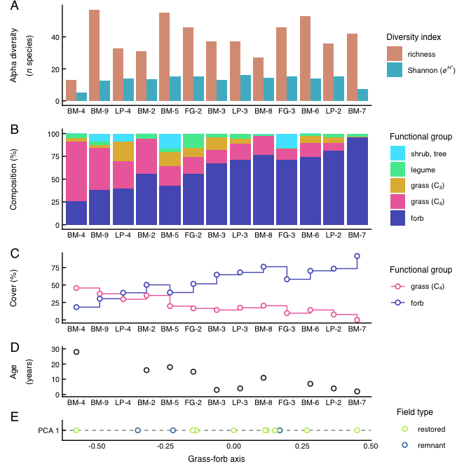<!-- -->

### Soil properties

``` r
soil <- read_csv(root_path("clean_data/soil.csv"), show_col_types = FALSE)[-c(26:27), ]
```

### Unified species, biomass, and metadata objects

#### Biomass-scaled abundance in guilds

``` r
its_guild_ma <- 
  its_reps_ma %>%
  pivot_longer(starts_with("otu"), names_to = "otu_num", values_to = "abund") %>%
  left_join(its_meta %>% select(otu_num, primary_lifestyle), by = join_by(otu_num)) %>%
  group_by(field_name, primary_lifestyle) %>% summarize(abund = sum(abund), .groups = "drop") %>%
  arrange(field_name, -abund) %>%
  pivot_wider(names_from = "primary_lifestyle", values_from = "abund") %>%
  select(field_name, patho_mass = plant_pathogen, sapro_mass = saprotroph) %>%
  left_join(sites_reps %>% select(field_name, field_type, region, yr_since), by = join_by(field_name))
```

Wrangle a second set to compare raw sequence abundances and proportion
of biomass values together includes more metadata

``` r
its_guild_wi <- 
  its_wi %>% 
  pivot_longer(starts_with("otu"), names_to = "otu_num", values_to = "abund") %>% 
  left_join(its_meta %>% select(otu_num, primary_lifestyle), by = join_by(otu_num)) %>% 
  group_by(field_name, primary_lifestyle) %>% summarize(abund = sum(abund), .groups = "drop") %>% 
  arrange(field_name, -abund) %>% 
  pivot_wider(names_from = "primary_lifestyle", values_from = "abund") %>% 
  rowwise() %>% 
  mutate(fungi_abund = sum(c_across(where(is.numeric)))) %>% 
  select(field_name, patho_abund = plant_pathogen, sapro_abund = saprotroph, fungi_abund) %>% 
  left_join(fa_reps %>% select(field_name, fungi_mass = fungi_18.2), by = join_by(field_name)) %>% 
  left_join(pfg, by = join_by(field_name)) %>% 
  left_join(gf_axis, by = join_by(field_name)) %>% 
  left_join(sites_wi %>% select(field_name, field_type, region, yr_since), by = join_by(field_name)) %>% 
  select(field_name, field_type, yr_since, region, everything()) %>% 
  ungroup()
```

# Composition in guilds

``` r
# Composition in guilds ———————— ####
```

## Fungi

``` r
its_meta %>% 
  count(primary_lifestyle) %>% 
  mutate(composition = round(n / sum(n) * 100, 1)) %>% 
  arrange(-composition) %>% 
  kable(format = "pandoc", caption = "ITS-detectable fungi: composition in guilds")
```

| primary_lifestyle      |    n | composition |
|:-----------------------|-----:|------------:|
| unidentified           | 2036 |        64.1 |
| saprotroph             |  720 |        22.7 |
| plant_pathogen         |  183 |         5.8 |
| arbuscular_mycorrhizal |   81 |         2.6 |
| animal_parasite        |   65 |         2.0 |
| ectomycorrhizal        |   31 |         1.0 |
| mycoparasite           |   27 |         0.9 |
| root_endophyte         |   18 |         0.6 |
| algal_parasite         |    3 |         0.1 |
| epiphyte               |    2 |         0.1 |
| foliar_endophyte       |    3 |         0.1 |
| lichen_parasite        |    4 |         0.1 |
| lichenized             |    2 |         0.1 |

ITS-detectable fungi: composition in guilds

## AM fungi

Composition in families

``` r
amf_meta %>% 
  count(family) %>% 
  mutate(composition = round(n / sum(n) * 100, 1)) %>% 
  arrange(-composition) %>% 
  kable(format = "pandoc", caption = "AM fungi: composition in families")
```

| family               |   n | composition |
|:---------------------|----:|------------:|
| Glomeraceae          | 105 |        69.1 |
| Claroideoglomeraceae |  17 |        11.2 |
| Diversisporaceae     |   8 |         5.3 |
| Archaeosporaceae     |   7 |         4.6 |
| Paraglomeraceae      |   6 |         3.9 |
| Acaulosporaceae      |   4 |         2.6 |
| Gigasporaceae        |   4 |         2.6 |
| Ambisporaceae        |   1 |         0.7 |

AM fungi: composition in families

## Dominant taxa

Highest relative abundance in guilds and overall \### ITS

``` r
its_rel_abund_all <- 
  its_all %>% 
  pivot_longer(starts_with("otu"), names_to = "otu", values_to = "seq_abund") %>% 
  group_by(otu) %>% 
  summarize(seq_abund = mean(seq_abund), .groups = "drop") %>% 
  mutate(rel_abund = seq_abund / sum(seq_abund) * 100)
its_rel_abund_ft <- 
  its_all %>% 
  left_join(sites_all %>% select(field_name, field_type), by = join_by(field_name)) %>% 
  pivot_longer(starts_with("otu"), names_to = "otu", values_to = "seq_abund") %>% 
  group_by(field_type, otu) %>% 
  summarize(seq_abund_ft = sum(seq_abund), .groups = "drop_last") %>% 
  mutate(rel_abund_ft = seq_abund_ft / sum(seq_abund_ft) * 100) %>% 
  pivot_wider(id_cols = "otu", names_from = "field_type", values_from = "rel_abund_ft") %>% 
  left_join(its_rel_abund_all %>% select(-seq_abund, all = rel_abund), by = join_by(otu)) %>% 
  slice_max(all, n = 30, with_ties = FALSE) %>% 
  left_join(its_meta %>% select(otu_num, family:primary_lifestyle), by = join_by(otu == otu_num))
kable(its_rel_abund_ft %>% mutate(across(where(is.numeric), ~ round(.x, 1))),
      format = "pandoc", 
      caption = "Top 30 ITS OTUs, ranked by average relative abundance. The overall value ≠ average of field types due to unequal weights (unbalanced design).")
```

| otu | corn | restored | remnant | all | family | genus | species | primary_lifestyle |
|:---|---:|---:|---:|---:|:---|:---|:---|:---|
| otu_1 | 2.6 | 4.1 | 3.8 | 3.8 | Nectriaceae | Fusarium | Fusarium_oxysporum | plant_pathogen |
| otu_7 | 0.7 | 2.9 | 2.0 | 2.3 | Periconiaceae | Periconia | unidentified | plant_pathogen |
| otu_2 | 0.9 | 2.4 | 1.1 | 1.9 | Mortierellaceae | Mortierella | Mortierella_exigua | saprotroph |
| otu_6 | 1.5 | 1.6 | 2.2 | 1.7 | Didymellaceae | unidentified | unidentified | unidentified |
| otu_15 | 6.0 | 0.7 | 0.2 | 1.7 | Lasiosphaeriaceae | unidentified | unidentified | unidentified |
| otu_4 | 0.0 | 1.9 | 1.2 | 1.4 | Herpotrichiellaceae | unidentified | unidentified | unidentified |
| otu_10 | 0.0 | 1.7 | 1.4 | 1.3 | unidentified | unidentified | unidentified | unidentified |
| otu_3 | 1.5 | 1.3 | 1.1 | 1.3 | Plectosphaerellaceae | Gibellulopsis | unidentified | plant_pathogen |
| otu_5 | 1.2 | 1.2 | 1.8 | 1.3 | Nectriaceae | unidentified | unidentified | unidentified |
| otu_26 | 2.0 | 1.1 | 0.4 | 1.2 | Sporormiaceae | Preussia | Preussia_flanaganii | saprotroph |
| otu_8 | 0.0 | 1.1 | 2.9 | 1.1 | Herpotrichiellaceae | unidentified | unidentified | unidentified |
| otu_22 | 0.8 | 1.2 | 1.1 | 1.1 | Herpotrichiellaceae | Exophiala | unidentified | animal_parasite |
| otu_36 | 0.0 | 1.2 | 2.0 | 1.1 | unidentified | unidentified | unidentified | unidentified |
| otu_19 | 0.0 | 1.4 | 0.9 | 1.0 | unidentified | unidentified | unidentified | unidentified |
| otu_92 | 1.5 | 0.9 | 0.9 | 1.0 | Lasiosphaeriaceae | Schizothecium | unidentified | saprotroph |
| otu_9 | 4.6 | 0.1 | 0.1 | 1.0 | Mrakiaceae | Tausonia | Tausonia_pullulans | saprotroph |
| otu_14 | 0.9 | 1.0 | 0.8 | 1.0 | Mortierellaceae | Mortierella | unidentified | saprotroph |
| otu_11 | 2.6 | 0.6 | 0.1 | 0.9 | Chaetomiaceae | Humicola | Humicola_grisea | saprotroph |
| otu_34 | 0.9 | 0.9 | 0.5 | 0.9 | Lasiosphaeriaceae | Apodus | Apodus_deciduus | saprotroph |
| otu_57 | 0.0 | 1.0 | 1.1 | 0.8 | Herpotrichiellaceae | unidentified | unidentified | unidentified |
| otu_16 | 1.5 | 0.7 | 0.6 | 0.8 | Nectriaceae | Nectria | Nectria_ramulariae | plant_pathogen |
| otu_24 | 0.0 | 0.9 | 1.6 | 0.8 | Helotiales_fam_Incertae_sedis | Leohumicola | Leohumicola_minima | unidentified |
| otu_12 | 0.2 | 1.0 | 0.8 | 0.8 | Sordariales_fam_Incertae_sedis | Staphylotrichum | unidentified | unidentified |
| otu_30 | 2.0 | 0.5 | 0.2 | 0.8 | Nectriaceae | Fusicolla | Fusicolla_aquaeductuum | mycoparasite |
| otu_33 | 0.4 | 1.0 | 0.4 | 0.8 | Nectriaceae | Fusarium | unidentified | plant_pathogen |
| otu_39 | 0.1 | 0.9 | 0.9 | 0.7 | Cucurbitariaceae | Pyrenochaeta | unidentified | saprotroph |
| otu_13 | 1.9 | 0.5 | 0.3 | 0.7 | Plectosphaerellaceae | Plectosphaerella | Plectosphaerella_cucumerina | plant_pathogen |
| otu_18 | 0.8 | 0.8 | 0.2 | 0.7 | Cladosporiaceae | Cladosporium | unidentified | saprotroph |
| otu_21 | 2.6 | 0.2 | 0.0 | 0.7 | Phaeosphaeriaceae | Setophoma | Setophoma_terrestris | plant_pathogen |
| otu_25 | 0.0 | 1.0 | 0.0 | 0.6 | Herpotrichiellaceae | unidentified | unidentified | unidentified |

Top 30 ITS OTUs, ranked by average relative abundance. The overall value
≠ average of field types due to unequal weights (unbalanced design).

### AMF

``` r
amf_rel_abund_all <- 
  amf_all %>% 
  pivot_longer(starts_with("otu"), names_to = "otu", values_to = "seq_abund") %>% 
  group_by(otu) %>% 
  summarize(seq_abund = sum(seq_abund), .groups = "drop") %>% 
  mutate(rel_abund = seq_abund / sum(seq_abund) * 100)
amf_rel_abund_ft <- 
  amf_all %>% 
  left_join(sites_all %>% select(field_name, field_type), by = join_by(field_name)) %>% 
  pivot_longer(starts_with("otu"), names_to = "otu", values_to = "seq_abund") %>% 
  group_by(field_type, otu) %>% 
  summarize(seq_abund_ft = sum(seq_abund), .groups = "drop_last") %>% 
  mutate(rel_abund_ft = seq_abund_ft / sum(seq_abund_ft) * 100) %>% 
  pivot_wider(id_cols = "otu", names_from = "field_type", values_from = "rel_abund_ft") %>% 
  left_join(amf_rel_abund_all %>% select(-seq_abund, all = rel_abund), by = join_by(otu)) %>% 
  slice_max(all, n = 30, with_ties = FALSE) %>% 
  left_join(amf_meta %>% select(otu_num, family:taxon), by = join_by(otu == otu_num))
kable(amf_rel_abund_ft %>% mutate(across(where(is.numeric), ~ round(.x, 1))),
      format = "pandoc", 
      caption = "Top 30 AMF OTUs, ranked by average relative abundance. The overall value ≠ average of field types due to unequal weights (unbalanced design).")
```

| otu | corn | restored | remnant | all | family | genus | taxon |
|:---|---:|---:|---:|---:|:---|:---|:---|
| otu_7 | 10.7 | 6.7 | 6.3 | 7.4 | Glomeraceae | Glomus | Glomus MO-G23 |
| otu_5 | 9.3 | 6.6 | 6.3 | 7.1 | Glomeraceae | Glomus | unidentified |
| otu_1 | 0.5 | 7.4 | 7.6 | 6.1 | Glomeraceae | Glomus | Glomus Douhan3 |
| otu_2 | 0.3 | 5.8 | 8.4 | 5.1 | Glomeraceae | Glomus | Glomus MO-G15 |
| otu_3 | 6.1 | 5.4 | 1.3 | 4.9 | Paraglomeraceae | Paraglomus | unidentified |
| otu_8 | 0.1 | 5.9 | 5.2 | 4.6 | Glomeraceae | Glomus | Glomus sp. |
| otu_9 | 1.5 | 4.9 | 5.8 | 4.4 | Glomeraceae | Glomus | Glomus Glo7 |
| otu_4 | 9.2 | 3.2 | 2.4 | 4.3 | Glomeraceae | Glomus | Glomus Whitfield type 17 |
| otu_6 | 3.5 | 3.7 | 3.6 | 3.6 | Claroideoglomeraceae | Claroideoglomus | unidentified |
| otu_13 | 12.9 | 1.2 | 1.8 | 3.6 | Glomeraceae | Glomus | Glomus viscosum |
| otu_11 | 0.0 | 4.4 | 4.1 | 3.5 | Glomeraceae | Glomus | Glomus sp. |
| otu_10 | 0.2 | 4.1 | 4.5 | 3.4 | Claroideoglomeraceae | Claroideoglomus | Claroideoglomus Douhan9 |
| otu_12 | 0.4 | 4.1 | 3.6 | 3.3 | Glomeraceae | Glomus | Glomus MO-G18 |
| otu_17 | 4.2 | 3.0 | 2.4 | 3.2 | Glomeraceae | Glomus | Glomus MO-G22 |
| otu_21 | 7.6 | 0.9 | 2.1 | 2.4 | Glomeraceae | Glomus | Glomus Wirsel OTU16 |
| otu_15 | 0.0 | 2.6 | 1.7 | 1.9 | Glomeraceae | Glomus | unidentified |
| otu_29 | 1.9 | 1.6 | 1.6 | 1.7 | Glomeraceae | Glomus | unidentified |
| otu_24 | 0.1 | 2.2 | 1.3 | 1.6 | Glomeraceae | Glomus | Glomus MO-G7 |
| otu_20 | 5.2 | 0.7 | 1.0 | 1.6 | Glomeraceae | Glomus | unidentified |
| otu_22 | 1.7 | 1.1 | 2.1 | 1.4 | Glomeraceae | Glomus | Glomus MO-G8 |
| otu_38 | 3.0 | 0.9 | 0.5 | 1.3 | Diversisporaceae | Diversispora | Diversispora MO-GC1 |
| otu_18 | 0.1 | 1.5 | 1.5 | 1.2 | Glomeraceae | Glomus | unidentified |
| otu_23 | 0.3 | 1.4 | 1.4 | 1.2 | Glomeraceae | Glomus | unidentified |
| otu_14 | 0.1 | 1.6 | 0.3 | 1.1 | Claroideoglomeraceae | Claroideoglomus | Claroideoglomus Glo59 |
| otu_16 | 0.3 | 1.3 | 1.1 | 1.1 | Claroideoglomeraceae | Claroideoglomus | Claroideoglomus ORVIN GLO4 |
| otu_37 | 0.0 | 1.3 | 0.9 | 1.0 | Glomeraceae | Glomus | unidentified |
| otu_26 | 1.3 | 1.0 | 0.1 | 0.9 | Glomeraceae | Glomus | Glomus acnaGlo2 |
| otu_25 | 0.0 | 1.1 | 0.8 | 0.8 | Claroideoglomeraceae | Claroideoglomus | Claroideoglomus acnaGlo7 |
| otu_30 | 0.0 | 0.9 | 1.2 | 0.8 | Diversisporaceae | Diversispora | unidentified |
| otu_19 | 1.4 | 0.6 | 0.6 | 0.8 | Glomeraceae | Glomus | unidentified |

Top 30 AMF OTUs, ranked by average relative abundance. The overall value
≠ average of field types due to unequal weights (unbalanced design).

# Alpha diversity

``` r
# Alpha diversity ———————— ####
```

Preprocess data for diversity indices

``` r
its_div   <- calc_div(its_all,   sites_reps)
```

``` r
amf_div   <- calc_div(amf_all,   sites_reps)
```

``` r
patho_div <- calc_div(patho_all, sites_reps)
```

``` r
sapro_div <- calc_div(sapro_all, sites_reps)
```

## Richness

``` r
## Richness ———————— ####
```

### ITS fungi

Sequence depth square root transformed and centered. Negative binomial
model used to handle count data. Poisson model was overdispersed (not
shown).

Test interaction

``` r
its_rich_glm_i <- glm.nb(richness ~ depth_rich_csq * field_type, data = its_div)
Anova(its_rich_glm_i, type = 3, test.statistic = "LR") # no interaction detected
```

    ## Analysis of Deviance Table (Type III tests)
    ## 
    ## Response: richness
    ##                           LR Chisq Df Pr(>Chisq)    
    ## depth_rich_csq               0.373  1     0.5416    
    ## field_type                  43.010  2  4.575e-10 ***
    ## depth_rich_csq:field_type    2.875  2     0.2375    
    ## ---
    ## Signif. codes:  0 '***' 0.001 '**' 0.01 '*' 0.05 '.' 0.1 ' ' 1

Fit additive model

``` r
its_rich_glm <- glm.nb(richness ~ depth_rich_csq + field_type, data = its_div)
```

Diagnostics

``` r
check_model(its_rich_glm)
```

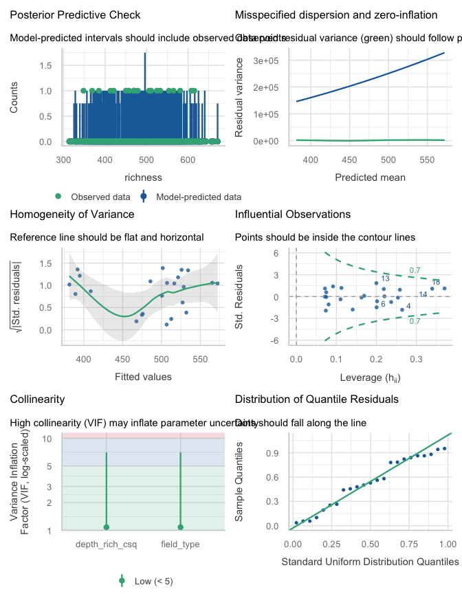<!-- -->

``` r
check_overdispersion(its_rich_glm)
```

    ## # Overdispersion test (using simulated residuals)
    ## 
    ##  dispersion ratio = 1.043
    ##           p-value = 0.888

    ## No overdispersion detected.

``` r
check_collinearity(its_rich_glm)
```

    ## # Check for Multicollinearity
    ## 
    ## Low Correlation
    ## 
    ##            Term  VIF   VIF 95% CI adj. VIF Tolerance Tolerance 95% CI
    ##  depth_rich_csq 1.08 [1.00, 7.03]     1.04      0.92     [0.14, 1.00]
    ##      field_type 1.08 [1.00, 7.03]     1.02      0.92     [0.14, 1.00]

Long tails, some midrange structure, no leverage points

``` r
distribution_prob(its_rich_glm)
```

    ## 
    ## 
    ## Distribution    p_Residuals
    ## -------------  ------------
    ## normal               0.5625
    ## cauchy               0.1875
    ## gamma                0.1250
    ## 
    ## 
    ## Distribution                  p_Response
    ## ---------------------------  -----------
    ## lognormal                        0.34375
    ## neg. binomial (zero-infl.)       0.31250
    ## beta-binomial                    0.12500

residuals distribution normal or long-tailed, response log

``` r
leveneTest(richness ~ field_type, data = its_div) %>% as.data.frame() %>% kable(format = "pandoc")
```

|       |  Df |   F value |   Pr(\>F) |
|-------|----:|----------:|----------:|
| group |   2 | 0.5113873 | 0.6072949 |
|       |  20 |        NA |        NA |

``` r
leveneTest(residuals(its_rich_glm) ~ its_div$field_type) %>% as.data.frame() %>% kable(format = "pandoc")
```

|       |  Df |   F value |   Pr(\>F) |
|-------|----:|----------:|----------:|
| group |   2 | 0.1163176 | 0.8907903 |
|       |  20 |        NA |        NA |

Residuals/response distributions do not suggest the need for
transformation. Levene’s p \> 0.05 → fail to reject = variances can be
considered equal across groups.

Model results, group means, and post-hoc. Use Type II LR test of
variables due to unbalanced design.

``` r
Anova(its_rich_glm, type = 2, test.statistic = "LR")
```

    ## Analysis of Deviance Table (Type II tests)
    ## 
    ## Response: richness
    ##                LR Chisq Df Pr(>Chisq)    
    ## depth_rich_csq    5.665  1    0.01731 *  
    ## field_type       39.005  2   3.39e-09 ***
    ## ---
    ## Signif. codes:  0 '***' 0.001 '**' 0.01 '*' 0.05 '.' 0.1 ' ' 1

Sequence depth is significant, less so than field type. Proceed with
means separation by obtaining estimated marginal means for field type.

``` r
its_rich_em <- emmeans(its_rich_glm, ~ field_type, type = "response")
```

Results tables below show the emmeans summary of group means and
confidence intervals, with sequencing depth as a covariate, and the post
hoc contrast of richness among field types.

| field_type | response |       SE |  df | asymp.LCL | asymp.UCL |
|:-----------|---------:|---------:|----:|----------:|----------:|
| corn       | 392.0337 | 15.74190 | Inf |  362.3630 |  424.1339 |
| restored   | 503.0749 | 11.72832 | Inf |  480.6051 |  526.5952 |
| remnant    | 553.3668 | 24.49096 | Inf |  507.3884 |  603.5116 |

Confidence level used: 0.95

| contrast           |     ratio |        SE |  df | null |   z.ratio |   p.value |
|:-------------------|----------:|----------:|----:|-----:|----------:|----------:|
| corn / restored    | 0.7792751 | 0.0361178 | Inf |    1 | -5.380839 | 0.0000002 |
| corn / remnant     | 0.7084519 | 0.0425042 | Inf |    1 | -5.744946 | 0.0000000 |
| restored / remnant | 0.9091165 | 0.0460571 | Inf |    1 | -1.880761 | 0.1442407 |

P value adjustment: tukey method for comparing a family of 3 estimates

OTU richness in cornfields is significantly less than in restored or
remnant fields (p\<0.001), which don’t differ.

### AM fungi

Sequence depth square root transformed and centered. Negative binomial
model was underdispersed and failed to converge at default iterations;
use poisson glm instead.

Test interaction

``` r
amf_rich_glm_i <- glm(richness ~ depth_rich_csq * field_type, data = amf_div, family = poisson(link = "log")) 
Anova(amf_rich_glm_i, type = 3, test.statistic = "LR") # interaction near significant
```

    ## Analysis of Deviance Table (Type III tests)
    ## 
    ## Response: richness
    ##                           LR Chisq Df Pr(>Chisq)   
    ## depth_rich_csq              4.4899  1   0.034096 * 
    ## field_type                  9.6078  2   0.008198 **
    ## depth_rich_csq:field_type   5.8980  2   0.052393 . 
    ## ---
    ## Signif. codes:  0 '***' 0.001 '**' 0.01 '*' 0.05 '.' 0.1 ' ' 1

``` r
check_overdispersion(amf_rich_glm_i) # not overdispersed
```

    ## # Overdispersion test
    ## 
    ##        dispersion ratio =  0.691
    ##   Pearson's Chi-Squared = 11.740
    ##                 p-value =  0.816

    ## No overdispersion detected.

``` r
augment(amf_rich_glm_i) # corn site has cooks >0.9
```

    ## # A tibble: 23 × 9
    ##    richness depth_rich_csq field_type .fitted   .resid   .hat .sigma     .cooksd
    ##       <int>          <dbl> <fct>        <dbl>    <dbl>  <dbl>  <dbl>       <dbl>
    ##  1       59         -10.6  restored      4.00  0.563   0.268   0.840 0.0270     
    ##  2       47           9.06 restored      3.95 -0.681   0.176   0.836 0.0194     
    ##  3       38          -1.10 corn          3.69 -0.357   0.214   0.851 0.00722    
    ##  4       52           3.57 remnant       4.03 -0.577   0.366   0.838 0.0491     
    ##  5       53           8.00 restored      3.95  0.141   0.151   0.856 0.000701   
    ##  6       60           3.46 corn          3.91  1.39    0.547   0.671 0.914      
    ##  7       33          -4.95 corn          3.51 -0.0975  0.560   0.856 0.00457    
    ##  8       62           5.87 remnant       4.06  0.560   0.500   0.833 0.107      
    ##  9       53           1.29 restored      3.97  0.00318 0.0720  0.857 0.000000141
    ## 10       54          -6.13 restored      3.99 -0.0135  0.142   0.857 0.00000588 
    ## # ℹ 13 more rows
    ## # ℹ 1 more variable: .std.resid <dbl>

``` r
check_collinearity(amf_rich_glm_i) # depth and field_type VIF > 26
```

    ## Model has interaction terms. VIFs might be inflated.
    ##   Try to center the variables used for the interaction, or check
    ##   multicollinearity among predictors of a model without interaction terms.

    ## # Check for Multicollinearity
    ## 
    ## Low Correlation
    ## 
    ##        Term  VIF       VIF 95% CI adj. VIF Tolerance Tolerance 95% CI
    ##  field_type 1.02 [ 1.00, 4341.63]     1.01      0.98     [0.00, 1.00]
    ## 
    ## High Correlation
    ## 
    ##                       Term   VIF       VIF 95% CI adj. VIF Tolerance
    ##             depth_rich_csq 25.06 [14.93,   42.55]     5.01      0.04
    ##  depth_rich_csq:field_type 25.35 [15.10,   43.04]     5.03      0.04
    ##  Tolerance 95% CI
    ##      [0.02, 0.07]
    ##      [0.02, 0.07]

An interaction was near significance, but including it in the model
leads to very poor diagnostics. It’s driven by one site in corn with
high leverage, and it introduces high multicollinearity. Further, the
outlier point would tend to lead to a Type II error of inference, making
it a conservative choice to stick with the additive model.

Fit additive model

``` r
amf_rich_glm <- glm(richness ~ depth_rich_csq + field_type, data = amf_div, family = poisson(link = "log")) 
```

Diagnostics

``` r
check_model(amf_rich_glm)
```

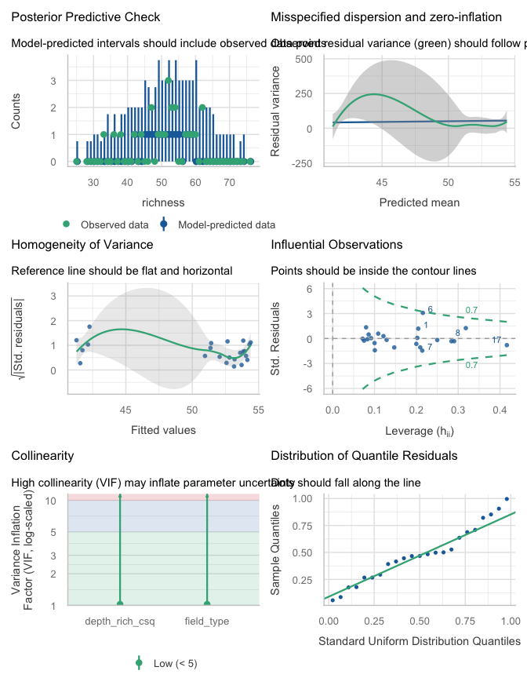<!-- -->

``` r
check_overdispersion(amf_rich_glm)
```

    ## # Overdispersion test
    ## 
    ##        dispersion ratio =  0.972
    ##   Pearson's Chi-Squared = 18.473
    ##                 p-value =  0.491

    ## No overdispersion detected.

``` r
check_collinearity(amf_rich_glm)
```

    ## # Check for Multicollinearity
    ## 
    ## Low Correlation
    ## 
    ##            Term  VIF       VIF 95% CI adj. VIF Tolerance Tolerance 95% CI
    ##  depth_rich_csq 1.02 [1.00, 14013.20]     1.01      0.98     [0.00, 1.00]
    ##      field_type 1.02 [1.00, 14013.20]     1.01      0.98     [0.00, 1.00]

Long tails, some midrange structure, no leverage points, overdispersion,
or multicollinearity

``` r
distribution_prob(amf_rich_glm)
```

    ## 
    ## 
    ## Distribution    p_Residuals
    ## -------------  ------------
    ## normal              0.34375
    ## cauchy              0.25000
    ## exponential         0.15625
    ## 
    ## 
    ## Distribution                  p_Response
    ## ---------------------------  -----------
    ## beta-binomial                    0.53125
    ## neg. binomial (zero-infl.)       0.15625
    ## binomial                         0.06250

residuals distribution normal or long-tailed, response count-distributed

``` r
leveneTest(richness ~ field_type, data = amf_div) %>% as.data.frame() %>% kable(format = "pandoc")
```

|       |  Df |   F value |   Pr(\>F) |
|-------|----:|----------:|----------:|
| group |   2 | 0.6725395 | 0.5215816 |
|       |  20 |        NA |        NA |

``` r
leveneTest(residuals(amf_rich_glm) ~ amf_div$field_type) %>% as.data.frame() %>% kable(format = "pandoc")
```

|       |  Df |   F value |   Pr(\>F) |
|-------|----:|----------:|----------:|
| group |   2 | 0.9542055 | 0.4019677 |
|       |  20 |        NA |        NA |

Residuals/response distributions do not suggest the need for
transformation. Levene’s p \> 0.05 → fail to reject = variances can be
considered equal across groups.

Model results, group means, and post-hoc. Use Type II LR test of
variables due to unbalanced design.

``` r
Anova(amf_rich_glm, type = 2, test.statistic = "LR")
```

    ## Analysis of Deviance Table (Type II tests)
    ## 
    ## Response: richness
    ##                LR Chisq Df Pr(>Chisq)   
    ## depth_rich_csq   0.3846  1   0.535160   
    ## field_type      10.1661  2   0.006201 **
    ## ---
    ## Signif. codes:  0 '***' 0.001 '**' 0.01 '*' 0.05 '.' 0.1 ' ' 1

Sequencing depth not a significant predictor of amf richness

``` r
amf_rich_em <- emmeans(amf_rich_glm, ~ field_type, type = "response")
```

Results tables below show the emmeans summary of estimated marginal
means and confidence intervals, and the post hoc contrast of richness
among field types. Main effect in model significant; pairwise contrast
warranted.

| field_type |     rate |       SE |  df | asymp.LCL | asymp.UCL |
|:-----------|---------:|---------:|----:|----------:|----------:|
| corn       | 41.85939 | 2.896984 | Inf |  36.54966 |  47.94049 |
| restored   | 52.95563 | 1.953254 | Inf |  49.26243 |  56.92571 |
| remnant    | 53.51428 | 3.689285 | Inf |  46.75066 |  61.25644 |

Confidence level used: 0.95

| contrast           |     ratio |        SE |  df | null |    z.ratio |   p.value |
|:-------------------|----------:|----------:|----:|-----:|-----------:|----------:|
| corn / restored    | 0.7904616 | 0.0620763 | Inf |    1 | -2.9941829 | 0.0077511 |
| corn / remnant     | 0.7822097 | 0.0762742 | Inf |    1 | -2.5190179 | 0.0315765 |
| restored / remnant | 0.9895607 | 0.0777379 | Inf |    1 | -0.1335851 | 0.9902101 |

P value adjustment: tukey method for comparing a family of 3 estimates

OTU richness in cornfields is significantly less than in restored or
remnant fields, which don’t differ.

### Pathogens

Sequence depth square root transformed and centered. Negative binomial
model was underdispersed and failed to converge at default iterations;
use poisson glm instead.

Test interaction

``` r
patho_rich_glm_i <- glm(richness ~ depth_rich_csq * field_type, data = patho_div, family = poisson(link = "log")) 
Anova(patho_rich_glm_i, type = 3, test.statistic = "LR") # no interaction detected
```

    ## Analysis of Deviance Table (Type III tests)
    ## 
    ## Response: richness
    ##                           LR Chisq Df Pr(>Chisq)
    ## depth_rich_csq              2.0180  1     0.1554
    ## field_type                  2.2539  2     0.3240
    ## depth_rich_csq:field_type   0.3535  2     0.8380

Fit additive model

``` r
patho_rich_glm <- glm(richness ~ depth_rich_csq + field_type, data = patho_div, family = poisson(link = "log")) 
```

Diagnostics

``` r
check_model(patho_rich_glm)
```

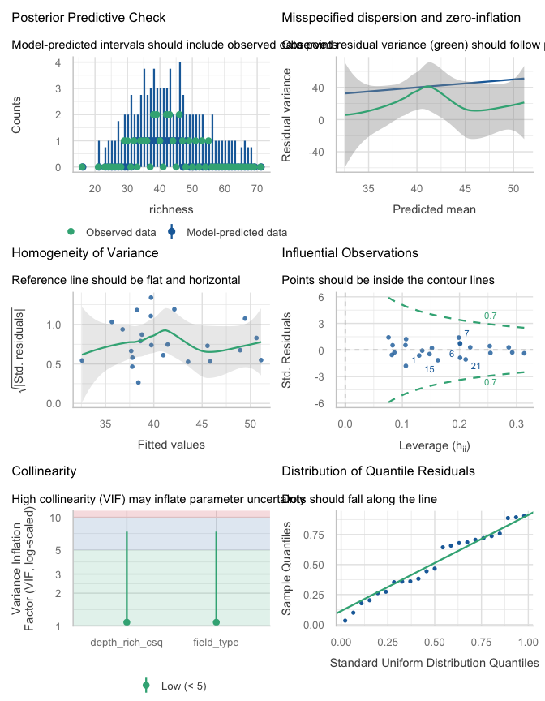<!-- -->

``` r
check_overdispersion(patho_rich_glm)
```

    ## # Overdispersion test
    ## 
    ##        dispersion ratio =  0.690
    ##   Pearson's Chi-Squared = 13.111
    ##                 p-value =  0.833

    ## No overdispersion detected.

``` r
check_collinearity(patho_rich_glm)
```

    ## # Check for Multicollinearity
    ## 
    ## Low Correlation
    ## 
    ##            Term  VIF   VIF 95% CI adj. VIF Tolerance Tolerance 95% CI
    ##  depth_rich_csq 1.08 [1.00, 7.37]     1.04      0.93     [0.14, 1.00]
    ##      field_type 1.08 [1.00, 7.37]     1.02      0.93     [0.14, 1.00]

Some midrange structure, no leverage points, overdispersion, or
multicollinearity

``` r
distribution_prob(patho_rich_glm)
```

    ## 
    ## 
    ## Distribution    p_Residuals
    ## -------------  ------------
    ## normal               0.7500
    ## cauchy               0.1875
    ## gamma                0.0625
    ## 
    ## 
    ## Distribution                  p_Response
    ## ---------------------------  -----------
    ## beta-binomial                    0.53125
    ## neg. binomial (zero-infl.)       0.18750
    ## chi                              0.06250

residuals distribution normal or long-tailed, response count-distributed

``` r
leveneTest(richness ~ field_type, data = patho_div) %>% as.data.frame() %>% kable(format = "pandoc")
```

|       |  Df |  F value |   Pr(\>F) |
|-------|----:|---------:|----------:|
| group |   2 | 1.152804 | 0.3358608 |
|       |  20 |       NA |        NA |

``` r
leveneTest(residuals(patho_rich_glm) ~ patho_div$field_type) %>% as.data.frame() %>% kable(format = "pandoc")
```

|       |  Df |  F value |   Pr(\>F) |
|-------|----:|---------:|----------:|
| group |   2 | 1.113932 | 0.3477946 |
|       |  20 |       NA |        NA |

Residuals/response distributions do not suggest the need for
transformation. Levene’s p \> 0.05 → fail to reject = variances can be
considered equal across groups.

Model results, group means, and post-hoc. Use Type II LR test of
variables due to unbalanced design.

``` r
Anova(patho_rich_glm, type = 2, test.statistic = "LR")
```

    ## Analysis of Deviance Table (Type II tests)
    ## 
    ## Response: richness
    ##                LR Chisq Df Pr(>Chisq)   
    ## depth_rich_csq   9.0666  1   0.002603 **
    ## field_type       1.9686  2   0.373696   
    ## ---
    ## Signif. codes:  0 '***' 0.001 '**' 0.01 '*' 0.05 '.' 0.1 ' ' 1

Sequence depth is highly significant; richness doesn’t vary in groups.

``` r
patho_div %>% 
  group_by(field_type) %>% 
  summarize(across(c(depth_rich, richness), ~ round(mean(.x), 0))) %>% 
  kable(format = "pandoc", caption = "Average sequence depth and pathogen richness in field types")
```

| field_type | depth_rich | richness |
|:-----------|-----------:|---------:|
| corn       |       1295 |       39 |
| restored   |       1398 |       44 |
| remnant    |        979 |       37 |

Average sequence depth and pathogen richness in field types

Depth is correlated with richness in field types. Differences in
richness are small and with depth variance removed first, this explains
why richness isn’t significantly different.

Calculate confidence intervals for figure. Arithmetic means calculated
in this case.

``` r
patho_rich_em <- emmeans(patho_rich_glm, ~ field_type, type = "response")
```

| field_type |     rate |       SE |  df | asymp.LCL | asymp.UCL |
|:-----------|---------:|---------:|----:|----------:|----------:|
| corn       | 38.33196 | 2.761761 | Inf |  33.28382 |  44.14574 |
| restored   | 42.60754 | 1.766885 | Inf |  39.28150 |  46.21519 |
| remnant    | 39.33911 | 3.291259 | Inf |  33.38949 |  46.34889 |

Confidence level used: 0.95

| contrast           |     ratio |        SE |  df | null |    z.ratio |   p.value |
|:-------------------|----------:|----------:|----:|-----:|-----------:|----------:|
| corn / restored    | 0.8996521 | 0.0744917 | Inf |    1 | -1.2771307 | 0.4081112 |
| corn / remnant     | 0.9743981 | 0.1080486 | Inf |    1 | -0.2338882 | 0.9702939 |
| restored / remnant | 1.0830833 | 0.1028556 | Inf |    1 |  0.8404298 | 0.6778429 |

P value adjustment: tukey method for comparing a family of 3 estimates

### Saprotrophs

Sequence depth square root transformed and centered. Poisson model was
overdispersed (not shown), use negative binomial instead.

Test interaction

``` r
sapro_rich_glm_i <- glm.nb(richness ~ depth_rich_csq * field_type, data = sapro_div) 
```

    ## Warning in theta.ml(Y, mu, sum(w), w, limit = control$maxit, trace =
    ## control$trace > : iteration limit reached
    ## Warning in theta.ml(Y, mu, sum(w), w, limit = control$maxit, trace =
    ## control$trace > : iteration limit reached

``` r
Anova(sapro_rich_glm_i, type = 3, test.statistic = "LR") # interaction detected
```

    ## Analysis of Deviance Table (Type III tests)
    ## 
    ## Response: richness
    ##                           LR Chisq Df Pr(>Chisq)   
    ## depth_rich_csq              2.7724  1    0.09591 . 
    ## field_type                  2.6636  2    0.26400   
    ## depth_rich_csq:field_type  13.7755  2    0.00102 **
    ## ---
    ## Signif. codes:  0 '***' 0.001 '**' 0.01 '*' 0.05 '.' 0.1 ' ' 1

``` r
check_model(sapro_rich_glm_i)
```

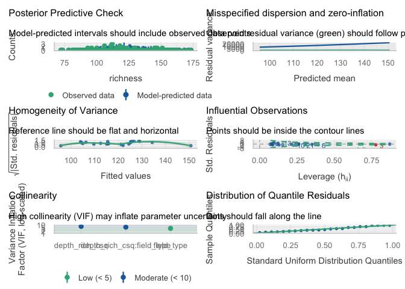<!-- -->

``` r
check_overdispersion(sapro_rich_glm_i) # not overdispersed
```

    ## # Overdispersion test (using simulated residuals)
    ## 
    ##  dispersion ratio = 0.930
    ##           p-value = 0.872

    ## No overdispersion detected.

``` r
augment(sapro_rich_glm_i) %>% print(n = Inf) # corn site has cooks >0.9
```

    ## Warning: The `augment()` method for objects of class `negbin` is not maintained by the broom team, and is only supported through the `glm` tidier method. Please be cautious in interpreting and reporting broom output.
    ## 
    ## This warning is displayed once per session.

    ## # A tibble: 23 × 9
    ##    richness depth_rich_csq field_type .fitted  .resid   .hat .sigma  .cooksd
    ##       <int>          <dbl> <fct>        <dbl>   <dbl>  <dbl>  <dbl>    <dbl>
    ##  1      100         -7.31  restored      4.65 -0.495  0.350    1.11 0.0332  
    ##  2      145          0.767 restored      4.84  1.66   0.0903   1.03 0.0529  
    ##  3      118         -0.316 corn          4.83 -0.656  0.777    1.07 1.10    
    ##  4       96        -15.3   remnant       4.56  0.0305 0.609    1.12 0.000617
    ##  5      106         -4.23  restored      4.72 -0.622  0.155    1.11 0.0137  
    ##  6       93         12.4   corn          4.64 -1.10   0.391    1.07 0.206   
    ##  7      106          8.80  corn          4.70 -0.352  0.215    1.12 0.00711 
    ##  8      120         -7.27  remnant       4.75  0.405  0.261    1.12 0.0133  
    ##  9      111         -3.22  restored      4.75 -0.386  0.114    1.12 0.00357 
    ## 10      116         -6.76  restored      4.67  0.923  0.307    1.09 0.0937  
    ## 11      118         -0.951 restored      4.80 -0.285  0.0717   1.12 0.00112 
    ## 12      112          0.614 restored      4.83 -1.22   0.0868   1.08 0.0250  
    ## 13      130          5.22  corn          4.75  1.32   0.245    1.05 0.129   
    ## 14      151          4.01  remnant       5.02  0.0217 0.870    1.12 0.00408 
    ## 15      147          1.75  restored      4.86  1.58   0.123    1.04 0.0694  
    ## 16      124          3.69  restored      4.90 -0.908  0.239    1.09 0.0550  
    ## 17      111         -7.15  remnant       4.75 -0.463  0.260    1.11 0.0167  
    ## 18      146          1.05  restored      4.84  1.67   0.0981   1.03 0.0592  
    ## 19      121         -0.617 restored      4.80 -0.0936 0.0717   1.12 0.000121
    ## 20      115          0.513 restored      4.83 -0.921  0.0846   1.10 0.0139  
    ## 21      112         12.1   corn          4.65  0.730  0.372    1.10 0.0858  
    ## 22      129          0.269 restored      4.82  0.403  0.0801   1.12 0.00259 
    ## 23      112          1.90  restored      4.86 -1.54   0.129    1.05 0.0645  
    ## # ℹ 1 more variable: .std.resid <dbl>

``` r
check_collinearity(sapro_rich_glm_i) # depth and interaction VIF > 6
```

    ## # Check for Multicollinearity
    ## 
    ## Low Correlation
    ## 
    ##        Term  VIF    VIF 95% CI adj. VIF Tolerance Tolerance 95% CI
    ##  field_type 4.12 [2.68,  6.81]     1.42      0.24     [0.15, 0.37]
    ## 
    ## Moderate Correlation
    ## 
    ##                       Term  VIF    VIF 95% CI adj. VIF Tolerance
    ##             depth_rich_csq 7.34 [4.56, 12.30]     2.71      0.14
    ##  depth_rich_csq:field_type 5.98 [3.76,  9.97]     2.45      0.17
    ##  Tolerance 95% CI
    ##      [0.08, 0.22]
    ##      [0.10, 0.27]

An interaction was detected, but including it in the model leads to very
poor diagnostics. It’s driven by one site in corn with high leverage,
and it introduces high multicollinearity.

Fit additive model

``` r
sapro_rich_glm <- glm.nb(richness ~ depth_rich_csq + field_type, data = sapro_div) 
```

Diagnostics

``` r
check_model(sapro_rich_glm)
```

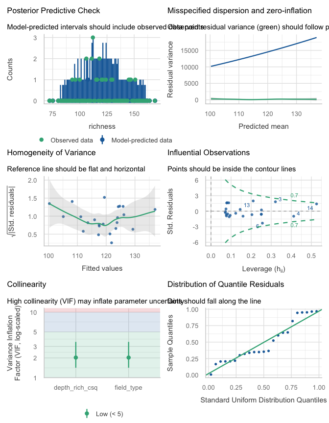<!-- -->

``` r
check_overdispersion(sapro_rich_glm)
```

    ## # Overdispersion test (using simulated residuals)
    ## 
    ##  dispersion ratio = 1.036
    ##           p-value = 0.848

    ## No overdispersion detected.

``` r
check_collinearity(sapro_rich_glm)
```

    ## # Check for Multicollinearity
    ## 
    ## Low Correlation
    ## 
    ##            Term  VIF   VIF 95% CI adj. VIF Tolerance Tolerance 95% CI
    ##  depth_rich_csq 2.03 [1.42, 3.52]     1.42      0.49     [0.28, 0.70]
    ##      field_type 2.03 [1.42, 3.52]     1.19      0.49     [0.28, 0.70]

Long tails, some structure throughout, no leverage points,
overdispersion, or multicollinearity

``` r
distribution_prob(sapro_rich_glm)
```

    ## 
    ## 
    ## Distribution    p_Residuals
    ## -------------  ------------
    ## normal              0.65625
    ## cauchy              0.18750
    ## chi                 0.03125
    ## 
    ## 
    ## Distribution                  p_Response
    ## ---------------------------  -----------
    ## beta-binomial                    0.37500
    ## neg. binomial (zero-infl.)       0.34375
    ## weibull                          0.09375

residuals distribution normal or long-tailed, response count-distributed

``` r
leveneTest(richness ~ field_type, data = sapro_div) %>% as.data.frame() %>% kable(format = "pandoc")
```

|       |  Df |   F value |   Pr(\>F) |
|-------|----:|----------:|----------:|
| group |   2 | 0.3949285 | 0.6788673 |
|       |  20 |        NA |        NA |

``` r
leveneTest(residuals(sapro_rich_glm) ~ sapro_div$field_type) %>% as.data.frame() %>% kable(format = "pandoc")
```

|       |  Df |   F value |   Pr(\>F) |
|-------|----:|----------:|----------:|
| group |   2 | 0.9187473 | 0.4152139 |
|       |  20 |        NA |        NA |

Residuals/response distributions do not suggest the need for
transformation. Levene’s p \> 0.05 → fail to reject = variances can be
considered equal across groups.

Model results, group means, and post-hoc. Use Type II LR test of
variables due to unbalanced design.

``` r
Anova(sapro_rich_glm, type = 2, test.statistic = "LR")
```

    ## Analysis of Deviance Table (Type II tests)
    ## 
    ## Response: richness
    ##                LR Chisq Df Pr(>Chisq)   
    ## depth_rich_csq   6.7038  1   0.009621 **
    ## field_type       7.6942  2   0.021341 * 
    ## ---
    ## Signif. codes:  0 '***' 0.001 '**' 0.01 '*' 0.05 '.' 0.1 ' ' 1

Both terms are significant, depth a little more. Proceed with means
separation by obtaining estimated marginal means for field type.

``` r
sapro_rich_em <- emmeans(sapro_rich_glm, ~ field_type, type = "response")
```

Results tables below show the emmeans summary of group means and
confidence intervals, with sequencing depth as a covariate, and the post
hoc contrast of richness among field types.

| field_type | response |       SE |  df | asymp.LCL | asymp.UCL |
|:-----------|---------:|---------:|----:|----------:|----------:|
| corn       | 100.7280 | 6.617169 | Inf |  88.55883 |  114.5694 |
| restored   | 122.9139 | 3.659137 | Inf | 115.94730 |  130.2990 |
| remnant    | 129.6494 | 8.294525 | Inf | 114.37035 |  146.9696 |

Confidence level used: 0.95

| contrast           |     ratio |        SE |  df | null |    z.ratio |   p.value |
|:-------------------|----------:|----------:|----:|-----:|-----------:|----------:|
| corn / restored    | 0.8195008 | 0.0610977 | Inf |    1 | -2.6699805 | 0.0207225 |
| corn / remnant     | 0.7769263 | 0.0817252 | Inf |    1 | -2.3995497 | 0.0433396 |
| restored / remnant | 0.9480482 | 0.0650498 | Inf |    1 | -0.7775321 | 0.7168515 |

P value adjustment: tukey method for comparing a family of 3 estimates

OTU richness in cornfields is significantly less than in restored or
remnant fields (p\<0.05), which don’t differ.

## Shannon diversity

``` r
## Shannon diversity ———————— ####
```

### ITS fungi

Sequence depth square root transformed and centered

``` r
its_shan_lm <- lm(shannon ~ depth_shan_csq + field_type, data = its_div)
```

Diagnostics

``` r
check_model(its_shan_lm)
```

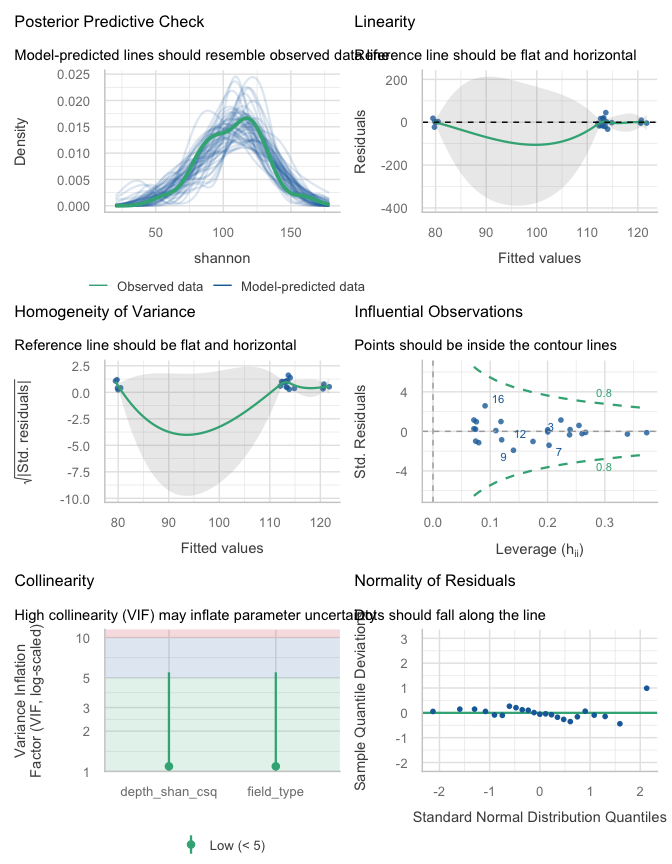<!-- -->

Some residual structure, no leverage points, no evidence for increasing
mean/var relationship.

``` r
distribution_prob(its_shan_lm)
```

    ## 
    ## 
    ## Distribution    p_Residuals
    ## -------------  ------------
    ## cauchy              0.65625
    ## normal              0.31250
    ## weibull             0.03125
    ## 
    ## 
    ## Distribution    p_Response
    ## -------------  -----------
    ## lognormal          0.31250
    ## gamma              0.28125
    ## chi                0.12500

residuals distribution most likely cauchy/normal; symmetric but long
tails, response log/gamma

``` r
leveneTest(shannon ~ field_type, data = its_div) %>% as.data.frame() %>% kable(format = "pandoc")
```

|       |  Df |  F value |   Pr(\>F) |
|-------|----:|---------:|----------:|
| group |   2 | 1.990968 | 0.1627262 |
|       |  20 |       NA |        NA |

``` r
leveneTest(residuals(its_shan_lm) ~ its_div$field_type) %>% as.data.frame() %>% kable(format = "pandoc")
```

|       |  Df |  F value |   Pr(\>F) |
|-------|----:|---------:|----------:|
| group |   2 | 1.905331 | 0.1748177 |
|       |  20 |       NA |        NA |

Residuals distribution does not suggest the need for transformation.
Levene’s p \> 0.05 → fail to reject = variances can be considered equal.
Response distribution more suspicious. Examine CV in groups to assess
changes in variance.

``` r
augment(its_shan_lm) %>%
  mutate(field_type = factor(field_type, levels = c("corn", "restored", "remnant"))) %>% 
  group_by(field_type) %>%
  summarise(
    mean_fitted = mean(.fitted),
    sd_resid    = sd(.resid),
    cv_resid    = sd_resid / mean_fitted
  ) %>% 
  mutate(across(where(is.numeric), ~ round(.x, 2))) %>% 
  kable(format = "pandoc", caption = "CV of residuals and fitted means in groups")
```

| field_type | mean_fitted | sd_resid | cv_resid |
|:-----------|------------:|---------:|---------:|
| corn       |       79.92 |    14.83 |     0.19 |
| restored   |      113.27 |    20.23 |     0.18 |
| remnant    |      120.89 |     6.36 |     0.05 |

CV of residuals and fitted means in groups

Residuals’ CV constant to declining. Relatively low Levene’s p value
likely due to unequal variance in restored and remnant despite similar
means. Unbalanced data and possible biological reality likely causing
this. No need for further transformation.

Model results, group means, and post-hoc. Type II SS used due to
unbalanced design.

``` r
Anova(its_shan_lm, type = 2)
```

    ## Anova Table (Type II tests)
    ## 
    ## Response: shannon
    ##                Sum Sq Df F value   Pr(>F)   
    ## depth_shan_csq    8.3  1   0.025 0.876006   
    ## field_type     4986.8  2   7.492 0.003991 **
    ## Residuals      6323.4 19                    
    ## ---
    ## Signif. codes:  0 '***' 0.001 '**' 0.01 '*' 0.05 '.' 0.1 ' ' 1

Sequence depth is not a significant predictor of Shannon diversity.
Proceed with means separation by obtaining estimated marginal means for
field type. Arithmetic means calculated in this case.

``` r
its_shan_em <- emmeans(its_shan_lm, ~ field_type, type = "response")
```

Results tables below show the emmeans summary of group means and
confidence intervals, with sequencing depth as a covariate, and the post
hoc contrast of richness among field types.

| field_type |    emmean |       SE |  df |  lower.CL |  upper.CL |
|:-----------|----------:|---------:|----:|----------:|----------:|
| corn       |  79.88937 | 8.160571 |  19 |  62.80909 |  96.96964 |
| restored   | 113.16398 | 4.917855 |  19 | 102.87080 | 123.45717 |
| remnant    | 121.28435 | 9.451146 |  19 | 101.50287 | 141.06582 |

Confidence level used: 0.95

| contrast           |   estimate |        SE |  df |    t.ratio |   p.value |
|:-------------------|-----------:|----------:|----:|-----------:|----------:|
| corn - restored    | -33.274619 |  9.515723 |  19 | -3.4968040 | 0.0065035 |
| corn - remnant     | -41.394983 | 12.522352 |  19 | -3.3056876 | 0.0099148 |
| restored - remnant |  -8.120364 | 10.802278 |  19 | -0.7517269 | 0.7362612 |

P value adjustment: tukey method for comparing a family of 3 estimates

Shannon diversity in cornfields is significantly less than in restored
or remnant fields, which don’t differ.

### AM fungi

Sequence depth square root transformed and centered

``` r
amf_shan_lm <- lm(shannon ~ depth_shan_csq + field_type, data = amf_div)
```

Diagnostics

``` r
check_model(amf_shan_lm)
```

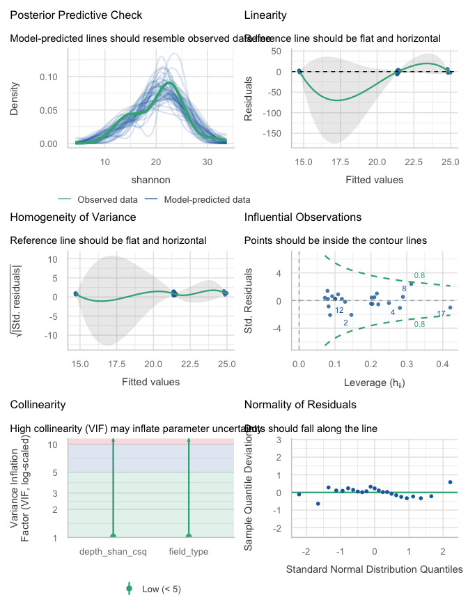<!-- -->

Variance appears somewhat non-constant in groups, qqplot fit is off, one
leverage point (Cook’s \> 0.5), a cornfield with high richness. Mean
richness in corn fields is lowest; this outlier would make the pairwise
contrast less significant, possible Type II error which is more
conservative.

``` r
distribution_prob(amf_shan_lm)
```

    ## 
    ## 
    ## Distribution    p_Residuals
    ## -------------  ------------
    ## normal              0.71875
    ## cauchy              0.15625
    ## exponential         0.03125
    ## 
    ## 
    ## Distribution    p_Response
    ## -------------  -----------
    ## normal             0.25000
    ## lognormal          0.15625
    ## pareto             0.15625

Residuals/response distributions most likely normal.

``` r
leveneTest(shannon ~ field_type, data = amf_div) %>% as.data.frame() %>% kable(format = "pandoc")
```

|       |  Df |   F value |   Pr(\>F) |
|-------|----:|----------:|----------:|
| group |   2 | 0.2568466 | 0.7759994 |
|       |  20 |        NA |        NA |

``` r
leveneTest(residuals(amf_shan_lm) ~ amf_div$field_type) %>% as.data.frame() %>% kable(format = "pandoc")
```

|       |  Df |   F value |   Pr(\>F) |
|-------|----:|----------:|----------:|
| group |   2 | 0.2601623 | 0.7734953 |
|       |  20 |        NA |        NA |

Residuals/response distributions do not suggest the need for
transformation. Levene’s p \> 0.05 → fail to reject = variances can be
considered equal.

Model results, group means, and post-hoc

``` r
Anova(amf_shan_lm, type = 2)
```

    ## Anova Table (Type II tests)
    ## 
    ## Response: shannon
    ##                 Sum Sq Df F value    Pr(>F)    
    ## depth_shan_csq   0.075  1  0.0071 0.9339506    
    ## field_type     254.632  2 11.9410 0.0004381 ***
    ## Residuals      202.579 19                      
    ## ---
    ## Signif. codes:  0 '***' 0.001 '**' 0.01 '*' 0.05 '.' 0.1 ' ' 1

Sequencing depth not a significant predictor of Shannon diversity.
Produce arithmetic means in groups and post hoc contrasts

``` r
amf_shan_em <- emmeans(amf_shan_lm, ~ field_type, type = "response")
```

Results tables below show the emmeans summary of group means and
confidence intervals, with sequencing depth as a covariate, and the post
hoc contrast of richness among field types.

| field_type |   emmean |        SE |  df | lower.CL | upper.CL |
|:-----------|---------:|----------:|----:|---------:|---------:|
| corn       | 14.71948 | 1.4611247 |  19 | 11.66131 | 17.77765 |
| restored   | 21.42925 | 0.8756828 |  19 | 19.59642 | 23.26207 |
| remnant    | 24.84889 | 1.6438083 |  19 | 21.40836 | 28.28942 |

Confidence level used: 0.95

| contrast           |   estimate |       SE |  df |   t.ratio |   p.value |
|:-------------------|-----------:|---------:|----:|----------:|----------:|
| corn - restored    |  -6.709768 | 1.705554 |  19 | -3.934070 | 0.0024473 |
| corn - remnant     | -10.129411 | 2.194984 |  19 | -4.614800 | 0.0005299 |
| restored - remnant |  -3.419643 | 1.869929 |  19 | -1.828755 | 0.1872242 |

P value adjustment: tukey method for comparing a family of 3 estimates

Shannon’s diversity in cornfields is significantly less than in restored
or remnant fields, which don’t differ.

### Pathogens

Sequence depth square root transformed and centered

``` r
patho_shan_lm <- lm(shannon ~ depth_shan_csq + field_type, data = patho_div)
```

Diagnostics

``` r
check_model(patho_shan_lm)
```

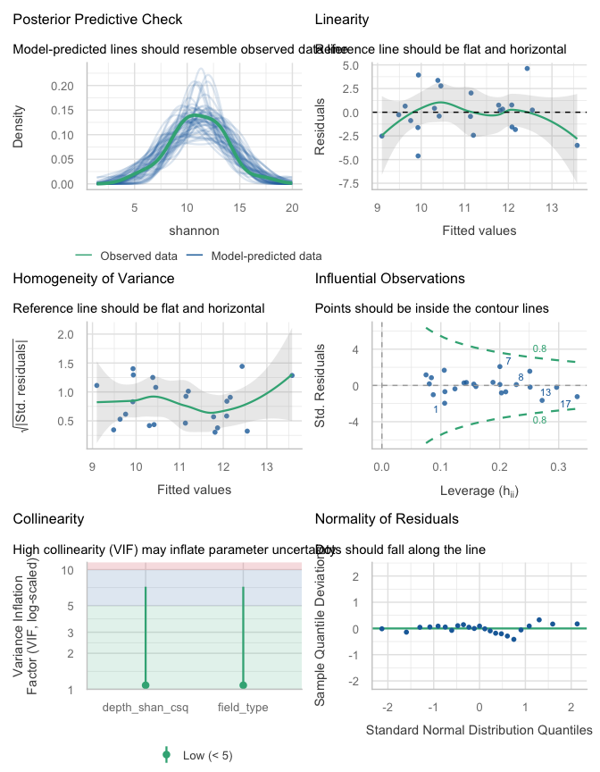<!-- -->

``` r
distribution_prob(patho_shan_lm)
```

    ## 
    ## 
    ## Distribution    p_Residuals
    ## -------------  ------------
    ## normal              0.84375
    ## cauchy              0.12500
    ## F                   0.03125
    ## 
    ## 
    ## Distribution    p_Response
    ## -------------  -----------
    ## normal              0.4375
    ## pareto              0.1250
    ## weibull             0.1250

residuals distribution most likely cauchy/normal; symmetric but long
tails response normal

``` r
leveneTest(shannon ~ field_type, data = patho_div) %>% as.data.frame() %>% kable(format = "pandoc")
```

|       |  Df |   F value |   Pr(\>F) |
|-------|----:|----------:|----------:|
| group |   2 | 0.0106992 | 0.9893634 |
|       |  20 |        NA |        NA |

``` r
leveneTest(residuals(patho_shan_lm) ~ patho_div$field_type) %>% as.data.frame() %>% kable(format = "pandoc")
```

|       |  Df |   F value |   Pr(\>F) |
|-------|----:|----------:|----------:|
| group |   2 | 0.1219259 | 0.8858669 |
|       |  20 |        NA |        NA |

Residuals distribution does not suggest the need for further model
selection. Levene’s p \> 0.05 → fail to reject = variances can be
considered equal.

Model results, group means, and post-hoc

``` r
Anova(patho_shan_lm, type = 2)
```

    ## Anova Table (Type II tests)
    ## 
    ## Response: shannon
    ##                 Sum Sq Df F value Pr(>F)
    ## depth_shan_csq  16.456  1  2.6642 0.1191
    ## field_type      13.540  2  1.0960 0.3544
    ## Residuals      117.358 19

Neither predictor is significant

``` r
patho_shan_em <- emmeans(patho_shan_lm, ~ field_type, type = "response")
```

Results tables below show the emmeans summary of group means and
confidence intervals, with sequencing depth as a covariate, and the post
hoc contrast of richness among field types.

| field_type |   emmean |        SE |  df |  lower.CL | upper.CL |
|:-----------|---------:|----------:|----:|----------:|---------:|
| corn       | 12.45363 | 1.1116992 |  19 | 10.126812 | 14.78044 |
| restored   | 10.55528 | 0.6692896 |  19 |  9.154441 | 11.95612 |
| remnant    | 10.77253 | 1.2822589 |  19 |  8.088728 | 13.45633 |

Confidence level used: 0.95

| contrast           |   estimate |       SE |  df |    t.ratio |   p.value |
|:-------------------|-----------:|---------:|----:|-----------:|----------:|
| corn - restored    |  1.8983450 | 1.296171 |  19 |  1.4645791 | 0.3295507 |
| corn - remnant     |  1.6810984 | 1.701338 |  19 |  0.9881039 | 0.5930316 |
| restored - remnant | -0.2172467 | 1.464276 |  19 | -0.1483645 | 0.9879457 |

P value adjustment: tukey method for comparing a family of 3 estimates

### Saprotrophs

Sequence depth square root transformed and centered

``` r
sapro_shan_lm <- lm(shannon ~ depth_shan_csq + field_type, data = sapro_div)
```

Diagnostics

``` r
check_model(sapro_shan_lm)
```

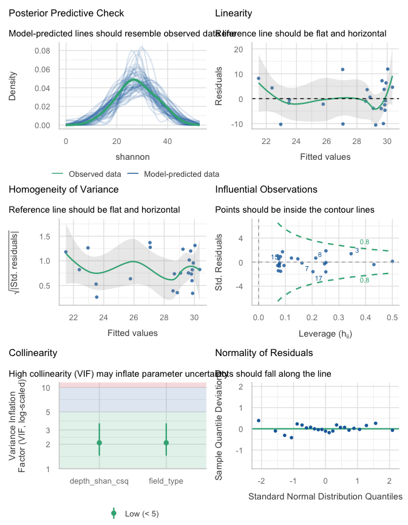<!-- -->

``` r
distribution_prob(sapro_shan_lm)
```

    ## 
    ## 
    ## Distribution    p_Residuals
    ## -------------  ------------
    ## normal               0.6875
    ## cauchy               0.1250
    ## chi                  0.0625
    ## 
    ## 
    ## Distribution    p_Response
    ## -------------  -----------
    ## gamma              0.40625
    ## weibull            0.15625
    ## chi                0.12500

residuals distribution most likely normal, qq fit good, no evidence of
mean/variance increase response non-normal, check variance in groups
though

``` r
leveneTest(shannon ~ field_type, data = sapro_div) %>% as.data.frame() %>% kable(format = "pandoc")
```

|       |  Df |   F value |   Pr(\>F) |
|-------|----:|----------:|----------:|
| group |   2 | 0.4404594 | 0.6498362 |
|       |  20 |        NA |        NA |

``` r
leveneTest(residuals(sapro_shan_lm) ~ sapro_div$field_type) %>% as.data.frame() %>% kable(format = "pandoc")
```

|       |  Df |   F value |   Pr(\>F) |
|-------|----:|----------:|----------:|
| group |   2 | 0.1121804 | 0.8944415 |
|       |  20 |        NA |        NA |

Residuals distribution does not suggest the need for transformation.
Levene’s p \> 0.05 → fail to reject = variances can be considered equal.

Model results, group means, and post-hoc

``` r
Anova(sapro_shan_lm, type = 2)
```

    ## Anova Table (Type II tests)
    ## 
    ## Response: shannon
    ##                Sum Sq Df F value Pr(>F)
    ## depth_shan_csq  11.19  1  0.2138 0.6490
    ## field_type     164.18  2  1.5681 0.2342
    ## Residuals      994.64 19

Sequence depth is not a significant predictor of Shannon diversity, nor
field type

``` r
sapro_shan_em <- emmeans(sapro_shan_lm, ~ field_type, type = "response")
```

Results tables below show the emmeans summary of group means and
confidence intervals, with sequencing depth as a covariate, and the post
hoc contrast of richness among field types.

## Unified results

``` r
## Unified results ———————— ####
```

Summary statistics for richness models Fungal OTU richness differences
across field types accounting for sequencing depth. Field type effects
were evaluated using Type II Analysis of Deviance. P-values for field
type were adjusted for multiple comparisons across fungal groups using
the Benjamini-Hochberg procedure.

``` r
list(
  its_rich_nb     = Anova(its_rich_glm, type = 2, test.statistic = "LR"),
  amf_rich_pois   = Anova(amf_rich_glm, type = 2, test.statistic = "LR"),
  patho_rich_pois = Anova(patho_rich_glm, type = 2, test.statistic = "LR"),
  sapro_rich_nb   = Anova(sapro_rich_glm, type = 2, test.statistic = "LR")
) %>% map(\(df) tidy(df)) %>% 
  bind_rows(.id = "guild_test") %>% 
  mutate(p.adj = if_else(term == "field_type", p.adjust(p.value, "fdr"), NA_real_),
         across(where(is.numeric), ~ round(.x, 3)),
         LRchisq_df = paste0(statistic, " (", df, ", 19)")) %>% 
  select(guild_test, term, LRchisq_df, p.value, p.adj) %>% 
  kable(format = "pandoc", caption = "Table S1 (richness)")
```

| guild_test      | term           | LRchisq_df     | p.value | p.adj |
|:----------------|:---------------|:---------------|--------:|------:|
| its_rich_nb     | depth_rich_csq | 5.665 (1, 19)  |   0.017 |    NA |
| its_rich_nb     | field_type     | 39.005 (2, 19) |   0.000 | 0.000 |
| amf_rich_pois   | depth_rich_csq | 0.385 (1, 19)  |   0.535 |    NA |
| amf_rich_pois   | field_type     | 10.166 (2, 19) |   0.006 | 0.017 |
| patho_rich_pois | depth_rich_csq | 9.067 (1, 19)  |   0.003 |    NA |
| patho_rich_pois | field_type     | 1.969 (2, 19)  |   0.374 | 0.427 |
| sapro_rich_nb   | depth_rich_csq | 6.704 (1, 19)  |   0.010 |    NA |
| sapro_rich_nb   | field_type     | 7.694 (2, 19)  |   0.021 | 0.028 |

Table S1 (richness)

Summary statistics for Shannon models Fungal OTU Shannon diversity
differences across field types accounting for sequencing depth. Field
type effects were evaluated using Type II Analysis of Variance P-values
for field type were adjusted for multiple comparisons across fungal
groups using the Benjamini-Hochberg procedure.

``` r
list(
  its_shan_lm   = Anova(its_shan_lm, type = 2),
  amf_shan_lm   = Anova(amf_shan_lm, type = 2),
  patho_shan_lm = Anova(patho_shan_lm, type = 2),
  sapro_shan_lm = Anova(sapro_shan_lm, type = 2)
) %>% map(\(df) tidy(df)) %>% 
  bind_rows(.id = "guild_test") %>% 
  mutate(p.adj = if_else(term == "field_type", p.adjust(p.value, "fdr"), NA_real_),
         across(where(is.numeric), ~ round(.x, 3)),
         `F` = paste0(statistic, " (", df, ", 19)")) %>% 
  select(guild_test, term, `F`, p.value, p.adj) %>% 
  kable(format = "pandoc", caption = "Table S1 (shannon)")
```

| guild_test    | term           | F              | p.value | p.adj |
|:--------------|:---------------|:---------------|--------:|------:|
| its_shan_lm   | depth_shan_csq | 0.025 (1, 19)  |   0.876 |    NA |
| its_shan_lm   | field_type     | 7.492 (2, 19)  |   0.004 | 0.016 |
| its_shan_lm   | Residuals      | NA (19, 19)    |      NA |    NA |
| amf_shan_lm   | depth_shan_csq | 0.007 (1, 19)  |   0.934 |    NA |
| amf_shan_lm   | field_type     | 11.941 (2, 19) |   0.000 | 0.004 |
| amf_shan_lm   | Residuals      | NA (19, 19)    |      NA |    NA |
| patho_shan_lm | depth_shan_csq | 2.664 (1, 19)  |   0.119 |    NA |
| patho_shan_lm | field_type     | 1.096 (2, 19)  |   0.354 | 0.567 |
| patho_shan_lm | Residuals      | NA (19, 19)    |      NA |    NA |
| sapro_shan_lm | depth_shan_csq | 0.214 (1, 19)  |   0.649 |    NA |
| sapro_shan_lm | field_type     | 1.568 (2, 19)  |   0.234 | 0.468 |
| sapro_shan_lm | Residuals      | NA (19, 19)    |      NA |    NA |

Table S1 (shannon)

Results summary and figures

``` r
div_tagpos <- c(0, 1)
```

``` r
its_div_fig <- 
  bind_rows(
    rich = summary(its_rich_em) %>% 
      select(field_type, mean = response, lcl = asymp.LCL, ucl = asymp.UCL),
    shan = summary(its_shan_em) %>% 
      select(field_type, mean = emmean, lcl = lower.CL, ucl = upper.CL),
    .id = "index"
  ) %>% 
  ggplot(aes(x = field_type, y = mean)) +
  geom_col_pattern(
    aes(fill = field_type, pattern = index),
    position = position_dodge(width = div_dodw), width = div_colw, color = "black", linewidth = lw,
    pattern_fill = div_patfil, pattern_colour = div_patcol, pattern_density = div_patden, pattern_spacing = div_patspa
  ) +
  geom_errorbar(aes(ymin = mean, ymax = ucl, group = index), 
                position = position_dodge(width = div_dodw), width = 0, linewidth = lw) +
  geom_text(na.rm = TRUE, aes(y = ucl, label = c("A", "B", "B", "a", "b", "b"), group = index), 
            position = position_dodge(width = div_dodw), vjust = -1, family = "sans", size = 3.5) +
  labs(x = NULL) +
  scale_y_continuous(name = expression(atop("General fungal", paste("Richness (", italic(n), " OTUs)"))), limits = c(0, 700), 
                     sec.axis = sec_axis(~ . , name = expression(Shannon~diversity~paste("(", italic(e)^italic(H), ")")), breaks = c(0, 100, 200))) +
  scale_pattern_manual(values = c("none", "stripe")) +
  scale_fill_manual(values = ft_pal) +
  theme_cor +
  theme(legend.position = "none",
        plot.tag = element_text(size = 14, face = 1, hjust = 0),
        plot.tag.position = div_tagpos)
```

``` r
amf_div_fig <- 
  bind_rows(
    rich = summary(amf_rich_em) %>% 
      select(field_type, mean = rate, lcl = asymp.LCL, ucl = asymp.UCL),
    shan = summary(amf_shan_em) %>% 
      select(field_type, mean = emmean, lcl = lower.CL, ucl = upper.CL),
    .id = "index"
  ) %>% 
  ggplot(aes(x = field_type, y = mean)) +
  geom_col_pattern(
    aes(fill = field_type, pattern = index),
    position = position_dodge(width = div_dodw), width = div_colw, color = "black", linewidth = lw,
    pattern_fill = div_patfil, pattern_colour = div_patcol, pattern_density = div_patden, pattern_spacing = div_patspa
  ) +
  geom_errorbar(aes(ymin = mean, ymax = ucl, group = index), 
                position = position_dodge(width = div_dodw), width = 0, linewidth = lw) +
  geom_text(na.rm = TRUE, aes(y = ucl, label = c("A", "B", "B", "a", "b", "b"), group = index), 
            position = position_dodge(width = div_dodw), vjust = -1, family = "sans", size = 3.5) +
  labs(x = NULL) +
  scale_y_continuous(name = expression(atop("AM fungal", paste("Richness (", italic(n), " OTUs)"))), limits = c(0, 80), 
                     sec.axis = sec_axis(~ . , name = expression(Shannon~diversity~paste("(", italic(e)^italic(H), ")")), breaks = c(0, 15, 30))) +
  scale_pattern_manual(values = c("none", "stripe")) +
  scale_fill_manual(values = ft_pal) +
  theme_cor +
  theme(legend.position = "none",
        plot.tag = element_text(size = 14, face = 1, hjust = 0),
        plot.tag.position = div_tagpos)
```

``` r
patho_div_fig <- 
  bind_rows(
    rich = summary(patho_rich_em) %>% 
      select(field_type, mean = rate, lcl = asymp.LCL, ucl = asymp.UCL),
    shan = summary(patho_shan_em) %>% 
      select(field_type, mean = emmean, lcl = lower.CL, ucl = upper.CL),
    .id = "index"
  ) %>% 
  ggplot(aes(x = field_type, y = mean)) +
  geom_col_pattern(
    aes(fill = field_type, pattern = index),
    position = position_dodge(width = div_dodw), width = div_colw, color = "black", linewidth = lw,
    pattern_fill = div_patfil, pattern_colour = div_patcol, pattern_density = div_patden, pattern_spacing = div_patspa
  ) +
  geom_errorbar(aes(ymin = mean, ymax = ucl, group = index),
                position = position_dodge(width = div_dodw), width = 0, linewidth = lw) +
  labs(x = NULL) +
  scale_y_continuous(name = expression(atop("Pathogen", paste("Richness (", italic(n), " OTUs)"))),  
                     sec.axis = sec_axis(~ . , name = expression(Shannon~diversity~paste("(", italic(e)^italic(H), ")")), breaks = c(0, 5, 10, 15))) +
  scale_pattern_manual(values = c("none", "stripe")) +
  scale_fill_manual(values = ft_pal) +
  theme_cor +
  theme(legend.position = "none",
        plot.tag = element_text(size = 14, face = 1, hjust = 0),
        plot.tag.position = div_tagpos)
```

``` r
sapro_div_fig <- 
  bind_rows(
    rich = summary(sapro_rich_em) %>% 
      select(field_type, mean = response, lcl = asymp.LCL, ucl = asymp.UCL),
    shan = summary(sapro_shan_em) %>% 
      select(field_type, mean = emmean, lcl = lower.CL, ucl = upper.CL),
    .id = "index"
  ) %>% 
  ggplot(aes(x = field_type, y = mean)) +
  geom_col_pattern(
    aes(fill = field_type, pattern = index),
    position = position_dodge(width = div_dodw), width = div_colw, color = "black", linewidth = lw,
    pattern_fill = div_patfil, pattern_colour = div_patcol, pattern_density = div_patden, pattern_spacing = div_patspa
  ) +
  geom_errorbar(aes(ymin = mean, ymax = ucl, group = index),
                position = position_dodge(width = div_dodw), width = 0, linewidth = lw) +
  geom_text(na.rm = TRUE, aes(y = ucl, label = c("A", "B", "B", "", "", ""), group = index), 
            position = position_dodge(width = div_dodw), vjust = -1, family = "sans", size = 3.5) +
  labs(x = NULL) +
  scale_y_continuous(name = expression(atop("Saprotroph", paste("Richness (", italic(n), " OTUs)"))), limits = c(0, 180),  
                     sec.axis = sec_axis(~ . , name = expression(Shannon~diversity~paste("(", italic(e)^italic(H), ")")), breaks = c(0, 20, 40))) +
  scale_pattern_manual(values = c("none", "stripe")) +
  scale_fill_manual(values = ft_pal) +
  theme_cor +
  theme(legend.position = "none",
        plot.tag = element_text(size = 14, face = 1, hjust = 0),
        plot.tag.position = div_tagpos)
```

### Unified figure

Display diversity index results

``` r
fig2 <- (its_div_fig / plot_spacer() / amf_div_fig / plot_spacer() / patho_div_fig / plot_spacer() / sapro_div_fig) +
  plot_layout(heights = c(rep(c(1, 0.1), 3), 1), axis_titles = "collect") +
  plot_annotation(tag_levels = 'A')
```

``` r
fig2
```

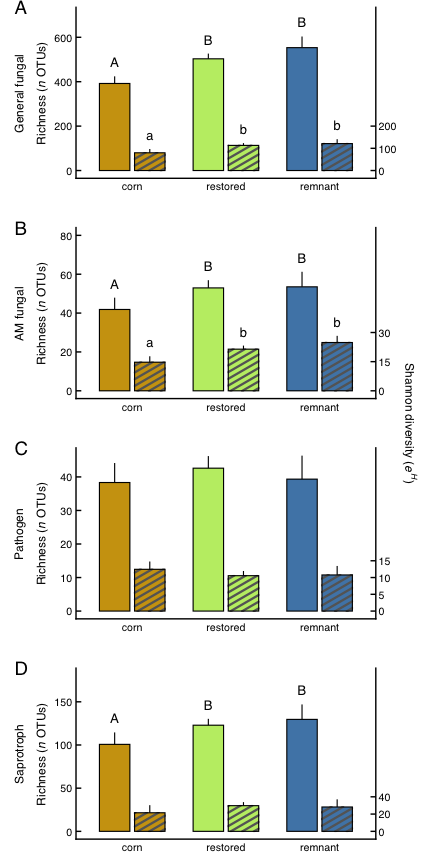<!-- -->

# Abundance

``` r
# Abundance ———————— ####
```

Biomass and abundance-scaled biomass

## ITS fungi (PLFA)

``` r
plfa_lm <- lm(fungi_18.2 ~ field_type, data = fa_reps)
par(mfrow = c(2,2))
plot(plfa_lm) 
```

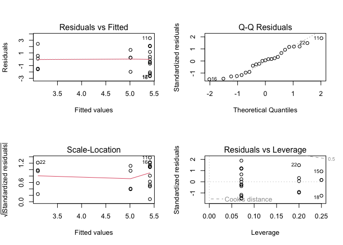<!-- -->

variance differs slightly in groups. Tails on qq plot diverge, lots of
groups structure visible.

``` r
distribution_prob(plfa_lm)
```

    ## 
    ## 
    ## Distribution    p_Residuals
    ## -------------  ------------
    ## normal                0.625
    ## cauchy                0.125
    ## gamma                 0.125
    ## 
    ## 
    ## Distribution     p_Response
    ## --------------  -----------
    ## weibull             0.18750
    ## uniform             0.15625
    ## beta-binomial       0.12500

Residuals distribution fits normal, response normal-ish

``` r
leveneTest(residuals(plfa_lm) ~ fa_reps$field_type) %>% as.data.frame() %>% kable(format = "pandoc") # No covariate, response and residuals tests equivalent
```

|       |  Df |   F value |   Pr(\>F) |
|-------|----:|----------:|----------:|
| group |   2 | 0.8518055 | 0.4415501 |
|       |  20 |        NA |        NA |

Residuals distribution does not suggest the need for transformation.
Levene’s p \> 0.05 → fail to reject = variances can be considered equal.

Model results, group means, and post-hoc, with arithmetic means from
emmeans

``` r
anova(plfa_lm)
```

    ## Analysis of Variance Table
    ## 
    ## Response: fungi_18.2
    ##            Df Sum Sq Mean Sq F value Pr(>F)  
    ## field_type  2 19.944   9.972  2.9794 0.0737 .
    ## Residuals  20 66.939   3.347                 
    ## ---
    ## Signif. codes:  0 '***' 0.001 '**' 0.01 '*' 0.05 '.' 0.1 ' ' 1

``` r
plfa_em <- emmeans(plfa_lm, ~ field_type, type = "response")
```

| field_type |   emmean |        SE |  df | lower.CL | upper.CL |
|:-----------|---------:|----------:|----:|---------:|---------:|
| corn       | 3.094661 | 0.8181628 |  20 | 1.388003 | 4.801318 |
| restored   | 5.412902 | 0.4889458 |  20 | 4.392979 | 6.432825 |
| remnant    | 5.011704 | 0.9147339 |  20 | 3.103603 | 6.919806 |

Confidence level used: 0.95

| contrast           |  estimate |        SE |  df |    t.ratio |   p.value |
|:-------------------|----------:|----------:|----:|-----------:|----------:|
| corn - restored    | -2.318242 | 0.9531309 |  20 | -2.4322385 | 0.0608728 |
| corn - remnant     | -1.917044 | 1.2272443 |  20 | -1.5620717 | 0.2846698 |
| restored - remnant |  0.401198 | 1.0372107 |  20 |  0.3868047 | 0.9211594 |

P value adjustment: tukey method for comparing a family of 3 estimates

## AM fungi (NLFA)

``` r
nlfa_lm <- lm(amf ~ field_type, data = fa_reps)
```

Diagnostics

``` r
par(mfrow = c(2,2))
plot(nlfa_lm) # variance obviously not constant in groups
```

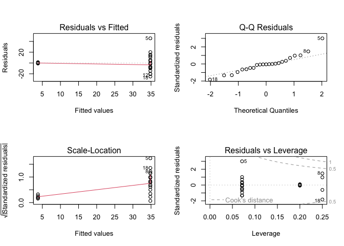<!-- -->

``` r
distribution_prob(nlfa_lm)
```

    ## 
    ## 
    ## Distribution    p_Residuals
    ## -------------  ------------
    ## cauchy               0.6875
    ## normal               0.1250
    ## tweedie              0.0625
    ## 
    ## 
    ## Distribution    p_Response
    ## -------------  -----------
    ## gamma              0.28125
    ## chi                0.18750
    ## half-cauchy        0.15625

``` r
# response distribution gamma; resids likely normal
leveneTest(residuals(nlfa_lm) ~ fa_reps$field_type) # No covariate, response and residuals tests equivalent
```

    ## Levene's Test for Homogeneity of Variance (center = median)
    ##       Df F value  Pr(>F)  
    ## group  2  3.1046 0.06695 .
    ##       20                  
    ## ---
    ## Signif. codes:  0 '***' 0.001 '**' 0.01 '*' 0.05 '.' 0.1 ' ' 1

Residuals distribution variance may not be equal in groups. Levene’s p =
0.067, close to rejecting the null of equal variance. Check CV in
groups.

``` r
fa_reps %>%
  mutate(field_type = factor(field_type, levels = c("corn", "restored", "remnant"))) %>%
  group_by(field_type) %>%
  summarize(mean = mean(amf),
            cv = sd(amf) / mean) %>%
  mutate(across(mean:cv, ~ round(.x, 2))) %>%
  kable(format = "pandoc", caption = "Mean and CV relationship in groups")
```

| field_type |  mean |   cv |
|:-----------|------:|-----:|
| corn       |  3.79 | 0.26 |
| restored   | 34.81 | 0.49 |
| remnant    | 34.82 | 0.59 |

Mean and CV relationship in groups

CV increases with mean, suggesting \> proportional mean/variance
relationship. Determine best model choice of log-transformed response or
gamma glm. Log:

``` r
nlfa_lm_log <- lm(log(amf) ~ field_type, data = fa_reps)
par(mfrow = c(2,2))
plot(nlfa_lm_log) # qqplot ok, one high leverage point in remnants
```

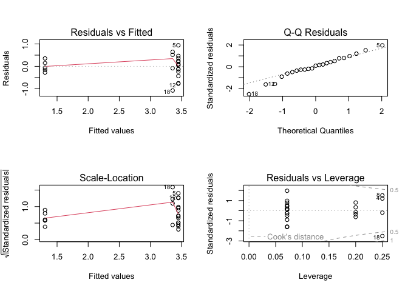<!-- -->

``` r
ncvTest(nlfa_lm_log) # p=0.19, null of constant variance not rejected
```

    ## Non-constant Variance Score Test 
    ## Variance formula: ~ fitted.values 
    ## Chisquare = 1.68588, Df = 1, p = 0.19414

Gamma glm:

``` r
nlfa_glm  <- glm(amf ~ field_type, family = Gamma(link = "log"), data = fa_reps)
nlfa_glm_diag <- glm.diag(nlfa_glm)
glm.diag.plots(nlfa_glm, nlfa_glm_diag) # qqplot shows strong fit; no leverage >0.5
```

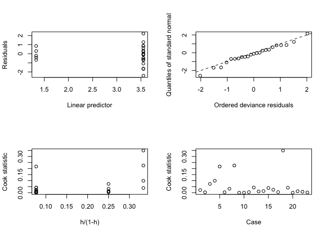<!-- -->

``` r
performance::check_overdispersion(nlfa_glm) # not detected
```

    ## # Overdispersion test (using simulated residuals)
    ## 
    ##  dispersion ratio = 1.266
    ##           p-value = 0.424

    ## No overdispersion detected.

Gamma glm is the best choice; no high-leverage point

Model results, group means, and post-hoc

``` r
Anova(nlfa_glm, test.statistic = "LR") 
```

    ## Analysis of Deviance Table (Type II tests)
    ## 
    ## Response: amf
    ##            LR Chisq Df Pr(>Chisq)    
    ## field_type   55.831  2  7.525e-13 ***
    ## ---
    ## Signif. codes:  0 '***' 0.001 '**' 0.01 '*' 0.05 '.' 0.1 ' ' 1

``` r
nlfa_em <- emmeans(nlfa_glm, ~ field_type, type = "response")
```

| field_type |  response |       SE |  df |  lower.CL |  upper.CL |
|:-----------|----------:|---------:|----:|----------:|----------:|
| corn       |  3.789798 | 0.794566 |  20 |  2.447266 |  5.868823 |
| restored   | 34.807708 | 4.361243 |  20 | 26.802024 | 45.204667 |
| remnant    | 34.817071 | 8.161334 |  20 | 21.351997 | 56.773539 |

Confidence level used: 0.95. Intervals are back-transformed from the log
scale

| contrast           |     ratio |        SE |  df | null |    t.ratio |   p.value |
|:-------------------|----------:|----------:|----:|-----:|-----------:|----------:|
| corn / restored    | 0.1088781 | 0.0265930 |  20 |    1 | -9.0790847 | 0.0000000 |
| corn / remnant     | 0.1088489 | 0.0342317 |  20 |    1 | -7.0520643 | 0.0000022 |
| restored / remnant | 0.9997311 | 0.2657200 |  20 |    1 | -0.0010119 | 0.9999994 |

P value adjustment: tukey method for comparing a family of 3 estimates.
Tests are performed on the log scale

## Pathogens

Abundance-scaled biomass

``` r
patho_ma_lm <- lm(patho_mass ~ field_type, data = its_guild_ma)
par(mfrow = c(2,2))
plot(patho_ma_lm) 
```

<!-- -->

no serious violations observed

``` r
distribution_prob(patho_ma_lm)
```

    ## 
    ## 
    ## Distribution    p_Residuals
    ## -------------  ------------
    ## normal              0.65625
    ## cauchy              0.15625
    ## gamma               0.12500
    ## 
    ## 
    ## Distribution    p_Response
    ## -------------  -----------
    ## gamma              0.43750
    ## weibull            0.15625
    ## uniform            0.09375

Residuals distribution fits normal, response gamma?

``` r
leveneTest(residuals(patho_ma_lm) ~ its_guild_ma$field_type) %>% as.data.frame() %>% kable(format = "pandoc") 
```

|       |  Df | F value |  Pr(\>F) |
|-------|----:|--------:|---------:|
| group |   2 | 1.56864 | 0.232904 |
|       |  20 |      NA |       NA |

No covariate, response and residuals tests equivalent. Residuals
distribution does not suggest the need for transformation. Levene’s p \>
0.05 → fail to reject = variances can be considered equal.

Model results, group means, and post-hoc, with arithmetic means from
emmeans

``` r
anova(patho_ma_lm)
```

    ## Analysis of Variance Table
    ## 
    ## Response: patho_mass
    ##            Df  Sum Sq Mean Sq F value  Pr(>F)  
    ## field_type  2 0.67016 0.33508    2.61 0.09836 .
    ## Residuals  20 2.56764 0.12838                  
    ## ---
    ## Signif. codes:  0 '***' 0.001 '**' 0.01 '*' 0.05 '.' 0.1 ' ' 1

``` r
patho_ma_em <- emmeans(patho_ma_lm, ~ field_type, type = "response")
```

| field_type |    emmean |        SE |  df |  lower.CL | upper.CL |
|:-----------|----------:|----------:|----:|----------:|---------:|
| corn       | 0.4420484 | 0.1602385 |  20 | 0.1077968 | 0.776300 |
| restored   | 0.8623116 | 0.0957608 |  20 | 0.6625581 | 1.062065 |
| remnant    | 0.6749910 | 0.1791521 |  20 | 0.3012863 | 1.048696 |

Confidence level used: 0.95

| contrast           |   estimate |        SE |  df |    t.ratio |   p.value |
|:-------------------|-----------:|----------:|----:|-----------:|----------:|
| corn - restored    | -0.4202632 | 0.1866722 |  20 | -2.2513436 | 0.0867007 |
| corn - remnant     | -0.2329426 | 0.2403577 |  20 | -0.9691495 | 0.6041907 |
| restored - remnant |  0.1873206 | 0.2031393 |  20 |  0.9221288 | 0.6329814 |

P value adjustment: tukey method for comparing a family of 3 estimates

## Saprotrophs

Abundance-scaled biomass

``` r
sapro_ma_lm <- lm(sapro_mass ~ field_type, data = its_guild_ma)
par(mfrow = c(2,2))
plot(sapro_ma_lm) 
```

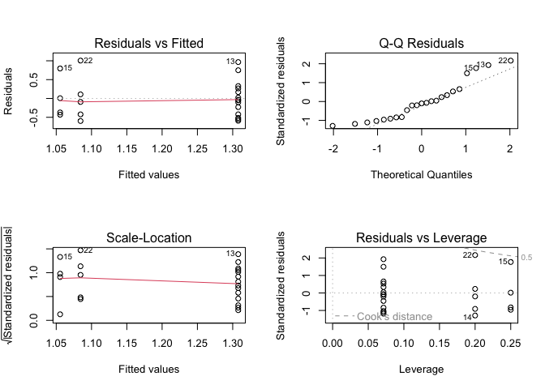<!-- -->

Variance looks consistent, no leverage points, poor qq fit

``` r
distribution_prob(sapro_ma_lm)
```

    ## 
    ## 
    ## Distribution    p_Residuals
    ## -------------  ------------
    ## normal              0.40625
    ## cauchy              0.15625
    ## gamma               0.15625
    ## 
    ## 
    ## Distribution    p_Response
    ## -------------  -----------
    ## gamma              0.59375
    ## exponential        0.12500
    ## pareto             0.09375

Residuals distribution fits normal, so do residuals

``` r
leveneTest(residuals(sapro_ma_lm) ~ its_guild_ma$field_type) %>% as.data.frame() %>% kable(format = "pandoc") 
```

|       |  Df |   F value |   Pr(\>F) |
|-------|----:|----------:|----------:|
| group |   2 | 0.1010933 | 0.9043076 |
|       |  20 |        NA |        NA |

No covariate; response and residuals tests equivalent Residuals
distribution does not suggest the need for transformation. Levene’s p \>
0.05 → fail to reject = variances can be considered equal (aka
homoscedastic by group).

Produce model results, group means, and post-hoc, with arithmetic means
from emmeans

``` r
anova(sapro_ma_lm)
```

    ## Analysis of Variance Table
    ## 
    ## Response: sapro_mass
    ##            Df Sum Sq Mean Sq F value Pr(>F)
    ## field_type  2 0.3076  0.1538  0.5701 0.5744
    ## Residuals  20 5.3961  0.2698

``` r
sapro_ma_em <- emmeans(sapro_ma_lm, ~ field_type, type = "response")
```

| field_type |   emmean |        SE |  df |  lower.CL | upper.CL |
|:-----------|---------:|----------:|----:|----------:|---------:|
| corn       | 1.084440 | 0.2322948 |  20 | 0.5998815 | 1.568999 |
| restored   | 1.307829 | 0.1388227 |  20 | 1.0182498 | 1.597408 |
| remnant    | 1.055516 | 0.2597135 |  20 | 0.5137630 | 1.597269 |

Confidence level used: 0.95

## Unified results

``` r
## Unified results ———————— ####
```

Fungal biomass differences differences across field types. Field type
effects were evaluated using ANOVA or Analysis of Deviance. P-values for
field type were adjusted for multiple comparisons across fungal groups
using the Benjamini-Hochberg procedure.

``` r
list(
  its_ma_lm   = anova(plfa_lm), 
  amf_ma_glm  = Anova(nlfa_glm, test.statistic = "LR"), 
  patho_ma_lm = anova(patho_ma_lm), 
  sapro_ma_lm = anova(sapro_ma_lm)
) %>% map(\(df) tidy(df) %>% select(term, statistic, df, p.value)) %>% 
  bind_rows(.id = "guild_test") %>% 
  mutate(p.adj = if_else(term == "field_type", p.adjust(p.value, "fdr"), NA_real_),
         across(where(is.numeric), ~ round(.x, 3)),
         `F` = paste0(statistic, " (", df, ", 19)")) %>% 
  select(guild_test, term, `F`, p.value, p.adj) %>% 
  kable(format = "pandoc")
```

| guild_test  | term       | F              | p.value | p.adj |
|:------------|:-----------|:---------------|--------:|------:|
| its_ma_lm   | field_type | 2.979 (2, 19)  |   0.074 | 0.131 |
| its_ma_lm   | Residuals  | NA (20, 19)    |      NA |    NA |
| amf_ma_glm  | field_type | 55.831 (2, 19) |   0.000 | 0.000 |
| patho_ma_lm | field_type | 2.61 (2, 19)   |   0.098 | 0.131 |
| patho_ma_lm | Residuals  | NA (20, 19)    |      NA |    NA |
| sapro_ma_lm | field_type | 0.57 (2, 19)   |   0.574 | 0.574 |
| sapro_ma_lm | Residuals  | NA (20, 19)    |      NA |    NA |

Figures

``` r
plfa_fig <- 
  ggplot(summary(plfa_em), aes(x = field_type, y = emmean)) +
  geom_col(aes(fill = field_type), color = "black", width = 0.5, linewidth = lw) +
  geom_errorbar(aes(ymin = emmean, ymax = upper.CL), width = 0, linewidth = lw) +
  labs(x = NULL, y = expression(atop("Biomass", paste("(", nmol[PLFA], " × ", g[soil]^{-1}, ")")))) +
  scale_fill_manual(values = ft_pal) +
  theme_cor +
  theme(legend.position = "none",
        plot.tag = element_text(size = 14, face = 1),
        plot.tag.position = c(0, 1))
```

``` r
nlfa_fig <-
  ggplot(summary(nlfa_em), aes(x = field_type, y = response)) +
  geom_col(aes(fill = field_type), color = "black", width = 0.5, linewidth = lw) +
  geom_errorbar(aes(ymin = response, ymax = upper.CL), width = 0, linewidth = lw) +
  geom_text(na.rm = TRUE, aes(y = upper.CL, label = c("a", "b", "b")),  vjust = -1, family = "sans", size = 3.5) +
  labs(x = NULL, y = expression(atop("Biomass", paste("(", nmol[NLFA], " × ", g[soil]^{-1}, ")")))) +
  scale_fill_manual(values = ft_pal) +
  lims(y = c(0, 75)) +
  theme_cor +
  theme(legend.position = "none",
        plot.tag = element_text(size = 14, face = 1),
        plot.tag.position = c(0, 1))
```

``` r
patho_ma_fig <- 
  ggplot(summary(patho_ma_em), aes(x = field_type, y = emmean)) +
  geom_col(aes(fill = field_type), color = "black", width = 0.5, linewidth = lw) +
  geom_errorbar(aes(ymin = emmean, ymax = upper.CL), width = 0, linewidth = lw) +
  labs(x = NULL, y = expression(atop("Biomass (scaled)", paste(bold(`(`), "(", nmol[PLFA], " × ", g[soil]^{-1}, ")", " × ", paste("(rel. abund)", bold(`)`)))))) +
  scale_fill_manual(values = ft_pal) +
  theme_cor +
  theme(legend.position = "none",
        plot.tag = element_text(size = 14, face = 1),
        plot.tag.position = c(0, 1))
```

``` r
sapro_ma_fig <- 
  ggplot(summary(sapro_ma_em), aes(x = field_type, y = emmean)) +
  geom_col(aes(fill = field_type), color = "black", width = 0.5, linewidth = lw) +
  geom_errorbar(aes(ymin = emmean, ymax = upper.CL), width = 0, linewidth = lw) +
  labs(x = NULL, y = expression(atop("Biomass (scaled)", paste(bold(`(`), "(", nmol[PLFA], " × ", g[soil]^{-1}, ")", " × ", paste("(rel. abund)", bold(`)`)))))) +
  scale_fill_manual(values = ft_pal) +
  theme_cor +
  theme(legend.position = "none",
        plot.tag = element_text(size = 14, face = 1),
        plot.tag.position = c(0, 1))
```

### Patchwork and export figure

Unified figure for supplemental

``` r
biomass_up <- (plfa_fig | plot_spacer() | nlfa_fig) +
  plot_layout(widths = c(0.50, 0.01, 0.50))
biomass_dn <- (patho_ma_fig | plot_spacer() | sapro_ma_fig) +
  plot_layout(widths = c(0.50, 0.01, 0.50))
biomass_fig <- (biomass_up / plot_spacer() / biomass_dn) +
  plot_layout(heights = c(0.50, 0.01, 0.50)) +
  plot_annotation(tag_levels = 'A')
```

``` r
biomass_fig
```

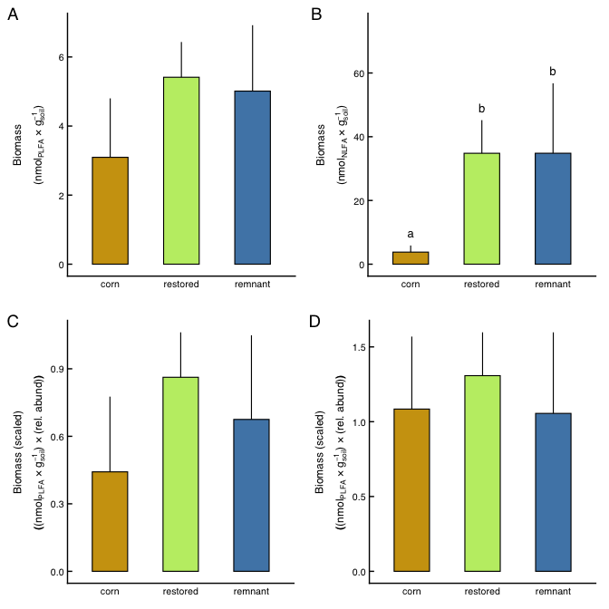<!-- -->

# Beta diversity

``` r
# Beta diversity ———————— ####
```

NMDS ordination of Bray-Curtis dissimilarities calculated from relative
sequence abundance for ITS2 fungal communities, including general fungi,
pathogens, and saprotrophs. For AM fungi, sequence-based ordination used
normalized weighted UniFrac distance. Because AM fungal biomass differed
among field types, these results were contrasted with Bray-Curtis
dissimilarities calculated from abundance-scaled biomass.

Inter-site distance covariates were included where spatial structure was
detected.

## ITS fungi

``` r
mva_its <- mva(d = d_reps$d_its, env = sites_reps)
```

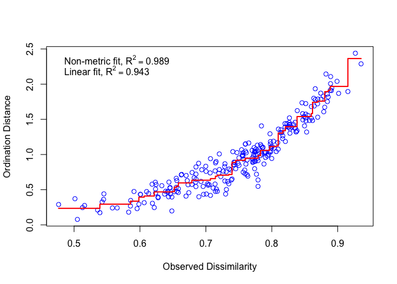<!-- -->

``` r
mva_its$ordination
```

    ## 
    ## Call:
    ## metaMDS(comm = d, k = 2, trymax = 100, autotransform = FALSE,      trace = FALSE) 
    ## 
    ## global Multidimensional Scaling using monoMDS
    ## 
    ## Data:     d 
    ## Distance: bray 
    ## 
    ## Dimensions: 2 
    ## Stress:     0.1063961 
    ## Stress type 1, weak ties
    ## Best solution was repeated 2 times in 20 tries
    ## The best solution was from try 11 (random start)
    ## Scaling: centring, PC rotation, halfchange scaling 
    ## Species: scores missing

``` r
mva_its$dispersion_test
```

    ## 
    ## Permutation test for homogeneity of multivariate dispersions
    ## Permutation: free
    ## Number of permutations: 1999
    ## 
    ## Response: Distances
    ##           Df   Sum Sq   Mean Sq      F N.Perm Pr(>F)  
    ## Groups     2 0.018819 0.0094097 2.9129   1999  0.083 .
    ## Residuals 20 0.064606 0.0032303                       
    ## ---
    ## Signif. codes:  0 '***' 0.001 '**' 0.01 '*' 0.05 '.' 0.1 ' ' 1
    ## 
    ## Pairwise comparisons:
    ## (Observed p-value below diagonal, permuted p-value above diagonal)
    ##              corn  remnant restored
    ## corn              0.132000    0.091
    ## remnant  0.126039             0.183
    ## restored 0.085164 0.181625

``` r
mva_its$permanova
```

    ## Permutation test for adonis under reduced model
    ## Terms added sequentially (first to last)
    ## Permutation: free
    ## Number of permutations: 1999
    ## 
    ## adonis2(formula = perm_form, data = env, permutations = nperm, by = "terms")
    ##            Df SumOfSqs      R2      F Pr(>F)    
    ## field_type  2   1.1796 0.18941 2.3366  0.001 ***
    ## Residual   20   5.0481 0.81059                  
    ## Total      22   6.2276 1.00000                  
    ## ---
    ## Signif. codes:  0 '***' 0.001 '**' 0.01 '*' 0.05 '.' 0.1 ' ' 1

``` r
mva_its$pairwise_contrasts[c(1,3,2), c(1,2,4,3,7,8)] %>% 
  arrange(group1, desc(group2)) %>% 
  kable(format = "pandoc", caption = "Pairwise permanova contrasts")
```

| group1  | group2   | F_value |    R2 | p_value | p_value_adj |
|:--------|:---------|--------:|------:|--------:|------------:|
| corn    | restored |   3.432 | 0.168 |  0.0010 |      0.0030 |
| corn    | remnant  |   2.862 | 0.290 |  0.0095 |      0.0142 |
| remnant | restored |   1.020 | 0.060 |  0.3895 |      0.3895 |

Pairwise permanova contrasts

Two-dimensional NMDS stress was 0.106. No evidence of differences in
multivariate dispersion among field types was detected (p = 0.083).

Plotting results:

``` r
its_ord_data <- mva_its$ordination_scores %>% 
  mutate(NMDS1 = -NMDS1,
         field_type = factor(field_type, levels = c("corn", "restored", "remnant")))
p_its_centers <- its_ord_data %>% 
  group_by(field_type) %>% 
  summarize(across(starts_with("NMDS"), list(mean = mean, ci_l = ci_l, ci_u = ci_u), .names = "{.fn}_{.col}"), .groups = "drop") %>% 
  mutate(across(c(ci_l_NMDS1, ci_u_NMDS1), ~ mean_NMDS1 + .x),
         across(c(ci_l_NMDS2, ci_u_NMDS2), ~ mean_NMDS2 + .x))
its_ord <- 
  ggplot(its_ord_data, aes(x = NMDS1, y = NMDS2)) +
  geom_linerange(data = p_its_centers, aes(x = mean_NMDS1, y = mean_NMDS2, xmin = ci_l_NMDS1, xmax = ci_u_NMDS1), linewidth = lw) +
  geom_linerange(data = p_its_centers, aes(x = mean_NMDS1, y = mean_NMDS2, ymin = ci_l_NMDS2, ymax = ci_u_NMDS2), linewidth = lw) +
  geom_point(data = p_its_centers, 
             aes(x = mean_NMDS1, y = mean_NMDS2, fill = field_type), 
             size = lg_size, stroke = lw, shape = 21) +
  geom_point(aes(fill = field_type), size = sm_size, stroke = lw, shape = 21) +
  geom_text(na.rm = TRUE, aes(label = yr_since), size = yrtx_size, family = "sans", fontface = 2, color = "black") +
  labs(
    x = paste0("NMDS 1 — General fungi"),
    y = paste0("NMDS 2 — General fungi")) +
  scale_x_continuous(breaks = c(-1.0,0.0,0.9)) +
  scale_y_continuous(breaks = c(-0.7,0,0.7)) +
  scale_fill_manual(values = ft_pal) +
  theme_ord +
  theme(legend.position = "none",
        plot.tag = element_text(size = 14, face = 1, hjust = 0),
        plot.tag.position = c(0, 1))
```

## AM fungi

### Standard ordination

Using sequence-based relative abundance, unifrac distance. No inter-site
distance covariate.

``` r
mva_amf <- mva(d = d_reps$d_amf_uni, env = sites_reps)
```

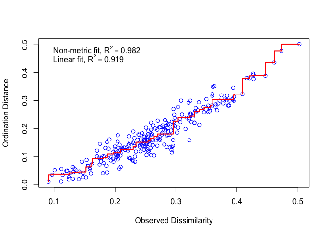<!-- -->

``` r
mva_amf$ordination
```

    ## 
    ## Call:
    ## metaMDS(comm = d, k = 2, trymax = 100, autotransform = FALSE,      trace = FALSE) 
    ## 
    ## global Multidimensional Scaling using monoMDS
    ## 
    ## Data:     d 
    ## Distance: user supplied 
    ## 
    ## Dimensions: 2 
    ## Stress:     0.1323063 
    ## Stress type 1, weak ties
    ## Best solution was repeated 1 time in 20 tries
    ## The best solution was from try 15 (random start)
    ## Scaling: centring, PC rotation 
    ## Species: scores missing

``` r
mva_amf$dispersion_test
```

    ## 
    ## Permutation test for homogeneity of multivariate dispersions
    ## Permutation: free
    ## Number of permutations: 1999
    ## 
    ## Response: Distances
    ##           Df   Sum Sq   Mean Sq      F N.Perm Pr(>F)
    ## Groups     2 0.000835 0.0004174 0.1169   1999  0.877
    ## Residuals 20 0.071402 0.0035701                     
    ## 
    ## Pairwise comparisons:
    ## (Observed p-value below diagonal, permuted p-value above diagonal)
    ##             corn remnant restored
    ## corn             0.91700   0.7555
    ## remnant  0.90120           0.6455
    ## restored 0.77254 0.64749

``` r
mva_amf$permanova
```

    ## Permutation test for adonis under reduced model
    ## Terms added sequentially (first to last)
    ## Permutation: free
    ## Number of permutations: 1999
    ## 
    ## adonis2(formula = perm_form, data = env, permutations = nperm, by = "terms")
    ##            Df SumOfSqs      R2      F Pr(>F)   
    ## field_type  2  0.20943 0.25686 3.4564  0.002 **
    ## Residual   20  0.60591 0.74314                 
    ## Total      22  0.81534 1.00000                 
    ## ---
    ## Signif. codes:  0 '***' 0.001 '**' 0.01 '*' 0.05 '.' 0.1 ' ' 1

``` r
mva_amf$pairwise_contrasts[c(1,3,2), c(1,2,4,3,7,8)] %>% 
  arrange(group1, desc(group2)) %>% 
  kable(format = "pandoc", caption = "Pairwise permanova contrasts")
```

| group1  | group2   | F_value |    R2 | p_value | p_value_adj |
|:--------|:---------|--------:|------:|--------:|------------:|
| corn    | restored |   6.032 | 0.262 |  0.0010 |      0.0030 |
| corn    | remnant  |   4.218 | 0.376 |  0.0095 |      0.0142 |
| remnant | restored |   0.352 | 0.022 |  0.9430 |      0.9430 |

Pairwise permanova contrasts

Two-dimensional NMDS stress was 0.132. No evidence of differences in
multivariate dispersion among field types was detected (p = 0.877).

Plotting the result:

``` r
amf_ord_data <- mva_amf$ordination_scores %>% 
  mutate(NMDS1 = -NMDS1,
         field_type = factor(field_type, levels = c("corn", "restored", "remnant")))
p_amf_centers <- amf_ord_data %>% 
  group_by(field_type) %>% 
  summarize(across(starts_with("NMDS"), list(mean = mean, ci_l = ci_l, ci_u = ci_u), .names = "{.fn}_{.col}"), .groups = "drop") %>% 
  mutate(across(c(ci_l_NMDS1, ci_u_NMDS1), ~ mean_NMDS1 + .x),
         across(c(ci_l_NMDS2, ci_u_NMDS2), ~ mean_NMDS2 + .x))
amf_ord <- 
  ggplot(amf_ord_data, aes(x = NMDS1, y = NMDS2)) + 
  geom_linerange(data = p_amf_centers, aes(x = mean_NMDS1, y = mean_NMDS2, xmin = ci_l_NMDS1, xmax = ci_u_NMDS1), linewidth = lw) +
  geom_linerange(data = p_amf_centers, aes(x = mean_NMDS1, y = mean_NMDS2, ymin = ci_l_NMDS2, ymax = ci_u_NMDS2), linewidth = lw) +
  geom_point(data = p_amf_centers, 
             aes(x = mean_NMDS1, y = mean_NMDS2, fill = field_type),
             size = lg_size, stroke = lw, shape = 21, show.legend = c(fill = FALSE)) +
  geom_point(aes(fill = field_type), size = sm_size, stroke = lw, shape = 21) +
  geom_text(na.rm = TRUE, aes(label = yr_since), size = yrtx_size, family = "sans", fontface = 2, color = "black") +
  scale_x_continuous(breaks = c(-0.2,0,0.2)) +
  scale_fill_manual(name = "Field type", values = ft_pal) +
  labs(
    x = paste0("NMDS 1 — AM fungi"),
    y = paste0("NMDS 2 — AM fungi")) +
  theme_ord +
  theme(legend.position = c(0.98, 0.02),
        legend.justification = c(1, 0),
        legend.title = element_text(size = 9, face = 1),
        legend.text = element_text(size = 8, face = 1),
        legend.background = element_rect(fill = "white", color = "black", linewidth = 0.2),
        legend.key = element_rect(fill = "white"),
        plot.tag = element_text(size = 14, face = 1, hjust = 0),
        plot.tag.position = c(0, 1))
```

### Biomass-aware ordination

Using abundance-scaled biomass, Bray-Curtis distance

``` r
mva_amf_ma <- mva(d = d_reps$d_amf_ma, env = sites_reps)
```

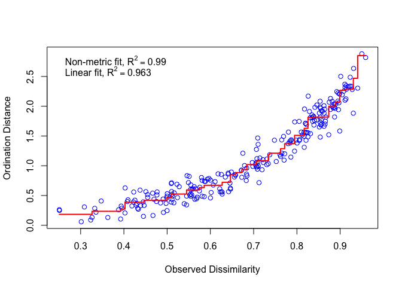<!-- -->

``` r
mva_amf_ma$ordination
```

    ## 
    ## Call:
    ## metaMDS(comm = d, k = 2, trymax = 100, autotransform = FALSE,      trace = FALSE) 
    ## 
    ## global Multidimensional Scaling using monoMDS
    ## 
    ## Data:     d 
    ## Distance: bray 
    ## 
    ## Dimensions: 2 
    ## Stress:     0.09878087 
    ## Stress type 1, weak ties
    ## Best solution was repeated 1 time in 20 tries
    ## The best solution was from try 18 (random start)
    ## Scaling: centring, PC rotation, halfchange scaling 
    ## Species: scores missing

``` r
mva_amf_ma$dispersion_test
```

    ## 
    ## Permutation test for homogeneity of multivariate dispersions
    ## Permutation: free
    ## Number of permutations: 1999
    ## 
    ## Response: Distances
    ##           Df   Sum Sq   Mean Sq      F N.Perm Pr(>F)
    ## Groups     2 0.019619 0.0098097 0.8516   1999  0.447
    ## Residuals 20 0.230381 0.0115191                     
    ## 
    ## Pairwise comparisons:
    ## (Observed p-value below diagonal, permuted p-value above diagonal)
    ##             corn remnant restored
    ## corn             0.41500   0.2295
    ## remnant  0.38757           0.6510
    ## restored 0.22227 0.65329

``` r
mva_amf_ma$permanova
```

    ## Permutation test for adonis under reduced model
    ## Terms added sequentially (first to last)
    ## Permutation: free
    ## Number of permutations: 1999
    ## 
    ## adonis2(formula = perm_form, data = env, permutations = nperm, by = "terms")
    ##            Df SumOfSqs      R2     F Pr(>F)    
    ## field_type  2   1.8649 0.34185 5.194  0.001 ***
    ## Residual   20   3.5904 0.65815                 
    ## Total      22   5.4553 1.00000                 
    ## ---
    ## Signif. codes:  0 '***' 0.001 '**' 0.01 '*' 0.05 '.' 0.1 ' ' 1

``` r
mva_amf_ma$pairwise_contrasts[c(1,3,2), c(1,2,4,3,7,8)] %>% 
  arrange(group1, desc(group2)) %>% 
  kable(format = "pandoc", caption = "Pairwise permanova contrasts")
```

| group1  | group2   | F_value |    R2 | p_value | p_value_adj |
|:--------|:---------|--------:|------:|--------:|------------:|
| corn    | restored |   9.778 | 0.365 |  0.0005 |      0.0015 |
| corn    | remnant  |   6.073 | 0.465 |  0.0095 |      0.0142 |
| remnant | restored |   0.396 | 0.024 |  0.9645 |      0.9645 |

Pairwise permanova contrasts

Two-dimensional NMDS stress was 0.099. No evidence of differences in
multivariate dispersion among field types was detected (p = 0.447).

Plotting results:

``` r
amf_ma_ord_data <- mva_amf_ma$ordination_scores %>% 
  mutate(NMDS1 = -NMDS1,
         field_type = factor(field_type, levels = c("corn", "restored", "remnant")))
p_amf_ma_centers <- amf_ma_ord_data %>% 
  group_by(field_type) %>% 
  summarize(across(starts_with("NMDS"), list(mean = mean, ci_l = ci_l, ci_u = ci_u), .names = "{.fn}_{.col}"), .groups = "drop") %>% 
  mutate(across(c(ci_l_NMDS1, ci_u_NMDS1), ~ mean_NMDS1 + .x),
         across(c(ci_l_NMDS2, ci_u_NMDS2), ~ mean_NMDS2 + .x))
amf_ma_ord <- 
  ggplot(amf_ma_ord_data, aes(x = NMDS1, y = NMDS2)) + 
  geom_linerange(data = p_amf_ma_centers, aes(x = mean_NMDS1, y = mean_NMDS2, xmin = ci_l_NMDS1, xmax = ci_u_NMDS1), linewidth = lw) +
  geom_linerange(data = p_amf_ma_centers, aes(x = mean_NMDS1, y = mean_NMDS2, ymin = ci_l_NMDS2, ymax = ci_u_NMDS2), linewidth = lw) +
  geom_point(data = p_amf_ma_centers, 
             aes(x = mean_NMDS1, y = mean_NMDS2, fill = field_type), 
             size = lg_size, stroke = lw, shape = 21, show.legend = c(fill = FALSE)) +
  geom_point(aes(fill = field_type), size = sm_size, stroke = lw, shape = 21) +
  geom_text(na.rm = TRUE, aes(label = yr_since), size = yrtx_size, family = "sans", fontface = 2, color = "black") +
  scale_x_continuous(breaks = c(-1.1,0,1.1)) +
  scale_y_continuous(breaks = c(-0.7,0,0.7)) +
  scale_fill_manual(name = "Field Type", values = ft_pal) +
  labs(
    x = paste0("NMDS 1 — AM fungi"),
    y = paste0("NMDS 2 — AM fungi")) +
  theme_ord +
  theme(legend.title = element_text(size = 9, face = 1),
        legend.text = element_text(size = 8, face = 1))
```

### Supplemental figure

``` r
amf_ma_ord
```

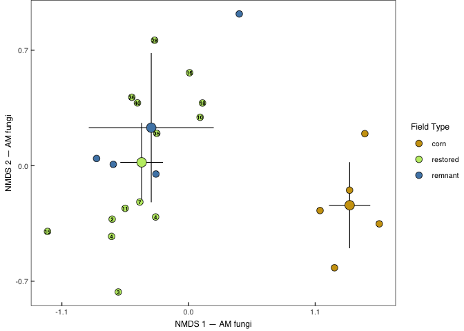<!-- -->

### Contrast AMF ordinations

Procrustes comparison of the two-dimensional sequence-based and
biomass-aware NMDS configurations.

``` r
set.seed(20251111)
amf_protest <- protest(
  mva_amf$ordination_scores %>% select(NMDS1, NMDS2),
  mva_amf_ma$ordination_scores %>% select(NMDS1, NMDS2),
  permutations = 1999
)
amf_protest
```

    ## 
    ## Call:
    ## protest(X = mva_amf$ordination_scores %>% select(NMDS1, NMDS2),      Y = mva_amf_ma$ordination_scores %>% select(NMDS1, NMDS2),      permutations = 1999) 
    ## 
    ## Procrustes Sum of Squares (m12 squared):        0.4132 
    ## Correlation in a symmetric Procrustes rotation: 0.766 
    ## Significance:  5e-04 
    ## 
    ## Permutation: free
    ## Number of permutations: 1999

The two NMDS configurations were significantly concordant (Procrustes r
= 0.766, p \< 0.001), although the correspondence was incomplete. The
biomass-aware analysis produced stronger separation of cornfields from
prairie sites, consistent with the substantially lower AM fungal biomass
in cornfields. The qualitative field-type inference was nevertheless the
same for the sequence-based and biomass-aware analyses.

## Pathogens

``` r
mva_patho <- mva(d = d_reps$d_patho, env = sites_reps)
```

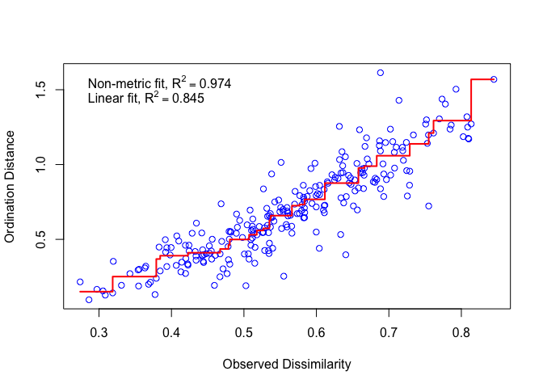<!-- -->

``` r
mva_patho$ordination
```

    ## 
    ## Call:
    ## metaMDS(comm = d, k = 2, trymax = 100, autotransform = FALSE,      trace = FALSE) 
    ## 
    ## global Multidimensional Scaling using monoMDS
    ## 
    ## Data:     d 
    ## Distance: bray 
    ## 
    ## Dimensions: 2 
    ## Stress:     0.1625488 
    ## Stress type 1, weak ties
    ## Best solution was repeated 3 times in 20 tries
    ## The best solution was from try 16 (random start)
    ## Scaling: centring, PC rotation, halfchange scaling 
    ## Species: scores missing

Diagnostics/results

``` r
mva_patho$dispersion_test
```

    ## 
    ## Permutation test for homogeneity of multivariate dispersions
    ## Permutation: free
    ## Number of permutations: 1999
    ## 
    ## Response: Distances
    ##           Df   Sum Sq   Mean Sq      F N.Perm Pr(>F)
    ## Groups     2 0.009961 0.0049803 1.1447   1999  0.328
    ## Residuals 20 0.087016 0.0043508                     
    ## 
    ## Pairwise comparisons:
    ## (Observed p-value below diagonal, permuted p-value above diagonal)
    ##             corn remnant restored
    ## corn             0.53400   0.1275
    ## remnant  0.54374           0.5885
    ## restored 0.12537 0.59943

``` r
mva_patho$permanova
```

    ## Permutation test for adonis under reduced model
    ## Terms added sequentially (first to last)
    ## Permutation: free
    ## Number of permutations: 1999
    ## 
    ## adonis2(formula = perm_form, data = env, permutations = nperm, by = "terms")
    ##            Df SumOfSqs      R2      F Pr(>F)    
    ## field_type  2   0.8345 0.22884 2.9674  0.001 ***
    ## Residual   20   2.8122 0.77116                  
    ## Total      22   3.6467 1.00000                  
    ## ---
    ## Signif. codes:  0 '***' 0.001 '**' 0.01 '*' 0.05 '.' 0.1 ' ' 1

``` r
mva_patho$pairwise_contrasts[c(1,3,2), c(1,2,4,3,7,8)] %>% 
  arrange(group1, desc(group2)) %>% 
  kable(format = "pandoc", caption = "Pairwise permanova contrasts")
```

| group1  | group2   | F_value |    R2 | p_value | p_value_adj |
|:--------|:---------|--------:|------:|--------:|------------:|
| corn    | restored |   4.439 | 0.207 |  0.0005 |      0.0015 |
| corn    | remnant  |   4.414 | 0.387 |  0.0095 |      0.0142 |
| remnant | restored |   0.903 | 0.053 |  0.4990 |      0.4990 |

Pairwise permanova contrasts

Two-dimensional NMDS stress was 0.163. No evidence of differences in
multivariate dispersion among field types was detected (p = 0.328).

Plot results

``` r
patho_ord_data <- mva_patho$ordination_scores %>% 
  mutate(NMDS1 = -NMDS1,
         field_type = factor(field_type, levels = c("corn", "restored", "remnant")))
p_patho_centers <- patho_ord_data %>% 
  group_by(field_type) %>% 
  summarize(across(starts_with("NMDS"), list(mean = mean, ci_l = ci_l, ci_u = ci_u), .names = "{.fn}_{.col}"), .groups = "drop") %>% 
  mutate(across(c(ci_l_NMDS1, ci_u_NMDS1), ~ mean_NMDS1 + .x),
         across(c(ci_l_NMDS2, ci_u_NMDS2), ~ mean_NMDS2 + .x))
patho_ord <- 
  ggplot(patho_ord_data, aes(x = NMDS1, y = NMDS2)) +
  geom_linerange(data = p_patho_centers, aes(x = mean_NMDS1, y = mean_NMDS2, xmin = ci_l_NMDS1, xmax = ci_u_NMDS1), linewidth = lw) +
  geom_linerange(data = p_patho_centers, aes(x = mean_NMDS1, y = mean_NMDS2, ymin = ci_l_NMDS2, ymax = ci_u_NMDS2), linewidth = lw) +
  geom_point(data = p_patho_centers, 
             aes(x = mean_NMDS1, y = mean_NMDS2, fill = field_type), 
             size = lg_size, stroke = lw, shape = 21, show.legend = c(fill = FALSE)) +
  geom_point(aes(fill = field_type), size = sm_size, stroke = lw, shape = 21) +
  geom_text(na.rm = TRUE, aes(label = yr_since), size = yrtx_size, family = "sans", fontface = 2, color = "black") +
  scale_x_continuous(breaks = c(-0.7,0,0.6)) +
  scale_y_continuous(breaks = c(-0.5,0,0.5)) +
  scale_fill_manual(name = "Field Type", values = ft_pal) +
  labs(
    x = paste0("NMDS 1 — Pathogens"),
    y = paste0("NMDS 2 — Pathogens")) +
  theme_ord +
  theme(legend.position = "none",
        plot.tag = element_text(size = 14, face = 1),
        plot.tag.position = c(0, 1))
```

## Saprotrophs

Account for spatial effects

``` r
mva_sapro <- mva(d = d_reps$d_sapro, env = sites_reps, covar = c("MEM1", "MEM3", "MEM2"))
```

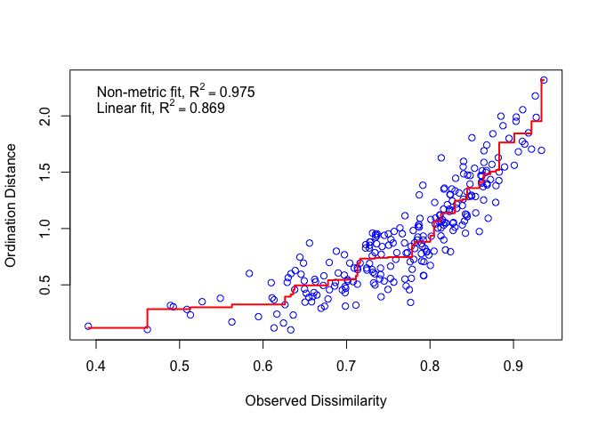<!-- -->

``` r
mva_sapro$ordination
```

    ## 
    ## Call:
    ## metaMDS(comm = d, k = 2, trymax = 100, autotransform = FALSE,      trace = FALSE) 
    ## 
    ## global Multidimensional Scaling using monoMDS
    ## 
    ## Data:     d 
    ## Distance: bray 
    ## 
    ## Dimensions: 2 
    ## Stress:     0.1581878 
    ## Stress type 1, weak ties
    ## Best solution was repeated 3 times in 20 tries
    ## The best solution was from try 15 (random start)
    ## Scaling: centring, PC rotation, halfchange scaling 
    ## Species: scores missing

``` r
mva_sapro$dispersion_test
```

    ## 
    ## Permutation test for homogeneity of multivariate dispersions
    ## Permutation: free
    ## Number of permutations: 1999
    ## 
    ## Response: Distances
    ##           Df   Sum Sq   Mean Sq      F N.Perm Pr(>F)
    ## Groups     2 0.016535 0.0082677 1.5258   1999 0.2455
    ## Residuals 20 0.108369 0.0054185                     
    ## 
    ## Pairwise comparisons:
    ## (Observed p-value below diagonal, permuted p-value above diagonal)
    ##              corn  remnant restored
    ## corn              0.297500   0.7965
    ## remnant  0.281162            0.0895
    ## restored 0.798242 0.090148

``` r
mva_sapro$permanova
```

    ## Permutation test for adonis under reduced model
    ## Terms added sequentially (first to last)
    ## Permutation: free
    ## Number of permutations: 1999
    ## 
    ## adonis2(formula = perm_form, data = env, permutations = nperm, by = "terms")
    ##            Df SumOfSqs      R2      F Pr(>F)    
    ## MEM1        1   0.4557 0.06953 1.8831 0.0095 ** 
    ## MEM3        1   0.4219 0.06436 1.7433 0.0150 *  
    ## MEM2        1   0.4234 0.06460 1.7497 0.0140 *  
    ## field_type  2   1.1395 0.17385 2.3543 0.0005 ***
    ## Residual   17   4.1140 0.62766                  
    ## Total      22   6.5546 1.00000                  
    ## ---
    ## Signif. codes:  0 '***' 0.001 '**' 0.01 '*' 0.05 '.' 0.1 ' ' 1

``` r
mva_sapro$pairwise_contrasts[c(1,3,2), c(1,2,4,3,8)] %>%
  arrange(group1, desc(group2)) %>% 
  kable(format = "pandoc", caption = "Pairwise permanova contrasts")
```

| group1  | group2   | F_value |    R2 | p_value_adj |
|:--------|:---------|--------:|------:|------------:|
| corn    | restored |   3.309 | 0.146 |      0.0008 |
| corn    | remnant  |   2.329 | 0.229 |      0.0008 |
| remnant | restored |   1.284 | 0.066 |      0.1460 |

Pairwise permanova contrasts

Two-dimensional NMDS stress was 0.158. No evidence of differences in
multivariate dispersion among field types was detected (p = 0.246).

Spatial structure in saprotroph communities was associated with MEM1,
MEM3, and MEM2. After accounting for these spatial covariates, field
type explained significant variation in community composition. Pairwise
comparisons indicated that saprotroph communities in cornfields differed
from those in both restored and remnant prairies, whereas restored and
remnant prairies did not differ.

Plotting results:

``` r
sapro_ord_data <- mva_sapro$ordination_scores %>% 
  mutate(NMDS1 = -NMDS1,
         field_type = factor(field_type, levels = c("corn", "restored", "remnant")))
p_sapro_centers <- sapro_ord_data %>%
  group_by(field_type) %>% 
  summarize(across(starts_with("NMDS"), list(mean = mean, ci_l = ci_l, ci_u = ci_u), .names = "{.fn}_{.col}"), .groups = "drop") %>% 
  mutate(across(c(ci_l_NMDS1, ci_u_NMDS1), ~ mean_NMDS1 + .x),
         across(c(ci_l_NMDS2, ci_u_NMDS2), ~ mean_NMDS2 + .x))
sapro_ord <-
  ggplot(sapro_ord_data, aes(x = NMDS1, y = NMDS2)) +
  geom_linerange(data = p_sapro_centers, aes(x = mean_NMDS1, y = mean_NMDS2, xmin = ci_l_NMDS1, xmax = ci_u_NMDS1), linewidth = lw) +
  geom_linerange(data = p_sapro_centers, aes(x = mean_NMDS1, y = mean_NMDS2, ymin = ci_l_NMDS2, ymax = ci_u_NMDS2), linewidth = lw) +
  geom_point(data = p_sapro_centers, 
             aes(x = mean_NMDS1, y = mean_NMDS2, fill = field_type), 
             size = lg_size, stroke = lw, shape = 21, show.legend = c(fill = FALSE)) +
  geom_point(aes(fill = field_type), size = sm_size, stroke = lw, shape = 21) +
  geom_text(na.rm = TRUE, aes(label = yr_since), size = yrtx_size, family = "sans", fontface = 2, color = "black") +
  scale_x_continuous(breaks = c(-0.8,0,0.7)) +
  scale_y_continuous(breaks = c(-0.9,0,0.9)) +
  scale_fill_manual(name = "Field Type", values = ft_pal) +
  labs(
    x = paste0("NMDS 1 — Saprotrophs"),
    y = paste0("NMDS 2 — Saprotrophs")) +
  theme_ord +
  theme(legend.position = "none",
        plot.tag = element_text(size = 14, face = 1),
        plot.tag.position = c(0, 1))
```

## Beta diversity summary

``` r
## Unified results ———————— ####
```

### NMDS Stress

``` r
list(
  its = mva_its$stress,
  amf_uni = mva_amf$stress,
  amf_ma = mva_amf_ma$stress,
  patho = mva_patho$stress,
  sapro = mva_sapro$stress
) %>% map(\(.x) round(.x, 3)) %>% 
  bind_rows(.id = "guild") %>% 
  kable(format = "pandoc", caption = "Stress for NMDS ordinations in guilds")
```

|   its | amf_uni | amf_ma | patho | sapro |
|------:|--------:|-------:|------:|------:|
| 0.106 |   0.132 |  0.099 | 0.163 | 0.158 |

Stress for NMDS ordinations in guilds

### Model summary statistics

Fungal community differences differences among field types. Field type
effects were evaluated using Permanova. P-values for field type were
adjusted for multiple comparisons across fungal groups using the
Benjamini-Hochberg procedure.

``` r
gl_perms <- list(
  its   = mva_its$permanova,
  amf_uni   = mva_amf$permanova,
  patho = mva_patho$permanova,
  sapro = mva_sapro$permanova
) %>% map(\(df) tidy(df) %>% select(term, pseudo_F = statistic, df, R2, p.value))
gl_perms_rdf <- gl_perms %>% 
  map(\(df) df %>% filter(term == "Residual") %>% select(rdf = df)) %>% 
  bind_rows(.id = "guild")
bind_rows(
  gl_perms %>% 
    bind_rows(.id = "guild") %>% 
    left_join(gl_perms_rdf, by = join_by(guild)) %>% 
    mutate(p.adj = if_else(term == "field_type", p.adjust(p.value, "fdr"), NA_real_),
           across(where(is.numeric), ~ round(.x, 4)),
           `Pseudo_F_(df)` = paste0(pseudo_F, " (", df, " ", rdf, ")")) %>% 
    filter(term %in% c("MEM1", "MEM2", "MEM3", "field_type")) %>% 
    select(guild, term, `Pseudo_F_(df)`, R2, p.value, p.adj),
  list(amf_ma = mva_amf_ma$permanova) %>% 
    map(\(df) tidy(df) %>% select(term, pseudo_F = statistic, df, R2, p.value)) %>% 
    bind_rows(.id = "guild") %>% 
    mutate(p.adj = if_else(term == "field_type", p.adjust(p.value, "fdr"), NA_real_),
           across(where(is.numeric), ~ round(.x, 4)),
           `Pseudo_F_(df)` = paste0(pseudo_F, " (", df, ", 20)")) %>% 
    filter(term == "field_type") %>% 
    select(guild, term, `Pseudo_F_(df)`, R2, p.value, p.adj)
) %>% 
  mutate(guild = factor(guild, levels = c("its", "amf_uni", "amf_ma", "patho", "sapro"))) %>% 
  arrange(guild, term) %>%  
  kable(format = "pandoc", caption = "PERMANOVA summary")
```

| guild   | term       | Pseudo_F\_(df) |     R2 | p.value |  p.adj |
|:--------|:-----------|:---------------|-------:|--------:|-------:|
| its     | field_type | 2.3366 (2 20)  | 0.1894 |  0.0010 | 0.0023 |
| amf_uni | field_type | 3.4564 (2 20)  | 0.2569 |  0.0020 | 0.0035 |
| amf_ma  | field_type | 5.194 (2, 20)  | 0.3418 |  0.0010 | 0.0010 |
| patho   | field_type | 2.9674 (2 20)  | 0.2288 |  0.0010 | 0.0023 |
| sapro   | MEM1       | 1.8831 (1 17)  | 0.0695 |  0.0095 |     NA |
| sapro   | MEM2       | 1.7497 (1 17)  | 0.0646 |  0.0140 |     NA |
| sapro   | MEM3       | 1.7433 (1 17)  | 0.0644 |  0.0150 |     NA |
| sapro   | field_type | 2.3543 (2 17)  | 0.1738 |  0.0005 | 0.0023 |

PERMANOVA summary

### Unified figure

Display community ordinations

``` r
fig3up <- (its_ord | plot_spacer() | amf_ord) +
  plot_layout(widths = c(0.50, 0.01, 0.50))
fig3dn <- (patho_ord | plot_spacer() | sapro_ord) +
  plot_layout(widths = c(0.50, 0.01, 0.50))
fig3 <- (fig3up / plot_spacer() / fig3dn) +
  plot_layout(heights = c(0.50, 0.01, 0.50)) +
  plot_annotation(tag_levels = 'A')
```

``` r
fig3
```

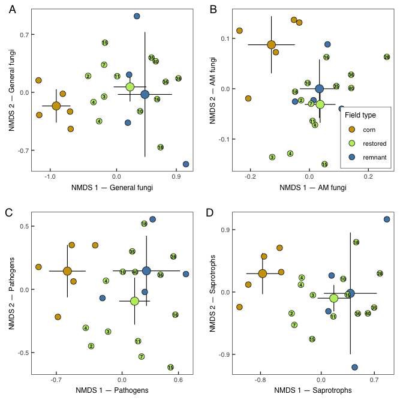<!-- -->

# Fungal communities and the environment

``` r
# FungComm-env corr ———————— ####
```

Do soil properties and plant communities explain variation in fungal
communities? What is the relative explanatory power of each, and which
particular variable correlate with fungal communities?

Restored and remnant prairies in Wisconsin are used to explore these
questions. Spatial covariate needed only with saprotrophs.

## Wrangle explanatory vars

``` r
soil_micro_pca <- 
  soil %>% 
  filter(field_name %in% sites_wi$field_name) %>% 
  select(field_name, SO4, Zn, Fe, Mn, Cu, Ca, Mg, Na) %>% 
  column_to_rownames(var = "field_name") %>% 
  decostand(method = "standardize") %>% 
  rda()
summary(soil_micro_pca) # 63% on first two axes
```

    ## 
    ## Call:
    ## rda(X = .) 
    ## 
    ## Partitioning of variance:
    ##               Inertia Proportion
    ## Total               8          1
    ## Unconstrained       8          1
    ## 
    ## Eigenvalues, and their contribution to the variance 
    ## 
    ## Importance of components:
    ##                          PC1    PC2    PC3     PC4    PC5     PC6     PC7
    ## Eigenvalue            3.1372 1.8654 1.3683 0.65097 0.5312 0.32857 0.09349
    ## Proportion Explained  0.3921 0.2332 0.1710 0.08137 0.0664 0.04107 0.01169
    ## Cumulative Proportion 0.3921 0.6253 0.7964 0.87773 0.9441 0.98520 0.99689
    ##                            PC8
    ## Eigenvalue            0.024912
    ## Proportion Explained  0.003114
    ## Cumulative Proportion 1.000000

``` r
soil_micro_index <- scores(soil_micro_pca, choices = c(1, 2), display = "sites") %>% 
  data.frame() %>% 
  rename(soil_micro_1 = PC1, soil_micro_2 = PC2) %>% 
  rownames_to_column(var = "field_name")
soil_macro <- 
  soil %>% 
  filter(field_name %in% sites_wi$field_name) %>% 
  select(field_name, pH, SOM, NO3, P, K)
```

Assemble explanatory variables and begin iterative selection process.
Plant functional groups and traits not included here were eliminated in
previous forward selection procedures (not shown). Check the VIF for
each explanatory variable to test for collinearity if model overfitting
is detected. Then run forward selection in `dbrda()`.

``` r
env_vars <- sites_wi %>% 
  select(field_name, MEM1, MEM2) %>% 
  left_join(soil_micro_index, by = join_by(field_name)) %>% 
  left_join(soil_macro, by = join_by(field_name)) %>% 
  left_join(gf_axis, by = join_by(field_name)) %>% # 92% on axis 1
  left_join(prich %>% select(field_name, pl_rich), by = join_by(field_name)) %>% # plant richness
  left_join(pfg %>% select(field_name, C3_grass, legume, shrubTree), by = join_by(field_name)) %>% 
  select(-soil_micro_1, -shrubTree, -legume, -C3_grass) %>% # variables removed after VIF check
  column_to_rownames(var = "field_name") %>% 
  as.data.frame()
env_cov <- env_vars[,c("MEM1", "MEM2"), drop = TRUE]
env_expl <- env_vars[, setdiff(colnames(env_vars), c("MEM1", "MEM2")), drop = FALSE] %>% 
  decostand("standardize")
```

Check VIF

``` r
env_expl %>% scale() %>% cor() %>% solve() %>% diag() %>% sort() %>% round(2)
```

    ##          NO3 soil_micro_2      pl_rich            K      gf_axis            P 
    ##         2.28         2.72         2.73         3.03         4.06         4.22 
    ##           pH          SOM 
    ##         5.25         5.80

High VIF or less informative vars iteratively removed with VIF \> 10

## Constrained analyses

``` r
## db-RDA ———————— ####
```

Test explanatory variables for correlation with site ordination. Using
plant data, so the analysis is restricted to Wisconsin sites. Edaphic
variables are too numerous to include individually, so transform micro
nutrients using PCA. Forb and grass cover is highly collinear; use the
grass-forb index produced previously with PCA.

Geographic distance covariate was significant with ITS (MEM2), pathogens
(MEM2), and saprotrophs (MEM1 & MEM2)

### ITS fungi

Condition MEM2

``` r
mod_null <- dbrda(d_wi$d_its_wi ~ 1 + Condition(env_cov[, "MEM2"]), data = env_expl)
mod_full <- dbrda(d_wi$d_its_wi ~ . + Condition(env_cov[, "MEM2"]), data = env_expl)
mod_step <- ordistep(mod_null, 
                     scope = formula(mod_full), 
                     direction = "forward", 
                     permutations = 1999, 
                     trace = FALSE)
```

Results

``` r
mod_step
```

    ## 
    ## Call: dbrda(formula = d_wi$d_its_wi ~ Condition(env_cov[, "MEM2"]) +
    ## gf_axis + pl_rich, data = env_expl)
    ## 
    ##               Inertia Proportion Rank
    ## Total          3.2477     1.0000     
    ## Conditional    0.4622     0.1423    1
    ## Constrained    0.9372     0.2886    2
    ## Unconstrained  1.8483     0.5691    9
    ## 
    ## Inertia is squared Bray distance
    ## 
    ## Eigenvalues for constrained axes:
    ## dbRDA1 dbRDA2 
    ## 0.6376 0.2996 
    ## 
    ## Eigenvalues for unconstrained axes:
    ##   MDS1   MDS2   MDS3   MDS4   MDS5   MDS6   MDS7   MDS8   MDS9 
    ## 0.3431 0.2789 0.2606 0.2270 0.1785 0.1701 0.1639 0.1401 0.0861

``` r
(mod_r2   <- RsquareAdj(mod_step, permutations = 1999))
```

    ## $r.squared
    ## [1] 0.2885822
    ## 
    ## $adj.r.squared
    ## [1] 0.1768512

``` r
(mod_glax <- anova(mod_step, permutations = 1999))
```

    ## Permutation test for dbrda under reduced model
    ## Permutation: free
    ## Number of permutations: 1999
    ## 
    ## Model: dbrda(formula = d_wi$d_its_wi ~ Condition(env_cov[, "MEM2"]) + gf_axis + pl_rich, data = env_expl)
    ##          Df SumOfSqs      F Pr(>F)    
    ## Model     2  0.93722 2.2818  5e-04 ***
    ## Residual  9  1.84828                  
    ## ---
    ## Signif. codes:  0 '***' 0.001 '**' 0.01 '*' 0.05 '.' 0.1 ' ' 1

``` r
(mod_inax <- anova(mod_step, by = "axis", permutations = 1999))
```

    ## Permutation test for dbrda under reduced model
    ## Forward tests for axes
    ## Permutation: free
    ## Number of permutations: 1999
    ## 
    ## Model: dbrda(formula = d_wi$d_its_wi ~ Condition(env_cov[, "MEM2"]) + gf_axis + pl_rich, data = env_expl)
    ##          Df SumOfSqs      F Pr(>F)    
    ## dbRDA1    1  0.63761 3.1048  5e-04 ***
    ## dbRDA2    1  0.29961 1.6210  5e-03 ** 
    ## Residual  9  1.84828                  
    ## ---
    ## Signif. codes:  0 '***' 0.001 '**' 0.01 '*' 0.05 '.' 0.1 ' ' 1

``` r
(mod_axpct <- round(100 * mod_step$CCA$eig / sum(mod_step$CCA$eig), 1))
```

    ## dbRDA1 dbRDA2 
    ##     68     32

``` r
anova(mod_step, by = "margin", permutations = 1999) %>% 
  as.data.frame() %>% 
  mutate(p.adj = p.adjust(`Pr(>F)`, "fdr")) %>% 
  kable(, format = "pandoc")
```

|          |  Df |  SumOfSqs |        F | Pr(\>F) | p.adj |
|----------|----:|----------:|---------:|--------:|------:|
| gf_axis  |   1 | 0.6324932 | 3.079854 |  0.0005 | 0.001 |
| pl_rich  |   1 | 0.3472243 | 1.690769 |  0.0380 | 0.038 |
| Residual |   9 | 1.8482823 |       NA |      NA |    NA |

Create the figure objects. Figure will be produced with panels from
other groups.

``` r
mod_step_eig <- round(mod_step$CCA$eig * 100, 1)
mod_scor <- scores(
  mod_step,
  choices = c(1, 2),
  display = c("bp", "sites"),
  tidy = FALSE
)
mod_scor_site <- mod_scor$sites %>% 
  data.frame() %>%
  rownames_to_column(var = "field_name") %>% 
  left_join(sites_wi, by = join_by(field_name))
mod_scor_bp <- bind_rows(
  mod_scor$biplot %>% 
    data.frame() %>% 
    rownames_to_column(var = "envvar") %>% 
    mutate(envlabs = c(">forb", "plant spp.")),
  data.frame(
    envvar = "gf_axis",
    dbRDA1 = -mod_scor$biplot["gf_axis", 1],
    dbRDA2 = -mod_scor$biplot["gf_axis", 2],
    envlabs = ">grass")
) %>% 
  arrange(envvar, envlabs) %>% 
  mutate(
    origin = 0,
    m = dbRDA2 / dbRDA1, 
    d = sqrt(dbRDA1^2 + dbRDA2^2), 
    dadd = sqrt((max(dbRDA1)-min(dbRDA1))^2 + (max(dbRDA2)-min(dbRDA2))^2)*dadd_adj,
    labx = ((d+dadd)*cos(atan(m)))*(dbRDA1/abs(dbRDA1)), 
    laby = ((d+dadd)*sin(atan(m)))*(dbRDA1/abs(dbRDA1)))
```

### AM fungi

Relative sequence abundance Env covars processed in the ITS section (see
above). No distance covariate.

``` r
amf_mod_null <- dbrda(d_wi$d_amf_wi ~ 1, data = env_expl)
amf_mod_full <- dbrda(d_wi$d_amf_wi ~ ., data = env_expl)
amf_mod_step <- ordistep(amf_mod_null,
                         scope = formula(amf_mod_full),
                         direction = "forward",
                         permutations = 1999,
                         trace = FALSE)
```

Results

``` r
amf_mod_step
```

    ## 
    ## Call: dbrda(formula = d_wi$d_amf_wi ~ gf_axis + pH, data = env_expl)
    ## 
    ##               Inertia Proportion Rank RealDims
    ## Total          0.3674     1.0000              
    ## Constrained    0.1635     0.4450    2        2
    ## Unconstrained  0.2039     0.5550   10        9
    ## 
    ## Inertia is squared Unknown distance
    ## 
    ## Eigenvalues for constrained axes:
    ##  dbRDA1  dbRDA2 
    ## 0.12080 0.04265 
    ## 
    ## Eigenvalues for unconstrained axes:
    ##     MDS1     MDS2     MDS3     MDS4     MDS5     MDS6     MDS7     MDS8 
    ##  0.06248  0.04913  0.03886  0.02901  0.01309  0.00482  0.00385  0.00199 
    ##     MDS9    iMDS1 
    ##  0.00119 -0.00052

``` r
(amf_mod_r2   <- RsquareAdj(amf_mod_step, permutations = 1999))
```

    ## $r.squared
    ## [1] 0.4449523
    ## 
    ## $adj.r.squared
    ## [1] 0.3339428

``` r
(amf_mod_glax <- anova(amf_mod_step, permutations = 1999))
```

    ## Permutation test for dbrda under reduced model
    ## Permutation: free
    ## Number of permutations: 1999
    ## 
    ## Model: dbrda(formula = d_wi$d_amf_wi ~ gf_axis + pH, data = env_expl)
    ##          Df SumOfSqs      F Pr(>F)    
    ## Model     2  0.16346 4.0082  5e-04 ***
    ## Residual 10  0.20390                  
    ## ---
    ## Signif. codes:  0 '***' 0.001 '**' 0.01 '*' 0.05 '.' 0.1 ' ' 1

``` r
(amf_mod_inax <- anova(amf_mod_step, by = "axis", permutations = 1999))
```

    ## Permutation test for dbrda under reduced model
    ## Forward tests for axes
    ## Permutation: free
    ## Number of permutations: 1999
    ## 
    ## Model: dbrda(formula = d_wi$d_amf_wi ~ gf_axis + pH, data = env_expl)
    ##          Df SumOfSqs      F Pr(>F)    
    ## dbRDA1    1 0.120803 5.9246 0.0005 ***
    ## dbRDA2    1 0.042655 2.3011 0.0230 *  
    ## Residual 10 0.203902                  
    ## ---
    ## Signif. codes:  0 '***' 0.001 '**' 0.01 '*' 0.05 '.' 0.1 ' ' 1

``` r
(amf_mod_axpct <- round(100 * amf_mod_step$CCA$eig / sum(amf_mod_step$CCA$eig), 1))
```

    ## dbRDA1 dbRDA2 
    ##   73.9   26.1

``` r
amf_mod_step$anova %>% 
  as.data.frame() %>% 
  mutate(p.adj = p.adjust(`Pr(>F)`, "fdr")) %>% 
  kable(, format = "pandoc")
```

|            |  Df |       AIC |        F | Pr(\>F) | p.adj |
|------------|----:|----------:|---------:|--------:|------:|
| \+ gf_axis |   1 | -14.67259 | 4.686311 |  0.0005 | 0.001 |
| \+ pH      |   1 | -15.71209 | 2.634020 |  0.0280 | 0.028 |

Based on permutation tests with n=1999 permutations, after accounting
for inter-site pairwise distance as a covariate, the model shows a
significant correlation between the site ordination on fungal
communities and the selected explanatory variables.

#### AMF constrained figure

Produce figure objects. Code for multipanel fig 6 is shown in the
saprotroph section.

``` r
amf_mod_step_eig <- round(amf_mod_step$CCA$eig * 100, 1)
amf_mod_scor <- scores(
  amf_mod_step,
  choices = c(1, 2),
  display = c("bp", "sites"),
  tidy = FALSE
)
amf_mod_scor_site <- amf_mod_scor$sites %>%
  data.frame() %>%
  rownames_to_column(var = "field_name") %>%
  left_join(sites_wi, by = join_by(field_name))
amf_mod_scor_bp <- bind_rows(
  amf_mod_scor$biplot %>%
    data.frame() %>%
    rownames_to_column(var = "envvar") %>%
    mutate(envlabs = c(">forb", "pH")),
  data.frame(
    envvar = "gf_axis",
    dbRDA1 = -amf_mod_scor$biplot["gf_axis", 1],
    dbRDA2 = -amf_mod_scor$biplot["gf_axis", 2],
    envlabs = ">grass")
) %>% 
  arrange(envvar, envlabs) %>% 
  mutate(
    origin = 0,
    m = dbRDA2 / dbRDA1,
    d = sqrt(dbRDA1^2 + dbRDA2^2),
    dadd = sqrt((max(dbRDA1)-min(dbRDA1))^2 + (max(dbRDA2)-min(dbRDA2))^2)*dadd_adj,
    labx = ((d+dadd)*cos(atan(m)))*(dbRDA1/abs(dbRDA1)),
    laby = ((d+dadd)*sin(atan(m)))*(dbRDA1/abs(dbRDA1)))
```

### Pathogens

Env covars processed in the ITS section (see above)

``` r
patho_mod_null <- dbrda(d_wi$d_patho_wi ~ 1 + Condition(env_cov[, "MEM2"]), data = env_expl)
patho_mod_full <- dbrda(d_wi$d_patho_wi ~ . + Condition(env_cov[, "MEM2"]), data = env_expl)
patho_mod_step <- ordistep(patho_mod_null,
                           scope = formula(patho_mod_full),
                           direction = "forward",
                           permutations = 1999,
                           trace = FALSE)
```

Results

``` r
patho_mod_step
```

    ## 
    ## Call: dbrda(formula = d_wi$d_patho_wi ~ Condition(env_cov[, "MEM2"]) +
    ## gf_axis + K, data = env_expl)
    ## 
    ##               Inertia Proportion Rank
    ## Total          1.6288     1.0000     
    ## Conditional    0.4242     0.2604    1
    ## Constrained    0.4501     0.2763    2
    ## Unconstrained  0.7546     0.4633    9
    ## 
    ## Inertia is squared Bray distance
    ## 
    ## Eigenvalues for constrained axes:
    ##  dbRDA1  dbRDA2 
    ## 0.29422 0.15584 
    ## 
    ## Eigenvalues for unconstrained axes:
    ##    MDS1    MDS2    MDS3    MDS4    MDS5    MDS6    MDS7    MDS8    MDS9 
    ## 0.29512 0.14264 0.10076 0.09022 0.05144 0.03228 0.02557 0.01027 0.00625

``` r
(patho_mod_r2   <- RsquareAdj(patho_mod_step, permutations = 1999))
```

    ## $r.squared
    ## [1] 0.2763153
    ## 
    ## $adj.r.squared
    ## [1] 0.189127

``` r
(patho_mod_glax <- anova(patho_mod_step, permutations = 1999))
```

    ## Permutation test for dbrda under reduced model
    ## Permutation: free
    ## Number of permutations: 1999
    ## 
    ## Model: dbrda(formula = d_wi$d_patho_wi ~ Condition(env_cov[, "MEM2"]) + gf_axis + K, data = env_expl)
    ##          Df SumOfSqs     F Pr(>F)   
    ## Model     2  0.45006 2.684 0.0015 **
    ## Residual  9  0.75456                
    ## ---
    ## Signif. codes:  0 '***' 0.001 '**' 0.01 '*' 0.05 '.' 0.1 ' ' 1

``` r
(patho_mod_inax <- anova(patho_mod_step, by = "axis", permutations = 1999))
```

    ## Permutation test for dbrda under reduced model
    ## Forward tests for axes
    ## Permutation: free
    ## Number of permutations: 1999
    ## 
    ## Model: dbrda(formula = d_wi$d_patho_wi ~ Condition(env_cov[, "MEM2"]) + gf_axis + K, data = env_expl)
    ##          Df SumOfSqs      F Pr(>F)   
    ## dbRDA1    1  0.29422 3.5092 0.0025 **
    ## dbRDA2    1  0.15584 2.0653 0.0545 . 
    ## Residual  9  0.75456                 
    ## ---
    ## Signif. codes:  0 '***' 0.001 '**' 0.01 '*' 0.05 '.' 0.1 ' ' 1

``` r
(patho_mod_axpct <- round(100 * patho_mod_step$CCA$eig / sum(patho_mod_step$CCA$eig), 1))
```

    ## dbRDA1 dbRDA2 
    ##   65.4   34.6

``` r
patho_mod_step$anova %>% 
  as.data.frame() %>% 
  mutate(p.adj = p.adjust(`Pr(>F)`, "fdr")) %>% 
  kable(, format = "pandoc")
```

|            |  Df |      AIC |        F | Pr(\>F) |  p.adj |
|------------|----:|---------:|---------:|--------:|-------:|
| \+ gf_axis |   1 | 4.300079 | 2.672949 |  0.0055 | 0.0110 |
| \+ K       |   1 | 3.298446 | 2.337540 |  0.0195 | 0.0195 |

Based on permutation tests with n=1999 permutations, after accounting
for inter-site pairwise distance as a covariate, the model shows no
significant correlation between pathogen community turnover and
explanatory variables.

#### Pathogen constrained figure

``` r
patho_mod_step_eig <- c(round(patho_mod_step$CCA$eig * 100, 1), round(patho_mod_step$CA$eig * 100, 1)[1])
patho_mod_scor <- scores(
  patho_mod_step,
  choices = c(1, 2),
  display = c("bp", "sites"),
  tidy = FALSE
)
patho_mod_scor_site <- patho_mod_scor$sites %>%
  data.frame() %>%
  rownames_to_column(var = "field_name") %>%
  left_join(sites_wi, by = join_by(field_name))
patho_mod_scor_bp <- bind_rows(
  patho_mod_scor$biplot %>%
    data.frame() %>%
    rownames_to_column(var = "envvar") %>%
    mutate(envlabs = c(">forb", "K")),
  data.frame(
    envvar = "gf_axis",
    dbRDA1 = -patho_mod_scor$biplot["gf_axis", 1],
    dbRDA2 = -patho_mod_scor$biplot["gf_axis", 2],
    envlabs = ">grass")
) %>% 
  arrange(envvar, envlabs) %>% 
  mutate(
    origin = 0,
    m = dbRDA2 / dbRDA1,
    d = sqrt(dbRDA1^2 + dbRDA2^2),
    dadd = sqrt((max(dbRDA1)-min(dbRDA1))^2 + (max(dbRDA2)-min(dbRDA2))^2)*dadd_adj,
    labx = ((d+dadd)*cos(atan(m)))*(dbRDA1/abs(dbRDA1)),
    laby = ((d+dadd)*sin(atan(m)))*(dbRDA1/abs(dbRDA1)))
```

### Saprotrophs

Env covars processed in the ITS section (see above) Two significant
spatial vars

``` r
sapro_mod_null <- dbrda(d_wi$d_sapro_wi ~ 1 + Condition(MEM2 + MEM1), data = cbind(env_expl, env_cov))
sapro_mod_full <- dbrda(d_wi$d_sapro_wi ~ soil_micro_2 + pH + SOM + NO3 + P + K + gf_axis + pl_rich + Condition(MEM2 + MEM1), data = cbind(env_expl, env_cov))
sapro_mod_step <- ordistep(sapro_mod_null,
                           scope = formula(sapro_mod_full),
                           direction = "forward",
                           permutations = 1999,
                           trace = FALSE)
```

Results

``` r
sapro_mod_step
```

    ## 
    ## Call: dbrda(formula = d_wi$d_sapro_wi ~ Condition(MEM2 + MEM1) + gf_axis +
    ## SOM + NO3, data = cbind(env_expl, env_cov))
    ## 
    ##               Inertia Proportion Rank
    ## Total          3.4587     1.0000     
    ## Conditional    0.8301     0.2400    2
    ## Constrained    1.2237     0.3538    3
    ## Unconstrained  1.4048     0.4062    7
    ## 
    ## Inertia is squared Bray distance
    ## 
    ## Eigenvalues for constrained axes:
    ## dbRDA1 dbRDA2 dbRDA3 
    ## 0.5426 0.3914 0.2897 
    ## 
    ## Eigenvalues for unconstrained axes:
    ##    MDS1    MDS2    MDS3    MDS4    MDS5    MDS6    MDS7 
    ## 0.31380 0.27515 0.23150 0.19716 0.18079 0.12502 0.08143

``` r
(sapro_mod_r2   <- RsquareAdj(sapro_mod_step, permutations = 1999))
```

    ## $r.squared
    ## [1] 0.3537978
    ## 
    ## $adj.r.squared
    ## [1] 0.2156636

``` r
(sapro_mod_glax <- anova(sapro_mod_step, permutations = 1999))
```

    ## Permutation test for dbrda under reduced model
    ## Permutation: free
    ## Number of permutations: 1999
    ## 
    ## Model: dbrda(formula = d_wi$d_sapro_wi ~ Condition(MEM2 + MEM1) + gf_axis + SOM + NO3, data = cbind(env_expl, env_cov))
    ##          Df SumOfSqs      F Pr(>F)    
    ## Model     3   1.2237 2.0324  5e-04 ***
    ## Residual  7   1.4048                  
    ## ---
    ## Signif. codes:  0 '***' 0.001 '**' 0.01 '*' 0.05 '.' 0.1 ' ' 1

``` r
(sapro_mod_inax <- anova(sapro_mod_step, by = "axis", permutations = 1999))
```

    ## Permutation test for dbrda under reduced model
    ## Forward tests for axes
    ## Permutation: free
    ## Number of permutations: 1999
    ## 
    ## Model: dbrda(formula = d_wi$d_sapro_wi ~ Condition(MEM2 + MEM1) + gf_axis + SOM + NO3, data = cbind(env_expl, env_cov))
    ##          Df SumOfSqs      F Pr(>F)   
    ## dbRDA1    1  0.54260 2.7037  0.002 **
    ## dbRDA2    1  0.39136 2.2287  0.002 **
    ## dbRDA3    1  0.28970 1.8559  0.014 * 
    ## Residual  7  1.40484                 
    ## ---
    ## Signif. codes:  0 '***' 0.001 '**' 0.01 '*' 0.05 '.' 0.1 ' ' 1

``` r
(sapro_mod_axpct <- round(100 * sapro_mod_step$CCA$eig / sum(sapro_mod_step$CCA$eig), 1))
```

    ## dbRDA1 dbRDA2 dbRDA3 
    ##   44.3   32.0   23.7

``` r
sapro_mod_step$anova %>% 
  as.data.frame() %>% 
  mutate(p.adj = p.adjust(`Pr(>F)`, "fdr")) %>% 
  kable(, format = "pandoc")
```

|            |  Df |      AIC |        F | Pr(\>F) |   p.adj |
|------------|----:|---------:|---------:|--------:|--------:|
| \+ gf_axis |   1 | 16.81572 | 2.083589 |  0.0045 | 0.01350 |
| \+ SOM     |   1 | 16.18929 | 1.791104 |  0.0225 | 0.03375 |
| \+ NO3     |   1 | 15.37848 | 1.689598 |  0.0365 | 0.03650 |

Based on permutation tests with n=1999 permutations, after accounting
for inter-site pairwise distance as a covariate, the model shows
correlations between the site ordination on saprotroph communities and
the selected explanatory variables.

#### Saprotroph constrained figure

``` r
sapro_mod_step_eig <- round(sapro_mod_step$CCA$eig * 100, 1)
sapro_mod_scor <- scores(
  sapro_mod_step,
  choices = c(1, 2),
  display = c("bp", "sites"),
  tidy = FALSE
)
sapro_mod_scor_site <- sapro_mod_scor$sites %>%
  data.frame() %>%
  rownames_to_column(var = "field_name") %>%
  left_join(sites_wi, by = join_by(field_name))
sapro_mod_scor_bp <- bind_rows(
  sapro_mod_scor$biplot %>%
    data.frame() %>%
    rownames_to_column(var = "envvar") %>%
    mutate(envlabs = c(">forb", "SOM", "NO3-")),
  data.frame(
    envvar = "gf_axis",
    dbRDA1 = -sapro_mod_scor$biplot["gf_axis", 1],
    dbRDA2 = -sapro_mod_scor$biplot["gf_axis", 2],
    envlabs = ">grass")
) %>% 
  arrange(envvar, envlabs) %>% 
  mutate(
    origin = 0,
    m = dbRDA2 / dbRDA1,
    d = sqrt(dbRDA1^2 + dbRDA2^2),
    dadd = sqrt((max(dbRDA1)-min(dbRDA1))^2 + (max(dbRDA2)-min(dbRDA2))^2)*dadd_adj,
    labx = ((d+dadd)*cos(atan(m)))*(dbRDA1/abs(dbRDA1)),
    laby = ((d+dadd)*sin(atan(m)))*(dbRDA1/abs(dbRDA1)))
```

### Constrained analysis unified summary

``` r
## Unified results ———————— ####
```

Environmental drivers were identified via partial distance-based
Redundancy Analysis (db-RDA) using forward selection. Geographic
distance (PCoA Axis 1) was included as a conditional term to partial out
spatial effects. Radj2 represents the cumulative variance explained by
the final selected model. P-values are based on 1,999 permutations; Padj
reflects FDR correction within the guild.

Produce objects with explanatory power and degrees of freedom for
reporting

``` r
dbrda_r2 <- data.frame(
  guild = c("all_fungi", "amf", "pathogens", "saprotrophs"),
  r2adj    = round(c(mod_r2$adj.r.squared, amf_mod_r2$adj.r.squared, patho_mod_r2$adj.r.squared, sapro_mod_r2$adj.r.squared), 3)
)
```

``` r
dbrda_rdf <- data.frame(
  guild = c("all_fungi", "amf", "pathogens", "saprotrophs"),
  rdf   = c(mod_inax["Residual", "Df"], amf_mod_inax["Residual", "Df"], patho_mod_inax["Residual", "Df"], sapro_mod_inax["Residual", "Df"])
)
```

#### Global tests

``` r
list(
  all_fungi   = mod_glax,
  amf         = amf_mod_glax,
  pathogens   = patho_mod_glax,
  saprotrophs = sapro_mod_glax
) %>% map(\(df) df %>% tidy() %>% filter(term != "Residual")) %>% 
  bind_rows(.id = "guild") %>% 
  left_join(dbrda_rdf, by = join_by(guild)) %>% 
  left_join(dbrda_r2, by = join_by(guild)) %>% 
  mutate(`pseudo_F_(df)` = paste0(round(statistic, 2), " (", df, ", ", rdf, ")"),
         p.adj = p.adjust(p.value, "fdr"),
         across(where(is.numeric), ~ round(.x, 4))) %>% 
  select(guild, term, `pseudo_F_(df)`, r2adj, p.value, p.adj) %>% 
  kable(format = "pandoc")
```

| guild       | term  | pseudo_F\_(df) | r2adj | p.value |  p.adj |
|:------------|:------|:---------------|------:|--------:|-------:|
| all_fungi   | Model | 2.28 (2, 9)    | 0.177 |  0.0005 | 0.0007 |
| amf         | Model | 4.01 (2, 10)   | 0.334 |  0.0005 | 0.0007 |
| pathogens   | Model | 2.68 (2, 9)    | 0.189 |  0.0015 | 0.0015 |
| saprotrophs | Model | 2.03 (3, 7)    | 0.216 |  0.0005 | 0.0007 |

#### Component axes

``` r
list(
  all_fungi   = mod_inax,
  amf         = amf_mod_inax,
  pathogens   = patho_mod_inax,
  saprotrophs = sapro_mod_inax
) %>% map(\(df) df %>% tidy() %>% filter(term != "Residual")) %>% 
  bind_rows(.id = "guild") %>% 
  left_join(dbrda_rdf, by = join_by(guild)) %>% 
  mutate(`pseudo_F_(df)` = paste0(round(statistic, 2), " (", df, ", ", rdf, ")"),
         term = str_remove(term, "\\+ "),
         p.adj = p.adjust(p.value, "fdr"),
         across(where(is.numeric), ~ round(.x, 4))) %>% 
  select(guild, term, `pseudo_F_(df)`, p.value, p.adj) %>% 
  kable(format = "pandoc")
```

| guild       | term   | pseudo_F\_(df) | p.value |  p.adj |
|:------------|:-------|:---------------|--------:|-------:|
| all_fungi   | dbRDA1 | 3.1 (1, 9)     |  0.0005 | 0.0023 |
| all_fungi   | dbRDA2 | 1.62 (1, 9)    |  0.0050 | 0.0075 |
| amf         | dbRDA1 | 5.92 (1, 10)   |  0.0005 | 0.0023 |
| amf         | dbRDA2 | 2.3 (1, 10)    |  0.0230 | 0.0259 |
| pathogens   | dbRDA1 | 3.51 (1, 9)    |  0.0025 | 0.0045 |
| pathogens   | dbRDA2 | 2.07 (1, 9)    |  0.0545 | 0.0545 |
| saprotrophs | dbRDA1 | 2.7 (1, 7)     |  0.0020 | 0.0045 |
| saprotrophs | dbRDA2 | 2.23 (1, 7)    |  0.0020 | 0.0045 |
| saprotrophs | dbRDA3 | 1.86 (1, 7)    |  0.0140 | 0.0180 |

#### Selected constraining variables

``` r
list(
  all_fungi   = mod_step$anova,
  amf         = amf_mod_step$anova,
  pathogens   = patho_mod_step$anova,
  saprotrophs = sapro_mod_step$anova
) %>% 
  map(\(df) df %>% tidy()) %>% 
  bind_rows(.id = "guild") %>% 
  left_join(dbrda_rdf, by = join_by(guild)) %>% 
  mutate(statistic = round(statistic, 3),
         `pseudo_F_(df)` = paste0(statistic, " (", df, ", ", rdf, ")"),
         term = str_remove(term, "\\+ "),
         p.adj = p.adjust(p.value, "fdr"),
         across(where(is.numeric), ~ round(.x, 4))) %>% 
  select(guild, term, `pseudo_F_(df)`, p.value, p.adj) %>% 
  arrange(guild, p.value) %>% 
  kable(format = "pandoc")
```

| guild       | term    | pseudo_F\_(df) | p.value |  p.adj |
|:------------|:--------|:---------------|--------:|-------:|
| all_fungi   | gf_axis | 2.687 (1, 9)   |  0.0010 | 0.0045 |
| all_fungi   | pl_rich | 1.691 (1, 9)   |  0.0455 | 0.0455 |
| amf         | gf_axis | 4.686 (1, 10)  |  0.0005 | 0.0045 |
| amf         | pH      | 2.634 (1, 10)  |  0.0280 | 0.0360 |
| pathogens   | gf_axis | 2.673 (1, 9)   |  0.0055 | 0.0124 |
| pathogens   | K       | 2.338 (1, 9)   |  0.0195 | 0.0338 |
| saprotrophs | gf_axis | 2.084 (1, 7)   |  0.0045 | 0.0124 |
| saprotrophs | SOM     | 1.791 (1, 7)   |  0.0225 | 0.0338 |
| saprotrophs | NO3     | 1.69 (1, 7)    |  0.0365 | 0.0411 |

#### Biplot panels

All soil fungi

``` r
fig4a <- 
  ggplot(mod_scor_site, aes(x = dbRDA1, y = dbRDA2)) +
  geom_segment(data = mod_scor_bp, 
               aes(x = origin, xend = dbRDA1, y = origin, yend = dbRDA2), 
               arrow = arrow(length = unit(2, "mm"), type = "closed"),
               color = c(pfg_col[5], pfg_col[4], "gray20")) +
  geom_text(na.rm = TRUE, data = mod_scor_bp, 
            aes(x = labx, y = laby, label = envlabs), 
            size = 3, color = "gray20", fontface = 2) +
  geom_point(aes(fill = field_type), size = sm_size, stroke = lw, shape = 21) +
  geom_text(na.rm = TRUE, aes(label = yr_since), size = yrtx_size, family = "sans", fontface = 2, color = "black") +
  labs(
    x = paste0("db-RDA 1 (", mod_axpct[1], "%; General fungi)"),
    y = paste0("db-RDA 2 (", mod_axpct[2], "%; General fungi)")) +
  scale_x_continuous(limits = c(-1.2,1.5), breaks = c(-1, 0, 1)) +
  scale_y_continuous(limits = c(-1.3, 1.8), breaks = c(-1, 0, 1)) +
  scale_fill_manual(values = ft_pal[2:3]) +
  theme_ord +
  theme(legend.position = "none",
        plot.tag = element_text(size = 14, face = 1, hjust = 0),
        plot.tag.position = c(0, 1))
```

AMF

``` r
fig4b <-
  ggplot(amf_mod_scor_site, aes(x = -1*dbRDA1, y = dbRDA2)) +
  geom_segment(data = amf_mod_scor_bp,
               aes(x = origin, xend = -1*dbRDA1, y = origin, yend = dbRDA2),
               arrow = arrow(length = unit(2, "mm"), type = "closed"),
               color = c(pfg_col[5], pfg_col[4], "gray20")) +
  geom_text(na.rm = TRUE, data = amf_mod_scor_bp,
            aes(x = -1*labx, y = laby, label = envlabs),
            size = 3, color = "gray20", fontface = 2) +
  geom_point(aes(fill = field_type), size = sm_size, stroke = lw, shape = 21) +
  geom_text(na.rm = TRUE, aes(label = yr_since), size = yrtx_size, family = "sans", fontface = 2, color = "black") +
  labs(
    x = paste0("db-RDA 1 (", amf_mod_axpct[1], "%; AM fungi)"),
    y = paste0("db-RDA 2 (", amf_mod_axpct[2], "%; AM fungi)")) +
  scale_x_continuous(limits = c(-1.2,1.3), breaks = c(-1, 0, 1)) +
  scale_y_continuous(limits = c(-1.2, 0.9), breaks = c(-1, 0, 1)) +
  scale_fill_manual(values = ft_pal[2:3]) +
  theme_ord +
  theme(legend.position = "none",
        plot.tag = element_text(size = 14, face = 1, hjust = 0),
        plot.tag.position = c(0, 1))
```

Pathogens, PCoA fig

``` r
fig4c <-
  ggplot(patho_mod_scor_site, aes(x = -1 * dbRDA1, y = dbRDA2)) +
  geom_segment(data = patho_mod_scor_bp,
               aes(x = origin, xend = -1 * dbRDA1, y = origin, yend = dbRDA2),
               arrow = arrow(length = unit(2, "mm"), type = "closed"),
               color = c("gray20", pfg_col[5], pfg_col[4])) +
  geom_text(na.rm = TRUE, data = patho_mod_scor_bp,
            aes(x = -1 * labx, y = laby, label = envlabs),
            size = 3, color = "gray20", fontface = 2) +
  geom_point(aes(fill = field_type), size = sm_size, stroke = lw, shape = 21) +
  geom_text(na.rm = TRUE, aes(label = yr_since), size = yrtx_size, family = "sans", fontface = 2, color = "black") +
  labs(
    x = paste0("db-RDA 1 (", patho_mod_step_eig[1], "%; Pathogens)"),
    y = paste0("db-RDA 2 (", patho_mod_step_eig[2], "%; Pathogens)")) +
  scale_x_continuous(limits = c(-1.1,1.1), breaks = c(-1, 0, 1)) +
  scale_y_continuous(breaks = c(-1, 0, 1)) +
  scale_fill_manual(values = ft_pal[2:3]) +
  theme_ord +
  theme(legend.position = "none",
        plot.tag = element_text(size = 14, face = 1, hjust = 0),
        plot.tag.position = c(0, 1))
```

Saprotrophs

``` r
fig4d <-
  ggplot(sapro_mod_scor_site, aes(x = -1 * dbRDA1, y = dbRDA2)) +
  geom_segment(data = sapro_mod_scor_bp,
               aes(x = origin, xend = -1 * dbRDA1, y = origin, yend = dbRDA2),
               arrow = arrow(length = unit(2, "mm"), type = "closed"),
               color = c("gray20", "gray20", pfg_col[5], pfg_col[4])) +
  geom_text(na.rm = TRUE, data = sapro_mod_scor_bp,
            aes(x = -1 * labx, y = laby, label = envlabs),
            size = 3, color = "gray20", fontface = 2) +
  geom_point(aes(fill = field_type), size = sm_size, stroke = lw, shape = 21) +
  geom_text(na.rm = TRUE, aes(label = yr_since), size = yrtx_size, family = "sans", fontface = 2, color = "black") +
  labs(
    x = paste0("db-RDA 1 (", sapro_mod_axpct[1], "%; Saprotrophs)"),
    y = paste0("db-RDA 2 (", sapro_mod_axpct[2], "%; Saprotrophs)")) +
  scale_x_continuous(limits = c(-1.3,1.5), breaks = c(-1, 0, 1)) +
  scale_y_continuous(breaks = c(-1, 0, 1)) +
  scale_fill_manual(name = "Field type", values = ft_pal[2:3]) +
  theme_ord +
  theme(legend.position = c(0.98, 0.65),
        legend.justification = c(1, 0),
        legend.title = element_text(size = 9, face = 1),
        legend.text = element_text(size = 8, face = 1),
        legend.background = element_rect(fill = "white", color = "black", linewidth = 0.2),
        legend.key = element_rect(fill = "white"),
        plot.tag = element_text(size = 14, face = 1, hjust = 0),
        plot.tag.position = c(0, 1))
```

#### Unified figure

Display results of constrained analyses

``` r
fig4up <- (fig4a | plot_spacer() | fig4b) +
  plot_layout(widths = c(0.50, 0.01, 0.50))
fig4dn <- (fig4c | plot_spacer() | fig4d) +
  plot_layout(widths = c(0.50, 0.01, 0.50))
fig4 <- (fig4up / plot_spacer() / fig4dn) +
  plot_layout(heights = c(0.50, 0.01, 0.50)) +
  plot_annotation(tag_levels = 'A')
```

``` r
fig4
```

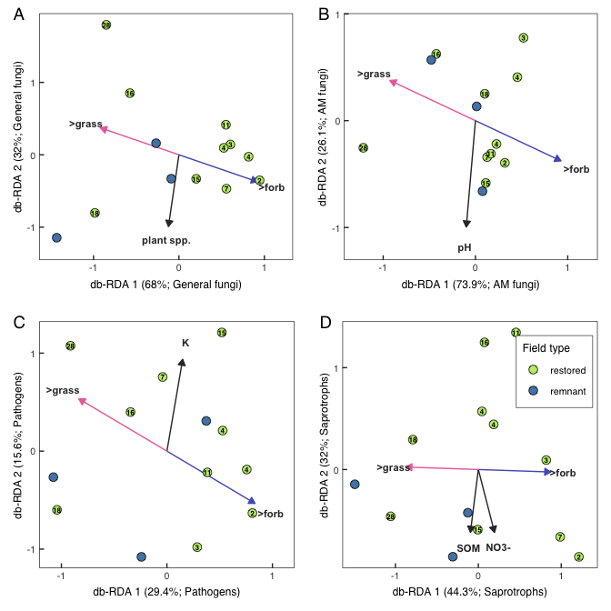<!-- -->

Fungal community ordinations which are constrained or unconstrained by
explanatory variables. Panels show results for all soil fungi **a**, amf
**b**, pathogens **c**, and saprotrophs **d**. Percent of constrained
(db-RDA) and unconstrained (PCoA) variation explained is shown with axis
labels. For explanatory variables with significant community
correlations, blue arrows show the grass-forb index with labels
indicating the direction of relative increase in C4 grasses or forbs,
respectively, along the index. The black arrows show other significant
constraining variables. Points show locations of restored fields (green)
and remnant fields (blue) in Wisconsin.

# Fungal abundance and the environment

``` r
# FungAbund-env corr ———————— ####
```

Plant community establishment has varied over time. How do plant
communities relate to fungal abundance/proportion in restored and
remnant fields?

## ITS fungi

How variable is biomass across sites?

``` r
(its_ma_cv <- 
   sd(fa_all %>% filter(field_name %in% sites_wi$field_name) %>% pull(fungi_18.2)) / 
   mean(fa_all %>% filter(field_name %in% sites_wi$field_name) %>% pull(fungi_18.2)) * 100)
```

    ## [1] 33.02084

Data for tests

``` r
fungi_resto <- its_div %>% 
  left_join(fa_all %>% select(field_name, fungi_mass = fungi_18.2), by = join_by(field_name)) %>% 
  left_join(sites_all, by = join_by(field_name, field_type)) %>% 
  filter(field_type != "corn", region != "FL") %>% 
  left_join(gf_axis, by = join_by(field_name)) %>% 
  left_join(prich %>% select(field_name, pl_rich, pl_shan), by = join_by(field_name)) %>% 
  select(field_name, fungi_ab = depth_rich, fungi_mass, gf_axis, pl_rich, pl_shan)
```

### Plant alpha diversity and fungal biomass

Is plant richness related to pathogen mass?

``` r
fa_prich_lm <- lm(fungi_mass ~ pl_rich, data = fungi_resto)
summary(fa_prich_lm)
```

    ## 
    ## Call:
    ## lm(formula = fungi_mass ~ pl_rich, data = fungi_resto)
    ## 
    ## Residuals:
    ##     Min      1Q  Median      3Q     Max 
    ## -2.4809 -0.6583  0.2743  0.7575  1.9430 
    ## 
    ## Coefficients:
    ##             Estimate Std. Error t value Pr(>|t|)    
    ## (Intercept)  7.84735    1.38756   5.656 0.000148 ***
    ## pl_rich     -0.07289    0.03368  -2.164 0.053335 .  
    ## ---
    ## Signif. codes:  0 '***' 0.001 '**' 0.01 '*' 0.05 '.' 0.1 ' ' 1
    ## 
    ## Residual standard error: 1.436 on 11 degrees of freedom
    ## Multiple R-squared:  0.2986, Adjusted R-squared:  0.2348 
    ## F-statistic: 4.683 on 1 and 11 DF,  p-value: 0.05334

Fungal mass and plant richness are weakly correlated but driven by a
high-leverage point (not shown). When seq proportion is a response and
log(mass) included as a covariate, no relationship is detected (not
shown).

Is plant diversity related to fungal mass?

``` r
fa_pshan_lm <- lm(fungi_mass ~ pl_shan, data = fungi_resto)
summary(fa_pshan_lm)
```

    ## 
    ## Call:
    ## lm(formula = fungi_mass ~ pl_shan, data = fungi_resto)
    ## 
    ## Residuals:
    ##     Min      1Q  Median      3Q     Max 
    ## -2.0899 -1.4918  0.4519  0.7842  2.6614 
    ## 
    ## Coefficients:
    ##             Estimate Std. Error t value Pr(>|t|)   
    ## (Intercept)   7.9113     1.8730   4.224  0.00143 **
    ## pl_shan      -0.2222     0.1378  -1.612  0.13517   
    ## ---
    ## Signif. codes:  0 '***' 0.001 '**' 0.01 '*' 0.05 '.' 0.1 ' ' 1
    ## 
    ## Residual standard error: 1.542 on 11 degrees of freedom
    ## Multiple R-squared:  0.1912, Adjusted R-squared:  0.1176 
    ## F-statistic:   2.6 on 1 and 11 DF,  p-value: 0.1352

Fungal biomass and plant diversity are negatively related but the
correlation is not significant. It’s driven almost entirely by KORP (not
shown) and wouldn’t be close to significant otherwise, no further
testing warranted.

### Fungal biomass and grass/forb composition

Inspect simple linear relationship.

``` r
fuma_rest_m <- lm(fungi_mass ~ gf_axis, data = fungi_resto)
summary(fuma_rest_m)
```

    ## 
    ## Call:
    ## lm(formula = fungi_mass ~ gf_axis, data = fungi_resto)
    ## 
    ## Residuals:
    ##     Min      1Q  Median      3Q     Max 
    ## -2.7014 -1.6462  0.6455  1.0298  2.2321 
    ## 
    ## Coefficients:
    ##             Estimate Std. Error t value Pr(>|t|)    
    ## (Intercept)    4.971      0.442  11.246 2.26e-07 ***
    ## gf_axis       -2.180      1.657  -1.315    0.215    
    ## ---
    ## Signif. codes:  0 '***' 0.001 '**' 0.01 '*' 0.05 '.' 0.1 ' ' 1
    ## 
    ## Residual standard error: 1.594 on 11 degrees of freedom
    ## Multiple R-squared:  0.1359, Adjusted R-squared:  0.05736 
    ## F-statistic:  1.73 on 1 and 11 DF,  p-value: 0.2151

The relationship is poor and needs no further analysis

## AM fungi

How variable is biomass across sites?

``` r
(amf_ma_cv <- 
    sd(fa_all %>% filter(field_name %in% sites_wi$field_name) %>% pull(amf)) / 
    mean(fa_all %>% filter(field_name %in% sites_wi$field_name) %>% pull(amf)) * 100)
```

    ## [1] 52.16179

Data for these tests

``` r
amf_resto <- amf_div %>% 
  left_join(fa_all %>% select(field_name, amf_mass = amf), by = join_by(field_name)) %>% 
  left_join(sites_all, by = join_by(field_name, field_type)) %>% 
  filter(field_type != "corn", region != "FL") %>% 
  left_join(gf_axis, by = join_by(field_name)) %>% 
  left_join(prich %>% select(field_name, pl_rich, pl_shan), by = join_by(field_name)) %>% 
  select(field_name, amf_ab = depth_rich, amf_mass, gf_axis, pl_rich, pl_shan) 
```

### Plant richness and fungal biomass

Is plant richness related to am fungal mass?

``` r
amfa_prich_lm <- lm(amf_mass ~ pl_rich, data = amf_resto)
summary(amfa_prich_lm)
```

    ## 
    ## Call:
    ## lm(formula = amf_mass ~ pl_rich, data = amf_resto)
    ## 
    ## Residuals:
    ##    Min     1Q Median     3Q    Max 
    ## -25.68 -10.68  -1.42  10.06  45.05 
    ## 
    ## Coefficients:
    ##              Estimate Std. Error t value Pr(>|t|)  
    ## (Intercept) 35.651114  18.693669   1.907   0.0829 .
    ## pl_rich     -0.003654   0.453789  -0.008   0.9937  
    ## ---
    ## Signif. codes:  0 '***' 0.001 '**' 0.01 '*' 0.05 '.' 0.1 ' ' 1
    ## 
    ## Residual standard error: 19.34 on 11 degrees of freedom
    ## Multiple R-squared:  5.893e-06,  Adjusted R-squared:  -0.0909 
    ## F-statistic: 6.483e-05 on 1 and 11 DF,  p-value: 0.9937

AM fungal mass and plant richness are nearly perfectly unrelated.

Is plant diversity related to am fungal mass?

``` r
amfa_pshan_lm <- lm(amf_mass ~ pl_shan, data = amf_resto)
summary(amfa_pshan_lm)
```

    ## 
    ## Call:
    ## lm(formula = amf_mass ~ pl_shan, data = amf_resto)
    ## 
    ## Residuals:
    ##     Min      1Q  Median      3Q     Max 
    ## -25.120 -10.432  -2.183  10.726  43.314 
    ## 
    ## Coefficients:
    ##             Estimate Std. Error t value Pr(>|t|)
    ## (Intercept)  23.5363    23.2042   1.014    0.332
    ## pl_shan       0.9046     1.7072   0.530    0.607
    ## 
    ## Residual standard error: 19.1 on 11 degrees of freedom
    ## Multiple R-squared:  0.02489,    Adjusted R-squared:  -0.06376 
    ## F-statistic: 0.2808 on 1 and 11 DF,  p-value: 0.6067

AM fungal biomass and plant diversity are positively related but only
weakly so, no further testing warranted.

### AM fungal biomass and grass/forb composition

Inspect simple linear relationship. Naïve model.

``` r
amma_rest_m <- lm(amf_mass ~ gf_axis, data = amf_resto)
summary(amma_rest_m)
```

    ## 
    ## Call:
    ## lm(formula = amf_mass ~ gf_axis, data = amf_resto)
    ## 
    ## Residuals:
    ##     Min      1Q  Median      3Q     Max 
    ## -15.847  -9.842  -2.154   5.266  45.036 
    ## 
    ## Coefficients:
    ##             Estimate Std. Error t value Pr(>|t|)    
    ## (Intercept)   35.507      4.551   7.801 8.29e-06 ***
    ## gf_axis       35.320     17.063   2.070   0.0628 .  
    ## ---
    ## Signif. codes:  0 '***' 0.001 '**' 0.01 '*' 0.05 '.' 0.1 ' ' 1
    ## 
    ## Residual standard error: 16.41 on 11 degrees of freedom
    ## Multiple R-squared:  0.2803, Adjusted R-squared:  0.2149 
    ## F-statistic: 4.285 on 1 and 11 DF,  p-value: 0.06277

AM fungal mass increases with grass-forb index slightly with p value
just above 0.95 alpha cutoff.

## Pathogens

``` r
## Pathogens ———————— ####
```

Data for these tests

``` r
patho_resto <- its_guild_wi %>% 
  left_join(its_guild_ma %>% select(field_name, patho_mass), by = join_by(field_name)) %>% 
  left_join(prich %>% select(field_name, pl_rich, pl_shan), by = join_by(field_name)) %>% 
  mutate(
    patho_prop = patho_abund / fungi_abund, # no zeroes present...
    notpatho_abund = fungi_abund - patho_abund,
    fungi_mass_lc = as.numeric(scale(log(fungi_mass), center = TRUE, scale = FALSE))
  ) %>% 
  select(-sapro_abund, -c(annual:shrubTree)) 
```

How variable is biomass-scaled abundance across sites?

``` r
(patho_ma_cv <- sd(patho_resto$patho_mass) / mean(patho_resto$patho_mass) * 100)
```

    ## [1] 48.96966

### Plant richness and pathogens

Is plant richness related to pathogen mass or proportion?

``` r
pathofa_prich_lm = lm(patho_mass ~ pl_rich, data = patho_resto)
summary(pathofa_prich_lm)
```

    ## 
    ## Call:
    ## lm(formula = patho_mass ~ pl_rich, data = patho_resto)
    ## 
    ## Residuals:
    ##      Min       1Q   Median       3Q      Max 
    ## -0.59887 -0.36293  0.02093  0.28457  0.79546 
    ## 
    ## Coefficients:
    ##              Estimate Std. Error t value Pr(>|t|)  
    ## (Intercept)  1.126277   0.426049   2.644   0.0228 *
    ## pl_rich     -0.006329   0.010342  -0.612   0.5530  
    ## ---
    ## Signif. codes:  0 '***' 0.001 '**' 0.01 '*' 0.05 '.' 0.1 ' ' 1
    ## 
    ## Residual standard error: 0.4409 on 11 degrees of freedom
    ## Multiple R-squared:  0.03292,    Adjusted R-squared:  -0.055 
    ## F-statistic: 0.3744 on 1 and 11 DF,  p-value: 0.553

Pathogen mass and plant richness aren’t correlated, though the direction
is negative. Relationship is weak enough that no further tests are
warranted.

``` r
patho_prich_glm <- glm(patho_prop ~ fungi_mass_lc + pl_rich,
                    data = patho_resto, family = quasibinomial(link = "logit"),
                    weights = fungi_abund)
summary(patho_prich_glm) 
```

    ## 
    ## Call:
    ## glm(formula = patho_prop ~ fungi_mass_lc + pl_rich, family = quasibinomial(link = "logit"), 
    ##     data = patho_resto, weights = fungi_abund)
    ## 
    ## Coefficients:
    ##                Estimate Std. Error t value Pr(>|t|)  
    ## (Intercept)   -1.453491   0.644743  -2.254   0.0478 *
    ## fungi_mass_lc  0.133695   0.552694   0.242   0.8137  
    ## pl_rich       -0.001881   0.015743  -0.119   0.9073  
    ## ---
    ## Signif. codes:  0 '***' 0.001 '**' 0.01 '*' 0.05 '.' 0.1 ' ' 1
    ## 
    ## (Dispersion parameter for quasibinomial family taken to be 418.3502)
    ## 
    ##     Null deviance: 4421.9  on 12  degrees of freedom
    ## Residual deviance: 4368.5  on 10  degrees of freedom
    ## AIC: NA
    ## 
    ## Number of Fisher Scoring iterations: 4

No relationship detected.

Is plant diversity related to pathogen mass or porportion?

``` r
pathofa_pshan_lm = lm(patho_mass ~ pl_shan, data = patho_resto)
summary(pathofa_pshan_lm)
```

    ## 
    ## Call:
    ## lm(formula = patho_mass ~ pl_shan, data = patho_resto)
    ## 
    ## Residuals:
    ##      Min       1Q   Median       3Q      Max 
    ## -0.72208 -0.33569  0.08258  0.30109  0.72374 
    ## 
    ## Coefficients:
    ##             Estimate Std. Error t value Pr(>|t|)  
    ## (Intercept)  1.11070    0.53974   2.058   0.0641 .
    ## pl_shan     -0.01770    0.03971  -0.446   0.6645  
    ## ---
    ## Signif. codes:  0 '***' 0.001 '**' 0.01 '*' 0.05 '.' 0.1 ' ' 1
    ## 
    ## Residual standard error: 0.4443 on 11 degrees of freedom
    ## Multiple R-squared:  0.01773,    Adjusted R-squared:  -0.07157 
    ## F-statistic: 0.1986 on 1 and 11 DF,  p-value: 0.6645

NS

``` r
patho_pshan_glm <- glm(patho_prop ~ fungi_mass_lc + pl_shan,
                       data = patho_resto, family = quasibinomial(link = "logit"),
                       weights = fungi_abund)
summary(patho_pshan_glm) 
```

    ## 
    ## Call:
    ## glm(formula = patho_prop ~ fungi_mass_lc + pl_shan, family = quasibinomial(link = "logit"), 
    ##     data = patho_resto, weights = fungi_abund)
    ## 
    ## Coefficients:
    ##               Estimate Std. Error t value Pr(>|t|)  
    ## (Intercept)   -1.67458    0.81358  -2.058   0.0666 .
    ## fungi_mass_lc  0.20623    0.54044   0.382   0.7107  
    ## pl_shan        0.01100    0.05976   0.184   0.8576  
    ## ---
    ## Signif. codes:  0 '***' 0.001 '**' 0.01 '*' 0.05 '.' 0.1 ' ' 1
    ## 
    ## (Dispersion parameter for quasibinomial family taken to be 421.5296)
    ## 
    ##     Null deviance: 4421.9  on 12  degrees of freedom
    ## Residual deviance: 4360.0  on 10  degrees of freedom
    ## AIC: NA
    ## 
    ## Number of Fisher Scoring iterations: 4

NS

### Plant functional groups and pathogens

#### PFG and pathogen mass

``` r
patho_gf_lm <- lm(patho_mass ~ gf_axis, data = patho_resto)
```

``` r
check_model(patho_gf_lm) 
```

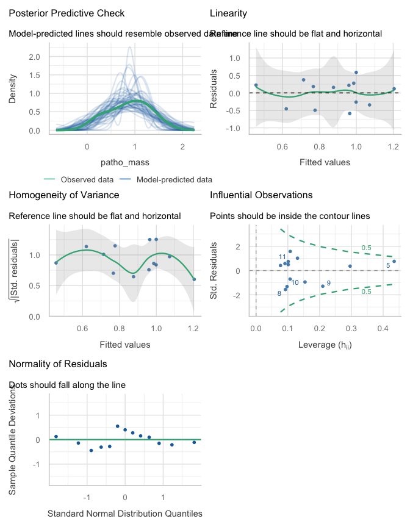<!-- -->

No obvious issues

``` r
summary(patho_gf_lm)
```

    ## 
    ## Call:
    ## lm(formula = patho_mass ~ gf_axis, data = patho_resto)
    ## 
    ## Residuals:
    ##     Min      1Q  Median      3Q     Max 
    ## -0.5889 -0.3432  0.1578  0.2245  0.5870 
    ## 
    ## Coefficients:
    ##             Estimate Std. Error t value Pr(>|t|)    
    ## (Intercept)   0.8765     0.1096   7.997 6.55e-06 ***
    ## gf_axis       0.7301     0.4109   1.777    0.103    
    ## ---
    ## Signif. codes:  0 '***' 0.001 '**' 0.01 '*' 0.05 '.' 0.1 ' ' 1
    ## 
    ## Residual standard error: 0.3952 on 11 degrees of freedom
    ## Multiple R-squared:  0.223,  Adjusted R-squared:  0.1524 
    ## F-statistic: 3.157 on 1 and 11 DF,  p-value: 0.1032

The model shows a positive relationship that isn’t significant.
Diagnostic reveals noisy fit and lots of structure.

#### PFG and pathogen proportion

Note on interpretation: exponentiated coefficients are interpreted as
odds ratios for pathogen dominance within the fungal community. Sequence
abundances are used as analytic weights so that sites with higher
sequencing depth contributed proportionally more information to the
likelihood.

``` r
patho_gf_glm <- glm(patho_prop ~ fungi_mass_lc + gf_axis,
                    data = patho_resto, family = quasibinomial(link = "logit"),
                    weights = fungi_abund)
summary(patho_gf_glm) # dispersion parameter >117 justifies quasibinomial
```

    ## 
    ## Call:
    ## glm(formula = patho_prop ~ fungi_mass_lc + gf_axis, family = quasibinomial(link = "logit"), 
    ##     data = patho_resto, weights = fungi_abund)
    ## 
    ## Coefficients:
    ##               Estimate Std. Error t value Pr(>|t|)    
    ## (Intercept)   -1.60740    0.09286 -17.310 8.77e-09 ***
    ## fungi_mass_lc  0.57428    0.29444   1.950 0.079698 .  
    ## gf_axis        1.90791    0.38447   4.962 0.000568 ***
    ## ---
    ## Signif. codes:  0 '***' 0.001 '**' 0.01 '*' 0.05 '.' 0.1 ' ' 1
    ## 
    ## (Dispersion parameter for quasibinomial family taken to be 117.7646)
    ## 
    ##     Null deviance: 4421.9  on 12  degrees of freedom
    ## Residual deviance: 1201.0  on 10  degrees of freedom
    ## AIC: NA
    ## 
    ## Number of Fisher Scoring iterations: 4

Diagnostics

``` r
check_model(patho_gf_glm)
```

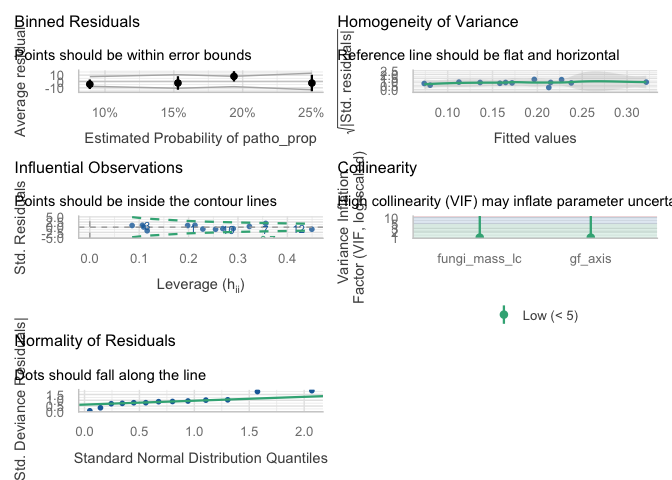<!-- -->

``` r
check_collinearity(patho_gf_glm)
```

    ## # Check for Multicollinearity
    ## 
    ## Low Correlation
    ## 
    ##           Term  VIF    VIF 95% CI adj. VIF Tolerance Tolerance 95% CI
    ##  fungi_mass_lc 1.08 [1.00, 12.78]     1.04      0.93     [0.08, 1.00]
    ##        gf_axis 1.08 [1.00, 12.78]     1.04      0.93     [0.08, 1.00]

``` r
augment(patho_gf_glm)
```

    ## # A tibble: 13 × 10
    ##    patho_prop fungi_mass_lc   gf_axis `(weights)` .fitted  .resid   .hat .sigma
    ##         <dbl>         <dbl>     <dbl>       <dbl>   <dbl>   <dbl>  <dbl>  <dbl>
    ##  1     0.126        0.470   -0.150          6936.  -1.62   -8.91  0.229   11.0 
    ##  2     0.217        0.142    0.114          7578.  -1.31    0.886 0.109   11.4 
    ##  3     0.140        0.110    0.167          7300.  -1.23  -18.7   0.116    9.56
    ##  4     0.207        0.0610  -0.000380       8145.  -1.57    8.15  0.0856  11.1 
    ##  5     0.0906       0.468   -0.575          7226.  -2.44    3.12  0.323   11.4 
    ##  6     0.168        0.320   -0.222          8810.  -1.85    8.44  0.213   11.0 
    ##  7     0.266       -0.540    0.267          8343.  -1.41   15.3   0.356    9.35
    ##  8     0.133       -0.511    0.120          8853.  -1.67   -6.69  0.290   11.1 
    ##  9     0.0549      -0.439   -0.351          7392.  -2.53   -6.50  0.269   11.2 
    ## 10     0.0837      -0.339   -0.137         10437.  -2.06   -9.74  0.255   10.9 
    ## 11     0.273        0.212    0.168          9062.  -1.16    7.66  0.198   11.1 
    ## 12     0.281        0.00271  0.450          8537.  -0.747  -8.14  0.450   10.9 
    ## 13     0.257        0.0438   0.150          8324.  -1.30    9.18  0.107   11.0 
    ## # ℹ 2 more variables: .cooksd <dbl>, .std.resid <dbl>

Long tails and low n showing structure. Moderate leverage at LPRP1: high
pathogens, high gf_axis but very low biomass…this is evidence of the
noise that caused the naïve model to fail.

``` r
distribution_prob(patho_gf_glm)
```

    ## 
    ## 
    ## Distribution    p_Residuals
    ## -------------  ------------
    ## normal              0.68750
    ## cauchy              0.12500
    ## gamma               0.09375
    ## 
    ## 
    ## Distribution    p_Response
    ## -------------  -----------
    ## weibull            0.31250
    ## uniform            0.18750
    ## beta               0.15625

Residuals distribution normal

``` r
loocv_paglm_gfi <- map_dbl(seq_len(nrow(patho_resto)), function(i){
  exp(coef(glm(patho_prop ~ fungi_mass_lc + gf_axis, 
           data = patho_resto[-i, ], 
           family = quasibinomial(link = "logit"),
           weights = fungi_abund))["gf_axis"])
})
summary(loocv_paglm_gfi)
```

    ##    Min. 1st Qu.  Median    Mean 3rd Qu.    Max. 
    ##   5.860   6.301   6.584   6.827   7.272   9.095

``` r
(cv_paglm <- (sd(loocv_paglm_gfi) / mean(loocv_paglm_gfi) * 100) %>% round(., 1))
```

    ## [1] 12.6

Grass-forb index LOOCV variation of 12.6% on the back-transformed scale
shows that the influential points (LPRP1) and three other potential
outliers from the qq plot do not significantly affect fit. Sign and
magnitude of LOO slopes wouldn’t change inference.

``` r
loocv_paglm_fma <- map_dbl(seq_len(nrow(patho_resto)), function(i){
  exp(coef(glm(patho_prop ~ fungi_mass_lc + gf_axis, 
               data = patho_resto[-i, ], 
               family = quasibinomial(link = "logit"),
               weights = fungi_abund))["fungi_mass_lc"])
})
summary(loocv_paglm_fma)
```

    ##    Min. 1st Qu.  Median    Mean 3rd Qu.    Max. 
    ##   1.577   1.652   1.742   1.797   1.894   2.457

``` r
(cv_paglm <- (sd(loocv_paglm_fma) / mean(loocv_paglm_fma) * 100) %>% round(., 1))
```

    ## [1] 12.9

Similarly, fungal mass LOOCV variation of 12.9% on the back-transformed
scale shows that the influential points (LPRP1) and three other
potential outliers from the qq plot do not significantly affect fit.
Sign and magnitude of LOO slopes wouldn’t change inference. The higher
variability here shows that the noise of PLFA variation is substantial.
View partial regression plots for consistency.

``` r
avPlots(patho_gf_glm)
```

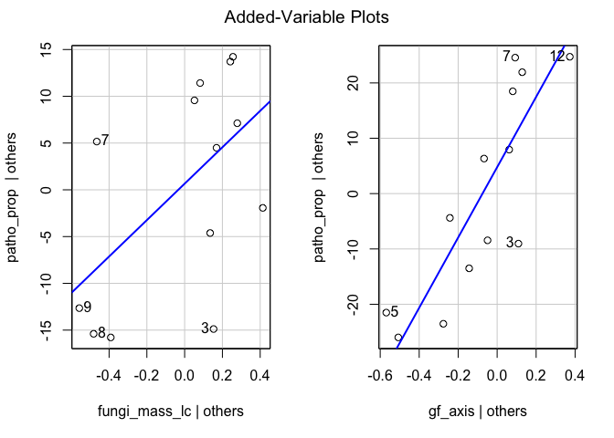<!-- -->

Noise in fungal mass data is obvious here. Fit of partial gf_axis is
clean. No non-linear structure is obvious. Both variables seem valuable.

Partial R2 values

``` r
data.frame(
  term = c("fungal_mass", "gf_axis"),
  partial_R2 = rsq.partial(patho_gf_glm, adj = TRUE)$partial.rsq
) %>% 
  mutate(across(where(is.numeric), ~ round(.x, 3))) %>% 
  kable(format = "pandoc", caption = "Partial R2 from weighted logistic regression")
```

| term        | partial_R2 |
|:------------|-----------:|
| fungal_mass |      0.220 |
| gf_axis     |      0.713 |

Partial R2 from weighted logistic regression

Model summary

``` r
patho_null_glm <- glm(patho_prop ~ 1,
                  data = patho_resto, family = quasibinomial(link = "logit"),
                  weights = fungi_abund)
anova(patho_null_glm, patho_gf_glm, test = "F")
```

    ## Analysis of Deviance Table
    ## 
    ## Model 1: patho_prop ~ 1
    ## Model 2: patho_prop ~ fungi_mass_lc + gf_axis
    ##   Resid. Df Resid. Dev Df Deviance      F   Pr(>F)   
    ## 1        12     4421.9                               
    ## 2        10     1201.0  2   3220.9 13.675 0.001376 **
    ## ---
    ## Signif. codes:  0 '***' 0.001 '**' 0.01 '*' 0.05 '.' 0.1 ' ' 1

Deviance explained

``` r
(patho_gf_glm_pr2 <- round(1-(summary(patho_gf_glm)$deviance / summary(patho_gf_glm)$null.deviance), 3))
```

    ## [1] 0.728

Summary of terms

``` r
tidy(patho_gf_glm) %>% 
  mutate(odds_ratio = exp(estimate), exp_std.error = exp(std.error),
         across(where(is.numeric), ~ round(.x, 3))) %>% 
  select(term, estimate, odds_ratio, std.error, exp_std.error, statistic, p.value) %>% 
  kable(format = "pandoc", caption = "Summary of terms from weighted logistic regression")
```

| term          | estimate | odds_ratio | std.error | exp_std.error | statistic | p.value |
|:--------------|---------:|-----------:|----------:|--------------:|----------:|--------:|
| (Intercept)   |   -1.607 |      0.200 |     0.093 |         1.097 |   -17.310 |   0.000 |
| fungi_mass_lc |    0.574 |      1.776 |     0.294 |         1.342 |     1.950 |   0.080 |
| gf_axis       |    1.908 |      6.739 |     0.384 |         1.469 |     4.962 |   0.001 |

Summary of terms from weighted logistic regression

``` r
(patho_or_pct <- round((exp(coef(patho_gf_glm)[3])^0.1)-1, 3))
```

    ## gf_axis 
    ##    0.21

Confidence intervals on the prediction scale, results on the increment
of 0.1 increase in grass-forb index desired due to scale of that
variable. Note: in the following output, percent predicted changes are
calculated *in excess* of 100% (e.g., 1.124 = 12.4%).

``` r
((exp(confint(patho_gf_glm))^0.1)-1) %>%
  as.data.frame() %>% 
  mutate(across(where(is.numeric), ~ round(.x, 3))) %>% 
  kable(format = "pandoc", caption = "95% confidence intervals, back transformed from the log-scale")
```

|               |  2.5 % | 97.5 % |
|---------------|-------:|-------:|
| (Intercept)   | -0.164 | -0.133 |
| fungi_mass_lc |  0.001 |  0.123 |
| gf_axis       |  0.124 |  0.307 |

95% confidence intervals, back transformed from the log-scale

Create objects for plotting

``` r
paglm_med_fungi <- median(patho_resto$fungi_mass_lc, na.rm = TRUE)
paglm_med_abund <- median(patho_resto$fungi_abund, na.rm = TRUE) # Needed for weight context
paglm_newdat <- tibble(
  gf_axis = seq(min(patho_resto$gf_axis, na.rm = TRUE),
                 max(patho_resto$gf_axis, na.rm = TRUE),
                 length.out = 200),
  fungi_mass_lc = paglm_med_fungi,
  fungi_abund = paglm_med_abund 
)
```

Predict on link scale, back-transform with plogis

``` r
paglm_pred <- predict(patho_gf_glm, newdata = paglm_newdat, type = "link", se.fit = TRUE) %>%
  as_tibble() %>%
  bind_cols(paglm_newdat) %>%
  mutate(
    fit_prob = plogis(fit),
    lwr_prob = plogis(fit - 1.96 * se.fit),
    upr_prob = plogis(fit + 1.96 * se.fit)
  )
```

## Saprotrophs

``` r
## Saprotrophs ———————— ####
```

Data for these tests

``` r
sapro_resto <- its_guild_wi %>% 
  left_join(its_guild_ma %>% select(field_name, sapro_mass), by = join_by(field_name)) %>% 
  left_join(prich %>% select(field_name, pl_rich, pl_shan), by = join_by(field_name)) %>% 
  mutate(
    sapro_prop = sapro_abund / fungi_abund, # no zeroes present...
    notsapro_abund = fungi_abund - sapro_abund,
    fungi_mass_lc = as.numeric(scale(log(fungi_mass), center = TRUE, scale = FALSE))
  ) %>% 
  select(-patho_abund, -c(annual:shrubTree))
```

How variable is biomass-scaled abundance across sites?

``` r
(sapro_ma_cv <- sd(sapro_resto$sapro_mass) / mean(sapro_resto$sapro_mass) * 100)
```

    ## [1] 42.11542

### Plant richness and saprotrophs

Is plant richness related to saprotroph mass?

``` r
saprofa_prich_lm <- lm(sapro_mass ~ pl_rich, data = sapro_resto)
distribution_prob(saprofa_prich_lm)
```

    ## 
    ## 
    ## Distribution    p_Residuals
    ## -------------  ------------
    ## normal              0.56250
    ## cauchy              0.15625
    ## gamma               0.09375
    ## 
    ## 
    ## Distribution    p_Response
    ## -------------  -----------
    ## gamma              0.56250
    ## exponential        0.12500
    ## pareto             0.09375

``` r
check_model(saprofa_prich_lm)
```

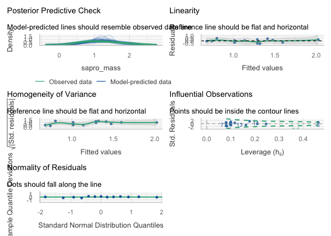<!-- -->

Passes visual diagnostics

``` r
summary(saprofa_prich_lm)
```

    ## 
    ## Call:
    ## lm(formula = sapro_mass ~ pl_rich, data = sapro_resto)
    ## 
    ## Residuals:
    ##      Min       1Q   Median       3Q      Max 
    ## -0.56697 -0.32365  0.06416  0.24916  0.53019 
    ## 
    ## Coefficients:
    ##              Estimate Std. Error t value Pr(>|t|)    
    ## (Intercept)  2.422247   0.349522   6.930 2.49e-05 ***
    ## pl_rich     -0.030600   0.008485  -3.607  0.00412 ** 
    ## ---
    ## Signif. codes:  0 '***' 0.001 '**' 0.01 '*' 0.05 '.' 0.1 ' ' 1
    ## 
    ## Residual standard error: 0.3617 on 11 degrees of freedom
    ## Multiple R-squared:  0.5418, Adjusted R-squared:  0.5001 
    ## F-statistic: 13.01 on 1 and 11 DF,  p-value: 0.004123

Strong negative relationship worthy of closer examination. It isn’t
driven by grass-forb index (see below), so this isn’t a confounding with
C4 grass abundance… Residuals distribution normal. KORP site appears to
have some leverage (not shown). With possible leverage, conduct a LOOCV
check.

``` r
loocv_sapro_prich_lm <- map_dbl(seq_len(nrow(sapro_resto)), function(i){
  coef(lm(sapro_mass ~ pl_rich, data = sapro_resto[-i, ]))["pl_rich"]
})
summary(loocv_sapro_prich_lm)
```

    ##     Min.  1st Qu.   Median     Mean  3rd Qu.     Max. 
    ## -0.03540 -0.03133 -0.03034 -0.03042 -0.02974 -0.02385

``` r
(cv_saprich_lm <- (sd(loocv_sapro_prich_lm) / mean(loocv_sapro_prich_lm) * 100) %>% round(., 1) %>% abs(.))
```

    ## [1] 8.7

All slopes negative and similar in magnitude, with CV = 8.7.

Is plant richness related to saprotroph proportion?

``` r
sapro_prich_glm <- glm(sapro_prop ~ fungi_mass_lc + pl_rich,
                       data = sapro_resto, family = quasibinomial(link = "logit"),
                       weights = fungi_abund)
summary(sapro_prich_glm) # dispersion parameter >62 justifies quasibinomial
```

    ## 
    ## Call:
    ## glm(formula = sapro_prop ~ fungi_mass_lc + pl_rich, family = quasibinomial(link = "logit"), 
    ##     data = sapro_resto, weights = fungi_abund)
    ## 
    ## Coefficients:
    ##                Estimate Std. Error t value Pr(>|t|)  
    ## (Intercept)   -0.517543   0.218103  -2.373   0.0391 *
    ## fungi_mass_lc -0.216797   0.186892  -1.160   0.2730  
    ## pl_rich       -0.015656   0.005417  -2.890   0.0161 *
    ## ---
    ## Signif. codes:  0 '***' 0.001 '**' 0.01 '*' 0.05 '.' 0.1 ' ' 1
    ## 
    ## (Dispersion parameter for quasibinomial family taken to be 62.46492)
    ## 
    ##     Null deviance: 1187.92  on 12  degrees of freedom
    ## Residual deviance:  663.24  on 10  degrees of freedom
    ## AIC: NA
    ## 
    ## Number of Fisher Scoring iterations: 4

Diagnostics

``` r
check_model(sapro_prich_glm)
```

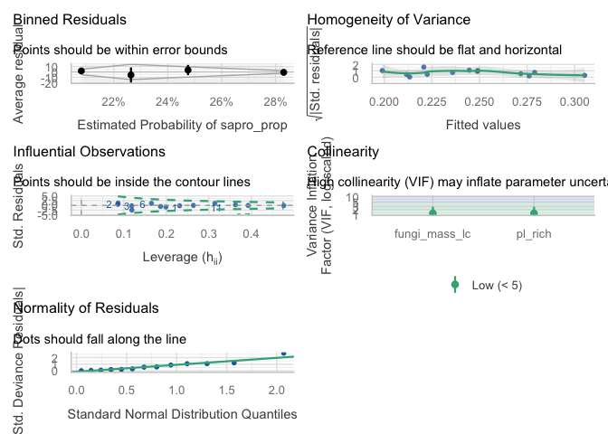<!-- -->

``` r
check_collinearity(sapro_prich_glm)
```

    ## # Check for Multicollinearity
    ## 
    ## Low Correlation
    ## 
    ##           Term  VIF   VIF 95% CI adj. VIF Tolerance Tolerance 95% CI
    ##  fungi_mass_lc 1.28 [1.04, 2.87]     1.13      0.78     [0.35, 0.96]
    ##        pl_rich 1.28 [1.04, 2.87]     1.13      0.78     [0.35, 0.96]

``` r
augment(sapro_prich_glm)
```

    ## # A tibble: 13 × 10
    ##    sapro_prop fungi_mass_lc pl_rich `(weights)` .fitted   .resid   .hat .sigma
    ##         <dbl>         <dbl>   <int>       <dbl>   <dbl>    <dbl>  <dbl>  <dbl>
    ##  1      0.217       0.470        31       6936.  -1.10   -6.15   0.199    8.02
    ##  2      0.290       0.142        37       7578.  -1.13    9.08   0.0864   7.68
    ##  3      0.130       0.110        46       7300.  -1.26  -19.8    0.119    5.06
    ##  4      0.216       0.0610       46       8145.  -1.25   -1.51   0.119    8.31
    ##  5      0.303       0.468        13       7226.  -0.823  -0.504  0.476    8.33
    ##  6      0.285       0.320        33       8810.  -1.10    7.78   0.165    7.82
    ##  7      0.275      -0.540        36       8343.  -0.964  -0.257  0.392    8.33
    ##  8      0.280      -0.511        37       8853.  -0.986   1.84   0.363    8.30
    ##  9      0.206      -0.439        57       7392.  -1.31   -1.27   0.231    8.32
    ## 10      0.213      -0.339        55      10437.  -1.31    0.0161 0.264    8.33
    ## 11      0.229       0.212        53       9062.  -1.39    6.98   0.314    7.82
    ## 12      0.255       0.00271      42       8537.  -1.18    4.12   0.0859   8.20
    ## 13      0.259       0.0438       27       8324.  -0.950  -4.14   0.186    8.19
    ## # ℹ 2 more variables: .cooksd <dbl>, .std.resid <dbl>

Long tails and low n showing moderate structure.

``` r
distribution_prob(sapro_prich_glm)
```

    ## 
    ## 
    ## Distribution    p_Residuals
    ## -------------  ------------
    ## cauchy              0.65625
    ## normal              0.31250
    ## pareto              0.03125
    ## 
    ## 
    ## Distribution    p_Response
    ## -------------  -----------
    ## weibull            0.31250
    ## beta               0.28125
    ## uniform            0.18750

Residuals distribution long-tailed / normal

``` r
loocv_saglm_gfi <- map_dbl(seq_len(nrow(sapro_resto)), function(i){
  exp(coef(glm(sapro_prop ~ fungi_mass_lc + pl_rich,
               data = sapro_resto[-i, ],
               family = quasibinomial(link = "logit"),
               weights = fungi_abund))["pl_rich"])
})
summary(loocv_saglm_gfi)
```

    ##    Min. 1st Qu.  Median    Mean 3rd Qu.    Max. 
    ##  0.9813  0.9842  0.9844  0.9844  0.9847  0.9875

``` r
(cv_saglm <- (sd(loocv_saglm_gfi) / mean(loocv_saglm_gfi) * 100) %>% round(., 1))
```

    ## [1] 0.1

Grass-forb index LOOCV variation of 0.1% on the back-transformed scale
shows remarkably consistent prediction.

``` r
loocv_saglm_fma <- map_dbl(seq_len(nrow(sapro_resto)), function(i){
  exp(coef(glm(sapro_prop ~ fungi_mass_lc + pl_rich,
               data = sapro_resto[-i, ],
               family = quasibinomial(link = "logit"),
               weights = fungi_abund))["fungi_mass_lc"])
})
summary(loocv_saglm_fma)
```

    ##    Min. 1st Qu.  Median    Mean 3rd Qu.    Max. 
    ##  0.7349  0.7953  0.8007  0.8051  0.8099  0.8803

``` r
(cv_saglm <- (sd(loocv_saglm_fma) / mean(loocv_saglm_fma) * 100) %>% round(., 1))
```

    ## [1] 4.6

Slope CV on fungal mass of 4.6% is low but shows greater noise with the
covariate than the test variable.

``` r
avPlots(sapro_prich_glm)
```

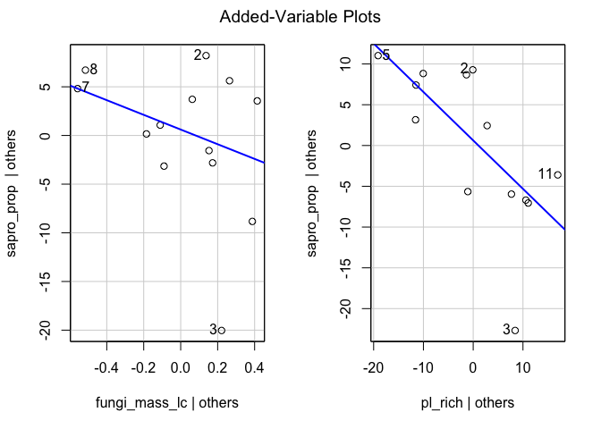<!-- -->

Noise in fungal mass data is obvious here. Fit of partial gf_axis is
clean. No non-linear behavior is obvious, increasing spread with fungal
mass expected for model type, no overdispersion was detected earlier
though.

Partial R2 values

``` r
data.frame(
  term = c("fungal_mass", "pl_rich"),
  partial_R2 = rsq.partial(sapro_prich_glm, adj = TRUE)$partial.rsq
) %>% 
  mutate(across(where(is.numeric), ~ round(.x, 3))) %>% 
  kable(format = "pandoc", caption = "Partial R2 from weighted logistic regression")
```

| term        | partial_R2 |
|:------------|-----------:|
| fungal_mass |      0.123 |
| pl_rich     |      0.455 |

Partial R2 from weighted logistic regression

Model summary

``` r
sapro_null_glm <- glm(sapro_prop ~ 1,
                      data = sapro_resto, family = quasibinomial(link = "logit"),
                      weights = fungi_abund)
anova(sapro_null_glm, sapro_prich_glm, test = "F")
```

    ## Analysis of Deviance Table
    ## 
    ## Model 1: sapro_prop ~ 1
    ## Model 2: sapro_prop ~ fungi_mass_lc + pl_rich
    ##   Resid. Df Resid. Dev Df Deviance      F  Pr(>F)  
    ## 1        12    1187.92                             
    ## 2        10     663.24  2   524.68 4.1998 0.04742 *
    ## ---
    ## Signif. codes:  0 '***' 0.001 '**' 0.01 '*' 0.05 '.' 0.1 ' ' 1

Deviance explained

``` r
(sapro_prich_glm_pr2 <- round(1-(summary(sapro_prich_glm)$deviance / summary(sapro_prich_glm)$null.deviance), 3))
```

    ## [1] 0.442

Summary of terms Odds ratio prediction and confidence intervals on the
prediction scale, results on the increment of an increase of 10 plant
species desired due to scale of that variable. Note: in the following
output, percent predicted changes are calculated *in excess* of 100%
(e.g., 0.085 = -15%).

``` r
tidy(sapro_prich_glm) %>% 
  mutate(odds_ratio = exp(estimate), exp_std.error = exp(std.error),
         across(where(is.numeric), ~ round(.x, 3))) %>% 
  select(term, estimate, odds_ratio, std.error, exp_std.error, statistic, p.value) %>% 
  kable(format = "pandoc", caption = "Summary of terms from weighted logistic regression")
```

| term          | estimate | odds_ratio | std.error | exp_std.error | statistic | p.value |
|:--------------|---------:|-----------:|----------:|--------------:|----------:|--------:|
| (Intercept)   |   -0.518 |      0.596 |     0.218 |         1.244 |    -2.373 |   0.039 |
| fungi_mass_lc |   -0.217 |      0.805 |     0.187 |         1.205 |    -1.160 |   0.273 |
| pl_rich       |   -0.016 |      0.984 |     0.005 |         1.005 |    -2.890 |   0.016 |

Summary of terms from weighted logistic regression

``` r
(sapro_or_pct <- round(1-(exp(coef(sapro_prich_glm)[3])^10), 3))
```

    ## pl_rich 
    ##   0.145

``` r
(1-(exp(confint(sapro_prich_glm))^10)) %>%
  as.data.frame() %>% 
  mutate(across(where(is.numeric), ~ round(.x, 3))) %>% 
  kable(format = "pandoc", caption = "95% confidence intervals, back transformed from the log-scale")
```

|               | 2.5 % | 97.5 % |
|---------------|------:|-------:|
| (Intercept)   | 1.000 |  0.603 |
| fungi_mass_lc | 0.997 | -3.547 |
| pl_rich       | 0.231 |  0.049 |

95% confidence intervals, back transformed from the log-scale

Create objects for plotting

``` r
saglm_med_fungi <- median(sapro_resto$fungi_mass_lc, na.rm = TRUE)
saglm_med_abund <- median(sapro_resto$fungi_abund, na.rm = TRUE) # Needed for weight context
saglm_newdat <- tibble(
  pl_rich = seq(min(sapro_resto$pl_rich, na.rm = TRUE),
                max(sapro_resto$pl_rich, na.rm = TRUE),
                length.out = 200),
  fungi_mass_lc = saglm_med_fungi,
  fungi_abund = saglm_med_abund
)
```

Predict on link scale, back-transform with plogis

``` r
saglm_pred <- predict(sapro_prich_glm, newdata = saglm_newdat, type = "link", se.fit = TRUE) %>%
  as_tibble() %>%
  bind_cols(saglm_newdat) %>%
  mutate(
    fit_prob = plogis(fit),
    lwr_prob = plogis(fit - 1.96 * se.fit),
    upr_prob = plogis(fit + 1.96 * se.fit)
  )
```

### Plant diversity and saprotrophs

Is plant diversity related to saprotroph mass?

``` r
saprofa_pshan_lm <- lm(sapro_mass ~ pl_shan, data = sapro_resto)
distribution_prob(saprofa_pshan_lm)
```

    ## 
    ## 
    ## Distribution    p_Residuals
    ## -------------  ------------
    ## normal              0.53125
    ## cauchy              0.15625
    ## gamma               0.12500
    ## 
    ## 
    ## Distribution    p_Response
    ## -------------  -----------
    ## gamma              0.56250
    ## exponential        0.12500
    ## pareto             0.09375

``` r
check_model(saprofa_pshan_lm)
```

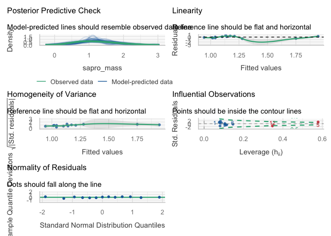<!-- -->

``` r
summary(saprofa_pshan_lm)
```

    ## 
    ## Call:
    ## lm(formula = sapro_mass ~ pl_shan, data = sapro_resto)
    ## 
    ## Residuals:
    ##      Min       1Q   Median       3Q      Max 
    ## -0.65416 -0.32568  0.03834  0.32797  0.71819 
    ## 
    ## Coefficients:
    ##             Estimate Std. Error t value Pr(>|t|)    
    ## (Intercept)  2.43532    0.52764   4.616 0.000746 ***
    ## pl_shan     -0.09224    0.03882  -2.376 0.036753 *  
    ## ---
    ## Signif. codes:  0 '***' 0.001 '**' 0.01 '*' 0.05 '.' 0.1 ' ' 1
    ## 
    ## Residual standard error: 0.4344 on 11 degrees of freedom
    ## Multiple R-squared:  0.3392, Adjusted R-squared:  0.2791 
    ## F-statistic: 5.646 on 1 and 11 DF,  p-value: 0.03675

Saprotroph mass has a weak, significant relationship with saprotroph
mass. Two extreme values exist, making a bit of a dumbbell shape.
Residuals distribution normal. Two points with borderline leverage,
conduct LOOCV.

``` r
loocv_sapshlm_fma <- map_dbl(seq_len(nrow(sapro_resto)), function(i){
  coef(lm(sapro_mass ~ pl_shan, data = sapro_resto[-i, ]))["pl_shan"]
})
summary(loocv_sapshlm_fma)
```

    ##     Min.  1st Qu.   Median     Mean  3rd Qu.     Max. 
    ## -0.13115 -0.09408 -0.09289 -0.09099 -0.08712 -0.04300

``` r
(cv_sapshlm_fma <- (sd(loocv_sapshlm_fma) / mean(loocv_sapshlm_fma) * 100) %>% round(., 1) %>% abs(.))
```

    ## [1] 20.3

Model relies heavily on two extreme values, with a LOOCV variation of
20.3%. Suggest that makes the model unimportant. All slopes negative,
but many very slight. Is plant diversity related to saprotroph
proportion?

``` r
sapro_pshan_glm <- glm(sapro_prop ~ fungi_mass_lc + pl_shan,
                       data = sapro_resto, family = quasibinomial(link = "logit"),
                       weights = fungi_abund)
summary(sapro_pshan_glm)
```

    ## 
    ## Call:
    ## glm(formula = sapro_prop ~ fungi_mass_lc + pl_shan, family = quasibinomial(link = "logit"), 
    ##     data = sapro_resto, weights = fungi_abund)
    ## 
    ## Coefficients:
    ##               Estimate Std. Error t value Pr(>|t|)  
    ## (Intercept)   -0.75763    0.34121  -2.220   0.0507 .
    ## fungi_mass_lc -0.07564    0.23605  -0.320   0.7552  
    ## pl_shan       -0.02839    0.02533  -1.121   0.2886  
    ## ---
    ## Signif. codes:  0 '***' 0.001 '**' 0.01 '*' 0.05 '.' 0.1 ' ' 1
    ## 
    ## (Dispersion parameter for quasibinomial family taken to be 101.3357)
    ## 
    ##     Null deviance: 1187.9  on 12  degrees of freedom
    ## Residual deviance: 1059.9  on 10  degrees of freedom
    ## AIC: NA
    ## 
    ## Number of Fisher Scoring iterations: 4

NS

### Plant functional groups and saprotrophs

``` r
sama_rest_m <- lm(sapro_mass ~ gf_axis, data = sapro_resto)
summary(sama_rest_m)
```

    ## 
    ## Call:
    ## lm(formula = sapro_mass ~ gf_axis, data = sapro_resto)
    ## 
    ## Residuals:
    ##     Min      1Q  Median      3Q     Max 
    ## -0.8700 -0.3270  0.1771  0.3471  0.6007 
    ## 
    ## Coefficients:
    ##             Estimate Std. Error t value Pr(>|t|)    
    ## (Intercept)   1.2147     0.1336    9.09  1.9e-06 ***
    ## gf_axis      -0.7966     0.5010   -1.59     0.14    
    ## ---
    ## Signif. codes:  0 '***' 0.001 '**' 0.01 '*' 0.05 '.' 0.1 ' ' 1
    ## 
    ## Residual standard error: 0.4818 on 11 degrees of freedom
    ## Multiple R-squared:  0.1869, Adjusted R-squared:  0.113 
    ## F-statistic: 2.528 on 1 and 11 DF,  p-value: 0.1401

Likely not enough of a relationship to warrant further attention Examine
mass+richness models, similar to pathogen models

``` r
sapro_gf_glm <- glm(sapro_prop ~ fungi_mass_lc + gf_axis,
                    data = sapro_resto, family = quasibinomial(link = "logit"),
                    weights = fungi_abund)
summary(sapro_gf_glm)
```

    ## 
    ## Call:
    ## glm(formula = sapro_prop ~ fungi_mass_lc + gf_axis, family = quasibinomial(link = "logit"), 
    ##     data = sapro_resto, weights = fungi_abund)
    ## 
    ## Coefficients:
    ##               Estimate Std. Error t value Pr(>|t|)    
    ## (Intercept)   -1.13286    0.07532 -15.041 3.41e-08 ***
    ## fungi_mass_lc  0.01934    0.23267   0.083    0.935    
    ## gf_axis       -0.07304    0.29889  -0.244    0.812    
    ## ---
    ## Signif. codes:  0 '***' 0.001 '**' 0.01 '*' 0.05 '.' 0.1 ' ' 1
    ## 
    ## (Dispersion parameter for quasibinomial family taken to be 111.5614)
    ## 
    ##     Null deviance: 1187.9  on 12  degrees of freedom
    ## Residual deviance: 1178.6  on 10  degrees of freedom
    ## AIC: NA
    ## 
    ## Number of Fisher Scoring iterations: 4

NS

### Guild-plant relationships

``` r
## Unified results ———————— ####
```

Create multipanel figure, post-production in editing software will be
necessary.

``` r
fig5a <-
  ggplot(paglm_pred, aes(x = gf_axis, y = fit_prob)) +
  geom_line(color = "black", linewidth = lw) +
  geom_point(data = patho_resto, aes(x = gf_axis, y = patho_prop, fill = field_type),
             size = sm_size, stroke = lw, shape = 21) +
  geom_text(na.rm = TRUE, data = patho_resto, aes(x = gf_axis, y = patho_prop, label = yr_since),
            size = yrtx_size, family = "sans", fontface = 2, color = "black") +
  labs(
    x = "Grass–forb axis",
    y = "Pathogen proportion",
    tag = "A"
  ) +
  scale_fill_manual(name = "Field type", values = ft_pal[2:3]) +
  theme_cor +
  theme(legend.position = c(0.03, 1),
        legend.justification = c(0, 1),
        legend.title = element_text(size = 9, face = 1),
        legend.text = element_text(size = 8, face = 1),
        legend.background = element_rect(fill = "white", color = "black", linewidth = 0.2),
        legend.key = element_rect(fill = "white"),
        plot.tag = element_text(size = 14, face = 1),
        plot.tag.position = c(0, 1))
```

``` r
gfa_fgc <- # grass-forb axis, forb-grass composition
  pfg_pct %>% 
  group_by(field_name) %>% 
  mutate(pct_comp = pct_cvr / sum(pct_cvr)) %>% 
  filter(pfg == "forb") %>% 
  select(field_name, gf_axis, forb_comp = pct_comp) %>% 
  arrange(gf_axis)
```

``` r
fig5a_rug <- add_fig7_rug(
  fig5a,
  comp_df = gfa_fgc,
  y0 = 0.05,
  h  = 0.010,
  forb_fill  = pfg_col[4],
  grass_fill = pfg_col[5]
) +
  expand_limits(y = 0.05) +
  geom_text(na.rm = TRUE, data = data.frame(x = c(-0.45, 0.45), y = c(0.04, 0.04),
                              lab = c(paste0("bold(grass~(C[4]))"), paste0("bold(forb)"))),
            aes(x = x, y = y, label = lab), parse = TRUE, size = 2.8, family = "Helvetica")
```

``` r
fig5b <-
  ggplot(saglm_pred, aes(x = pl_rich, y = fit_prob)) +
  geom_line(color = "black", linewidth = lw) +
  geom_point(data = sapro_resto, aes(x = pl_rich, y = sapro_prop, fill = field_type),
             size = sm_size, stroke = lw, shape = 21) +
  geom_text(na.rm = TRUE, data = sapro_resto, aes(x = pl_rich, y = sapro_prop, label = yr_since),
            size = yrtx_size, family = "sans", fontface = 2, color = "black") +
  labs(
    x = expression(paste("Plant richness (", italic(n), " species)")),
    y = "Saprotroph proportion",
    tag = "A"
  ) +
  scale_fill_manual(name = "Field type", values = ft_pal[2:3]) +
  theme_cor +
  theme(legend.position = "none",
        plot.tag = element_text(size = 14, face = 1),
        plot.tag.position = c(0, 1))
```

``` r
fig5 <- (fig5a_rug | plot_spacer() | fig5b) +
  plot_layout(widths = c(0.50, 0.01, 0.50), axis_titles = "collect_y") +
  plot_annotation(tag_levels = 'A')
```

``` r
fig5
```

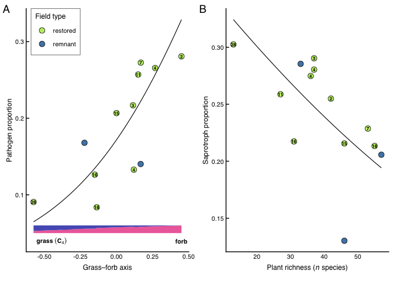<!-- -->
