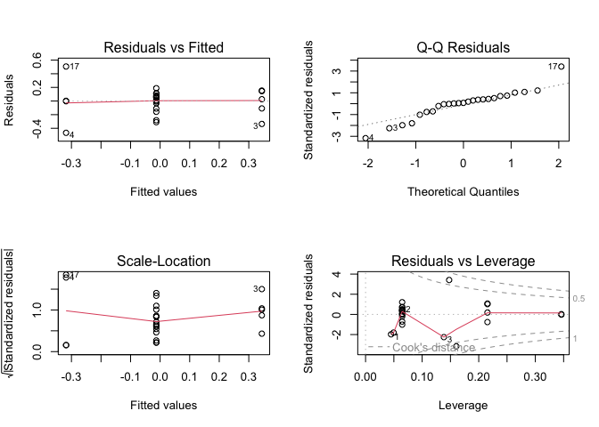

Results: Soil Fungal Communities
================
Beau Larkin

Last updated: 05 December, 2025

- [Description](#description)
- [Packages and libraries](#packages-and-libraries)
  - [Root path function](#root-path-function)
- [Data](#data)
  - [Site metadata and design](#site-metadata-and-design)
  - [Fatty Acids: Biomass](#fatty-acids-biomass)
  - [Sites-species tables](#sites-species-tables)
  - [Microbial species metadata](#microbial-species-metadata)
  - [Plant data](#plant-data)
  - [Soil properties](#soil-properties)
- [Species, environment, and
  metadata](#species-environment-and-metadata)
  - [Plant communities](#plant-communities)
  - [Plant functional groups](#plant-functional-groups)
  - [Whole soil fungi](#whole-soil-fungi)
- [Functions](#functions)
- [Whole Soil Fungi](#whole-soil-fungi-1)
  - [Diversity Indices](#diversity-indices)
  - [Abundance](#abundance)
  - [Beta Diversity](#beta-diversity)
  - [Constrained Analysis](#constrained-analysis)
  - [Fungi‒pfg correlations](#fungipfg-correlations)
- [Arbuscular mycorrhizal fungi](#arbuscular-mycorrhizal-fungi)
  - [Diversity Indices](#diversity-indices-1)
  - [NLFA](#nlfa)
  - [Beta Diversity](#beta-diversity-1)
  - [AMF abundance in families](#amf-abundance-in-families)
  - [Indicator species analysis](#indicator-species-analysis)
  - [Constrained Analysis](#constrained-analysis-1)
  - [AMF correlations with pfg](#amf-correlations-with-pfg)
- [Putative plant pathogens](#putative-plant-pathogens)
  - [Diversity Indices](#diversity-indices-2)
  - [Abundance](#abundance-1)
  - [Beta Diversity](#beta-diversity-2)
  - [Unified figure](#unified-figure-4)
  - [Pathogen Indicator Species](#pathogen-indicator-species)
  - [Pathogen—pfg correlations](#pathogenpfg-correlations)
- [Putative saprotrophs](#putative-saprotrophs)
  - [Diversity Indices](#diversity-indices-3)
  - [Abundance](#abundance-2)
  - [Beta Diversity](#beta-diversity-3)
  - [Unified figure](#unified-figure-5)
  - [Saprotroph Indicator Species](#saprotroph-indicator-species)
  - [Saprotroph correlations with
    pfg](#saprotroph-correlations-with-pfg)

# Description

**Scope** – Biomass (PLFA/NLFA), OTU richness and diversity, and
β‑diversity of soil fungi across corn, restored, and remnant prairie
fields.

**Alpha diversity** – 97 %-OTUs (ITS & 18S); site means are replicates;
means separation model selection based on response and residuals
distributions; sequencing depth used as covariate per [Bálint
2015](https://onlinelibrary.wiley.com/doi/abs/10.1111/mec.13018) when
warranted; pairwise LSMs via *emmeans*.

**Beta diversity** – Workflow after [Song
2015](https://doi.org/10.1371/journal.pone.0127234):  
1. PCoA of Bray (ITS) or UNIFRAC (18S) distances 1. homogeneity test
diagnostics 1. PERMANOVA (+ pairwise)

Cartesian inter‑site distance enters models as a covariate per [Redondo
2020](https://doi.org/10.1093/femsec/fiaa082).

# Packages and libraries

``` r
# Libraries ———————— ####
```

``` r
packages_needed <- c(
  "colorspace", "emmeans", "gridExtra", "knitr", "tidyverse", "vegan",
  "rprojroot", "phyloseq", "ape", "phangorn", "geosphere", "conflicted",
  "ggpubr", "patchwork", "car", "performance", "boot", "indicspecies",
  "MASS", "DHARMa", "broom", "rlang", "rsq", "purrr", "sandwich", "lmtest"
)

to_install <- setdiff(packages_needed, rownames(installed.packages()))
if (length(to_install)) install.packages(to_install)
invisible(lapply(packages_needed, library, character.only = TRUE))
```

## Root path function

``` r
root_path <- function(...) rprojroot::find_rstudio_root_file(...)
```

``` r
conflicts_prefer(
  dplyr::filter(),
  dplyr::select(),
  dplyr::where(),
  vegan::diversity(),
  purrr::map()
)
```

``` r
source(root_path("resources", "styles.R"))
```

# Data

``` r
# Data ———————— ####
```

## Site metadata and design

``` r
sites <- read_csv(root_path("clean_data/sites.csv"), show_col_types = FALSE) %>% 
  mutate(field_type = factor(field_type, levels = c("corn", "restored", "remnant")))
```

### Wrangle site metadata

Intersite geographic distance will be used as a covariate in clustering.
Raw coordinates in data file aren’t distances; convert to distance
matrix and summarize with PCoA

``` r
field_dist <- as.dist(distm(sites[, c("long", "lat")], fun = distHaversine))
field_dist_pcoa <- pcoa(field_dist)
field_dist_pcoa$values[c(1,2), c(1,2)] %>% 
  kable(format = "pandoc")
```

|  Eigenvalues | Relative_eig |
|-------------:|-------------:|
| 146898426293 |    0.9053961 |
|  15349390146 |    0.0946047 |

First axis of geographic distance PCoA explains 91% of the variation
among sites.

``` r
sites$dist_axis_1 <- field_dist_pcoa$vectors[, 1]
```

## Fatty Acids: Biomass

Use only 18.2 for soil fungi

``` r
fa <- read_csv(root_path("clean_data/plfa.csv"), show_col_types = FALSE) %>% 
  rename(fungi_18.2 = fa_18.2) %>% 
  select(field_name, fungi_18.2, amf) %>%
  left_join(
    sites %>% select(field_name, field_type),
    by = join_by(field_name)
  )
```

## Sites-species tables

CSV files were produced in `sequence_data.R`. Average sequence abundance
at sites included here. Amf_avg_uni table is in species-samples format
to enable use of `Unifrac()` later.

``` r
its_avg     = read_csv(root_path("clean_data/spe_ITS_avg.csv"), show_col_types = FALSE)
amf_avg     = read_csv(root_path("clean_data/spe_18S_avg.csv"), show_col_types = FALSE)
```

## Microbial species metadata

``` r
its_meta = read_csv(root_path("clean_data/spe_ITS_metadata.csv"), show_col_types = FALSE) %>% 
  mutate(primary_lifestyle = case_when(str_detect(primary_lifestyle, "_saprotroph$") ~ "saprotroph",
                                       TRUE ~ primary_lifestyle),
         across(everything(), ~ replace_na(., "unidentified")))
amf_meta = read_csv(root_path("clean_data/spe_18S_metadata.csv"), show_col_types = FALSE) %>% 
  mutate(across(everything(), ~ replace_na(., "unidentified")))
```

### Wrangle additional species and metadata objects

``` r
# Species data wrangling ———————— ####
```

1.  Proportional species abundance corrected for site biomass
2.  Unifrac products for AMF
3.  Phyloseq products to process the Unifrac distance cleanly

``` r
its_avg_ma <- its_avg %>% # ma = sequence proportion of biomass
  rowwise() %>%
  mutate(total = sum(c_across(where(is.numeric))),
         across(starts_with("otu"), ~ if_else(total > 0, .x / total, 0))) %>%
  left_join(fa %>% select(-amf, -field_type), by = join_by(field_name)) %>%
  mutate(across(starts_with("otu"), ~ .x * fungi_18.2)) %>%
  select(field_name, starts_with("otu")) %>% 
  ungroup()
amf_avg_ma <- amf_avg %>% 
  rowwise() %>%
  mutate(total = sum(c_across(where(is.numeric))),
         across(starts_with("otu"), ~ if_else(total > 0, .x / total, 0))) %>%
  left_join(fa %>% select(-fungi_18.2, -field_type), by = join_by(field_name)) %>%
  mutate(across(starts_with("otu"), ~ .x * amf)) %>%
  select(field_name, starts_with("otu")) %>% 
  ungroup()
amf_avg_uni <- amf_avg %>%
  column_to_rownames("field_name") %>%
  t() %>% as.data.frame() %>% rownames_to_column("otu_num") %>%
  left_join(amf_meta %>% select(otu_num, otu_ID), by = "otu_num") %>%
  select(otu_ID, everything(), -otu_num) %>% 
  as_tibble()
amf_ps <- phyloseq(
  otu_table(data.frame(amf_avg_uni, row.names = 1), taxa_are_rows = TRUE),
  tax_table(as.matrix(data.frame(amf_meta, row.names = 2))),
  read.dna(root_path("otu_tables/18S/18S_sequences.fasta"), format = "fasta") %>%
    phyDat(type = "DNA") %>% dist.hamming() %>% NJ(),
  sample_data(sites %>% column_to_rownames(var = "field_name"))
)
```

## Plant data

Abundance in functional groups and by species are only available from
Wisconsin sites. Only C4_grass and forbs are used. Others: C3_grass,
legume, and shrubTree were found previously to have high VIF in models
or were not chosen in forward selection.

``` r
pfg <- read_csv(root_path("clean_data", "plant_traits.csv"), show_col_types = FALSE) 
```

## Soil properties

``` r
soil <- read_csv(root_path("clean_data/soil.csv"), show_col_types = FALSE)[-c(26:27), ]
```

# Species, environment, and metadata

``` r
# Metadata wrangling ———————— ####
```

## Plant communities

### Plant species richness

``` r
plant <- read_csv(root_path("clean_data/plant_avg.csv"), show_col_types = FALSE)
prich <- plant %>% 
  select(-BARESOIL, -LITTER, -ROSA, -SALIX) %>% # remove non-species entries
  rowwise() %>% 
  mutate(pl_rich = sum(c_across(where(is.numeric)) > 0)) %>% 
  select(field_name = SITE, pl_rich) %>% 
  left_join(sites, by = join_by(field_name)) %>% 
  filter(region != "FL", field_type == "restored") %>% 
  ungroup()
```

Visualize how richness varies in fields…restored in Wisconsin only as
used later

``` r
with(prich, cor.test(yr_since, pl_rich))
```

    ## 
    ##  Pearson's product-moment correlation
    ## 
    ## data:  yr_since and pl_rich
    ## t = -1.2324, df = 8, p-value = 0.2528
    ## alternative hypothesis: true correlation is not equal to 0
    ## 95 percent confidence interval:
    ##  -0.8222704  0.3075217
    ## sample estimates:
    ##       cor 
    ## -0.399447

Years since restoration isn’t obviously related to plant species
richness. The trend is fewer species with older fields, but the
correlation isn’t significant, again KORP is a high leverage point.

## Plant functional groups

C4 grass and forb cover are transformed into a single index using PCA in
restored sites only. Abundance data are also joined with site and env
paramaters to facilitate downstream analyses.

### Grass-forb index

C4 grass and forb cover are highly correlated (*r* = -0.91) in restored
prairies. In models or constrained ordinations, they are collinear and
cannot be used simultaneously. An index of grass-forb cover is created
to solve this problem.

``` r
pfg_pca <- 
  pfg %>%
  select(field_name, C4_grass, forb) %>% 
  left_join(sites %>% select(field_name, field_type), by = join_by(field_name)) %>% 
  filter(field_type == "restored") %>% 
  select(-field_type) %>% 
  column_to_rownames(var = "field_name") %>% 
  decostand(method = "standardize") %>% 
  rda()
pfg_pca %>% summary() # 92% variation on first axis
```

    ## 
    ## Call:
    ## rda(X = .) 
    ## 
    ## Partitioning of variance:
    ##               Inertia Proportion
    ## Total               2          1
    ## Unconstrained       2          1
    ## 
    ## Eigenvalues, and their contribution to the variance 
    ## 
    ## Importance of components:
    ##                          PC1     PC2
    ## Eigenvalue            1.8482 0.15184
    ## Proportion Explained  0.9241 0.07592
    ## Cumulative Proportion 0.9241 1.00000

``` r
gf_index = scores(pfg_pca, choices = 1, display = "sites") %>% 
  data.frame() %>% 
  rename(gf_index = PC1) %>% 
  rownames_to_column(var = "field_name")
```

Are field age and gf_index correlated?

``` r
gfi_yrs <- gf_index %>% 
  left_join(sites %>% select(field_name, yr_since), by = join_by(field_name)) %>% 
  arrange(-gf_index)
with(gfi_yrs, cor.test(yr_since, gf_index))
```

    ## 
    ##  Pearson's product-moment correlation
    ## 
    ## data:  yr_since and gf_index
    ## t = -6.802, df = 8, p-value = 0.0001375
    ## alternative hypothesis: true correlation is not equal to 0
    ## 95 percent confidence interval:
    ##  -0.9820484 -0.7016336
    ## sample estimates:
    ##       cor 
    ## -0.923353

The relatively strong correlation suggests that different restoration
methods over time are still reflected in plant composition. Years since
restoration is highly related to plant community change.

``` r
# Visualize grass forb gradient...
pfg_comp <- 
  pfg %>% 
  select(field_name, C3_grass:shrubTree) %>% 
  rowwise() %>% 
  mutate((across(where(is.numeric), ~ .x / sum(c_across(where(is.numeric))))) * 100) %>% 
  ungroup() %>% 
  pivot_longer(C3_grass:shrubTree, names_to = "pfg", values_to = "pct_comp") %>% 
  left_join(sites, by = join_by(field_name)) %>% 
  left_join(gf_index, by = join_by(field_name)) %>% 
  filter(field_type == "restored", region != "FL") %>% 
  select(field_name, yr_since, gf_index, pfg, pct_comp) %>% 
  mutate(pfg = factor(pfg, levels = rev(c("forb", "C4_grass", "C3_grass", "legume", "shrubTree")),
                      labels = rev(c("forb", "grass (C4)", "grass (C3)", "legume", "shrub, tree"))))
pfg_comp_fig <- 
  ggplot(pfg_comp, aes(x = fct_reorder(field_name, -gf_index), y = pct_comp, group = pfg)) +
  geom_col(aes(fill = pfg)) +
  labs(x = NULL, y = "Percent composition") +
  scale_fill_discrete_qualitative(name = "Functional group", palette = "pfg-col", rev = TRUE) +
  theme_cor+
  theme(plot.tag = element_text(size = 14, face = 1, hjust = 0),
        plot.tag.position = c(0, 1))
pfg_pct <- 
  pfg %>% 
  select(field_name, C4_grass, forb) %>%
  pivot_longer(C4_grass:forb, names_to = "pfg", values_to = "pct_cvr") %>% 
  left_join(sites, by = join_by(field_name)) %>% 
  left_join(gf_index, by = join_by(field_name)) %>% 
  filter(field_type == "restored", region != "FL") %>% 
  select(field_name, yr_since, gf_index, pfg, pct_cvr)  %>% 
  mutate(pfg = factor(pfg, levels = rev(c("C4_grass", "forb"))))
gf_pct_fig <- 
  ggplot(pfg_pct, aes(x = fct_reorder(field_name, -gf_index), y = pct_cvr, group = pfg)) +
  geom_step(aes(color = pfg)) +
  geom_point(aes(color = pfg)) +
  scale_color_manual(name = "Functional group", values = gfi_cols) +
  labs(x = NULL, y = "Percent cover") +
  theme_cor+
  theme(plot.tag = element_text(size = 14, face = 1, hjust = 0),
        plot.tag.position = c(0, 1))
yrs_fig <- 
  ggplot(gfi_yrs %>% mutate(grp = "a"), aes(x = fct_reorder(field_name, -gf_index), y = yr_since, group = grp)) +
  geom_step() +
  geom_point() +
  labs(x = NULL, y = "Yrs. since resto.") +
  theme_cor+
  theme(plot.tag = element_text(size = 14, face = 1, hjust = 0),
        plot.tag.position = c(0, 1.1))
```

#### Unified figure

``` r
pfg_pct_fig <- (pfg_comp_fig / plot_spacer() / gf_pct_fig / plot_spacer() / yrs_fig) +
  plot_layout(heights = c(1,0.01,1,0.01,0.5))  +
  plot_annotation(tag_levels = 'a') 
```

``` r
pfg_pct_fig
```

<!-- -->

## Whole soil fungi

Wrangle data to produce proportional biomass in guilds for its and
families for amf

``` r
its_guild_ma <- # guild biomass (proportion of total biomass)
  its_avg_ma %>% 
  pivot_longer(starts_with("otu"), names_to = "otu_num", values_to = "abund") %>% 
  left_join(its_meta %>% select(otu_num, primary_lifestyle), by = join_by(otu_num)) %>% 
  group_by(field_name, primary_lifestyle) %>% summarize(abund = sum(abund), .groups = "drop") %>% 
  arrange(field_name, -abund) %>% 
  pivot_wider(names_from = "primary_lifestyle", values_from = "abund") %>% 
  select(field_name, patho_mass = plant_pathogen, sapro_mass = saprotroph) %>% 
  left_join(pfg, by = join_by(field_name)) %>% 
  left_join(gf_index, by = join_by(field_name)) %>% 
  left_join(sites %>% select(field_name, field_type, region, yr_since), by = join_by(field_name)) %>% 
  select(field_name, field_type, yr_since, region, everything())
```

Wrangle a second set to compare raw sequence abundances and proportion
of biomass values together

``` r
its_guild <- 
  its_avg %>% 
  pivot_longer(starts_with("otu"), names_to = "otu_num", values_to = "abund") %>% 
  left_join(its_meta %>% select(otu_num, primary_lifestyle), by = join_by(otu_num)) %>% 
  group_by(field_name, primary_lifestyle) %>% summarize(abund = sum(abund), .groups = "drop") %>% 
  arrange(field_name, -abund) %>% 
  pivot_wider(names_from = "primary_lifestyle", values_from = "abund") %>% 
  rowwise() %>% 
  mutate(fungi_abund = sum(c_across(where(is.numeric)))) %>% 
  select(field_name, patho_abund = plant_pathogen, sapro_abund = saprotroph, fungi_abund) %>% 
  left_join(fa %>% select(field_name, fungi_mass = fungi_18.2), by = join_by(field_name)) %>% 
  left_join(pfg, by = join_by(field_name)) %>% 
  left_join(gf_index, by = join_by(field_name)) %>% 
  left_join(sites %>% select(field_name, field_type, region, yr_since), by = join_by(field_name)) %>% 
  select(field_name, field_type, yr_since, region, everything()) %>% 
  ungroup()
```

#### AMF

``` r
amf_fam <- # sequence abundance in families
  amf_avg %>% 
  pivot_longer(starts_with("otu"), names_to = "otu_num", values_to = "abund") %>% 
  left_join(amf_meta %>% select(otu_num, family), by = join_by(otu_num)) %>% 
  group_by(field_name, family) %>% summarize(abund = sum(abund), .groups = "drop") %>% 
  arrange(field_name, -abund) %>% 
  pivot_wider(names_from = "family", values_from = "abund") %>% 
  rename_with(~ paste0(abbreviate(.x, minlength = 5, strict = TRUE), "_ab"),
              Glomeraceae:Ambisporaceae) %>% 
  left_join(pfg %>% select(field_name, C3_grass:shrubTree), by = join_by(field_name)) %>% 
  left_join(gf_index, by = join_by(field_name)) %>% 
  left_join(sites %>% select(field_name, field_type, region, yr_since), by = join_by(field_name)) %>% 
  select(field_name, field_type, yr_since, region, everything())
amf_fam_ma <- # family biomass (proportion of total biomass)
  amf_avg_ma %>% 
  pivot_longer(starts_with("otu"), names_to = "otu_num", values_to = "abund") %>% 
  left_join(amf_meta %>% select(otu_num, family), by = join_by(otu_num)) %>% 
  group_by(field_name, family) %>% summarize(abund = sum(abund), .groups = "drop") %>% 
  arrange(field_name, -abund) %>% 
  pivot_wider(names_from = "family", values_from = "abund") %>% 
  rename_with(~ paste0(abbreviate(.x, minlength = 5, strict = TRUE), "_mass"),
              Glomeraceae:Ambisporaceae) %>% 
  left_join(pfg %>% select(field_name, C3_grass:shrubTree), by = join_by(field_name)) %>% 
  left_join(gf_index, by = join_by(field_name)) %>% 
  left_join(sites %>% select(field_name, field_type, region, yr_since), by = join_by(field_name)) %>% 
  select(field_name, field_type, yr_since, region, everything())
```

# Functions

Executed from a separate script to save lines here; to view the function
navigate to `functions.R` in the code folder, accessible from the root
dir of the repo.

``` r
# Functions ———————— ####
source(root_path("code", "functions.R"))
```

# Whole Soil Fungi

``` r
# Whole soil fungi ———————— ####
```

## Diversity Indices

``` r
its_div <- calc_div(its_avg, sites)
```

### Richness

Account for sequencing depth as a covariate. Test covar transformations
for best model performance.

``` r
its_rich_covar <- covar_shape_test(
  data  = its_div,
  y     = "richness",       
  covar = "depth",   
  group = "field_type"           
)
its_rich_covar$compare
```

    ## # Comparison of Model Performance Indices
    ## 
    ## Name   | Model |    R2 |   RMSE | AIC weights | Performance-Score
    ## -----------------------------------------------------------------
    ## m_lin  |    lm | 0.634 | 41.654 |       0.344 |           100.00%
    ## m_sqrt |    lm | 0.633 | 41.705 |       0.334 |            52.74%
    ## m_log  |    lm | 0.632 | 41.763 |       0.322 |             0.00%

Best model does not use transformation of covariate.

``` r
its_rich_lm <- lm(richness ~ depth + field_type, data = its_div) # Interaction NS (not shown)
```

Diagnostics

``` r
its_rich_covar$diagnostics
```

<!-- -->

Long tails, some midrange structure, no leverage points

``` r
distribution_prob(its_rich_lm)
```

    ## 
    ## 
    ## Distribution    p_Residuals
    ## -------------  ------------
    ## cauchy              0.65625
    ## normal              0.15625
    ## lognormal           0.06250
    ## 
    ## 
    ## Distribution                  p_Response
    ## ---------------------------  -----------
    ## lognormal                         0.3750
    ## neg. binomial (zero-infl.)        0.3125
    ## beta-binomial                     0.1250

residuals distribution normal or long-tailed, response log

``` r
leveneTest(richness ~ field_type, data = its_div) %>% as.data.frame() %>% kable(format = "pandoc")
```

|       |  Df |   F value |   Pr(\>F) |
|-------|----:|----------:|----------:|
| group |   2 | 0.4909782 | 0.6185753 |
|       |  22 |        NA |        NA |

``` r
leveneTest(residuals(its_rich_lm) ~ its_div$field_type) %>% as.data.frame() %>% kable(format = "pandoc")
```

|       |  Df |   F value |   Pr(\>F) |
|-------|----:|----------:|----------:|
| group |   2 | 0.0997223 | 0.9054955 |
|       |  22 |        NA |        NA |

Residuals/response distributions do not suggest the need for
transformation. Levene’s p \> 0.05 → fail to reject = variances can be
considered equal across groups.

Model results, group means, and post-hoc. Use Type II SS for test of
variables due to unbalanced design.

``` r
its_rich_covar$anova_t2
```

    ## Anova Table (Type II tests)
    ## 
    ## Response: richness
    ##            Sum Sq Df F value    Pr(>F)    
    ## x_lin       15822  1  7.6602   0.01153 *  
    ## field_type  65966  2 15.9683 6.079e-05 ***
    ## Residuals   43376 21                      
    ## ---
    ## Signif. codes:  0 '***' 0.001 '**' 0.01 '*' 0.05 '.' 0.1 ' ' 1

Sequence depth is significant, less so than field type. Check
relationship of depth and field type.

``` r
its_div %>% 
    group_by(field_type) %>% 
    summarize(across(c(depth, richness), ~ round(mean(.x), 0))) %>% 
    kable(format = "pandoc")
```

| field_type | depth | richness |
|:-----------|------:|---------:|
| corn       |  8257 |      393 |
| restored   |  8266 |      502 |
| remnant    |  7750 |      540 |

Sequence depth isn’t obviously related to field type, but they’re weakly
inversely related. The possibility for an interaction between depth and
field_type was tested, it did not improve model fit (tested with
anova(), not shown). Proceed with means separation by obtaining
estimated marginal means for field type. Arithmetic means calculated in
this case.

``` r
its_rich_em <- emmeans(its_rich_lm, ~ field_type, type = "response")
```

Results tables below show the emmeans summary of group means and
confidence intervals, with sequencing depth as a covariate, and the post
hoc contrast of richness among field types. Main effect and covariate in
model significant after p value adjustment (see summary section):
pairwise contrast warranted.

| field_type |   emmean |       SE |  df | lower.CL | upper.CL |
|:-----------|---------:|---------:|----:|---------:|---------:|
| corn       | 390.5680 | 20.34401 |  21 | 348.2603 | 432.8756 |
| restored   | 499.6535 | 11.40451 |  21 | 475.9365 | 523.3704 |
| remnant    | 554.1762 | 23.27447 |  21 | 505.7742 | 602.5781 |

Confidence level used: 0.95

| contrast           |   estimate |       SE |  df |   t.ratio |   p.value |
|:-------------------|-----------:|---------:|----:|----------:|----------:|
| corn - restored    | -109.08551 | 23.28548 |  21 | -4.684702 | 0.0003581 |
| corn - remnant     | -163.60820 | 31.05516 |  21 | -5.268310 | 0.0000912 |
| restored - remnant |  -54.52269 | 26.10861 |  21 | -2.088303 | 0.1165142 |

P value adjustment: tukey method for comparing a family of 3 estimates

OTU richness in cornfields is significantly less than in restored or
remnant fields (p\<0.001), which don’t differ.

``` r
its_rich_fig <- 
  ggplot(summary(its_rich_em), aes(x = field_type, y = emmean)) +
  geom_col(aes(fill = field_type), color = "black", width = 0.5, linewidth = lw) +
  geom_errorbar(aes(ymin = emmean, ymax = upper.CL), width = 0, linewidth = lw) +
  geom_text(aes(y = upper.CL, label = c("a", "b", "b")), vjust = -1.5, family = "sans", size = 4) +
  labs(x = NULL, y = "Richness") +
  lims(y = c(0, 760)) +
  scale_fill_manual(values = ft_pal) +
  theme_cor +
  theme(legend.position = "none",
        plot.tag = element_text(size = 14, face = 1),
        plot.tag.position = c(0, 1))
```

### Shannon’s diversity

Account for sequencing depth as a covariate. Test covariate
transformations.

``` r
its_shan_covar <- covar_shape_test(
  data  = its_div,
  y     = "shannon",       
  covar = "depth",   
  group = "field_type"           
)
its_shan_covar$compare
```

    ## # Comparison of Model Performance Indices
    ## 
    ## Name   | Model |    R2 |   RMSE | AIC weights | Performance-Score
    ## -----------------------------------------------------------------
    ## m_log  |    lm | 0.391 | 17.816 |       0.350 |           100.00%
    ## m_sqrt |    lm | 0.389 | 17.851 |       0.333 |            48.90%
    ## m_lin  |    lm | 0.386 | 17.886 |       0.317 |             0.00%

Log transformation of depth selected; difference between models is
slight. Produce model with centered, log transformed depth.

``` r
its_shan_lm <- lm(shannon ~ depth_clg + field_type, 
                  data = its_div %>% mutate(depth_clg = log(depth) - mean(log(depth))))
```

Diagnostics

``` r
its_shan_covar$diagnostics
```

<!-- -->

Lots of residual structure, no leverage points, no evidence for
increasing mean/var relationship.

``` r
distribution_prob(its_shan_lm)
```

    ## 
    ## 
    ## Distribution    p_Residuals
    ## -------------  ------------
    ## cauchy               0.5625
    ## normal               0.4375
    ## bernoulli            0.0000
    ## 
    ## 
    ## Distribution    p_Response
    ## -------------  -----------
    ## gamma              0.31250
    ## lognormal          0.31250
    ## chi                0.15625

residuals distribution most likely cauchy/normal; symmetric but long
tails, response gamma

``` r
leveneTest(shannon ~ field_type, data = its_div) %>% as.data.frame() %>% kable(format = "pandoc")
```

|       |  Df |  F value |   Pr(\>F) |
|-------|----:|---------:|----------:|
| group |   2 | 2.742412 | 0.0864225 |
|       |  22 |       NA |        NA |

``` r
leveneTest(residuals(its_shan_lm) ~ its_div$field_type) %>% as.data.frame() %>% kable(format = "pandoc")
```

|       |  Df |  F value |   Pr(\>F) |
|-------|----:|---------:|----------:|
| group |   2 | 2.234138 | 0.1308179 |
|       |  22 |       NA |        NA |

Residuals distribution does not suggest the need for transformation.
Levene’s p \> 0.05 → fail to reject = variances can be considered equal.
Response more suspicious. Examine CV in groups to assess changes in
variance.

``` r
augment(its_shan_lm) %>%
  mutate(field_type = factor(field_type, levels = c("corn", "restored", "remnant"))) %>% 
  group_by(field_type) %>%
  summarise(
    mean_fitted = mean(.fitted),
    sd_resid    = sd(.resid),
    cv_resid    = sd_resid / mean_fitted
  ) %>% 
  mutate(across(where(is.numeric), ~ round(.x, 2))) %>% 
  kable(format = "pandoc", caption = "CV of residuals and fitted means in groups")
```

| field_type | mean_fitted | sd_resid | cv_resid |
|:-----------|------------:|---------:|---------:|
| corn       |       79.92 |    15.24 |     0.19 |
| restored   |      111.36 |    21.32 |     0.19 |
| remnant    |      120.89 |     7.89 |     0.07 |

CV of residuals and fitted means in groups

CV constant to declining. Relatively low p value likely due to unequal
variance in restored and remnant despite similar means. Unbalanced data.

Model results, group means, and post-hoc. Type II SS used due to
unbalanced design.

``` r
its_shan_covar$anova_t2
```

    ## Anova Table (Type II tests)
    ## 
    ## Response: shannon
    ##            Sum Sq Df F value   Pr(>F)   
    ## x_log       359.9  1  0.9524 0.340225   
    ## field_type 4996.2  2  6.6107 0.005932 **
    ## Residuals  7935.6 21                    
    ## ---
    ## Signif. codes:  0 '***' 0.001 '**' 0.01 '*' 0.05 '.' 0.1 ' ' 1

Sequence depth is not a significant predictor of Shannon diversity.
Proceed with means separation by obtaining estimated marginal means for
field type. Arithmetic means calculated in this case.

``` r
its_shan_em <- emmeans(its_shan_lm, ~ field_type, type = "response")
```

Results tables below show the emmeans summary of group means and
confidence intervals, with sequencing depth as a covariate, and the post
hoc contrast of richness among field types.

| field_type |    emmean |       SE |  df |  lower.CL |  upper.CL |
|:-----------|----------:|---------:|----:|----------:|----------:|
| corn       |  79.40574 | 8.709329 |  21 |  61.29369 |  97.51778 |
| restored   | 110.98354 | 4.874880 |  21 | 100.84567 | 121.12141 |
| remnant    | 123.02795 | 9.962773 |  21 | 102.30923 | 143.74667 |

Confidence level used: 0.95

| contrast           |  estimate |        SE |  df |   t.ratio |   p.value |
|:-------------------|----------:|----------:|----:|----------:|----------:|
| corn - restored    | -31.57780 |  9.960673 |  21 | -3.170248 | 0.0122823 |
| corn - remnant     | -43.62221 | 13.319347 |  21 | -3.275101 | 0.0096914 |
| restored - remnant | -12.04441 | 11.166765 |  21 | -1.078594 | 0.5373742 |

P value adjustment: tukey method for comparing a family of 3 estimates

Shannon’s diversity in cornfields is significantly less than in restored
or remnant fields, which don’t differ.

``` r
its_shan_fig <- 
  ggplot(summary(its_shan_em), aes(x = field_type, y = emmean)) +
  geom_col(aes(fill = field_type), color = "black", width = 0.5, linewidth = lw) +
  geom_errorbar(aes(ymin = emmean, ymax = upper.CL), width = 0, linewidth = lw) +
  geom_text(aes(y = upper.CL, label = c("a", "b", "b")), vjust = -1.5, family = "sans", size = 4) +
  labs(x = NULL, y = "Shannon diversity") +
  lims(y = c(0, 160)) +
  scale_fill_manual(values = ft_pal) +
  theme_cor +
  theme(legend.position = "none",
        plot.tag = element_text(size = 14, face = 1, hjust = 0),
        plot.tag.position = c(0, 1))
```

## Abundance

``` r
plfa_lm <- lm(fungi_18.2 ~ field_type, data = fa)
par(mfrow = c(2,2))
plot(plfa_lm) 
```

<!-- -->

variance differs slightly in groups. Tails on qq plot diverge, lots of
groups structure visible.

``` r
distribution_prob(plfa_lm)
```

    ## 
    ## 
    ## Distribution    p_Residuals
    ## -------------  ------------
    ## normal              0.62500
    ## cauchy              0.12500
    ## gamma               0.09375
    ## 
    ## 
    ## Distribution     p_Response
    ## --------------  -----------
    ## weibull             0.21875
    ## normal              0.18750
    ## beta-binomial       0.12500

Residuals distribution fits normal, response normal-ish

``` r
leveneTest(residuals(plfa_lm) ~ fa$field_type) %>% as.data.frame() %>% kable(format = "pandoc") # No covariate, response and residuals tests equivalent
```

|       |  Df |   F value |   Pr(\>F) |
|-------|----:|----------:|----------:|
| group |   2 | 0.9749963 | 0.3929075 |
|       |  22 |        NA |        NA |

Residuals distribution does not suggest the need for transformation.
Levene’s p \> 0.05 → fail to reject = variances can be considered equal.

Model results, group means, and post-hoc, with arithmetic means from
emmeans

``` r
anova(plfa_lm)
```

    ## Analysis of Variance Table
    ## 
    ## Response: fungi_18.2
    ##            Df Sum Sq Mean Sq F value Pr(>F)
    ## field_type  2 16.229  8.1146  2.3426 0.1196
    ## Residuals  22 76.207  3.4639

``` r
plfa_em <- emmeans(plfa_lm, ~ field_type, type = "response")
```

| field_type |   emmean |        SE |  df | lower.CL | upper.CL |
|:-----------|---------:|----------:|----:|---------:|---------:|
| corn       | 3.094661 | 0.8323383 |  22 | 1.368497 | 4.820825 |
| restored   | 5.129779 | 0.4652913 |  22 | 4.164824 | 6.094734 |
| remnant    | 5.011704 | 0.9305825 |  22 | 3.081794 | 6.941614 |

Confidence level used: 0.95

| contrast           |   estimate |        SE |  df |    t.ratio |   p.value |
|:-------------------|-----------:|----------:|----:|-----------:|----------:|
| corn - restored    | -2.0351183 | 0.9535633 |  22 | -2.1342246 | 0.1058898 |
| corn - remnant     | -1.9170436 | 1.2485075 |  22 | -1.5354682 | 0.2943078 |
| restored - remnant |  0.1180747 | 1.0404229 |  22 |  0.1134873 | 0.9929269 |

P value adjustment: tukey method for comparing a family of 3 estimates

``` r
plfa_fig <- 
  ggplot(summary(plfa_em), aes(x = field_type, y = emmean)) +
  geom_col(aes(fill = field_type), color = "black", width = 0.5, linewidth = lw) +
  geom_errorbar(aes(ymin = emmean, ymax = upper.CL), width = 0, linewidth = lw) +
  labs(x = NULL, y = expression(Biomass~(nmol[PLFA]%*%g[soil]^-1))) +
  scale_fill_manual(values = ft_pal) +
  theme_cor +
  theme(legend.position = "none",
        plot.tag = element_text(size = 14, face = 1),
        plot.tag.position = c(0, 1.1))
```

## Beta Diversity

1.  Using biomass-weighted relative abundance [Waller et
    al. 2023](https://besjournals.onlinelibrary.wiley.com/doi/10.1111/1365-2745.14392)
2.  Using sequence-based relative abundance [McKnight et
    al. 2019](https://besjournals.onlinelibrary.wiley.com/doi/full/10.1111/2041-210X.13115)
3.  Contrast the two with procrustes

### ITS, biomass-weighted relative abundance

``` r
d_its_ma <- its_avg_ma %>% 
  data.frame(row.names = 1) %>% 
  vegdist("bray")
mva_its_ma <- mva(d = d_its_ma, env = sites)
```

``` r
mva_its_ma$dispersion_test
```

    ## 
    ## Permutation test for homogeneity of multivariate dispersions
    ## Permutation: free
    ## Number of permutations: 1999
    ## 
    ## Response: Distances
    ##           Df   Sum Sq   Mean Sq      F N.Perm Pr(>F)
    ## Groups     2 0.014652 0.0073262 2.3478   1999  0.116
    ## Residuals 22 0.068649 0.0031204                     
    ## 
    ## Pairwise comparisons:
    ## (Observed p-value below diagonal, permuted p-value above diagonal)
    ##             corn remnant restored
    ## corn             0.18950   0.1705
    ## remnant  0.18914           0.1220
    ## restored 0.16490 0.11917

``` r
mva_its_ma$permanova
```

    ## Permutation test for adonis under reduced model
    ## Terms added sequentially (first to last)
    ## Permutation: free
    ## Number of permutations: 1999
    ## 
    ## adonis2(formula = d ~ dist_axis_1 + field_type, data = env, permutations = nperm, by = "terms")
    ##             Df SumOfSqs      R2      F Pr(>F)    
    ## dist_axis_1  1   0.4368 0.06225 1.7169 0.0270 *  
    ## field_type   2   1.2378 0.17639 2.4327 0.0005 ***
    ## Residual    21   5.3426 0.76136                  
    ## Total       24   7.0171 1.00000                  
    ## ---
    ## Signif. codes:  0 '***' 0.001 '**' 0.01 '*' 0.05 '.' 0.1 ' ' 1

``` r
mva_its_ma$pairwise_contrasts[c(1,3,2), c(1,2,4,3,8)] %>% 
  kable(format = "pandoc", caption = "Pairwise permanova contrasts")
```

|     | group1  | group2   | F_value |    R2 | p_value_adj |
|-----|:--------|:---------|--------:|------:|------------:|
| 1   | corn    | remnant  |   2.662 | 0.268 |      0.0030 |
| 3   | remnant | restored |   0.980 | 0.050 |      0.4530 |
| 2   | corn    | restored |   3.809 | 0.160 |      0.0015 |

Pairwise permanova contrasts

No eignevalue correction was needed. Two relative eigenvalues exceeded
broken stick model. Based on the homogeneity of variance test, the null
hypothesis of equal variance among groups is accepted across all
clusters and in pairwise comparison of clusters (both p\>0.05),
supporting the application of a PERMANOVA test.

Clustering revealed that community variation was related to geographic
distance, the covariate in the model. With geographic distance accounted
for, the test variable ‘field type’ significantly explained variation in
fungal communities, with a post-hoc test revealing that communities in
corn fields differed from communities in restored and remnant fields.

Plotting results:

``` r
its_ma_ord_data <- mva_its_ma$ordination_scores %>% mutate(field_type = factor(field_type, levels = c("corn", "restored", "remnant")))
p_its_ma_centers <- its_ma_ord_data %>% 
  group_by(field_type) %>% 
  summarize(across(starts_with("Axis"), list(mean = mean, ci_l = ci_l, ci_u = ci_u), .names = "{.fn}_{.col}"), .groups = "drop") %>% 
  mutate(across(c(ci_l_Axis.1, ci_u_Axis.1), ~ mean_Axis.1 + .x),
         across(c(ci_l_Axis.2, ci_u_Axis.2), ~ mean_Axis.2 + .x))
its_ma_ord <- 
  ggplot(its_ma_ord_data, aes(x = Axis.1, y = Axis.2)) +
  geom_linerange(data = p_its_ma_centers, aes(x = mean_Axis.1, y = mean_Axis.2, xmin = ci_l_Axis.1, xmax = ci_u_Axis.1), linewidth = lw) +
  geom_linerange(data = p_its_ma_centers, aes(x = mean_Axis.1, y = mean_Axis.2, ymin = ci_l_Axis.2, ymax = ci_u_Axis.2), linewidth = lw) +
  geom_point(data = p_its_ma_centers, aes(x = mean_Axis.1, y = mean_Axis.2, fill = field_type), size = lg_size, stroke = lw, shape = 21) +
  geom_point(aes(fill = field_type), size = sm_size, stroke = lw, shape = 21) +
  geom_text(aes(label = yr_since), size = yrtx_size, family = "sans", fontface = 2, color = "black") +
  scale_fill_manual(values = ft_pal) +
  labs(
    x = paste0("Axis 1 (", mva_its_ma$axis_pct[1], "%)"),
    y = paste0("Axis 2 (", mva_its_ma$axis_pct[2], "%)")) +
  theme_ord +
  theme(legend.position = "none",
        plot.tag = element_text(size = 14, face = 1, hjust = 0),
        plot.tag.position = c(0, 1))
```

#### Unified figure

``` r
fig2_ls <- (its_rich_fig / plot_spacer() / plfa_fig) +
  plot_layout(heights = c(1,0.01,1)) 
fig2 <- (fig2_ls | plot_spacer() | its_ma_ord) +
  plot_layout(widths = c(0.35, 0.01, 0.64)) +
  plot_annotation(tag_levels = 'a') 
```

``` r
fig2
```

<!-- -->

**Fig 2.** Whole-soil fungal communities in **corn**, **restored**, and
**remnant** prairie fields. **a** OTU richness and **b** fungal biomass
(PLFA) are shown as columns with 95 % CIs; lowercase letters mark
significant pairwise differences. **c** Principal-coordinate (PCoA)
ordination of ITS-based (97 % OTU) community distances: small points =
sites, large circles = field-type centroids (error bars = 95 % CI).
Cornfields cluster apart from restored or remnant prairies. Numbers in
black circles give years since restoration. Axis labels show the percent
variation explained.

### ITS, sequence-based relative abundance

Comparison figure and stats for supplemental

``` r
d_its <- its_avg %>% 
  data.frame(row.names = 1) %>%
  decostand("total") %>%
  vegdist("bray")
mva_its <- mva(d = d_its, env = sites)
```

``` r
mva_its$dispersion_test
```

    ## 
    ## Permutation test for homogeneity of multivariate dispersions
    ## Permutation: free
    ## Number of permutations: 1999
    ## 
    ## Response: Distances
    ##           Df   Sum Sq   Mean Sq      F N.Perm Pr(>F)  
    ## Groups     2 0.018698 0.0093489 3.2104   1999 0.0595 .
    ## Residuals 22 0.064065 0.0029121                       
    ## ---
    ## Signif. codes:  0 '***' 0.001 '**' 0.01 '*' 0.05 '.' 0.1 ' ' 1
    ## 
    ## Pairwise comparisons:
    ## (Observed p-value below diagonal, permuted p-value above diagonal)
    ##              corn  remnant restored
    ## corn              0.123000   0.0710
    ## remnant  0.126039            0.1385
    ## restored 0.068726 0.135570

``` r
mva_its$permanova
```

    ## Permutation test for adonis under reduced model
    ## Terms added sequentially (first to last)
    ## Permutation: free
    ## Number of permutations: 1999
    ## 
    ## adonis2(formula = d ~ dist_axis_1 + field_type, data = env, permutations = nperm, by = "terms")
    ##             Df SumOfSqs      R2      F Pr(>F)    
    ## dist_axis_1  1   0.4225 0.06253 1.7391 0.0270 *  
    ## field_type   2   1.2321 0.18236 2.5358 0.0005 ***
    ## Residual    21   5.1017 0.75510                  
    ## Total       24   6.7563 1.00000                  
    ## ---
    ## Signif. codes:  0 '***' 0.001 '**' 0.01 '*' 0.05 '.' 0.1 ' ' 1

``` r
mva_its$pairwise_contrasts[c(1,3,2), c(1,2,4,3,8)] %>% 
    kable(format = "pandoc", caption = "Pairwise permanova contrasts")
```

|     | group1  | group2   | F_value |    R2 | p_value_adj |
|-----|:--------|:---------|--------:|------:|------------:|
| 1   | corn    | remnant  |   2.858 | 0.281 |      0.0030 |
| 3   | remnant | restored |   1.062 | 0.054 |      0.3285 |
| 2   | corn    | restored |   3.913 | 0.164 |      0.0015 |

Pairwise permanova contrasts

No eignevalue correction was needed. Two relative eigenvalues exceeded
broken stick model. Based on the homogeneity of variance test, the null
hypothesis of equal variance among groups is accepted across all
clusters and in pairwise comparison of clusters (both p\>0.05),
supporting the application of a PERMANOVA test.

Clustering revealed that community variation was related to geographic
distance, the covariate in the model. With geographic distance accounted
for, the test variable ‘field type’ significantly explained variation in
fungal communities, with a post-hoc test revealing that communities in
corn fields differed from communities in restored and remnant fields.

Plotting results:

``` r
its_ord_data <- mva_its$ordination_scores %>% mutate(field_type = factor(field_type, levels = c("corn", "restored", "remnant")))
p_its_centers <- its_ord_data %>% 
  group_by(field_type) %>% 
  summarize(across(starts_with("Axis"), list(mean = mean, ci_l = ci_l, ci_u = ci_u), .names = "{.fn}_{.col}"), .groups = "drop") %>% 
  mutate(across(c(ci_l_Axis.1, ci_u_Axis.1), ~ mean_Axis.1 + .x),
         across(c(ci_l_Axis.2, ci_u_Axis.2), ~ mean_Axis.2 + .x))
its_ord <- 
  ggplot(its_ord_data, aes(x = Axis.1, y = Axis.2)) +
  geom_linerange(data = p_its_centers, aes(x = mean_Axis.1, y = mean_Axis.2, xmin = ci_l_Axis.1, xmax = ci_u_Axis.1), linewidth = lw) +
  geom_linerange(data = p_its_centers, aes(x = mean_Axis.1, y = mean_Axis.2, ymin = ci_l_Axis.2, ymax = ci_u_Axis.2), linewidth = lw) +
  geom_point(data = p_its_centers, aes(x = mean_Axis.1, y = mean_Axis.2, fill = field_type), size = lg_size, stroke = lw, shape = 21) +
  geom_point(aes(fill = field_type), size = sm_size, stroke = lw, shape = 21) +
  geom_text(aes(label = yr_since), size = yrtx_size, family = "sans", fontface = 2, color = "black") +
  labs(
        x = paste0("Axis 1 (", mva_its$axis_pct[1], "%)"),
        y = paste0("Axis 2 (", mva_its$axis_pct[2], "%)")) +
  scale_fill_manual(values = ft_pal) +
  theme_ord +
  theme(legend.position = "none",
        plot.tag = element_text(size = 14, face = 1, hjust = 0),
        plot.tag.position = c(0, 1))
```

#### Supplemental figure

``` r
its_shan_ord_sup <- (its_shan_fig | plot_spacer() | its_ord) +
  plot_layout(widths = c(0.45, 0.01, 0.55)) +
  plot_annotation(tag_levels = 'a') 
```

``` r
its_shan_ord_sup
```

<!-- -->

#### Contrast community metrics

Procrustes test on PCoA values using axes with eigenvalues exceeding a
broken stick model

``` r
set.seed(20251111)
its_protest <- protest(
  pcoa(d_its)$vectors[, 1:2],
  pcoa(d_its_ma)$vectors[, 1:2],
  permutations = 1999
)
its_protest
```

    ## 
    ## Call:
    ## protest(X = pcoa(d_its)$vectors[, 1:2], Y = pcoa(d_its_ma)$vectors[,      1:2], permutations = 1999) 
    ## 
    ## Procrustes Sum of Squares (m12 squared):        0.02873 
    ## Correlation in a symmetric Procrustes rotation: 0.9855 
    ## Significance:  5e-04 
    ## 
    ## Permutation: free
    ## Number of permutations: 1999

Including biomass changes little. The spatial configurations of both
ordinations are highly correlated. $R^{2}=$ 0.97, p\<0.001.

## Constrained Analysis

Test explanatory variables for correlation with site ordination. Using
plant data, so the analysis is restricted to Wisconsin sites. Edaphic
variables are too numerous to include individually, so transform micro
nutrients using PCA. Forb and grass cover is highly collinear; use the
grass-forb index produced previously with PCA.

``` r
soil_micro_pca <- 
  soil %>% 
  left_join(sites %>% select(field_name, field_type, region), by = join_by(field_name)) %>% 
  filter(field_type == "restored", !(region %in% "FL")) %>% 
  select(field_name, SO4, Zn, Fe, Mn, Cu, Ca, Mg, Na, -field_key, -field_type, -region) %>% 
  column_to_rownames(var = "field_name") %>% 
  decostand(method = "standardize") %>% 
  rda()
summary(soil_micro_pca) # 70% on first two axes
```

    ## 
    ## Call:
    ## rda(X = .) 
    ## 
    ## Partitioning of variance:
    ##               Inertia Proportion
    ## Total               8          1
    ## Unconstrained       8          1
    ## 
    ## Eigenvalues, and their contribution to the variance 
    ## 
    ## Importance of components:
    ##                          PC1    PC2    PC3     PC4     PC5     PC6     PC7       PC8
    ## Eigenvalue            3.4066 2.1821 1.0440 0.74927 0.38143 0.17796 0.05328 0.0054225
    ## Proportion Explained  0.4258 0.2728 0.1305 0.09366 0.04768 0.02225 0.00666 0.0006778
    ## Cumulative Proportion 0.4258 0.6986 0.8291 0.92274 0.97042 0.99266 0.99932 1.0000000

``` r
soil_micro_index <- scores(soil_micro_pca, choices = c(1, 2), display = "sites") %>% 
  data.frame() %>% 
  rename(soil_micro_1 = PC1, soil_micro_2 = PC2) %>% 
  rownames_to_column(var = "field_name")
soil_macro <- 
  soil %>% 
  left_join(sites %>% select(field_name, field_type, region), by = join_by(field_name)) %>% 
  filter(field_type == "restored", !(region %in% "FL")) %>% 
  select(-c(field_key, field_type, region, SO4, Zn, Fe, Mn, Cu, Ca, Mg, Na))
```

Assemble explanatory variables and begin iterative selection process.
Plant functional groups and traits not included here were eliminated in
previous forward selection procedures (not shown). Check the VIF for
each explanatory variable to test for collinearity if model overfitting
is detected. Then run forward selection in `dbrda()`.

``` r
env_vars <- sites %>% 
  filter(field_type == "restored", !(region %in% "FL")) %>% 
  select(field_name, dist_axis_1) %>% # 90% on axis 1
  left_join(soil_micro_index, by = join_by(field_name)) %>% # 70% on first two axes
  left_join(soil_macro, by = join_by(field_name)) %>% 
  left_join(gf_index, by = join_by(field_name)) %>% # 92% on axis 1
  left_join(prich %>% select(field_name, pl_rich), by = join_by(field_name)) %>% # plant richness
  select(-starts_with("field_key"), -soil_micro_1, -K) %>% # soil_micro_1, K removed based on initial VIF check
  column_to_rownames(var = "field_name") %>% 
  as.data.frame()
env_cov <- env_vars[,"dist_axis_1", drop = TRUE]
env_expl <- env_vars[, setdiff(colnames(env_vars), "dist_axis_1"), drop = FALSE] %>% 
  decostand("standardize")
```

Check VIF

``` r
env_expl %>% 
  cor() %>% 
  solve() %>% 
  diag() %>% 
  sort()
```

    ##            P          NO3           pH     gf_index soil_micro_2      pl_rich           OM 
    ##     3.524822     4.287236     4.384405     4.572272     4.772600     4.838028     6.632588

OM, K, and soil_micro_1 with high VIF in initial VIF check. Removed
soil_micro_1 and K to maintain OM in the model. No overfitting detected
in full model; proceed with forward selection.

``` r
spe_its_wi_resto <- its_avg_ma %>% 
  filter(field_name %in% rownames(env_expl)) %>% 
  column_to_rownames(var = "field_name")
mod_null <- dbrda(spe_its_wi_resto ~ 1 + Condition(env_cov), data = env_expl, distance = "bray")
mod_full <- dbrda(spe_its_wi_resto ~ . + Condition(env_cov), data = env_expl, distance = "bray")
mod_step <- ordistep(mod_null, 
                     scope = formula(mod_full), 
                     direction = "forward", 
                     permutations = 1999, 
                     trace = FALSE)
```

### Constrained Analysis Results

``` r
mod_step
```

    ## 
    ## Call: dbrda(formula = spe_its_wi_resto ~ Condition(env_cov) + gf_index + pH, data = env_expl, distance = "bray")
    ## 
    ##               Inertia Proportion Rank
    ## Total          2.3383     1.0000     
    ## Conditional    0.3617     0.1547    1
    ## Constrained    0.8258     0.3532    2
    ## Unconstrained  1.1508     0.4922    6
    ## 
    ## Inertia is squared Bray distance
    ## 
    ## Eigenvalues for constrained axes:
    ## dbRDA1 dbRDA2 
    ## 0.4923 0.3335 
    ## 
    ## Eigenvalues for unconstrained axes:
    ##    MDS1    MDS2    MDS3    MDS4    MDS5    MDS6 
    ## 0.30476 0.26807 0.19064 0.15564 0.12774 0.10396

``` r
(mod_glax <- anova(mod_step, permutations = 1999))
```

    ## Permutation test for dbrda under reduced model
    ## Permutation: free
    ## Number of permutations: 1999
    ## 
    ## Model: dbrda(formula = spe_its_wi_resto ~ Condition(env_cov) + gf_index + pH, data = env_expl, distance = "bray")
    ##          Df SumOfSqs      F Pr(>F)    
    ## Model     2  0.82579 2.1527  5e-04 ***
    ## Residual  6  1.15081                  
    ## ---
    ## Signif. codes:  0 '***' 0.001 '**' 0.01 '*' 0.05 '.' 0.1 ' ' 1

``` r
(mod_inax <- anova(mod_step, by = "axis", permutations = 1999))
```

    ## Permutation test for dbrda under reduced model
    ## Forward tests for axes
    ## Permutation: free
    ## Number of permutations: 1999
    ## 
    ## Model: dbrda(formula = spe_its_wi_resto ~ Condition(env_cov) + gf_index + pH, data = env_expl, distance = "bray")
    ##          Df SumOfSqs      F Pr(>F)    
    ## dbRDA1    1  0.49230 2.5667 0.0005 ***
    ## dbRDA2    1  0.33349 2.0285 0.0035 ** 
    ## Residual  6  1.15081                  
    ## ---
    ## Signif. codes:  0 '***' 0.001 '**' 0.01 '*' 0.05 '.' 0.1 ' ' 1

``` r
(mod_r2   <- RsquareAdj(mod_step, permutations = 1999))
```

    ## $r.squared
    ## [1] 0.353165
    ## 
    ## $adj.r.squared
    ## [1] 0.2127488

``` r
anova(mod_step, by = "margin", permutations = 1999) %>% 
  as.data.frame() %>% 
  mutate(p.adj = p.adjust(`Pr(>F)`, "fdr")) %>% 
  kable(, format = "pandoc")
```

|          |  Df |  SumOfSqs |        F | Pr(\>F) |  p.adj |
|----------|----:|----------:|---------:|--------:|-------:|
| gf_index |   1 | 0.4408051 | 2.298235 |  0.0010 | 0.0020 |
| pH       |   1 | 0.3682119 | 1.919754 |  0.0165 | 0.0165 |
| Residual |   6 | 1.1508095 |       NA |      NA |     NA |

Based on permutation tests with n=1999 permutations, the model shows a
significant correlation between the site ordination on fungal
communities and the selected explanatory variables (p\<0.001). The first
two constrained axes are also significant (p\<0.001, P\<0.01). The
selected variables explain $R^{2}_{\text{Adj}}$=21.3% of the community
variation. Selected explanatory variables are pH and the grass-forb
index; see table for individual p values and statistics.

Create the figure, combine with pathogen-plant correlation figure in
patchwork later:

``` r
mod_pars <- 
  dbrda(
    spe_its_wi_resto ~ gf_index + pH + Condition(env_cov),
    data = env_expl,
    distance = "bray"
  )
mod_pars_eig <- round(mod_pars$CCA$eig * 100, 1)
mod_scor <- scores(
  mod_pars,
  choices = c(1, 2),
  display = c("bp", "sites"),
  tidy = FALSE
)
mod_scor_site <- mod_scor$sites %>% 
  data.frame() %>%
  rownames_to_column(var = "field_name") %>% 
  left_join(sites, by = join_by(field_name))
mod_scor_bp <- bind_rows(
  mod_scor$biplot %>% 
    data.frame() %>% 
    rownames_to_column(var = "envvar") %>% 
    mutate(envlabs = c(">forb", "pH")),
  data.frame(
    envvar = "gf_index",
    dbRDA1 = -0.847304624873555,
    dbRDA2 = -0.448178789544163,
    envlabs = ">grass")
  ) %>% 
  arrange(envvar, envlabs) %>% 
  mutate(
    origin = 0,
    m = dbRDA2 / dbRDA1, 
    d = sqrt(dbRDA1^2 + dbRDA2^2), 
    dadd = sqrt((max(dbRDA1)-min(dbRDA2))^2 + (max(dbRDA2)-min(dbRDA2))^2)*0.05,
    labx = ((d+dadd)*cos(atan(m)))*(dbRDA1/abs(dbRDA1)), 
    laby = ((d+dadd)*sin(atan(m)))*(dbRDA1/abs(dbRDA1)))
```

``` r
fig6a <- 
  ggplot(mod_scor_site, aes(x = dbRDA1, y = dbRDA2)) +
  geom_hline(yintercept = 0, linetype = "dashed", color = "gray50", linewidth = 0.3) +
  geom_vline(xintercept = 0, linetype = "dashed", color = "gray50", linewidth = 0.3) +
  geom_segment(data = mod_scor_bp, 
               aes(x = origin, xend = dbRDA1, y = origin, yend = dbRDA2), 
               arrow = arrow(length = unit(2, "mm"), type = "closed"),
               color = c("darkblue", "darkblue", "gray20")) +
  geom_text(data = mod_scor_bp, 
            aes(x = labx, y = laby, label = envlabs), 
            nudge_x = c(-0.1, 0.1, 0), nudge_y = c(0.06, -0.06, 0),
            size = 3, color = "black") +
  geom_point(fill = ft_pal[2], size = sm_size, stroke = lw, shape = 21) +
  geom_text(aes(label = yr_since), size = yrtx_size, family = "sans", fontface = 2, color = "black") +
  labs(
    x = paste0("Constr. Axis 1 (", mod_pars_eig[1], "%)"),
    y = paste0("Constr. Axis 2 (", mod_pars_eig[2], "%)")) +
  theme_ord +
  theme(legend.position = "none",
        plot.tag = element_text(size = 14, face = 1, hjust = 0),
        plot.tag.position = c(0, 1))
```

Will combine with 6b (AMF)

## Fungi‒pfg correlations

``` r
fungi_resto <- its_div %>% 
  left_join(fa %>% select(field_name, fungi_mass = fungi_18.2), by = join_by(field_name)) %>% 
  left_join(sites, by = join_by(field_name, field_type)) %>% 
  left_join(gf_index, by = join_by(field_name)) %>% 
  filter(field_type == "restored", region != "FL") %>% 
  select(field_name, fungi_ab = depth, fungi_mass, gf_index)

fuma_rest_m <- lm(fungi_mass ~ gf_index, data = fungi_resto)
check_model(fuma_rest_m)
```

<!-- -->

``` r
summary(fuma_rest_m)
```

    ## 
    ## Call:
    ## lm(formula = fungi_mass ~ gf_index, data = fungi_resto)
    ## 
    ## Residuals:
    ##     Min      1Q  Median      3Q     Max 
    ## -2.1805 -1.1250  0.3522  1.1322  1.6609 
    ## 
    ## Coefficients:
    ##             Estimate Std. Error t value Pr(>|t|)    
    ## (Intercept)   4.9852     0.4653  10.715 5.06e-06 ***
    ## gf_index     -1.4476     0.7143  -2.027   0.0773 .  
    ## ---
    ## Signif. codes:  0 '***' 0.001 '**' 0.01 '*' 0.05 '.' 0.1 ' ' 1
    ## 
    ## Residual standard error: 1.471 on 8 degrees of freedom
    ## Multiple R-squared:  0.3392, Adjusted R-squared:  0.2566 
    ## F-statistic: 4.107 on 1 and 8 DF,  p-value: 0.07727

PFG doesn’t strongly predict fungal biomass at sites. How are mass and
sequence abundance related?

``` r
furest_m_raw  <- lm(fungi_ab ~ fungi_mass + gf_index, data = fungi_resto)
furest_m_logy <- lm(log(fungi_ab) ~ fungi_mass + gf_index, data = fungi_resto)
furest_m_logx <- lm(fungi_ab ~ log(fungi_mass) + gf_index, data = fungi_resto)
furest_m_both <- lm(log(fungi_ab) ~ log(fungi_mass) + gf_index, data = fungi_resto)
```

``` r
compare_performance(furest_m_raw, furest_m_logy, furest_m_logx, furest_m_both,
                    metrics = c("AIC", "RMSE","R2"), rank = TRUE)
```

    ## # Comparison of Model Performance Indices
    ## 
    ## Name          | Model |    R2 |    RMSE | AIC weights | Performance-Score
    ## -------------------------------------------------------------------------
    ## furest_m_logy |    lm | 0.523 |   0.077 |       0.421 |           100.00%
    ## furest_m_both |    lm | 0.453 |   0.083 |       0.213 |            53.34%
    ## furest_m_raw  |    lm | 0.493 | 677.668 |       0.241 |            38.33%
    ## furest_m_logx |    lm | 0.423 | 722.959 |       0.126 |             0.00%

``` r
check_model(furest_m_logy)
```

<!-- -->

``` r
summary(furest_m_logy)
```

    ## 
    ## Call:
    ## lm(formula = log(fungi_ab) ~ fungi_mass + gf_index, data = fungi_resto)
    ## 
    ## Residuals:
    ##      Min       1Q   Median       3Q      Max 
    ## -0.10555 -0.05019 -0.01896  0.02043  0.14082 
    ## 
    ## Coefficients:
    ##             Estimate Std. Error t value Pr(>|t|)    
    ## (Intercept)  9.28385    0.11446  81.109 1.14e-11 ***
    ## fungi_mass  -0.05233    0.02220  -2.357   0.0506 .  
    ## gf_index    -0.01042    0.05518  -0.189   0.8555    
    ## ---
    ## Signif. codes:  0 '***' 0.001 '**' 0.01 '*' 0.05 '.' 0.1 ' ' 1
    ## 
    ## Residual standard error: 0.09239 on 7 degrees of freedom
    ## Multiple R-squared:  0.5231, Adjusted R-squared:  0.3868 
    ## F-statistic: 3.838 on 2 and 7 DF,  p-value: 0.07492

``` r
ggplot(fungi_resto, aes(x = gf_index, y = fungi_mass)) +
  geom_text(label = rownames(fungi_resto))
```

<!-- -->

No relationshp detected with gf_index. High leverage point is again
KORP1. ITS based community turnover is correlated with grass/forb
change, but abundances of grasses/forbs aren’t correlated with these
fungi.

# Arbuscular mycorrhizal fungi

``` r
# AMF ———————— ####
```

## Diversity Indices

``` r
amf_div <- calc_div(amf_avg, sites)
```

### Richness

Account for sequencing depth as a covariate. Test covar transformations
for best model performance.

``` r
amf_rich_covar <- covar_shape_test(
  data  = amf_div,
  y     = "richness",       
  covar = "depth",   
  group = "field_type"           
)
amf_rich_covar$compare
```

    ## # Comparison of Model Performance Indices
    ## 
    ## Name   | Model |    R2 |  RMSE | AIC weights | Performance-Score
    ## ----------------------------------------------------------------
    ## m_log  |    lm | 0.361 | 6.037 |       0.342 |           100.00%
    ## m_sqrt |    lm | 0.359 | 6.043 |       0.333 |            48.60%
    ## m_lin  |    lm | 0.358 | 6.050 |       0.324 |             0.00%

Log transformation performs best, but very little difference among
models

``` r
amf_rich_lm <- lm(richness ~ depth_clg + field_type, 
                  data = amf_div %>% mutate(depth_clg = log(depth) - mean(log(depth))))
```

Diagnostics

``` r
amf_rich_covar$diagnostics
```

<!-- -->

Long tails, one outlier without significant leverage…mean/variance
relationship shows no trend…

``` r
distribution_prob(amf_rich_lm)
```

    ## 
    ## 
    ## Distribution    p_Residuals
    ## -------------  ------------
    ## normal              0.40625
    ## cauchy              0.37500
    ## chi                 0.15625
    ## 
    ## 
    ## Distribution                  p_Response
    ## ---------------------------  -----------
    ## beta-binomial                    0.46875
    ## neg. binomial (zero-infl.)       0.25000
    ## normal                           0.09375

Residuals distribution most likely normal, response bimodal (ignore)

``` r
leveneTest(richness ~ field_type, data = amf_div) %>% as.data.frame() %>% kable(format = "pandoc")
```

|       |  Df |   F value |   Pr(\>F) |
|-------|----:|----------:|----------:|
| group |   2 | 0.7049808 | 0.5049423 |
|       |  22 |        NA |        NA |

``` r
leveneTest(residuals(amf_rich_lm) ~ amf_div$field_type) %>% as.data.frame() %>% kable(format = "pandoc")
```

|       |  Df |   F value |   Pr(\>F) |
|-------|----:|----------:|----------:|
| group |   2 | 0.7020383 | 0.5063407 |
|       |  22 |        NA |        NA |

Residuals/response distributions do not suggest the need for
transformation. Levene’s p \> 0.05 → fail to reject = variances can be
considered equal.

Model results, group means, and post-hoc

``` r
amf_rich_covar$anova_t2
```

    ## Anova Table (Type II tests)
    ## 
    ## Response: richness
    ##            Sum Sq Df F value  Pr(>F)  
    ## x_log       16.31  1  0.3759 0.54640  
    ## field_type 498.55  2  5.7462 0.01022 *
    ## Residuals  910.99 21                  
    ## ---
    ## Signif. codes:  0 '***' 0.001 '**' 0.01 '*' 0.05 '.' 0.1 ' ' 1

Sequencing depth not a significant predictor of amf richness

``` r
amf_rich_em <- emmeans(amf_rich_lm, ~ field_type, type = "response")
```

Results tables below show the emmeans summary of group arithmetic means
and confidence intervals, and the post hoc contrast of richness among
field types. Main effect in model significant after p value adjustment
(see summary section): pairwise contrast warranted.

| field_type |   emmean |       SE |  df | lower.CL | upper.CL |
|:-----------|---------:|---------:|----:|---------:|---------:|
| corn       | 41.80119 | 2.945527 |  21 | 35.67563 | 47.92675 |
| restored   | 52.81688 | 1.649325 |  21 | 49.38692 | 56.24684 |
| remnant    | 53.48097 | 3.314676 |  21 | 46.58773 | 60.37422 |

Confidence level used: 0.95

| contrast           |    estimate |       SE |  df |    t.ratio |   p.value |
|:-------------------|------------:|---------:|----:|-----------:|----------:|
| corn - restored    | -11.0156904 | 3.375910 |  21 | -3.2630282 | 0.0099605 |
| corn - remnant     | -11.6797819 | 4.434156 |  21 | -2.6340485 | 0.0395103 |
| restored - remnant |  -0.6640915 | 3.711977 |  21 | -0.1789051 | 0.9825242 |

P value adjustment: tukey method for comparing a family of 3 estimates

OTU richness in cornfields is significantly less than in restored or
remnant fields, which don’t differ. Plot the results

``` r
amf_rich_fig <- 
  ggplot(summary(amf_rich_em), aes(x = field_type, y = emmean)) +
  geom_col(aes(fill = field_type), color = "black", width = 0.5, linewidth = lw) +
  geom_errorbar(aes(ymin = emmean, ymax = upper.CL), width = 0, linewidth = lw) +
  geom_text(aes(y = upper.CL, label = c("a", "b", "b")), vjust = -1.5, family = "sans", size = 4) +
  labs(x = NULL, y = "Richness") +
  lims(y = c(0, 75)) +
  scale_fill_manual(values = ft_pal) +
  theme_cor +
  theme(legend.position = "none",
        plot.tag = element_text(size = 14, face = 1),
        plot.tag.position = c(0, 1))
```

### Shannon diversity

Account for sequencing depth as a covariate. Test covar transformations
for best model performance.

``` r
amf_shan_covar <- covar_shape_test(
  data  = amf_div,
  y     = "shannon",       
  covar = "depth",   
  group = "field_type"           
)
amf_shan_covar$compare
```

    ## # Comparison of Model Performance Indices
    ## 
    ## Name   | Model |    R2 |  RMSE | AIC weights | Performance-Score
    ## ----------------------------------------------------------------
    ## m_lin  |    lm | 0.559 | 2.859 |       0.335 |           100.00%
    ## m_sqrt |    lm | 0.559 | 2.859 |       0.333 |            40.94%
    ## m_log  |    lm | 0.559 | 2.860 |       0.332 |             0.00%

Models are equivalent; no transformation selected on parsimony grounds

``` r
amf_shan_lm <- lm(shannon ~ depth + field_type, data = amf_div)
```

Diagnostics

``` r
amf_shan_covar$diagnostics
```

<!-- -->

``` r
par(mfrow = c(2,2))
plot(amf_shan_lm)
```

<!-- -->

Variance somewhat non-constant in groups, qqplot fit is poor, one
leverage point (Cook’s \> 0.5), a cornfield with high richness. Mean
richness in corn fields is lowest; this outlier would make the pairwise
contrast less significant, possible Type II error which is more
acceptable.

``` r
distribution_prob(amf_shan_lm)
```

    ## 
    ## 
    ## Distribution    p_Residuals
    ## -------------  ------------
    ## normal              0.68750
    ## cauchy              0.18750
    ## chi                 0.03125
    ## 
    ## 
    ## Distribution    p_Response
    ## -------------  -----------
    ## normal             0.25000
    ## uniform            0.15625
    ## pareto             0.12500

Residuals/response distributions most likely normal.

``` r
leveneTest(shannon ~ field_type, data = amf_div) %>% as.data.frame() %>% kable(format = "pandoc")
```

|       |  Df |   F value |   Pr(\>F) |
|-------|----:|----------:|----------:|
| group |   2 | 0.2896534 | 0.7513336 |
|       |  22 |        NA |        NA |

``` r
leveneTest(residuals(amf_shan_lm) ~ amf_div$field_type) %>% as.data.frame() %>% kable(format = "pandoc")
```

|       |  Df |   F value |   Pr(\>F) |
|-------|----:|----------:|----------:|
| group |   2 | 0.3042903 | 0.7407015 |
|       |  22 |        NA |        NA |

Residuals/response distributions do not suggest the need for
transformation. Covariate adds little added explanatory value. Levene’s
p \> 0.05 → fail to reject = variances can be considered equal.

Model results, group means, and post-hoc

``` r
Anova(amf_shan_lm, type = 2)
```

    ## Anova Table (Type II tests)
    ## 
    ## Response: shannon
    ##             Sum Sq Df F value    Pr(>F)    
    ## depth        0.216  1  0.0222 0.8829148    
    ## field_type 258.695  2 13.2953 0.0001859 ***
    ## Residuals  204.305 21                      
    ## ---
    ## Signif. codes:  0 '***' 0.001 '**' 0.01 '*' 0.05 '.' 0.1 ' ' 1

Sequencing depth not a significant predictor of Shannon diversity.
Produce arithmetic means in groups and post hoc contrasts

``` r
amf_shan_em <- emmeans(amf_shan_lm, ~ field_type, type = "response")
```

Results tables below show the emmeans summary of group means and
confidence intervals, with sequencing depth as a covariate, and the post
hoc contrast of richness among field types.

| field_type |   emmean |        SE |  df | lower.CL | upper.CL |
|:-----------|---------:|----------:|----:|---------:|---------:|
| corn       | 14.71542 | 1.3959996 |  21 | 11.81228 | 17.61856 |
| restored   | 21.52725 | 0.7816073 |  21 | 19.90181 | 23.15269 |
| remnant    | 24.84337 | 1.5662608 |  21 | 21.58615 | 28.10058 |

Confidence level used: 0.95

| contrast           |   estimate |       SE |  df |   t.ratio |   p.value |
|:-------------------|-----------:|---------:|----:|----------:|----------:|
| corn - restored    |  -6.811832 | 1.601761 |  21 | -4.252715 | 0.0009933 |
| corn - remnant     | -10.127948 | 2.094272 |  21 | -4.836023 | 0.0002507 |
| restored - remnant |  -3.316116 | 1.754871 |  21 | -1.889663 | 0.1664019 |

P value adjustment: tukey method for comparing a family of 3 estimates

Shannon’s diversity in cornfields is significantly less than in restored
or remnant fields, which don’t differ.

``` r
amf_shan_fig <- 
  ggplot(summary(amf_shan_em), aes(x = field_type, y = emmean)) +
  geom_col(aes(fill = field_type), color = "black", width = 0.5, linewidth = lw) +
  geom_errorbar(aes(ymin = emmean, ymax = upper.CL), width = 0, linewidth = lw) +
  geom_text(aes(y = upper.CL, label = c("a", "b", "b")), vjust = -1.5, family = "sans", size = 4) +
  labs(x = NULL, y = "Shannon diversity") +
  lims(y = c(0, 32)) +
  scale_fill_manual(values = ft_pal) +
  theme_cor +
  theme(legend.position = "none",
        plot.tag = element_text(size = 14, face = 1, hjust = 0),
        plot.tag.position = c(0, 1))
```

## NLFA

``` r
nlfa_lm <- lm(amf ~ field_type, data = fa)
```

Diagnostics

``` r
par(mfrow = c(2,2))
plot(nlfa_lm) # variance obviously not constant in groups
```

<!-- -->

``` r
distribution_prob(nlfa_lm)
```

    ## 
    ## 
    ## Distribution    p_Residuals
    ## -------------  ------------
    ## cauchy              0.62500
    ## normal              0.15625
    ## chi                 0.06250
    ## 
    ## 
    ## Distribution    p_Response
    ## -------------  -----------
    ## gamma              0.40625
    ## chi                0.12500
    ## half-cauchy        0.12500

``` r
# response distribution gamma; resids likely normal
leveneTest(residuals(nlfa_lm) ~ fa$field_type) # No covariate, response and residuals tests equivalent
```

    ## Levene's Test for Homogeneity of Variance (center = median)
    ##       Df F value  Pr(>F)  
    ## group  2  3.3372 0.05423 .
    ##       22                  
    ## ---
    ## Signif. codes:  0 '***' 0.001 '**' 0.01 '*' 0.05 '.' 0.1 ' ' 1

Residuals distribution variance may not be equal in groups. Levene’s p =
0.054, close to rejecting the null of equal variance. Check CV in
groups.

``` r
fa %>%
  mutate(field_type = factor(field_type, levels = c("corn", "restored", "remnant"))) %>%
  group_by(field_type) %>%
  summarize(mean = mean(amf),
            cv = sd(amf) / mean) %>%
  mutate(across(mean:cv, ~ round(.x, 2))) %>%
  kable(format = "pandoc", caption = "Mean and CV relationship in groups")
```

| field_type |  mean |   cv |
|:-----------|------:|-----:|
| corn       |  3.79 | 0.26 |
| restored   | 32.27 | 0.54 |
| remnant    | 34.82 | 0.59 |

Mean and CV relationship in groups

CV increases with mean, suggesting \> proportional mean/variance
relationship. Determine best model choice of log-transformed response or
gamma glm.

``` r
nlfa_lm_log   <- lm(log(amf) ~ field_type, data = fa)
plot(nlfa_lm_log) # qqplot ok, one high leverage point in remnants
```

<!-- --><!-- --><!-- --><!-- -->

``` r
ncvTest(nlfa_lm_log) # p=0.16, null of constant variance not rejected
```

    ## Non-constant Variance Score Test 
    ## Variance formula: ~ fitted.values 
    ## Chisquare = 1.989836, Df = 1, p = 0.15836

``` r
nlfa_glm  <- glm(amf ~ field_type, family = Gamma(link = "log"), data = fa)
nlfa_glm_diag <- glm.diag(nlfa_glm)
glm.diag.plots(nlfa_glm, nlfa_glm_diag) # qqplot shows strong fit; no leverage >0.5
```

<!-- -->

``` r
performance::check_overdispersion(nlfa_glm) # not detected
```

    ## # Overdispersion test
    ## 
    ##  dispersion ratio = 1.259
    ##           p-value =  0.48

    ## No overdispersion detected.

Gamma glm is the best choice; no high-leverage point

Model results, group means, and post-hoc

``` r
summary(nlfa_glm)
```

    ## 
    ## Call:
    ## glm(formula = amf ~ field_type, family = Gamma(link = "log"), 
    ##     data = fa)
    ## 
    ## Coefficients:
    ##                    Estimate Std. Error t value Pr(>|t|)    
    ## (Intercept)          1.3323     0.2262   5.890 6.30e-06 ***
    ## field_typerestored   2.1418     0.2591   8.266 3.42e-08 ***
    ## field_typeremnant    2.2178     0.3393   6.537 1.42e-06 ***
    ## ---
    ## Signif. codes:  0 '***' 0.001 '**' 0.01 '*' 0.05 '.' 0.1 ' ' 1
    ## 
    ## (Dispersion parameter for Gamma family taken to be 0.2557978)
    ## 
    ##     Null deviance: 17.7149  on 24  degrees of freedom
    ## Residual deviance:  5.8538  on 22  degrees of freedom
    ## AIC: 190.67
    ## 
    ## Number of Fisher Scoring iterations: 5

``` r
anova(nlfa_glm) # Decline in residual deviance worth the cost in df
```

    ## Analysis of Deviance Table
    ## 
    ## Model: Gamma, link: log
    ## 
    ## Response: amf
    ## 
    ## Terms added sequentially (first to last)
    ## 
    ## 
    ##            Df Deviance Resid. Df Resid. Dev      F   Pr(>F)    
    ## NULL                          24    17.7149                    
    ## field_type  2   11.861        22     5.8538 23.184 3.83e-06 ***
    ## ---
    ## Signif. codes:  0 '***' 0.001 '**' 0.01 '*' 0.05 '.' 0.1 ' ' 1

``` r
nlfa_em <- emmeans(nlfa_glm, ~ field_type, type = "response")
```

| field_type |  response |        SE |  df |  lower.CL | upper.CL |
|:-----------|----------:|----------:|----:|----------:|---------:|
| corn       |  3.789798 | 0.8571948 |  22 |  2.370816 |  6.05807 |
| restored   | 32.269772 | 4.0802271 |  22 | 24.826411 | 41.94477 |
| remnant    | 34.817071 | 8.8046212 |  22 | 20.607643 | 58.82422 |

Confidence level used: 0.95. Intervals are back-transformed from the log
scale

| contrast           |     ratio |        SE |  df | null |   t.ratio |   p.value |
|:-------------------|----------:|----------:|----:|-----:|----------:|----------:|
| corn / restored    | 0.1174411 | 0.0304322 |  22 |    1 | -8.265507 | 0.0000001 |
| corn / remnant     | 0.1088489 | 0.0369299 |  22 |    1 | -6.536823 | 0.0000041 |
| restored / remnant | 0.9268376 | 0.2620457 |  22 |    1 | -0.268725 | 0.9610443 |

P value adjustment: tukey method for comparing a family of 3 estimates.
Tests are performed on the log scale

``` r
nlfa_fig <-
  ggplot(summary(nlfa_em), aes(x = field_type, y = response)) +
  geom_col(aes(fill = field_type), color = "black", width = 0.5, linewidth = lw) +
  geom_errorbar(aes(ymin = response, ymax = upper.CL), width = 0, linewidth = lw) +
  geom_text(aes(y = upper.CL, label = c("a", "b", "b")), vjust = -1.5, family = "sans", size = 4) +
  labs(x = NULL, y = Biomass~(nmol[NLFA]%*%g[soil]^-1)) +
  scale_fill_manual(values = ft_pal) +
  lims(y = c(0, 75)) +
  theme_cor +
  theme(legend.position = "none",
        plot.tag = element_text(size = 14, face = 1),
        plot.tag.position = c(0, 1.1))
```

## Beta Diversity

1.  Using biomass-weighted relative abundance and b-c distance (unifrac
    is scale invariant; it’s based on the proportion of reads on each
    descending branch, multiplying rows by any constant doesn’t change
    this).
2.  Using sequence-based relative abundance and unifrac distance to
    display phylogenetically aware information.
3.  Contrast the two with procrustes.

### AMF, biomass-weighted relative abundance

``` r
d_amf_ma <- amf_avg_ma %>% 
  data.frame(row.names = 1) %>% 
  vegdist("bray")
mva_amf_ma <- mva(d = d_amf_ma, env = sites, corr = "lingoes")
```

``` r
mva_amf_ma$dispersion_test
```

    ## 
    ## Permutation test for homogeneity of multivariate dispersions
    ## Permutation: free
    ## Number of permutations: 1999
    ## 
    ## Response: Distances
    ##           Df   Sum Sq  Mean Sq      F N.Perm Pr(>F)
    ## Groups     2 0.020317 0.010158 0.9907   1999 0.3895
    ## Residuals 22 0.225579 0.010254                     
    ## 
    ## Pairwise comparisons:
    ## (Observed p-value below diagonal, permuted p-value above diagonal)
    ##             corn remnant restored
    ## corn             0.41250   0.1685
    ## remnant  0.38741           0.6570
    ## restored 0.16747 0.65170

``` r
mva_amf_ma$permanova
```

    ## Permutation test for adonis under reduced model
    ## Terms added sequentially (first to last)
    ## Permutation: free
    ## Number of permutations: 1999
    ## 
    ## adonis2(formula = d ~ dist_axis_1 + field_type, data = env, permutations = nperm, by = "terms")
    ##             Df SumOfSqs      R2      F Pr(>F)    
    ## dist_axis_1  1   0.2327 0.03986 1.3035 0.2215    
    ## field_type   2   1.8558 0.31794 5.1982 0.0005 ***
    ## Residual    21   3.7485 0.64220                  
    ## Total       24   5.8369 1.00000                  
    ## ---
    ## Signif. codes:  0 '***' 0.001 '**' 0.01 '*' 0.05 '.' 0.1 ' ' 1

``` r
mva_amf_ma$pairwise_contrasts[c(1,3,2), c(1,2,4,3,8)] %>% 
  kable(format = "pandoc", caption = "Pairwise permanova contrasts")
```

|     | group1  | group2   | F_value |    R2 | p_value_adj |
|-----|:--------|:---------|--------:|------:|------------:|
| 1   | corn    | remnant  |   6.251 | 0.464 |      0.0015 |
| 3   | remnant | restored |   0.430 | 0.023 |      0.9405 |
| 2   | corn    | restored |   9.902 | 0.334 |      0.0015 |

Pairwise permanova contrasts

Lingoes correction was applied to negative eignevalues. Three relative
eigenvalues exceeded broken stick model. Based on the homogeneity of
variance test, the null hypothesis of equal variance among groups is
accepted across all clusters and in pairwise comparison of clusters
(both p\>0.05), supporting the application of a PERMANOVA test.

Clustering revealed that community variation was not related to
geographic distance, the covariate in the model. With geographic
distance accounted for, the test variable ‘field type’ significantly
explained variation in fungal communities, with a post-hoc test
revealing that communities in corn fields differed from communities in
restored and remnant fields.

Plotting results:

``` r
amf_ma_ord_data <- mva_amf_ma$ordination_scores %>% mutate(field_type = factor(field_type, levels = c("corn", "restored", "remnant")))
p_amf_ma_centers <- amf_ma_ord_data %>% 
  group_by(field_type) %>% 
  summarize(across(starts_with("Axis"), list(mean = mean, ci_l = ci_l, ci_u = ci_u), .names = "{.fn}_{.col}"), .groups = "drop") %>% 
  mutate(across(c(ci_l_Axis.1, ci_u_Axis.1), ~ mean_Axis.1 + .x),
         across(c(ci_l_Axis.2, ci_u_Axis.2), ~ mean_Axis.2 + .x),
         across(ends_with("Axis.1"), ~ .x * -1)) # reverse axis values to be consistent with other plots
amf_ma_ord <- 
  ggplot(amf_ma_ord_data, aes(x = Axis.1 * -1, y = Axis.2)) +  # reverse axis values to be consistent with other plots
  geom_linerange(data = p_amf_ma_centers, aes(x = mean_Axis.1, y = mean_Axis.2, xmin = ci_l_Axis.1, xmax = ci_u_Axis.1), linewidth = lw) +
  geom_linerange(data = p_amf_ma_centers, aes(x = mean_Axis.1, y = mean_Axis.2, ymin = ci_l_Axis.2, ymax = ci_u_Axis.2), linewidth = lw) +
  geom_point(data = p_amf_ma_centers, aes(x = mean_Axis.1, y = mean_Axis.2, fill = field_type), size = lg_size, stroke = lw, shape = 21) +
  geom_point(aes(fill = field_type), size = sm_size, stroke = lw, shape = 21) +
  geom_text(aes(label = yr_since), size = yrtx_size, family = "sans", fontface = 2, color = "black") +
  scale_fill_manual(values = ft_pal) +
  labs(
    x = paste0("Axis 1 (", mva_amf_ma$axis_pct[1], "%)"),
    y = paste0("Axis 2 (", mva_amf_ma$axis_pct[2], "%)")) +
  theme_ord +
  theme(legend.position = "none",
        plot.tag = element_text(size = 14, face = 1, hjust = 0),
        plot.tag.position = c(0, 1))
```

#### Unified figure

``` r
fig3_ls <- (amf_rich_fig / plot_spacer() / nlfa_fig) +
  plot_layout(heights = c(1,0.01,1)) 
fig3 <- (fig3_ls | plot_spacer() | amf_ma_ord) +
  plot_layout(widths = c(0.35, 0.01, 0.64)) +
  plot_annotation(tag_levels = 'a') 
```

``` r
fig3
```

<!-- -->

**Fig 3.** AMF communities in corn, restored, and remnant prairie
fields. OTU richness **a**; NLFA biomass **b** (95 % CI, letters = Tukey
groups). PCoA of BC distances on proportion of biomass abundance data
(18S, 97 % OTUs) **c**: small points = sites, large rings = field‑type
centroids ±95 % CI. Numbers in points give years since restoration. Axes
show % variance. Corn clusters apart from both prairie types. Shading:
corn grey, restored black, remnant white.

### AMF, sequence-based relative abundance, unifrac distance

``` r
d_amf <- UniFrac(amf_ps, weighted = TRUE, normalized = TRUE)
mva_amf <- mva(d = d_amf, env = sites, corr = "lingoes")
```

``` r
mva_amf$dispersion_test
```

    ## 
    ## Permutation test for homogeneity of multivariate dispersions
    ## Permutation: free
    ## Number of permutations: 1999
    ## 
    ## Response: Distances
    ##           Df   Sum Sq   Mean Sq      F N.Perm Pr(>F)
    ## Groups     2 0.000418 0.0002089 0.0647   1999 0.9285
    ## Residuals 22 0.071014 0.0032279                     
    ## 
    ## Pairwise comparisons:
    ## (Observed p-value below diagonal, permuted p-value above diagonal)
    ##             corn remnant restored
    ## corn             0.89350    0.853
    ## remnant  0.89942            0.702
    ## restored 0.85873 0.71820

``` r
mva_amf$permanova
```

    ## Permutation test for adonis under reduced model
    ## Terms added sequentially (first to last)
    ## Permutation: free
    ## Number of permutations: 1999
    ## 
    ## adonis2(formula = d ~ dist_axis_1 + field_type, data = env, permutations = nperm, by = "terms")
    ##             Df SumOfSqs      R2      F Pr(>F)    
    ## dist_axis_1  1  0.04776 0.05566 1.6777 0.1135    
    ## field_type   2  0.21243 0.24757 3.7307 0.0005 ***
    ## Residual    21  0.59788 0.69677                  
    ## Total       24  0.85808 1.00000                  
    ## ---
    ## Signif. codes:  0 '***' 0.001 '**' 0.01 '*' 0.05 '.' 0.1 ' ' 1

``` r
mva_amf$pairwise_contrasts[c(1,3,2), c(1,2,4,3,8)] %>% 
  kable(format = "pandoc", caption = "Pairwise permanova contrasts")
```

|     | group1  | group2   | F_value |    R2 | p_value_adj |
|-----|:--------|:---------|--------:|------:|------------:|
| 1   | corn    | remnant  |   4.655 | 0.355 |      0.0008 |
| 3   | remnant | restored |   0.442 | 0.023 |      0.8705 |
| 2   | corn    | restored |   6.478 | 0.250 |      0.0008 |

Pairwise permanova contrasts

Lingoes eigenvalue correction was used. The first three relative
eigenvalues exceeded broken stick model. Based on the homogeneity of
variance test, the null hypothesis of equal variance among groups is
accepted across all clusters and in pairwise comparison of clusters
(both p\>0.05), supporting the application of a PERMANOVA test.

Clustering revealed that geographic distance among sites did not
significantly explain AMF community variation. With geographic distance
accounted for, the test variable field type significantly explained
variation in AMF communities, with a post-hoc test revealing that
communities in corn fields differed from communities in restored and
remnant fields.

Plotting the result:

``` r
amf_ord_data <- mva_amf$ordination_scores %>% mutate(field_type = factor(field_type, levels = c("corn", "restored", "remnant")))
p_amf_centers <- amf_ord_data %>% 
  group_by(field_type) %>% 
  summarize(across(starts_with("Axis"), list(mean = mean, ci_l = ci_l, ci_u = ci_u), .names = "{.fn}_{.col}"), .groups = "drop") %>% 
  mutate(across(c(ci_l_Axis.1, ci_u_Axis.1), ~ mean_Axis.1 + .x),
         across(c(ci_l_Axis.2, ci_u_Axis.2), ~ mean_Axis.2 + .x),
         across(ends_with("Axis.1"), ~ .x * -1)) # reversed for consistency
amf_ord <- 
  ggplot(amf_ord_data, aes(x = Axis.1 * -1, y = Axis.2)) + # reversed for consistency
  geom_linerange(data = p_amf_centers, aes(x = mean_Axis.1, y = mean_Axis.2, xmin = ci_l_Axis.1, xmax = ci_u_Axis.1), linewidth = lw) +
  geom_linerange(data = p_amf_centers, aes(x = mean_Axis.1, y = mean_Axis.2, ymin = ci_l_Axis.2, ymax = ci_u_Axis.2), linewidth = lw) +
  geom_point(data = p_amf_centers, aes(x = mean_Axis.1, y = mean_Axis.2, fill = field_type), size = lg_size, stroke = lw, shape = 21) +
  geom_point(aes(fill = field_type), size = sm_size, stroke = lw, shape = 21) +
  geom_text(aes(label = yr_since), size = yrtx_size, family = "sans", fontface = 2, color = "black") +
  scale_fill_manual(values = ft_pal) +
  labs(
    x = paste0("Axis 1 (", mva_amf$axis_pct[1], "%)"),
    y = paste0("Axis 2 (", mva_amf$axis_pct[2], "%)")) +
  theme_ord +
  theme(legend.position = "none",
        plot.tag = element_text(size = 14, face = 1, hjust = 0),
        plot.tag.position = c(0, 1))
```

#### Supplemental figure

``` r
amf_shan_ord_sup <- (amf_shan_fig | plot_spacer() | amf_ord) +
  plot_layout(widths = c(0.45, 0.01, 0.55)) +
  plot_annotation(tag_levels = 'a') 
```

``` r
amf_shan_ord_sup
```

<!-- -->

#### Contrast community metrics

Procrustes test on PCoA values using axes with eigenvalues exceeding a
broken stick model

``` r
set.seed(20251111)
amf_protest <- protest(
  pcoa(d_amf, correction = "lingoes")$vectors[, 1:3],
  pcoa(d_amf_ma, correction = "lingoes")$vectors[, 1:3],
  permutations = 1999
)
amf_protest
```

    ## 
    ## Call:
    ## protest(X = pcoa(d_amf, correction = "lingoes")$vectors[, 1:3],      Y = pcoa(d_amf_ma, correction = "lingoes")$vectors[, 1:3],      permutations = 1999) 
    ## 
    ## Procrustes Sum of Squares (m12 squared):        0.3712 
    ## Correlation in a symmetric Procrustes rotation: 0.793 
    ## Significance:  5e-04 
    ## 
    ## Permutation: free
    ## Number of permutations: 1999

The ordinations differ in spatial arrangement somewhat, with a
correlation of $R^{2}=$ 0.63, however, the null that these solutions are
unrelated is still rejected at p\<0.001. Clearly, the low biomass in
cornfields is a driving difference in the biomass-aware ordination,
which, as a result, should possibly be preferred in this case.

## AMF abundance in families

Test proportion of biomass across field types for each family. A similar
contrast with sequence abundance only returns largely NS results,
highlighting the incorrect inference when using compositional data to
conduct site-differential analysis.

For each AMF family, fit a Gamma GLM with log link predicting
biomass-weighted relative abundance by field type. We controlled the
false discovery rate across the four family-level tests using a
Benjamini–Hochberg (BH) false discovery rate correction. For pairwise
contrasts, within models showing a significant field-type effect,
compare estimated marginal means with Tukey adjustment for all pairwise
contrasts (emmeans).

### Glomeraceae

``` r
glom_lm <- lm(Glmrc_mass ~ field_type, data = amf_fam_ma)
par(mfrow = c(2,2))
plot(glom_lm) # variance non-constant among groups
```

<!-- -->

``` r
distribution_prob(glom_lm)
```

    ## 
    ## 
    ## Distribution    p_Residuals
    ## -------------  ------------
    ## normal              0.50000
    ## cauchy              0.46875
    ## gamma               0.03125
    ## 
    ## 
    ## Distribution    p_Response
    ## -------------  -----------
    ## chi                0.28125
    ## gamma              0.21875
    ## uniform            0.12500

residuals normal, response chi/gamma…mean variance relationship
suggested

``` r
leveneTest(residuals(glom_lm) ~ amf_fam_ma$field_type)
```

    ## Levene's Test for Homogeneity of Variance (center = median)
    ##       Df F value  Pr(>F)  
    ## group  2  4.3054 0.02643 *
    ##       22                  
    ## ---
    ## Signif. codes:  0 '***' 0.001 '**' 0.01 '*' 0.05 '.' 0.1 ' ' 1

Levene’s p\<0.05, null of equal variance rejected

``` r
amf_fam_ma %>% 
  mutate(field_type = factor(field_type, levels = c("corn", "restored", "remnant"))) %>%
  group_by(field_type) %>%
  summarize(mean = mean(Glmrc_mass),
            cv = sd(Glmrc_mass) / mean) %>%
  mutate(across(mean:cv, ~ round(.x, 2))) %>%
  kable(format = "pandoc", caption = "Mean and CV relationship in groups")
```

| field_type |  mean |   cv |
|:-----------|------:|-----:|
| corn       |  3.25 | 0.39 |
| restored   | 25.21 | 0.49 |
| remnant    | 29.20 | 0.57 |

Mean and CV relationship in groups

Corroborates the mean/variance relationship. Proceed with log
transformation or gamma glm

``` r
glom_lm_log   <- lm(log(Glmrc_mass) ~ field_type, data = amf_fam_ma)
plot(glom_lm_log) # some improvement, leverage point still exists
```

<!-- --><!-- --><!-- --><!-- -->

``` r
ncvTest(glom_lm_log) # p=0.29, null of constant variance not rejected, model fit is improved
```

    ## Non-constant Variance Score Test 
    ## Variance formula: ~ fitted.values 
    ## Chisquare = 1.129022, Df = 1, p = 0.28798

Gamma glm to reduce leverage point…

``` r
glom_glm <- glm(Glmrc_mass ~ field_type, family = Gamma(link = "log"), data = amf_fam_ma)
```

Diagnostics

``` r
glom_glm_diag <- glm.diag(glom_glm)
glm.diag.plots(glom_glm, glom_glm_diag) # qqplot shows strong fit; no leverage >0.5
```

<!-- -->

``` r
check_model(glom_glm) # corroborates
```

<!-- -->

``` r
performance::check_overdispersion(glom_glm) # not detected
```

    ## # Overdispersion test
    ## 
    ##  dispersion ratio = 1.096
    ##           p-value = 0.696

    ## No overdispersion detected.

Gamma glm is the best choice; no high-leverage point

Model results, group means, and post-hoc

``` r
anova(glom_glm) # Decline in residual deviance worth the cost in df
```

    ## Analysis of Deviance Table
    ## 
    ## Model: Gamma, link: log
    ## 
    ## Response: Glmrc_mass
    ## 
    ## Terms added sequentially (first to last)
    ## 
    ## 
    ##            Df Deviance Resid. Df Resid. Dev      F    Pr(>F)    
    ## NULL                          24    17.1887                     
    ## field_type  2   11.237        22     5.9519 23.499 3.463e-06 ***
    ## ---
    ## Signif. codes:  0 '***' 0.001 '**' 0.01 '*' 0.05 '.' 0.1 ' ' 1

``` r
glom_em <- emmeans(glom_glm, ~ field_type, type = "response")
```

### Claroideoglomeraceae

``` r
clar_lm <- lm(Clrdg_mass ~ field_type, data = amf_fam_ma)
par(mfrow = c(2,2))
plot(clar_lm) # variance non-constant among groups
```

<!-- -->

``` r
distribution_prob(clar_lm)
```

    ## 
    ## 
    ## Distribution    p_Residuals
    ## -------------  ------------
    ## cauchy              0.68750
    ## normal              0.15625
    ## tweedie             0.09375
    ## 
    ## 
    ## Distribution    p_Response
    ## -------------  -----------
    ## half-cauchy        0.34375
    ## chi                0.21875
    ## weibull            0.15625

residuals and response very long tailed

``` r
leveneTest(residuals(clar_lm) ~ amf_fam_ma$field_type)
```

    ## Levene's Test for Homogeneity of Variance (center = median)
    ##       Df F value Pr(>F)
    ## group  2  0.9056 0.4189
    ##       22

Levene’s p\>0.05, null of equal variance not rejected Look to gamma to
reduce outlier and remain consistent with this model set

``` r
clar_glm <- glm(Clrdg_mass ~ field_type, family = Gamma(link = "log"), data = amf_fam_ma)
```

Diagnostics

``` r
clar_glm_diag <- glm.diag(clar_glm)
glm.diag.plots(clar_glm, clar_glm_diag) # qqplot shows strong fit; no outlier point
```

<!-- -->

``` r
check_model(clar_glm) # corroborates
```

<!-- -->

``` r
performance::check_overdispersion(clar_glm) # not detected
```

    ## # Overdispersion test
    ## 
    ##  dispersion ratio = 2.205
    ##           p-value =  0.08

    ## No overdispersion detected.

Gamma glm is the best choice; no high-leverage point

Model results, group means, and post-hoc

``` r
anova(clar_glm) # Decline in residual deviance worth the cost in df
```

    ## Analysis of Deviance Table
    ## 
    ## Model: Gamma, link: log
    ## 
    ## Response: Clrdg_mass
    ## 
    ## Terms added sequentially (first to last)
    ## 
    ## 
    ##            Df Deviance Resid. Df Resid. Dev     F    Pr(>F)    
    ## NULL                          24     41.280                    
    ## field_type  2   23.413        22     17.867 10.01 0.0008104 ***
    ## ---
    ## Signif. codes:  0 '***' 0.001 '**' 0.01 '*' 0.05 '.' 0.1 ' ' 1

``` r
clar_em <- emmeans(clar_glm, ~ field_type, type = "response")
```

### Paraglomeraceae

``` r
para_lm <- lm(Clrdg_mass ~ field_type, data = amf_fam_ma)
par(mfrow = c(2,2))
plot(para_lm) # variance non-constant among groups
```

<!-- -->

``` r
distribution_prob(para_lm)
```

    ## 
    ## 
    ## Distribution    p_Residuals
    ## -------------  ------------
    ## cauchy              0.68750
    ## normal              0.15625
    ## tweedie             0.09375
    ## 
    ## 
    ## Distribution    p_Response
    ## -------------  -----------
    ## half-cauchy        0.34375
    ## chi                0.21875
    ## weibull            0.15625

residuals and response very long tailed

``` r
leveneTest(residuals(para_lm) ~ amf_fam_ma$field_type)
```

    ## Levene's Test for Homogeneity of Variance (center = median)
    ##       Df F value Pr(>F)
    ## group  2  0.9056 0.4189
    ##       22

Levene’s p\>0.05, null of equal variance not rejected Look to gamma to
reduce outlier and remain consistent with this model set

``` r
para_glm <- glm(Prglm_mass ~ field_type, family = Gamma(link = "log"), data = amf_fam_ma)
```

Diagnostics

``` r
para_glm_diag <- glm.diag(para_glm)
glm.diag.plots(para_glm, para_glm_diag) # qqplot shows strong fit; no outlier point
```

<!-- -->

``` r
check_model(para_glm) # corroborates
```

<!-- -->

``` r
performance::check_overdispersion(para_glm) # not detected
```

    ## # Overdispersion test
    ## 
    ##  dispersion ratio = 1.929
    ##           p-value = 0.216

    ## No overdispersion detected.

Gamma glm is the best choice; no high-leverage point

Model results, group means, and post-hoc

``` r
anova(para_glm) # field_type not significant
```

    ## Analysis of Deviance Table
    ## 
    ## Model: Gamma, link: log
    ## 
    ## Response: Prglm_mass
    ## 
    ## Terms added sequentially (first to last)
    ## 
    ## 
    ##            Df Deviance Resid. Df Resid. Dev     F Pr(>F)
    ## NULL                          24     39.286             
    ## field_type  2   9.2546        22     30.031 2.534 0.1022

``` r
para_em <- emmeans(para_glm, ~ field_type, type = "response")
```

Pairwise significance not appropriate due to overall variable NS

### Diversisporaceae

``` r
diver_glm <- glm(Dvrss_mass ~ field_type, family = Gamma(link = "log"), data = amf_fam_ma)
```

Diagnostics

``` r
diver_glm_diag <- glm.diag(diver_glm)
glm.diag.plots(diver_glm, diver_glm_diag) # qqplot shows strong fit; no outlier point
```

<!-- -->

``` r
check_model(diver_glm) # corroborates
```

<!-- -->

``` r
performance::check_overdispersion(diver_glm) # not detected
```

    ## # Overdispersion test
    ## 
    ##  dispersion ratio = 1.239
    ##           p-value =  0.44

    ## No overdispersion detected.

Gamma glm is the best choice; no high-leverage point Model results,
group means, and post-hoc

``` r
anova(diver_glm) # Decline in residual deviance worth the cost in df
```

    ## Analysis of Deviance Table
    ## 
    ## Model: Gamma, link: log
    ## 
    ## Response: Dvrss_mass
    ## 
    ## Terms added sequentially (first to last)
    ## 
    ## 
    ##            Df Deviance Resid. Df Resid. Dev      F   Pr(>F)   
    ## NULL                          24     26.307                   
    ## field_type  2   8.6471        22     17.660 5.8721 0.009046 **
    ## ---
    ## Signif. codes:  0 '***' 0.001 '**' 0.01 '*' 0.05 '.' 0.1 ' ' 1

``` r
diver_em <- emmeans(diver_glm, ~ field_type, type = "response")
```

### Gigasporaceae and others

Zeroes in data; comparison not warranted

### Results table

Combine later with confidence intervals and corrected p values

``` r
amf_fam_diff <- 
  amf_fam_ma %>% 
  pivot_longer(Glmrc_mass:Dvrss_mass, names_to = "family", values_to = "mass") %>% 
  group_by(field_type, family) %>% 
  summarize(mass = mean(mass), .groups = "drop") %>% 
  pivot_wider(names_from = field_type, values_from = mass) %>% 
  mutate(total = rowSums(across(where(is.numeric))), across(where(is.numeric), ~ round(.x, 2))) %>% 
  arrange(-total) %>% select(-total) %>% 
  left_join(
    list(
      Glmrc_mass = glom_em,
      Clrdg_mass = clar_em,
      Prglm_mass = para_em,
      Dvrss_mass = diver_em
    ) %>% map(\(df) df %>% as.data.frame() %>% select(field_type, lower.CL, upper.CL) %>% 
                pivot_wider(names_from = field_type, values_from = c(lower.CL, upper.CL), names_glue = "{field_type}_{.value}")) %>% 
      bind_rows(.id = "family") %>% 
      mutate(across(where(is.numeric), ~ round(.x, 2))),
    by = join_by(family)
  ) %>% 
  mutate(corn_ci = paste(corn_lower.CL, corn_upper.CL, sep = "–"),
         restored_ci = paste(restored_lower.CL, restored_upper.CL, sep = "–"),
         remnant_ci = paste(remnant_lower.CL, remnant_upper.CL, sep = "–")) %>% 
  select(family, corn, corn_ci, restored, restored_ci, remnant, remnant_ci)
kable(amf_fam_diff, format = "pandoc", caption = "Table: AMF mass in families across field types")
```

| family     | corn | corn_ci   | restored | restored_ci | remnant | remnant_ci  |
|:-----------|-----:|:----------|---------:|:------------|--------:|:------------|
| Glmrc_mass | 3.25 | 2.07–5.12 |    25.21 | 19.56–32.48 |   29.20 | 17.58–48.47 |
| Clrdg_mass | 0.15 | 0.05–0.4  |     4.56 | 2.6–7.98    |    3.94 | 1.28–12.1   |
| Prglm_mass | 0.29 | 0.08–1.01 |     1.70 | 0.84–3.42   |    0.82 | 0.2–3.34    |
| Dvrss_mass | 0.10 | 0.04–0.22 |     0.55 | 0.35–0.86   |    0.65 | 0.26–1.57   |

Table: AMF mass in families across field types

Pairwise contrasts Paraglomeraceae model was NS; no pairwise indicated

``` r
list(glom = glom_em, clar = clar_em, diver = diver_em) %>% 
  map(\(df) pairs(df, adjust = "tukey"))
```

    ## $glom
    ##  contrast           ratio     SE df null t.ratio p.value
    ##  corn / restored    0.129 0.0323 22    1  -8.172  <.0001
    ##  corn / remnant     0.111 0.0366 22    1  -6.689  <.0001
    ##  restored / remnant 0.863 0.2360 22    1  -0.537  0.8540
    ## 
    ## P value adjustment: tukey method for comparing a family of 3 estimates 
    ## Tests are performed on the log scale 
    ## 
    ## $clar
    ##  contrast            ratio     SE df null t.ratio p.value
    ##  corn / restored    0.0322 0.0178 22    1  -6.203  <.0001
    ##  corn / remnant     0.0372 0.0270 22    1  -4.538  0.0005
    ##  restored / remnant 1.1558 0.6990 22    1   0.240  0.9689
    ## 
    ## P value adjustment: tukey method for comparing a family of 3 estimates 
    ## Tests are performed on the log scale 
    ## 
    ## $diver
    ##  contrast           ratio     SE df null t.ratio p.value
    ##  corn / restored    0.178 0.0781 22    1  -3.930  0.0020
    ##  corn / remnant     0.151 0.0872 22    1  -3.279  0.0092
    ##  restored / remnant 0.853 0.4090 22    1  -0.332  0.9412
    ## 
    ## P value adjustment: tukey method for comparing a family of 3 estimates 
    ## Tests are performed on the log scale

Model results

``` r
list(glom = glom_glm, clar = clar_glm, para = para_glm, diver = diver_glm) %>% 
  map(\(df) df %>% anova() %>% as.data.frame()) %>% 
  bind_rows(.id = "family") %>% 
  mutate(p.adj = p.adjust(`Pr(>F)`, "fdr") %>% round(., 5))
```

    ##                family Df  Deviance Resid. Df Resid. Dev         F       Pr(>F)   p.adj
    ## NULL...1         glom NA        NA        24   17.18866        NA           NA      NA
    ## field_type...2   glom  2 11.236779        22    5.95188 23.499356 3.462571e-06 0.00001
    ## NULL...3         clar NA        NA        24   41.27991        NA           NA      NA
    ## field_type...4   clar  2 23.412599        22   17.86731 10.009596 8.104473e-04 0.00162
    ## NULL...5         para NA        NA        24   39.28586        NA           NA      NA
    ## field_type...6   para  2  9.254643        22   30.03122  2.534027 1.022403e-01 0.10224
    ## NULL...7        diver NA        NA        24   26.30731        NA           NA      NA
    ## field_type...8  diver  2  8.647118        22   17.66019  5.872076 9.046193e-03 0.01206

## Indicator species analysis

``` r
amf_ind <- inspan(spe=amf_avg_ma, meta=amf_meta, guild=NULL, site_dat=sites)
amf_ind %>% 
  select(field_type, family, taxon, starts_with("corn"), starts_with("restor"), starts_with("rem")) %>% 
  filter(taxon != "unidentified") %>% 
  arrange(field_type) %>% 
  mutate(across(where(is.numeric), ~ round(.x, 3))) %>% 
  kable(format = "pandoc", caption = "Indicator species analysis results with avg biomass")
```

| field_type | family | taxon | corn_avg | corn_ci | restored_avg | restored_ci | remnant_avg | remnant_ci |
|:---|:---|:---|---:|---:|---:|---:|---:|---:|
| corn | Glomeraceae | Glomus sp. | 0.085 | 0.164 | 0.000 | 0.000 | 0.000 | 0.000 |
| corn | Glomeraceae | Glomus Glo2 | 0.012 | 0.020 | 0.000 | 0.000 | 0.000 | 0.000 |
| corn | Glomeraceae | Glomus ORVIN GLO3D | 0.003 | 0.004 | 0.000 | 0.000 | 0.000 | 0.000 |
| remnant | Glomeraceae | Glomus perpusillum | 0.000 | 0.000 | 0.060 | 0.058 | 0.677 | 1.301 |
| remnant | Glomeraceae | Glomus MO-G15 | 0.016 | 0.020 | 1.785 | 0.680 | 3.058 | 2.363 |
| remnant | Glomeraceae | Glomus Glo3 | 0.000 | 0.000 | 0.001 | 0.001 | 0.113 | 0.209 |
| remnant | Acaulosporaceae | Acaulospora Acau2 | 0.000 | 0.000 | 0.002 | 0.004 | 0.048 | 0.070 |
| restored | Glomeraceae | Glomus MO-G7 | 0.004 | 0.006 | 0.548 | 0.209 | 0.328 | 0.246 |

Indicator species analysis results with avg biomass

None of the identified species seem relevant for further discussion…

## Constrained Analysis

Env covars processed in the ITS section (see above)

``` r
spe_amf_wi_resto <- amf_avg_ma %>%
  filter(field_name %in% rownames(env_expl)) %>%
  column_to_rownames(var = "field_name")

amf_mod_null <- dbrda(spe_amf_wi_resto ~ 1 + Condition(env_cov), data = env_expl, distance = "bray")
amf_mod_full <- dbrda(spe_amf_wi_resto ~ . + Condition(env_cov), data = env_expl, distance = "bray")
amf_mod_step <- ordistep(amf_mod_null,
                     scope = formula(amf_mod_full),
                     direction = "forward",
                     permutations = 1999,
                     trace = FALSE)
```

### Constrained Analysis Results

``` r
amf_mod_step
```

    ## 
    ## Call: dbrda(formula = spe_amf_wi_resto ~ Condition(env_cov) + gf_index + OM, data = env_expl, distance = "bray")
    ## 
    ##               Inertia Proportion Rank
    ## Total          1.7516     1.0000     
    ## Conditional    0.1874     0.1070    1
    ## Constrained    0.8004     0.4569    2
    ## Unconstrained  0.7638     0.4361    6
    ## 
    ## Inertia is squared Bray distance
    ## 
    ## Eigenvalues for constrained axes:
    ## dbRDA1 dbRDA2 
    ## 0.5463 0.2541 
    ## 
    ## Eigenvalues for unconstrained axes:
    ##    MDS1    MDS2    MDS3    MDS4    MDS5    MDS6 
    ## 0.24673 0.21114 0.12395 0.08233 0.06363 0.03600

``` r
(amf_mod_glax <- anova(amf_mod_step, permutations = 1999))
```

    ## Permutation test for dbrda under reduced model
    ## Permutation: free
    ## Number of permutations: 1999
    ## 
    ## Model: dbrda(formula = spe_amf_wi_resto ~ Condition(env_cov) + gf_index + OM, data = env_expl, distance = "bray")
    ##          Df SumOfSqs      F Pr(>F)    
    ## Model     2  0.80037 3.1437  5e-04 ***
    ## Residual  6  0.76378                  
    ## ---
    ## Signif. codes:  0 '***' 0.001 '**' 0.01 '*' 0.05 '.' 0.1 ' ' 1

``` r
(amf_mod_inax <- anova(amf_mod_step, by = "axis", permutations = 1999))
```

    ## Permutation test for dbrda under reduced model
    ## Forward tests for axes
    ## Permutation: free
    ## Number of permutations: 1999
    ## 
    ## Model: dbrda(formula = spe_amf_wi_resto ~ Condition(env_cov) + gf_index + OM, data = env_expl, distance = "bray")
    ##          Df SumOfSqs      F Pr(>F)    
    ## dbRDA1    1  0.54631 4.2917 0.0005 ***
    ## dbRDA2    1  0.25406 2.3284 0.0150 *  
    ## Residual  6  0.76378                  
    ## ---
    ## Signif. codes:  0 '***' 0.001 '**' 0.01 '*' 0.05 '.' 0.1 ' ' 1

``` r
(amf_mod_r2   <- RsquareAdj(amf_mod_step, permutations = 1999))
```

    ## $r.squared
    ## [1] 0.4569478
    ## 
    ## $adj.r.squared
    ## [1] 0.3505445

``` r
amf_mod_step$anova %>% kable(, format = "pandoc")
```

|             |  Df |      AIC |        F | Pr(\>F) |
|-------------|----:|---------:|---------:|--------:|
| \+ gf_index |   1 | 5.743226 | 3.110430 |   5e-04 |
| \+ OM       |   1 | 4.251623 | 2.507259 |   3e-03 |

Based on permutation tests with n=1999 permutations, after accounting
for inter-site pairwise distance as a covariate, the model shows a
significant correlation between the site ordination on fungal
communities and the selected explanatory variables (p\<0.001). The first
two constrained axes are also significant (p\<0.001, p\<0.02). The
selected variables explain $R^{2}_{\text{Adj}}$=35.1% of the community
variation. Selected explanatory variables are pH and the grass-forb
index; see table for individual p values and statistics.

### AMF constrained figure

``` r
amf_mod_pars <-
  dbrda(
    spe_amf_wi_resto ~ gf_index + OM + Condition(env_cov),
    data = env_expl,
    distance = "bray"
  )
amf_mod_pars_eig <- round(amf_mod_pars$CCA$eig * 100, 1)

amf_mod_scor <- scores(
  amf_mod_pars,
  choices = c(1, 2),
  display = c("bp", "sites"),
  tidy = FALSE
)
amf_mod_scor_site <- amf_mod_scor$sites %>%
  data.frame() %>%
  rownames_to_column(var = "field_name") %>%
  left_join(sites, by = join_by(field_name))
amf_mod_scor_bp <- bind_rows(
  amf_mod_scor$biplot %>%
    data.frame() %>%
    rownames_to_column(var = "envvar") %>%
    mutate(envlabs = c(">forb", "OM")),
  data.frame(
    envvar = "gf_index",
    dbRDA1 = 0.8450446,
    dbRDA2 = -0.4524256,
    envlabs = ">grass")
) %>% 
  arrange(envvar, envlabs) %>% 
  mutate(
    origin = 0,
    m = dbRDA2 / dbRDA1,
    d = sqrt(dbRDA1^2 + dbRDA2^2),
    dadd = sqrt((max(dbRDA1)-min(dbRDA2))^2 + (max(dbRDA2)-min(dbRDA2))^2)*0.1,
    labx = ((d+dadd)*cos(atan(m)))*(dbRDA1/abs(dbRDA1)),
    laby = ((d+dadd)*sin(atan(m)))*(dbRDA1/abs(dbRDA1)))
```

``` r
fig6b <-
  ggplot(amf_mod_scor_site, aes(x = (dbRDA1 * -1), y = dbRDA2)) +
  geom_hline(yintercept = 0, linetype = "dashed", color = "gray50", linewidth = 0.3) +
  geom_vline(xintercept = 0, linetype = "dashed", color = "gray50", linewidth = 0.3) +
  geom_segment(data = amf_mod_scor_bp,
               aes(x = origin, xend = (dbRDA1 * -1), y = origin, yend = dbRDA2),
               arrow = arrow(length = unit(2, "mm"), type = "closed"),
               color = c("gray20", "darkblue", "darkblue")) +
  geom_text(data = amf_mod_scor_bp,
            aes(x = (labx * -1), y = laby, label = envlabs),
            nudge_x = (c(0.05, 0.2, -0.2) * -1), nudge_y = c(0.1, 0.04, -0.04),
            size = 3, color = "gray20") +
  geom_point(fill = ft_pal[2], size = sm_size, stroke = lw, shape = 21) +
  geom_text(aes(label = yr_since), size = yrtx_size, family = "sans", fontface = 2, color = "black") +
  labs(
    x = paste0("Constr. Axis 1 (", amf_mod_pars_eig[1], "%)"),
    y = paste0("Constr. Axis 2 (", amf_mod_pars_eig[2], "%)")) +
  lims(x = c(-1.1,1.05), y = c(-1.6,0.9)) +
  theme_ord +
  theme(legend.position = "none",
        plot.tag = element_text(size = 14, face = 1, hjust = 0),
        plot.tag.position = c(0, 1))
```

#### Unified figure

Display results of constrained analysis for ITS and AMF

``` r
fig6 <- (fig6a | plot_spacer() | fig6b) +
  plot_layout(widths = c(0.50, 0.01, 0.50)) +
  plot_annotation(tag_levels = 'a') 
```

``` r
fig6
```

<!-- -->

Results of constrained analysis on **a** whole-soil fungi and **b**
arbuscular mycorrhizal fungi. Percent variation explained by each
constrained axis is shown with axis labels. Points show locations of
restored fields in Wisconsin based on fungal community distance. Blue
arrows show the grass-forb index with labels indicating the direction of
relative increase in grasses or forbs, respectively, along the index.
The black arrows show significant constraints from edaphic properties.

## AMF correlations with pfg

``` r
amf_resto <- amf_fam %>% 
  rowwise() %>% 
  mutate(amf_ab = sum(c_across(Glmrc_ab:Ambsp_ab))) %>% 
  select(-c(Glmrc_ab:Ambsp_ab)) %>% 
  filter(field_type == "restored", region != "FL") %>% 
  left_join(fa %>% select(field_name, amf_mass = amf), by = join_by(field_name))
amma_rest_m <- lm(amf_mass ~ gf_index, data = amf_resto)
check_model(amma_rest_m)
```

<!-- -->

``` r
summary(amma_rest_m)
```

    ## 
    ## Call:
    ## lm(formula = amf_mass ~ gf_index, data = amf_resto)
    ## 
    ## Residuals:
    ##     Min      1Q  Median      3Q     Max 
    ## -18.682  -9.667  -2.828   2.646  43.645 
    ## 
    ## Coefficients:
    ##             Estimate Std. Error t value Pr(>|t|)    
    ## (Intercept)   37.726      5.735   6.578 0.000173 ***
    ## gf_index      11.187      8.805   1.271 0.239600    
    ## ---
    ## Signif. codes:  0 '***' 0.001 '**' 0.01 '*' 0.05 '.' 0.1 ' ' 1
    ## 
    ## Residual standard error: 18.14 on 8 degrees of freedom
    ## Multiple R-squared:  0.1679, Adjusted R-squared:  0.06389 
    ## F-statistic: 1.614 on 1 and 8 DF,  p-value: 0.2396

No simple linear relationship. Check contributions of biomass and
sequence abundance.

``` r
amrest_m_raw  <- lm(amf_ab ~ amf_mass + gf_index, data = amf_resto)
amrest_m_logy <- lm(log(amf_ab) ~ amf_mass + gf_index, data = amf_resto)
amrest_m_logx <- lm(amf_ab ~ log(amf_mass) + gf_index, data = amf_resto)
amrest_m_both <- lm(log(amf_ab) ~ log(amf_mass) + gf_index, data = amf_resto)
compare_performance(amrest_m_raw, amrest_m_logy, amrest_m_logx, amrest_m_both,
                    metrics = c("AIC", "RMSE","R2"), rank = TRUE)
```

    ## # Comparison of Model Performance Indices
    ## 
    ## Name          | Model |    R2 |    RMSE | AIC weights | Performance-Score
    ## -------------------------------------------------------------------------
    ## amrest_m_logx |    lm | 0.698 | 487.253 |       0.758 |            74.34%
    ## amrest_m_both |    lm | 0.689 |   0.148 |       0.174 |            72.61%
    ## amrest_m_logy |    lm | 0.469 |   0.194 |       0.012 |            33.33%
    ## amrest_m_raw  |    lm | 0.490 | 632.980 |       0.055 |             4.91%

``` r
check_model(amrest_m_logx)
```

<!-- -->

``` r
summary(amrest_m_logx)
```

    ## 
    ## Call:
    ## lm(formula = amf_ab ~ log(amf_mass) + gf_index, data = amf_resto)
    ## 
    ## Residuals:
    ##     Min      1Q  Median      3Q     Max 
    ## -722.49 -354.14  -59.17  518.05  628.21 
    ## 
    ## Coefficients:
    ##               Estimate Std. Error t value Pr(>|t|)   
    ## (Intercept)    -2046.7     1661.7  -1.232  0.25783   
    ## log(amf_mass)   1695.4      468.5   3.619  0.00852 **
    ## gf_index        -130.0      331.2  -0.393  0.70624   
    ## ---
    ## Signif. codes:  0 '***' 0.001 '**' 0.01 '*' 0.05 '.' 0.1 ' ' 1
    ## 
    ## Residual standard error: 582.4 on 7 degrees of freedom
    ## Multiple R-squared:  0.6976, Adjusted R-squared:  0.6112 
    ## F-statistic: 8.075 on 2 and 7 DF,  p-value: 0.0152

``` r
ggplot(amf_resto, aes(x = gf_index, y = amf_mass)) +
  geom_text(label = rownames(amf_resto))
```

<!-- -->

No relationshp detected with gf_index. High leverage point is again
KORP1.

# Putative plant pathogens

``` r
# Putative plant pathogens ———————— ####
```

Retrieve pathogen sequence abundance

``` r
patho <- guildseq(its_avg, its_meta, "plant_pathogen")
```

## Diversity Indices

``` r
patho_div <- calc_div(patho, sites)
```

### Richness

Account for sequencing depth as a covariate. Compare models with raw,
sqrt, and log transformed depth.

``` r
patho_rich_covar <- covar_shape_test(
  data  = patho_div,
  y     = "richness",       
  covar = "depth",   
  group = "field_type"           
)
patho_rich_covar$compare
```

    ## # Comparison of Model Performance Indices
    ## 
    ## Name   | Model |    R2 |  RMSE | AIC weights | Performance-Score
    ## ----------------------------------------------------------------
    ## m_sqrt |    lm | 0.517 | 4.744 |       0.374 |           100.00%
    ## m_lin  |    lm | 0.513 | 4.766 |       0.333 |            51.97%
    ## m_log  |    lm | 0.508 | 4.791 |       0.293 |             0.00%

Sqrt transform selected based on model performance. Model with centered,
sqrt depth covar

``` r
patho_rich_lm <- lm(richness ~ depth_csq + field_type, # Interaction NS (not shown)
                    data = patho_div %>% mutate(depth_csq = sqrt(depth) - mean(sqrt(depth))))
```

Diagnostics

``` r
patho_rich_covar$diagnostics
```

<!-- -->

``` r
distribution_prob(patho_rich_lm)
```

    ## 
    ## 
    ## Distribution    p_Residuals
    ## -------------  ------------
    ## normal              0.75000
    ## cauchy              0.15625
    ## chi                 0.03125
    ## 
    ## 
    ## Distribution                  p_Response
    ## ---------------------------  -----------
    ## beta-binomial                    0.50000
    ## neg. binomial (zero-infl.)       0.25000
    ## chi                              0.09375

residuals distribution normal or close, response showing group divisions

``` r
leveneTest(richness ~ field_type, data = patho_div) %>% as.data.frame() %>% 
  kable(format = "pandoc", caption = "Response var in groups")
```

|       |  Df |  F value |   Pr(\>F) |
|-------|----:|---------:|----------:|
| group |   2 | 1.455231 | 0.2549471 |
|       |  22 |       NA |        NA |

Response var in groups

``` r
leveneTest(residuals(patho_rich_lm) ~ patho_div$field_type) %>% as.data.frame() %>% 
  kable(format = "pandoc", caption = "Residuals var in groups")
```

|       |  Df |   F value |   Pr(\>F) |
|-------|----:|----------:|----------:|
| group |   2 | 0.6950833 | 0.5096629 |
|       |  22 |        NA |        NA |

Residuals var in groups

Residuals/response distributions do not suggest the need for
transformation. Levene’s p \> 0.05 → fail to reject = variances can be
considered equal.

Model results, group means, and post-hoc

``` r
patho_rich_covar$anova_t2
```

    ## Anova Table (Type II tests)
    ## 
    ## Response: richness
    ##            Sum Sq Df F value   Pr(>F)    
    ## x_sqrt     485.18  1 18.1065 0.000353 ***
    ## field_type  66.63  2  1.2434 0.308790    
    ## Residuals  562.71 21                     
    ## ---
    ## Signif. codes:  0 '***' 0.001 '**' 0.01 '*' 0.05 '.' 0.1 ' ' 1

Sequence depth is highly significant (also after p value adjustment);
richness doesn’t vary in groups. Calculate confidence intervals for
figure. Arithmetic means calculated in this case.

``` r
patho_rich_em <- emmeans(patho_rich_lm, ~ field_type, type = "response")
```

| field_type |   emmean |       SE |  df | lower.CL | upper.CL |
|:-----------|---------:|---------:|----:|---------:|---------:|
| corn       | 38.07221 | 2.318303 |  21 | 33.25103 | 42.89338 |
| restored   | 42.01995 | 1.297830 |  21 | 39.32097 | 44.71894 |
| remnant    | 39.57992 | 2.645514 |  21 | 34.07828 | 45.08157 |

Confidence level used: 0.95

| contrast           |  estimate |       SE |  df |    t.ratio |   p.value |
|:-------------------|----------:|---------:|----:|-----------:|----------:|
| corn - restored    | -3.947746 | 2.652273 |  21 | -1.4884390 | 0.3164509 |
| corn - remnant     | -1.507716 | 3.536821 |  21 | -0.4262911 | 0.9051329 |
| restored - remnant |  2.440031 | 2.964889 |  21 |  0.8229754 | 0.6932381 |

P value adjustment: tukey method for comparing a family of 3 estimates

``` r
patho_rich_fig <- 
  ggplot(summary(patho_rich_em), aes(x = field_type, y = emmean)) +
  geom_col(aes(fill = field_type), color = "black", width = 0.5, linewidth = lw) +
  geom_errorbar(aes(ymin = emmean, ymax = upper.CL), width = 0, linewidth = lw) +
  labs(x = NULL, y = "Richness") +
  scale_fill_manual(values = ft_pal) +
  theme_cor +
  theme(legend.position = "none",
        plot.tag = element_text(size = 14, face = 1),
        plot.tag.position = c(0, 1))
```

### Shannon’s diversity

Account for sequencing depth as a covariate. Test transformations of
covariate.

``` r
patho_shan_covar <- covar_shape_test(
  data  = patho_div,
  y     = "shannon",       
  covar = "depth",   
  group = "field_type"           
)
patho_shan_covar$compare
```

    ## # Comparison of Model Performance Indices
    ## 
    ## Name   | Model |    R2 |  RMSE | AIC weights | Performance-Score
    ## ----------------------------------------------------------------
    ## m_log  |    lm | 0.274 | 2.140 |       0.490 |           100.00%
    ## m_sqrt |    lm | 0.246 | 2.181 |       0.306 |            43.03%
    ## m_lin  |    lm | 0.221 | 2.216 |       0.204 |             0.00%

Log transform selected, center the covariate

``` r
patho_shan_lm <- lm(shannon ~ depth_clg + field_type, 
                    data = patho_div %>% mutate(depth_clg = log(depth) - mean(log(depth))))
```

Diagnostics

``` r
patho_shan_covar$diagnostics # variance similar in groups 
```

<!-- -->

``` r
distribution_prob(patho_shan_lm)
```

    ## 
    ## 
    ## Distribution    p_Residuals
    ## -------------  ------------
    ## normal              0.81250
    ## cauchy              0.12500
    ## chi                 0.03125
    ## 
    ## 
    ## Distribution    p_Response
    ## -------------  -----------
    ## normal             0.40625
    ## weibull            0.15625
    ## pareto             0.12500

residuals distribution most likely cauchy/normal; symmetric but long
tails response normal

``` r
leveneTest(shannon ~ field_type, data = patho_div) %>% as.data.frame() %>% kable(format = "pandoc")
```

|       |  Df |   F value |   Pr(\>F) |
|-------|----:|----------:|----------:|
| group |   2 | 0.0061893 | 0.9938316 |
|       |  22 |        NA |        NA |

``` r
leveneTest(residuals(patho_shan_lm) ~ patho_div$field_type) %>% as.data.frame() %>% kable(format = "pandoc")
```

|       |  Df |   F value |   Pr(\>F) |
|-------|----:|----------:|----------:|
| group |   2 | 0.2668678 | 0.7682178 |
|       |  22 |        NA |        NA |

Residuals distribution does not suggest the need for further model
selection. Levene’s p \> 0.05 → fail to reject = variances can be
considered equal.

Model results, group means, and post-hoc

``` r
patho_shan_covar$anova_t2
```

    ## Anova Table (Type II tests)
    ## 
    ## Response: shannon
    ##             Sum Sq Df F value  Pr(>F)  
    ## x_log       25.911  1  4.7531 0.04077 *
    ## field_type  14.098  2  1.2931 0.29540  
    ## Residuals  114.478 21                  
    ## ---
    ## Signif. codes:  0 '***' 0.001 '**' 0.01 '*' 0.05 '.' 0.1 ' ' 1

Sequence depth is a significant predictor of Shannon diversity, field
type is not.

``` r
patho_shan_em <- emmeans(patho_shan_lm, ~ field_type, type = "response")
```

Results tables below show the emmeans summary of group means and
confidence intervals, with sequencing depth as a covariate, and the post
hoc contrast of richness among field types.

| field_type |   emmean |        SE |  df |  lower.CL | upper.CL |
|:-----------|---------:|----------:|----:|----------:|---------:|
| corn       | 12.30141 | 1.0477327 |  21 | 10.122527 | 14.48029 |
| restored   | 10.37646 | 0.5850275 |  21 |  9.159831 | 11.59309 |
| remnant    | 10.83953 | 1.1975999 |  21 |  8.348982 | 13.33007 |

Confidence level used: 0.95

| contrast           |   estimate |       SE |  df |    t.ratio |   p.value |
|:-------------------|-----------:|---------:|----:|-----------:|----------:|
| corn - restored    |  1.9249435 | 1.197121 |  21 |  1.6079767 | 0.2643971 |
| corn - remnant     |  1.4618786 | 1.605769 |  21 |  0.9103915 | 0.6398707 |
| restored - remnant | -0.4630649 | 1.340794 |  21 | -0.3453663 | 0.9365631 |

P value adjustment: tukey method for comparing a family of 3 estimates

``` r
patho_shan_fig <- 
  ggplot(summary(patho_shan_em), aes(x = field_type, y = emmean)) +
  geom_col(aes(fill = field_type), color = "black", width = 0.5, linewidth = lw) +
  geom_errorbar(aes(ymin = emmean, ymax = upper.CL), width = 0, linewidth = lw) +
  labs(x = NULL, y = "Shannon diversity") +
  # lims(y = c(0, 160)) +
  scale_fill_manual(values = ft_pal) +
  theme_cor +
  theme(legend.position = "none",
        plot.tag = element_text(size = 14, face = 1, hjust = 0),
        plot.tag.position = c(0, 1))
```

## Abundance

``` r
patho_ma_lm <- lm(patho_mass ~ field_type, data = its_guild_ma)
par(mfrow = c(2,2))
plot(patho_ma_lm) 
```

<!-- -->

no serious violations observed

``` r
distribution_prob(patho_ma_lm)
```

    ## 
    ## 
    ## Distribution    p_Residuals
    ## -------------  ------------
    ## normal              0.53125
    ## cauchy              0.15625
    ## gamma               0.12500
    ## 
    ## 
    ## Distribution    p_Response
    ## -------------  -----------
    ## gamma              0.43750
    ## exponential        0.09375
    ## F                  0.09375

Residuals distribution fits normal, response gamma?

``` r
leveneTest(residuals(patho_ma_lm) ~ fa$field_type) %>% as.data.frame() %>% kable(format = "pandoc") 
```

|       |  Df |  F value |   Pr(\>F) |
|-------|----:|---------:|----------:|
| group |   2 | 2.415849 | 0.1125951 |
|       |  22 |       NA |        NA |

No covariate, response and residuals tests equivalent. Residuals
distribution does not suggest the need for transformation. Levene’s p \>
0.05 → fail to reject = variances can be considered equal.

Model results, group means, and post-hoc, with arithmetic means from
emmeans

``` r
anova(patho_ma_lm)
```

    ## Analysis of Variance Table
    ## 
    ## Response: patho_mass
    ##            Df Sum Sq Mean Sq F value Pr(>F)
    ## field_type  2 0.4790 0.23950  1.7121 0.2037
    ## Residuals  22 3.0774 0.13988

``` r
patho_ma_em <- emmeans(patho_ma_lm, ~ field_type, type = "response")
```

| field_type |    emmean |        SE |  df |  lower.CL |  upper.CL |
|:-----------|----------:|----------:|----:|----------:|----------:|
| corn       | 0.4420484 | 0.1672623 |  22 | 0.0951678 | 0.7889291 |
| restored   | 0.7950284 | 0.0935024 |  22 | 0.6011162 | 0.9889406 |
| remnant    | 0.6749910 | 0.1870049 |  22 | 0.2871666 | 1.0628154 |

Confidence level used: 0.95

| contrast           |   estimate |        SE |  df |    t.ratio |   p.value |
|:-------------------|-----------:|----------:|----:|-----------:|----------:|
| corn - restored    | -0.3529799 | 0.1916230 |  22 | -1.8420542 | 0.1795254 |
| corn - remnant     | -0.2329426 | 0.2508934 |  22 | -0.9284524 | 0.6284990 |
| restored - remnant |  0.1200374 | 0.2090778 |  22 |  0.5741277 | 0.8351761 |

P value adjustment: tukey method for comparing a family of 3 estimates

``` r
patho_ma_fig <- 
  ggplot(summary(patho_ma_em), aes(x = field_type, y = emmean)) +
  geom_col(aes(fill = field_type), color = "black", width = 0.5, linewidth = lw) +
  geom_errorbar(aes(ymin = emmean, ymax = upper.CL), width = 0, linewidth = lw) +
  labs(x = NULL, y = expression(Biomass~(nmol[PLFA]%*%g[soil]^-1))) +
  scale_fill_manual(values = ft_pal) +
  theme_cor +
  theme(legend.position = "none",
        plot.tag = element_text(size = 14, face = 1),
        plot.tag.position = c(0, 1.1))
```

## Beta Diversity

Community distances handled similarly to previous \### Biomass-weighted
relative abundance

``` r
patho_ma <- guildseq(its_avg_ma, its_meta, "plant_pathogen")
```

``` r
d_patho_ma <- patho_ma %>% 
  data.frame(row.names = 1) %>% 
  vegdist("bray")
mva_patho_ma <- mva(d = d_patho_ma, env = sites, corr = "lingoes")
```

``` r
mva_patho_ma$dispersion_test
```

    ## 
    ## Permutation test for homogeneity of multivariate dispersions
    ## Permutation: free
    ## Number of permutations: 1999
    ## 
    ## Response: Distances
    ##           Df   Sum Sq  Mean Sq      F N.Perm Pr(>F)
    ## Groups     2 0.034719 0.017359 1.6491   1999  0.226
    ## Residuals 22 0.231584 0.010526                     
    ## 
    ## Pairwise comparisons:
    ## (Observed p-value below diagonal, permuted p-value above diagonal)
    ##              corn  remnant restored
    ## corn              0.310000    0.086
    ## remnant  0.310250             0.622
    ## restored 0.080028 0.602352

``` r
mva_patho_ma$permanova
```

    ## Permutation test for adonis under reduced model
    ## Terms added sequentially (first to last)
    ## Permutation: free
    ## Number of permutations: 1999
    ## 
    ## adonis2(formula = d ~ dist_axis_1 + field_type, data = env, permutations = nperm, by = "terms")
    ##             Df SumOfSqs      R2      F Pr(>F)   
    ## dist_axis_1  1   0.2740 0.06235 1.7945 0.0875 . 
    ## field_type   2   0.9141 0.20802 2.9935 0.0015 **
    ## Residual    21   3.2061 0.72964                 
    ## Total       24   4.3942 1.00000                 
    ## ---
    ## Signif. codes:  0 '***' 0.001 '**' 0.01 '*' 0.05 '.' 0.1 ' ' 1

``` r
mva_patho_ma$pairwise_contrasts[c(1,3,2), c(1,2,4,3,8)] %>% 
  kable(format = "pandoc", caption = "Pairwise permanova contrasts")
```

|     | group1  | group2   | F_value |    R2 | p_value_adj |
|-----|:--------|:---------|--------:|------:|------------:|
| 1   | corn    | remnant  |   3.772 | 0.360 |      0.0060 |
| 3   | remnant | restored |   0.581 | 0.030 |      0.8100 |
| 2   | corn    | restored |   5.335 | 0.205 |      0.0015 |

Pairwise permanova contrasts

Lingoes correction was needed. Three axes were significant based on
broken stick test. Based on the homogeneity of variance test, the null
hypothesis of equal variance among groups is accepted across all
clusters and in pairwise comparison of clusters (both p\>0.05),
supporting the application of a PERMANOVA test.

An effect of geographic distance (covariate) on pathogen communities was
not supported. With geographic distance accounted for, the test variable
‘field type’ significantly explained variation in fungal communities,
with a post-hoc test revealing that communities in corn fields differed
from communities in restored and remnant fields.

Plotting results:

``` r
patho_ma_ord_data <- mva_patho_ma$ordination_scores %>% mutate(field_type = factor(field_type, levels = c("corn", "restored", "remnant")))
p_patho_ma_centers <- patho_ma_ord_data %>% 
  group_by(field_type) %>% 
  summarize(across(starts_with("Axis"), list(mean = mean, ci_l = ci_l, ci_u = ci_u), .names = "{.fn}_{.col}"), .groups = "drop") %>% 
  mutate(across(c(ci_l_Axis.1, ci_u_Axis.1), ~ mean_Axis.1 + .x),
         across(c(ci_l_Axis.2, ci_u_Axis.2), ~ mean_Axis.2 + .x))
patho_ma_ord <- 
  ggplot(patho_ma_ord_data, aes(x = Axis.1, y = Axis.2)) +
  geom_linerange(data = p_patho_ma_centers, aes(x = mean_Axis.1, y = mean_Axis.2, xmin = ci_l_Axis.1, xmax = ci_u_Axis.1), linewidth = lw) +
  geom_linerange(data = p_patho_ma_centers, aes(x = mean_Axis.1, y = mean_Axis.2, ymin = ci_l_Axis.2, ymax = ci_u_Axis.2), linewidth = lw) +
  geom_point(data = p_patho_ma_centers, aes(x = mean_Axis.1, y = mean_Axis.2, fill = field_type), size = lg_size, stroke = lw, shape = 21) +
  geom_point(aes(fill = field_type), size = sm_size, stroke = lw, shape = 21) +
  geom_text(aes(label = yr_since), size = yrtx_size, family = "sans", fontface = 2, color = "black") +
  scale_fill_manual(values = ft_pal) +
  labs(
    x = paste0("Axis 1 (", mva_patho_ma$axis_pct[1], "%)"),
    y = paste0("Axis 2 (", mva_patho_ma$axis_pct[2], "%)")) +
  theme_ord +
  theme(legend.position = "none",
        plot.tag = element_text(size = 14, face = 1),
        plot.tag.position = c(0, 1))
```

## Unified figure

``` r
fig4_ls <- (patho_rich_fig / plot_spacer() / patho_ma_fig) +
  plot_layout(heights = c(1,0.01,1)) 
fig4 <- (fig4_ls | plot_spacer() | patho_ma_ord) +
  plot_layout(widths = c(0.35, 0.01, 0.64)) +
  plot_annotation(tag_levels = 'a') 
```

``` r
fig4
```

<!-- -->

**Fig 4.** Putative plant pathogen communities in **corn**,
**restored**, and **remnant** prairie fields. **a** OTU richness and
**b** sequence abundance are shown as columns with 95 % CIs. **c**
Principal-coordinate (PCoA) ordination of ITS-based (97 % OTU) community
distances: small points = sites, large circles = field-type centroids
(error bars = 95 % CI). Cornfields cluster apart from restored or
remnant prairies (P \< 0.01). Numbers in black circles give years since
restoration. Axis labels show the percent variation explained.

### Sequence-based relative abundance

``` r
d_patho <- patho %>% 
  data.frame(row.names = 1) %>% 
  decostand("total") %>%
  vegdist("bray")
mva_patho <- mva(d = d_patho, env = sites, corr = "lingoes")
```

Diagnostics/results

``` r
mva_patho$dispersion_test
```

    ## 
    ## Permutation test for homogeneity of multivariate dispersions
    ## Permutation: free
    ## Number of permutations: 1999
    ## 
    ## Response: Distances
    ##           Df   Sum Sq   Mean Sq      F N.Perm Pr(>F)
    ## Groups     2 0.015563 0.0077814 1.4865   1999  0.251
    ## Residuals 22 0.115164 0.0052347                     
    ## 
    ## Pairwise comparisons:
    ## (Observed p-value below diagonal, permuted p-value above diagonal)
    ##             corn remnant restored
    ## corn             0.31450   0.1035
    ## remnant  0.30990           0.7800
    ## restored 0.10559 0.77814

``` r
mva_patho$permanova
```

    ## Permutation test for adonis under reduced model
    ## Terms added sequentially (first to last)
    ## Permutation: free
    ## Number of permutations: 1999
    ## 
    ## adonis2(formula = d ~ dist_axis_1 + field_type, data = env, permutations = nperm, by = "terms")
    ##             Df SumOfSqs      R2      F Pr(>F)    
    ## dist_axis_1  1   0.1805 0.05290 1.6072 0.1345    
    ## field_type   2   0.8732 0.25589 3.8872 0.0005 ***
    ## Residual    21   2.3587 0.69121                  
    ## Total       24   3.4124 1.00000                  
    ## ---
    ## Signif. codes:  0 '***' 0.001 '**' 0.01 '*' 0.05 '.' 0.1 ' ' 1

``` r
mva_patho$pairwise_contrasts[c(1,3,2), c(1,2,4,3,8)] %>% 
  kable(format = "pandoc", caption = "Pairwise permanova contrasts")
```

|     | group1  | group2   | F_value |    R2 | p_value_adj |
|-----|:--------|:---------|--------:|------:|------------:|
| 1   | corn    | remnant  |   5.690 | 0.453 |      0.0098 |
| 3   | remnant | restored |   0.768 | 0.040 |      0.6310 |
| 2   | corn    | restored |   6.418 | 0.246 |      0.0015 |

Pairwise permanova contrasts

Lingoes correction was needed. Three axes were significant based on a
broken stick test. Based on the homogeneity of variance test, the null
hypothesis of equal variance among groups is accepted across all
clusters and in pairwise comparison of clusters (both p\>0.05),
supporting the application of a PERMANOVA test. An effect of geographic
distance (covariate) on pathogen communities was not supported. With
geographic distance accounted for, the test variable ‘field type’
significantly explained variation in fungal communities, with a post-hoc
test revealing that communities in corn fields differed from communities
in restored and remnant fields.

Plot results

``` r
patho_ord_data <- mva_patho$ordination_scores %>% mutate(field_type = factor(field_type, levels = c("corn", "restored", "remnant")))
p_patho_centers <- patho_ord_data %>% 
  group_by(field_type) %>% 
  summarize(across(starts_with("Axis"), list(mean = mean, ci_l = ci_l, ci_u = ci_u), .names = "{.fn}_{.col}"), .groups = "drop") %>% 
  mutate(across(c(ci_l_Axis.1, ci_u_Axis.1), ~ mean_Axis.1 + .x),
         across(c(ci_l_Axis.2, ci_u_Axis.2), ~ mean_Axis.2 + .x))
patho_ord <- 
  ggplot(patho_ord_data, aes(x = Axis.1, y = Axis.2)) +
  geom_linerange(data = p_patho_centers, aes(x = mean_Axis.1, y = mean_Axis.2, xmin = ci_l_Axis.1, xmax = ci_u_Axis.1), linewidth = lw) +
  geom_linerange(data = p_patho_centers, aes(x = mean_Axis.1, y = mean_Axis.2, ymin = ci_l_Axis.2, ymax = ci_u_Axis.2), linewidth = lw) +
  geom_point(data = p_patho_centers, aes(x = mean_Axis.1, y = mean_Axis.2, fill = field_type), size = lg_size, stroke = lw, shape = 21) +
  geom_point(aes(fill = field_type), size = sm_size, stroke = lw, shape = 21) +
  geom_text(aes(label = yr_since), size = yrtx_size, family = "serif", fontface = 2, color = "black") +
  scale_fill_manual(values = ft_pal) +
  labs(
    x = paste0("Axis 1 (", mva_patho$axis_pct[1], "%)"),
    y = paste0("Axis 2 (", mva_patho$axis_pct[2], "%)")) +
  theme_ord +
  theme(legend.position = "none",
        plot.tag = element_text(size = 14, face = 1),
        plot.tag.position = c(0, 1))
```

#### Supplemental figure

``` r
patho_shan_ord_sup <- (patho_shan_fig | plot_spacer() | patho_ord) +
  plot_layout(widths = c(0.45, 0.01, 0.55)) +
  plot_annotation(tag_levels = 'a') 
```

``` r
patho_shan_ord_sup
```

<!-- -->

#### Contrast community metrics

Procrustes test on PCoA values using axes with eigenvalues exceeding a
broken stick model

``` r
set.seed(20251112)
patho_protest <- protest(
  pcoa(d_patho)$vectors[, 1:3],
  pcoa(d_patho_ma)$vectors[, 1:3],
  permutations = 1999
)
patho_protest
```

    ## 
    ## Call:
    ## protest(X = pcoa(d_patho)$vectors[, 1:3], Y = pcoa(d_patho_ma)$vectors[,      1:3], permutations = 1999) 
    ## 
    ## Procrustes Sum of Squares (m12 squared):        0.2189 
    ## Correlation in a symmetric Procrustes rotation: 0.8838 
    ## Significance:  5e-04 
    ## 
    ## Permutation: free
    ## Number of permutations: 1999

Including biomass changes little. The spatial configurations of both
ordinations are highly correlated. $R^{2}=$ 0.78, p\<0.001.

## Pathogen Indicator Species

Use as a tool to find species for discussion. Unbalanced design and bias
to agricultural soil research may make the indicator stats less
appropriate for other use.

``` r
patho_ind <- inspan(its_avg, its_meta, "plant_pathogen", sites)
patho_ind %>% 
  select(A, B, stat, p_val_adj, field_type, species, starts_with("corn"), starts_with("restor"), starts_with("rem")) %>% 
  filter(species != "unidentified") %>% 
  arrange(field_type, p_val_adj) %>% 
  mutate(across(where(is.numeric), ~ round(.x, 2))) %>% 
  kable(format = "pandoc", caption = "Indicator species analysis results with abundances")
```

| A | B | stat | p_val_adj | field_type | species | corn_avg | corn_ci | restored_avg | restored_ci | remnant_avg | remnant_ci |
|---:|---:|---:|---:|:---|:---|---:|---:|---:|---:|---:|---:|
| 0.98 | 1.0 | 0.99 | 0.02 | corn | Corynespora_cassiicola | 30.40 | 24.99 | 0.58 | 0.67 | 0.00 | 0.00 |
| 0.90 | 1.0 | 0.95 | 0.03 | corn | Setophoma_terrestris | 214.94 | 101.10 | 19.55 | 16.66 | 3.70 | 5.63 |
| 1.00 | 0.6 | 0.77 | 0.10 | corn | Pseudocoleophoma_polygonicola | 6.40 | 11.20 | 0.00 | 0.00 | 0.00 | 0.00 |
| 0.74 | 1.0 | 0.86 | 0.13 | corn | Plectosphaerella_cucumerina | 160.74 | 103.89 | 37.80 | 21.34 | 19.52 | 25.03 |
| 0.55 | 1.0 | 0.74 | 0.43 | corn | Nectria_ramulariae | 119.80 | 54.84 | 55.75 | 24.14 | 44.10 | 72.52 |
| 0.90 | 0.5 | 0.67 | 0.36 | remnant | Monosporascus_eutypoides | 0.00 | 0.00 | 0.04 | 0.07 | 0.32 | 0.42 |

Indicator species analysis results with abundances

## Pathogen—pfg correlations

Pathogen abundance correlated with grass and forbs.

``` r
patho_resto <- its_guild %>% 
  filter(field_type == "restored", region != "FL") %>% 
  left_join(its_guild_ma %>% select(field_name, patho_mass), by = join_by(field_name)) %>% 
  mutate(
    patho_prop = patho_abund / fungi_abund, # no zeroes present...
    patho_logit = qlogis(patho_prop)
  ) %>% 
  select(-sapro_abund)
```

Inspect simple linear relationship.

``` r
pama_rest_m <- lm(patho_mass ~ gf_index, data = patho_resto)
check_model(pama_rest_m)
```

<!-- -->

``` r
summary(pama_rest_m)
```

    ## 
    ## Call:
    ## lm(formula = patho_mass ~ gf_index, data = patho_resto)
    ## 
    ## Residuals:
    ##     Min      1Q  Median      3Q     Max 
    ## -0.6124 -0.2387  0.1193  0.1785  0.5660 
    ## 
    ## Coefficients:
    ##             Estimate Std. Error t value Pr(>|t|)    
    ## (Intercept)   0.9403     0.1276   7.366 7.87e-05 ***
    ## gf_index      0.2650     0.1960   1.352    0.213    
    ## ---
    ## Signif. codes:  0 '***' 0.001 '**' 0.01 '*' 0.05 '.' 0.1 ' ' 1
    ## 
    ## Residual standard error: 0.4037 on 8 degrees of freedom
    ## Multiple R-squared:  0.1861, Adjusted R-squared:  0.08432 
    ## F-statistic: 1.829 on 1 and 8 DF,  p-value: 0.2133

GF index and biomass weighted relative abundance of pathogens aren’t
strongly related. We need to find out how total fungal biomass relates
to gf_index in defining the relationship with pathogen absolute sequence
abundance. Essentially, using total biomass as a covariate removes the
compositional element of total sequence abundance. Since sequence
abundance \* biomass, the composite variable, is a product, the
diagnostic model should probably be log-log. Check to make sure:

``` r
parest_m_raw  <- lm(patho_abund ~ fungi_mass + gf_index, data = patho_resto)
parest_m_logy <- lm(log(patho_abund) ~ fungi_mass + gf_index, data = patho_resto)
parest_m_logx <- lm(patho_abund ~ log(fungi_mass) + gf_index, data = patho_resto)
parest_m_both <- lm(log(patho_abund) ~ log(fungi_mass) + gf_index, data = patho_resto)
compare_performance(parest_m_raw, parest_m_logy, parest_m_logx, parest_m_both, 
                    metrics = c("AIC", "RMSE","R2"), rank = TRUE)
```

    ## # Comparison of Model Performance Indices
    ## 
    ## Name          | Model |    R2 |    RMSE | AIC weights | Performance-Score
    ## -------------------------------------------------------------------------
    ## parest_m_both |    lm | 0.831 |   0.188 |       0.376 |           100.00%
    ## parest_m_logy |    lm | 0.824 |   0.192 |       0.311 |            86.06%
    ## parest_m_logx |    lm | 0.787 | 299.280 |       0.167 |             6.85%
    ## parest_m_raw  |    lm | 0.781 | 303.006 |       0.147 |             0.00%

Log-log is best. For further investigation, Compute a pathogen
proportion (row proportions of guilds).

### Does plant composition shift the relative pathogen proportion?

``` r
ggplot(patho_resto, aes(x = gf_index, y = patho_logit)) +
  geom_text(label = rownames(patho_resto))
```

<!-- -->

``` r
parest_m_rel <- lm(patho_logit ~ gf_index, data = patho_resto)
distribution_prob(parest_m_rel)
```

    ## 
    ## 
    ## Distribution    p_Residuals
    ## -------------  ------------
    ## normal              0.46875
    ## beta                0.18750
    ## cauchy              0.18750
    ## 
    ## 
    ## Distribution    p_Response
    ## -------------  -----------
    ## normal             0.56250
    ## cauchy             0.15625
    ## beta               0.09375

``` r
shapiro.test(parest_m_rel$residuals)
```

    ## 
    ##  Shapiro-Wilk normality test
    ## 
    ## data:  parest_m_rel$residuals
    ## W = 0.86648, p-value = 0.09093

``` r
check_model(parest_m_rel)
```

<!-- -->

``` r
summary(parest_m_rel)
```

    ## 
    ## Call:
    ## lm(formula = patho_logit ~ gf_index, data = patho_resto)
    ## 
    ## Residuals:
    ##     Min      1Q  Median      3Q     Max 
    ## -0.6250 -0.1032  0.1136  0.2094  0.3299 
    ## 
    ## Coefficients:
    ##             Estimate Std. Error t value Pr(>|t|)    
    ## (Intercept)  -1.5139     0.1087  -13.93 6.83e-07 ***
    ## gf_index      0.6708     0.1668    4.02  0.00384 ** 
    ## ---
    ## Signif. codes:  0 '***' 0.001 '**' 0.01 '*' 0.05 '.' 0.1 ' ' 1
    ## 
    ## Residual standard error: 0.3437 on 8 degrees of freedom
    ## Multiple R-squared:  0.6689, Adjusted R-squared:  0.6275 
    ## F-statistic: 16.16 on 1 and 8 DF,  p-value: 0.00384

``` r
slopes <- map_dbl(seq_len(nrow(patho_resto)), function(i){
  coef(lm(patho_logit ~ gf_index, data = patho_resto[-i, ]))["gf_index"]
})
summary(slopes); slopes[which.min(slopes)]; slopes[which.max(slopes)]
```

    ##    Min. 1st Qu.  Median    Mean 3rd Qu.    Max. 
    ##  0.6063  0.6504  0.6674  0.6801  0.6889  0.8224

    ## [1] 0.6062903

    ## [1] 0.8223972

``` r
coeftest(parest_m_rel, vcov. = vcovHC(parest_m_rel, type = "HC3"))
```

    ## 
    ## t test of coefficients:
    ## 
    ##             Estimate Std. Error  t value  Pr(>|t|)    
    ## (Intercept) -1.51386    0.11846 -12.7800 1.325e-06 ***
    ## gf_index     0.67075    0.17871   3.7532  0.005598 ** 
    ## ---
    ## Signif. codes:  0 '***' 0.001 '**' 0.01 '*' 0.05 '.' 0.1 ' ' 1

``` r
coefci(parest_m_rel, vcov. = vcovHC(parest_m_rel, type = "HC3"))
```

    ##                  2.5 %    97.5 %
    ## (Intercept) -1.7870200 -1.240703
    ## gf_index     0.2586412  1.082867

``` r
par(mfrow = c(1,1))
crPlots(parest_m_rel, terms = ~ gf_index)
```

<!-- -->

``` r
ncvTest(parest_m_rel)
```

    ## Non-constant Variance Score Test 
    ## Variance formula: ~ fitted.values 
    ## Chisquare = 0.06999224, Df = 1, p = 0.79135

A linear model indicated a positive association between grass–forb index
and the logit share of pathogen sequences (β = 0.67, 95% CI = 0.26-1.08,
R2adj = 0.63, n = 10). Results were robust to HC3 standard errors and to
robust regression (bisquare), with similar slope estimates in a
leave-one-out test. Model residuals did not deviate from normal based on
a shapiro test.

### Does plant composition affect total fungal biomass?

``` r
ggplot(patho_resto, aes(x = gf_index, y = log(fungi_mass))) +
  geom_text(label = rownames(patho_resto))
```

<!-- -->

``` r
parest_m_biom <- lm(log(fungi_mass) ~ gf_index, data = patho_resto)
distribution_prob(parest_m_biom)
```

    ## 
    ## 
    ## Distribution    p_Residuals
    ## -------------  ------------
    ## normal              0.46875
    ## beta                0.18750
    ## cauchy              0.18750
    ## 
    ## 
    ## Distribution    p_Response
    ## -------------  -----------
    ## uniform            0.28125
    ## gamma              0.15625
    ## normal             0.15625

``` r
shapiro.test(parest_m_biom$residuals) # residuals distribution non-normal
```

    ## 
    ##  Shapiro-Wilk normality test
    ## 
    ## data:  parest_m_biom$residuals
    ## W = 0.81441, p-value = 0.02169

``` r
par(mfrow = c(2,2))
plot(parest_m_biom)
```

<!-- -->

``` r
summary(parest_m_biom)
```

    ## 
    ## Call:
    ## lm(formula = log(fungi_mass) ~ gf_index, data = patho_resto)
    ## 
    ## Residuals:
    ##      Min       1Q   Median       3Q      Max 
    ## -0.46460 -0.29060  0.09537  0.25815  0.30848 
    ## 
    ## Coefficients:
    ##             Estimate Std. Error t value Pr(>|t|)    
    ## (Intercept)   1.5500     0.1052  14.732 4.43e-07 ***
    ## gf_index     -0.2626     0.1615  -1.626    0.143    
    ## ---
    ## Signif. codes:  0 '***' 0.001 '**' 0.01 '*' 0.05 '.' 0.1 ' ' 1
    ## 
    ## Residual standard error: 0.3327 on 8 degrees of freedom
    ## Multiple R-squared:  0.2484, Adjusted R-squared:  0.1544 
    ## F-statistic: 2.644 on 1 and 8 DF,  p-value: 0.1426

``` r
coeftest(parest_m_biom, vcov = vcovHC(parest_m_biom, type = "HC3")) # robust slope and SEs also NS
```

    ## 
    ## t test of coefficients:
    ## 
    ##             Estimate Std. Error t value  Pr(>|t|)    
    ## (Intercept)  1.55001    0.11467 13.5168 8.614e-07 ***
    ## gf_index    -0.26262    0.16440 -1.5974    0.1488    
    ## ---
    ## Signif. codes:  0 '***' 0.001 '**' 0.01 '*' 0.05 '.' 0.1 ' ' 1

``` r
coefci(parest_m_biom, vcov. = vcovHC(parest_m_biom, type = "HC3"))
```

    ##                  2.5 %    97.5 %
    ## (Intercept)  1.2855697 1.8144420
    ## gf_index    -0.6417366 0.1164929

Non-normal residuals distribution suggests the need for corroboration.
Try a nonparametric test.

``` r
with(patho_resto, cor.test(gf_index, log(fungi_mass), method = "spearman", exact = FALSE)) # nonparametric correlation NS
```

    ## 
    ##  Spearman's rank correlation rho
    ## 
    ## data:  gf_index and log(fungi_mass)
    ## S = 246, p-value = 0.1497
    ## alternative hypothesis: true rho is not equal to 0
    ## sample estimates:
    ##        rho 
    ## -0.4909091

OLS and robust estimates agree on direction/magnitude; effect not
significant

``` r
par(mfrow = c(1,1))
crPlots(parest_m_biom, terms = ~ gf_index)
```

<!-- -->

``` r
ncvTest(parest_m_biom)
```

    ## Non-constant Variance Score Test 
    ## Variance formula: ~ fitted.values 
    ## Chisquare = 0.1508795, Df = 1, p = 0.6977

The model likely works well enough to show that there’s not a strong
relationship between GF index and total fungal biomass, which agrees
with what we found before with biomass as an untransformed response
variable.

### Does gf_index still matter for absolute pathogens once biomass is in the model?

``` r
ggplot(patho_resto, aes(x = log(fungi_mass), y = log(patho_mass))) +
  geom_text(label = rownames(patho_resto))
```

<!-- -->

``` r
parest_m_abs <- lm(log(patho_mass) ~ log(fungi_mass) + gf_index, data = patho_resto)

augment(parest_m_abs)
```

    ## # A tibble: 10 × 9
    ##    `log(patho_mass)` `log(fungi_mass)` gf_index .fitted  .resid  .hat .sigma  .cooksd .std.resid
    ##                <dbl>             <dbl>    <dbl>   <dbl>   <dbl> <dbl>  <dbl>    <dbl>      <dbl>
    ##  1           -0.0502              2.02  -0.611   0.112  -0.162  0.296  0.247 0.0908      -0.806 
    ##  2            0.163               1.69   0.211   0.181  -0.0187 0.154  0.259 0.000437    -0.0848
    ##  3            0.0335              1.61  -0.0752 -0.143   0.176  0.103  0.248 0.0231       0.776 
    ##  4           -0.384               2.02  -1.45   -0.476   0.0918 0.603  0.252 0.187        0.607 
    ##  5           -0.317               1.01   0.534  -0.643   0.326  0.349  0.200 0.505        1.68  
    ##  6           -0.980               1.04   0.179  -0.845  -0.135  0.351  0.250 0.0881      -0.699 
    ##  7           -1.27                1.21  -0.379  -0.971  -0.300  0.352  0.210 0.437       -1.55  
    ##  8            0.461               1.76   0.302   0.353   0.109  0.217  0.254 0.0242       0.512 
    ##  9            0.282               1.55   1.05    0.556  -0.274  0.450  0.211 0.648       -1.54  
    ## 10            0.234               1.59   0.234   0.0465  0.188  0.125  0.246 0.0334       0.837

``` r
distribution_prob(parest_m_abs)
```

    ## 
    ## 
    ## Distribution    p_Residuals
    ## -------------  ------------
    ## normal               0.5000
    ## cauchy               0.1875
    ## beta                 0.1250
    ## 
    ## 
    ## Distribution    p_Response
    ## -------------  -----------
    ## gamma              0.37500
    ## weibull            0.21875
    ## uniform            0.12500

``` r
shapiro.test(parest_m_abs$residuals)
```

    ## 
    ##  Shapiro-Wilk normality test
    ## 
    ## data:  parest_m_abs$residuals
    ## W = 0.94786, p-value = 0.6432

Residuals distribution difference from normal rejected by shapiro test
and machine learning approach

``` r
par(mfrow = c(2,2))
plot(parest_m_abs)
```

<!-- -->

Sturcture, leverage point detected

``` r
crPlots(parest_m_abs)
```

<!-- -->

``` r
avPlots(parest_m_abs)
```

<!-- -->

Relationships appear monotonic (in log-log space).

``` r
coeftest(parest_m_abs, vcov. = vcovHC(parest_m_abs, type = "HC3")) # Robust Wald t test
```

    ## 
    ## t test of coefficients:
    ## 
    ##                 Estimate Std. Error t value Pr(>|t|)   
    ## (Intercept)     -2.56753    0.64068 -4.0075 0.005141 **
    ## log(fungi_mass)  1.53851    0.38789  3.9664 0.005417 **
    ## gf_index         0.69799    0.21061  3.3141 0.012868 * 
    ## ---
    ## Signif. codes:  0 '***' 0.001 '**' 0.01 '*' 0.05 '.' 0.1 ' ' 1

``` r
coefci(parest_m_abs, vcov. = vcovHC(parest_m_abs, type = "HC3"))
```

    ##                      2.5 %    97.5 %
    ## (Intercept)     -4.0824932 -1.052561
    ## log(fungi_mass)  0.6213022  2.455721
    ## gf_index         0.1999755  1.196011

``` r
par(mfrow = c(1,1))
crPlots(parest_m_abs, terms = ~ gf_index)
```

<!-- -->

``` r
ncvTest(parest_m_abs)
```

    ## Non-constant Variance Score Test 
    ## Variance formula: ~ fitted.values 
    ## Chisquare = 0.3789739, Df = 1, p = 0.53815

Diagnostics (Shapiro p=0.64; NCV p=0.54; HC3 and LOOCV stable) support
the additive log–log model.

Results:

``` r
Anova(parest_m_abs, type = 2)
```

    ## Anova Table (Type II tests)
    ## 
    ## Response: log(patho_mass)
    ##                  Sum Sq Df F value    Pr(>F)    
    ## log(fungi_mass) 2.09608  1  36.404 0.0005244 ***
    ## gf_index        1.55362  1  26.983 0.0012607 ** 
    ## Residuals       0.40305  7                      
    ## ---
    ## Signif. codes:  0 '***' 0.001 '**' 0.01 '*' 0.05 '.' 0.1 ' ' 1

``` r
rsq.partial(parest_m_abs, adj=TRUE)$partial.rsq
```

    ## [1] 0.8156842 0.7645845

Elasticity of pathogen mass to fungal biomass: a 1% increase in biomass
≈ 1.54% increase in pathogen mass. Gf_index is multiplicative on the
original scale. One-unit increase in gf_index ≈ exp(0.698) ≈ 2.01 in
pathogen mass. Including HC3 SE: 0.698 ± 1.96·0.2106 = exp(0.284, 1.112)
= (1.33, 3.04).

View results: Median fungal biomass on the original scale and model
prediction for figure.

``` r
med_fungi <- median(patho_resto$fungi_mass, na.rm = TRUE)
newdat <- tibble(
  gf_index   = seq(min(patho_resto$gf_index, na.rm = TRUE),
                   max(patho_resto$gf_index, na.rm = TRUE),
                   length.out = 200),
  fungi_mass = med_fungi
)
# Predict on the log scale, then back-transform to the original scale
pred <- augment(parest_m_abs, newdata = newdat, se_fit = TRUE) %>%
  mutate(
    fit_med = exp(.fitted),                       # median on raw scale
    lwr_med = exp(.fitted - 1.96 * .se.fit),
    upr_med = exp(.fitted + 1.96 * .se.fit)
  )
```

``` r
fig7 <- 
  ggplot(pred, aes(x = gf_index, y = fit_med)) +
  geom_ribbon(aes(ymin = lwr_med, ymax = upr_med), fill = "gray90") +
  geom_line(color = "black", linewidth = lw) +
  geom_point(data = patho_resto, aes(x = gf_index, y = patho_mass),
             fill = ft_pal[2], size = sm_size, stroke = lw, shape = 21) +
  geom_text(data = patho_resto, aes(x = gf_index, y = patho_mass, label = yr_since), 
            size = yrtx_size, family = "sans", fontface = 2, color = "black") +
  labs(
    x = "Grass–forb index",
    y = "Pathogen mass",
    caption = paste0("Curve shown at median fungal biomass")
  ) +
  theme_cor
```

``` r
fig7
```

<!-- -->

### Alternative explanations

Is plant richness related to pathogens?

``` r
patho_resto %>% left_join(prich, by = join_by(field_name)) %>% 
  ggplot(aes(x = pl_rich, y = patho_mass)) + 
  geom_point()
```

<!-- -->

not at all…and it wasn’t selected in whole soil fungi either

``` r
with(gf_index %>% left_join(prich, by = join_by(field_name)), cor.test(gf_index, pl_rich))
```

    ## 
    ##  Pearson's product-moment correlation
    ## 
    ## data:  gf_index and pl_rich
    ## t = 1.6174, df = 8, p-value = 0.1444
    ## alternative hypothesis: true correlation is not equal to 0
    ## 95 percent confidence interval:
    ##  -0.1937795  0.8578992
    ## sample estimates:
    ##       cor 
    ## 0.4964136

``` r
gf_index %>% left_join(prich, by = join_by(field_name)) %>% 
  ggplot(aes(x = gf_index, y = pl_rich)) +
  geom_point()
```

<!-- -->

Plant richness relationship with GF index is weak and driven by a single
outlier site. The relative proportion of grasses and forbs is related to
pathogen abundance irrespective of the number of plant species.

# Putative saprotrophs

``` r
# Putative saprotrophs ———————— ####
```

Retrieve pathogen sequence abundance

``` r
sapro <- guildseq(its_avg, its_meta, "saprotroph")
```

## Diversity Indices

``` r
sapro_div <- calc_div(sapro, sites)
```

### Richness

Account for sequencing depth as a covariate

``` r
sapro_rich_covar <- covar_shape_test(
  data  = sapro_div,
  y     = "richness",       
  covar = "depth",   
  group = "field_type"           
)
sapro_rich_covar$compare
```

    ## # Comparison of Model Performance Indices
    ## 
    ## Name   | Model |    R2 |   RMSE | AIC weights | Performance-Score
    ## -----------------------------------------------------------------
    ## m_log  |    lm | 0.257 | 13.775 |       0.555 |           100.00%
    ## m_sqrt |    lm | 0.218 | 14.129 |       0.294 |            46.63%
    ## m_lin  |    lm | 0.175 | 14.510 |       0.151 |             0.00%

Log transform selected based on model performance. Model with centered,
log depth covar

``` r
sapro_rich_lm <- lm(richness ~ depth_clg + field_type,
                    data = sapro_div %>% mutate(depth_clg = log(depth) - mean(log(depth))))
```

Diagnostics

``` r
sapro_rich_covar$diagnostics # heavy residual structure, poor qq alignment
```

<!-- -->

``` r
distribution_prob(sapro_rich_lm)
```

    ## 
    ## 
    ## Distribution    p_Residuals
    ## -------------  ------------
    ## normal              0.53125
    ## cauchy              0.31250
    ## tweedie             0.06250
    ## 
    ## 
    ## Distribution                  p_Response
    ## ---------------------------  -----------
    ## neg. binomial (zero-infl.)       0.37500
    ## beta-binomial                    0.34375
    ## weibull                          0.09375

residuals distribution normal or close, response showing group divisions
and count overdispersion (binomial family)

``` r
leveneTest(richness ~ field_type, data = sapro_div) %>% as.data.frame() %>% 
  kable(format = "pandoc", caption = "Response var in groups")
```

|       |  Df |   F value |   Pr(\>F) |
|-------|----:|----------:|----------:|
| group |   2 | 0.3571473 | 0.7036516 |
|       |  22 |        NA |        NA |

Response var in groups

``` r
leveneTest(residuals(sapro_rich_lm) ~ sapro_div$field_type) %>% as.data.frame() %>% 
  kable(format = "pandoc", caption = "Residuals var in groups")
```

|       |  Df |   F value |   Pr(\>F) |
|-------|----:|----------:|----------:|
| group |   2 | 0.7282612 | 0.4940258 |
|       |  22 |        NA |        NA |

Residuals var in groups

Levene’s p \> 0.05 → fail to reject = variances can be considered equal.
Despite lack of unequal variance, does gamma glm improve other
diagnostics?

``` r
sapro_rich_glm  <- glm(richness ~ depth_clg + field_type, family = Gamma(link = "log"), 
                       data = sapro_div %>% mutate(depth_clg = log(depth) - mean(log(depth))))
sapro_glm_diag <- glm.diag(sapro_rich_glm)
glm.diag.plots(sapro_rich_glm, sapro_glm_diag) 
```

<!-- -->

Slight improvement to qq plot shape, slightly reduced hatvalue (not
shown)

``` r
performance::check_overdispersion(sapro_rich_glm) # not detected
```

    ## # Overdispersion test
    ## 
    ##  dispersion ratio = 1.078
    ##           p-value = 0.696

    ## No overdispersion detected.

``` r
sapro_glm_sim <- simulateResiduals(sapro_rich_glm)
plot(sapro_glm_sim) # DHARMa passes all tests
```

<!-- -->

Gamma glm is the best choice; no high-leverage point

Model results, group means, and post-hoc

``` r
summary(sapro_rich_glm)
```

    ## 
    ## Call:
    ## glm(formula = richness ~ depth_clg + field_type, family = Gamma(link = "log"), 
    ##     data = sapro_div %>% mutate(depth_clg = log(depth) - mean(log(depth))))
    ## 
    ## Coefficients:
    ##                    Estimate Std. Error t value Pr(>|t|)    
    ## (Intercept)         4.62015    0.07010  65.911   <2e-16 ***
    ## depth_clg           0.31969    0.13033   2.453   0.0230 *  
    ## field_typerestored  0.16709    0.07851   2.128   0.0453 *  
    ## field_typeremnant   0.24989    0.11767   2.124   0.0457 *  
    ## ---
    ## Signif. codes:  0 '***' 0.001 '**' 0.01 '*' 0.05 '.' 0.1 ' ' 1
    ## 
    ## (Dispersion parameter for Gamma family taken to be 0.0158652)
    ## 
    ##     Null deviance: 0.44813  on 24  degrees of freedom
    ## Residual deviance: 0.33510  on 21  degrees of freedom
    ## AIC: 211.22
    ## 
    ## Number of Fisher Scoring iterations: 4

``` r
Anova(sapro_rich_glm, type = 2)
```

    ## Analysis of Deviance Table (Type II tests)
    ## 
    ## Response: richness
    ##            LR Chisq Df Pr(>Chisq)  
    ## depth_clg    6.0614  1    0.01382 *
    ## field_type   5.5344  2    0.06284 .
    ## ---
    ## Signif. codes:  0 '***' 0.001 '**' 0.01 '*' 0.05 '.' 0.1 ' ' 1

Sequence depth is significant; richness doesn’t vary in groups. View
trend:

``` r
sapro_div %>% 
  group_by(field_type) %>% 
  summarize(avg_richness = mean(richness),
            avg_depth = mean(depth), .groups = "drop") %>% 
  mutate(across(starts_with("avg"), ~ round(.x, 1))) %>% 
  kable(format = "pandoc")
```

| field_type | avg_richness | avg_depth |
|:-----------|-------------:|----------:|
| corn       |        111.8 |    2915.9 |
| restored   |        119.3 |    2054.2 |
| remnant    |        119.5 |    1624.2 |

Inverse relationship between depth and field_type. There was a mildly
significant interaction, but how to work out what that would even mean?

Calculate confidence intervals for figure. Arithmetic means calculated
in this case, back-transformed.

``` r
sapro_rich_em <- emmeans(sapro_rich_glm, ~ field_type, type = "response")
```

| field_type | response |       SE |  df |  lower.CL | upper.CL |
|:-----------|---------:|---------:|----:|----------:|---------:|
| corn       | 101.5093 | 7.115512 |  21 |  87.73973 | 117.4397 |
| restored   | 119.9692 | 3.794780 |  21 | 112.33149 | 128.1262 |
| remnant    | 130.3263 | 9.735566 |  21 | 111.57439 | 152.2299 |

Confidence level used: 0.95

Model NS; no post hoc comparison…

``` r
sapro_rich_fig <- 
  ggplot(summary(sapro_rich_em), aes(x = field_type, y = response)) +
  geom_col(aes(fill = field_type), color = "black", width = 0.5, linewidth = lw) +
  geom_errorbar(aes(ymin = response, ymax = upper.CL), width = 0, linewidth = lw) +
  labs(x = NULL, y = "Richness") +
  scale_fill_manual(values = ft_pal) +
  theme_cor +
  theme(legend.position = "none",
        plot.tag = element_text(size = 14, face = 1),
        plot.tag.position = c(0, 1))
```

### Shannon’s diversity

Account for sequencing depth as a covariate

``` r
sapro_shan_covar <- covar_shape_test(
  data = sapro_div,
  y = "shannon",
  covar = "depth",
  group = "field_type"
)
sapro_shan_covar$compare
```

    ## # Comparison of Model Performance Indices
    ## 
    ## Name   | Model |    R2 |  RMSE | AIC weights | Performance-Score
    ## ----------------------------------------------------------------
    ## m_log  |    lm | 0.096 | 7.096 |       0.347 |           100.00%
    ## m_sqrt |    lm | 0.093 | 7.108 |       0.333 |            48.53%
    ## m_lin  |    lm | 0.090 | 7.119 |       0.320 |             0.00%

Log transform selected based on model performance. Model with centered,
log depth covar

``` r
sapro_shan_lm <- lm(shannon ~ depth_clg + field_type,
                    data = sapro_div %>% mutate(depth_clg = log(depth) - mean(log(depth))))
```

Diagnostics

``` r
sapro_shan_covar$diagnostics # variance similar in groups 
```

<!-- -->

``` r
distribution_prob(sapro_shan_lm)
```

    ## 
    ## 
    ## Distribution    p_Residuals
    ## -------------  ------------
    ## normal              0.84375
    ## cauchy              0.12500
    ## gamma               0.03125
    ## 
    ## 
    ## Distribution    p_Response
    ## -------------  -----------
    ## chi                 0.2500
    ## gamma               0.2500
    ## weibull             0.1875

residuals distribution most likely normal, qq fit good, no evidence of
mean/variance increase response non-normal, check variance in groups
though

``` r
leveneTest(shannon ~ field_type, data = sapro_div) %>% as.data.frame() %>% kable(format = "pandoc")
```

|       |  Df |   F value |   Pr(\>F) |
|-------|----:|----------:|----------:|
| group |   2 | 0.3384785 | 0.7165013 |
|       |  22 |        NA |        NA |

``` r
leveneTest(residuals(sapro_shan_lm) ~ sapro_div$field_type) %>% as.data.frame() %>% kable(format = "pandoc")
```

|       |  Df |   F value |   Pr(\>F) |
|-------|----:|----------:|----------:|
| group |   2 | 0.0781284 | 0.9251011 |
|       |  22 |        NA |        NA |

Residuals distribution does not suggest the need for transformation.
Levene’s p \> 0.05 → fail to reject = variances can be considered equal.
Model results, group means, and post-hoc

``` r
sapro_shan_covar$anova_t2
```

    ## Anova Table (Type II tests)
    ## 
    ## Response: shannon
    ##             Sum Sq Df F value Pr(>F)
    ## x_log        14.56  1  0.2428 0.6273
    ## field_type  125.64  2  1.0479 0.3683
    ## Residuals  1258.95 21

Sequence depth is not a significant predictor of Shannon diversity, nor
field type

``` r
sapro_shan_em <- emmeans(sapro_shan_lm, ~ field_type, type = "response")
```

Results tables below show the emmeans summary of group means and
confidence intervals, with sequencing depth as a covariate, and the post
hoc contrast of richness among field types.

``` r
sapro_shan_fig <- 
  ggplot(summary(sapro_shan_em), aes(x = field_type, y = emmean)) +
  geom_col(aes(fill = field_type), color = "black", width = 0.5, linewidth = lw) +
  geom_errorbar(aes(ymin = emmean, ymax = upper.CL), width = 0, linewidth = lw) +
  labs(x = NULL, y = "Shannon diversity") +
  scale_fill_manual(values = ft_pal) +
  theme_cor +
  theme(legend.position = "none",
        plot.tag = element_text(size = 14, face = 1, hjust = 0),
        plot.tag.position = c(0, 1))
```

## Abundance

Proportional biomass

``` r
sapro_ma_lm <- lm(sapro_mass ~ field_type, data = its_guild_ma)
par(mfrow = c(2,2))
plot(sapro_ma_lm) 
```

<!-- -->

Variance looks consistent, no leverage points, poor qq fit

``` r
distribution_prob(sapro_ma_lm)
```

    ## 
    ## 
    ## Distribution    p_Residuals
    ## -------------  ------------
    ## normal              0.40625
    ## cauchy              0.15625
    ## gamma               0.15625
    ## 
    ## 
    ## Distribution    p_Response
    ## -------------  -----------
    ## gamma               0.6875
    ## exponential         0.1250
    ## binomial            0.0625

Residuals distribution fits normal, so do residuals

``` r
leveneTest(residuals(sapro_ma_lm) ~ sapro_div$field_type) %>% as.data.frame() %>% kable(format = "pandoc") 
```

|       |  Df |   F value |   Pr(\>F) |
|-------|----:|----------:|----------:|
| group |   2 | 0.1060768 | 0.8998127 |
|       |  22 |        NA |        NA |

No covariate; response and residuals tests equivalent Residuals
distribution does not suggest the need for transformation. Levene’s p \>
0.05 → fail to reject = variances can be considered equal (aka
homoscedastic by group).

Produce model results, group means, and post-hoc, with arithmetic means
from emmeans

``` r
Anova(sapro_ma_lm)
```

    ## Anova Table (Type II tests)
    ## 
    ## Response: sapro_mass
    ##            Sum Sq Df F value Pr(>F)
    ## field_type 0.1960  2  0.3756 0.6912
    ## Residuals  5.7401 22

``` r
sapro_ma_em <- emmeans(sapro_ma_lm, ~ field_type, type = "response")
```

| field_type |   emmean |        SE |  df |  lower.CL | upper.CL |
|:-----------|---------:|----------:|----:|----------:|---------:|
| corn       | 1.084440 | 0.2284349 |  22 | 0.6106951 | 1.558185 |
| restored   | 1.255165 | 0.1276990 |  22 | 0.9903330 | 1.519996 |
| remnant    | 1.055516 | 0.2553980 |  22 | 0.5258529 | 1.585179 |

Confidence level used: 0.95

``` r
sapro_ma_fig <- 
  ggplot(summary(sapro_ma_em), aes(x = field_type, y = emmean)) +
  geom_col(aes(fill = field_type), color = "black", width = 0.5, linewidth = lw) +
  geom_errorbar(aes(ymin = emmean, ymax = upper.CL), width = 0, linewidth = lw) +
  labs(x = NULL, y = expression(Biomass~(nmol[PLFA]%*%g[soil]^-1))) +
  scale_fill_manual(values = ft_pal) +
  theme_cor +
  theme(legend.position = "none",
        plot.tag = element_text(size = 14, face = 1),
        plot.tag.position = c(0, 1.1))
```

## Beta Diversity

Community distance handled similarly to previous \### Biomass-weighted
relative abundance

``` r
sapro_ma <- guildseq(its_avg_ma, its_meta, "saprotroph")
```

``` r
d_sapro_ma <- sapro_ma %>% 
  data.frame(row.names = 1) %>% 
  vegdist("bray")
mva_sapro_ma <- mva(d = d_sapro_ma, env = sites)
```

``` r
mva_sapro_ma$dispersion_test
```

    ## 
    ## Permutation test for homogeneity of multivariate dispersions
    ## Permutation: free
    ## Number of permutations: 1999
    ## 
    ## Response: Distances
    ##           Df   Sum Sq   Mean Sq      F N.Perm Pr(>F)
    ## Groups     2 0.016606 0.0083028 1.4423   1999  0.265
    ## Residuals 22 0.126644 0.0057566                     
    ## 
    ## Pairwise comparisons:
    ## (Observed p-value below diagonal, permuted p-value above diagonal)
    ##              corn  remnant restored
    ## corn              0.396500   0.6995
    ## remnant  0.392824            0.0880
    ## restored 0.702162 0.094644

``` r
mva_sapro_ma$permanova
```

    ## Permutation test for adonis under reduced model
    ## Terms added sequentially (first to last)
    ## Permutation: free
    ## Number of permutations: 1999
    ## 
    ## adonis2(formula = d ~ dist_axis_1 + field_type, data = env, permutations = nperm, by = "terms")
    ##             Df SumOfSqs      R2      F Pr(>F)    
    ## dist_axis_1  1   0.5385 0.07454 2.0226 0.0045 ** 
    ## field_type   2   1.0951 0.15157 2.0564 0.0005 ***
    ## Residual    21   5.5916 0.77389                  
    ## Total       24   7.2253 1.00000                  
    ## ---
    ## Signif. codes:  0 '***' 0.001 '**' 0.01 '*' 0.05 '.' 0.1 ' ' 1

``` r
mva_sapro_ma$pairwise_contrasts[c(1,3,2), c(1,2,4,3,8)] %>% 
  kable(format = "pandoc", caption = "Pairwise permanova contrasts")
```

|     | group1  | group2   | F_value |    R2 | p_value_adj |
|-----|:--------|:---------|--------:|------:|------------:|
| 1   | corn    | remnant  |   1.766 | 0.195 |      0.0030 |
| 3   | remnant | restored |   1.178 | 0.059 |      0.2135 |
| 2   | corn    | restored |   3.042 | 0.131 |      0.0015 |

Pairwise permanova contrasts

Lingoes correction was not necessary. Based on the homogeneity of
variance test, the null hypothesis of equal variance among groups is
accepted across all clusters and in pairwise comparison of clusters
(both p\>0.05), supporting the application of a PERMANOVA test.

An effect of geographic distance (covariate) on pathogen communities was
detected. With geographic distance accounted for, the test variable
‘field type’ significantly explained variation in fungal communities,
with a post-hoc test revealing that communities in corn fields differed
from communities in restored and remnant fields.

Plotting results:

``` r
sapro_ma_ord_data <- mva_sapro_ma$ordination_scores %>% mutate(field_type = factor(field_type, levels = c("corn", "restored", "remnant")))
p_sapro_ma_centers <- sapro_ma_ord_data %>% 
  group_by(field_type) %>% 
  summarize(across(starts_with("Axis"), list(mean = mean, ci_l = ci_l, ci_u = ci_u), .names = "{.fn}_{.col}"), .groups = "drop") %>% 
  mutate(across(c(ci_l_Axis.1, ci_u_Axis.1), ~ mean_Axis.1 + .x),
         across(c(ci_l_Axis.2, ci_u_Axis.2), ~ mean_Axis.2 + .x))
sapro_ma_ord <- 
  ggplot(sapro_ma_ord_data, aes(x = Axis.1, y = Axis.2)) +
  geom_linerange(data = p_sapro_ma_centers, aes(x = mean_Axis.1, y = mean_Axis.2, xmin = ci_l_Axis.1, xmax = ci_u_Axis.1), linewidth = lw) +
  geom_linerange(data = p_sapro_ma_centers, aes(x = mean_Axis.1, y = mean_Axis.2, ymin = ci_l_Axis.2, ymax = ci_u_Axis.2), linewidth = lw) +
  geom_point(data = p_sapro_ma_centers, aes(x = mean_Axis.1, y = mean_Axis.2, fill = field_type), size = lg_size, stroke = lw, shape = 21) +
  geom_point(aes(fill = field_type), size = sm_size, stroke = lw, shape = 21) +
  geom_text(aes(label = yr_since), size = yrtx_size, family = "sans", fontface = 2, color = "black") +
  scale_fill_manual(values = ft_pal) +
  labs(
    x = paste0("Axis 1 (", mva_sapro_ma$axis_pct[1], "%)"),
    y = paste0("Axis 2 (", mva_sapro_ma$axis_pct[2], "%)")) +
  theme_ord +
  theme(legend.position = "none",
        plot.tag = element_text(size = 14, face = 1),
        plot.tag.position = c(0, 1))
```

## Unified figure

``` r
fig5_ls <- (sapro_rich_fig / plot_spacer() / sapro_ma_fig) +
  plot_layout(heights = c(1,0.01,1)) 
fig5 <- (fig5_ls | plot_spacer() | sapro_ma_ord) +
  plot_layout(widths = c(0.35, 0.01, 0.64)) +
  plot_annotation(tag_levels = 'a') 
```

``` r
fig5
```

<!-- -->

**Fig 5.** Putative plant pathogen communities in **corn**,
**restored**, and **remnant** prairie fields. **a** OTU richness and
**b** sequence abundance are shown as columns with 95 % CIs. **c**
Principal-coordinate (PCoA) ordination of ITS-based (97 % OTU) community
distances: small points = sites, large circles = field-type centroids
(error bars = 95 % CI). Cornfields cluster apart from restored or
remnant prairies (P \< 0.01). Numbers in black circles give years since
restoration. Axis labels show the percent variation explained.
Colours/shading: corn = grey, restored = black, remnant = white.

### Sequence-based relative abundance

``` r
d_sapro <- sapro %>%
  data.frame(row.names = 1) %>%
  decostand("total") %>%
  vegdist("bray")
mva_sapro <- mva(d = d_sapro, env = sites)
```

``` r
mva_sapro$dispersion_test
```

    ## 
    ## Permutation test for homogeneity of multivariate dispersions
    ## Permutation: free
    ## Number of permutations: 1999
    ## 
    ## Response: Distances
    ##           Df  Sum Sq   Mean Sq     F N.Perm Pr(>F)
    ## Groups     2 0.01522 0.0076101 1.229   1999 0.3265
    ## Residuals 22 0.13623 0.0061922                    
    ## 
    ## Pairwise comparisons:
    ## (Observed p-value below diagonal, permuted p-value above diagonal)
    ##             corn remnant restored
    ## corn             0.35300   0.9465
    ## remnant  0.34863           0.1100
    ## restored 0.94409 0.10783

``` r
mva_sapro$permanova
```

    ## Permutation test for adonis under reduced model
    ## Terms added sequentially (first to last)
    ## Permutation: free
    ## Number of permutations: 1999
    ## 
    ## adonis2(formula = d ~ dist_axis_1 + field_type, data = env, permutations = nperm, by = "terms")
    ##             Df SumOfSqs      R2      F Pr(>F)    
    ## dist_axis_1  1   0.5499 0.07873 2.1652  3e-03 ** 
    ## field_type   2   1.1017 0.15773 2.1691  5e-04 ***
    ## Residual    21   5.3330 0.76354                  
    ## Total       24   6.9845 1.00000                  
    ## ---
    ## Signif. codes:  0 '***' 0.001 '**' 0.01 '*' 0.05 '.' 0.1 ' ' 1

``` r
mva_sapro$pairwise_contrasts[c(1,3,2), c(1,2,4,3,8)] %>%
  kable(format = "pandoc", caption = "Pairwise permanova contrasts")
```

|     | group1  | group2   | F_value |    R2 | p_value_adj |
|-----|:--------|:---------|--------:|------:|------------:|
| 1   | corn    | remnant  |   1.947 | 0.208 |      0.0037 |
| 3   | remnant | restored |   1.231 | 0.061 |      0.1845 |
| 2   | corn    | restored |   3.196 | 0.136 |      0.0015 |

Pairwise permanova contrasts

Lingoes correction was not necessary. Based on the homogeneity of
variance test, the null hypothesis of equal variance among groups is
accepted across all clusters and in pairwise comparison of clusters
(both p\>0.05), supporting the application of a PERMANOVA test.

An effect of geographic distance (covariate) on pathogen communities was
detected With geographic distance accounted for, the test variable
‘field type’ significantly explained variation in fungal communities,
with a post-hoc test revealing that communities in corn fields differed
from communities in restored and remnant fields.

Plotting results:

``` r
sapro_ord_data <- mva_sapro$ordination_scores %>% mutate(field_type = factor(field_type, levels = c("corn", "restored", "remnant")))
p_sapro_centers <- sapro_ord_data %>%
  group_by(field_type) %>%
  summarize(across(starts_with("Axis"), list(mean = mean, ci_l = ci_l, ci_u = ci_u), .names = "{.fn}_{.col}"), .groups = "drop") %>%
  mutate(across(c(ci_l_Axis.1, ci_u_Axis.1), ~ mean_Axis.1 + .x),
         across(c(ci_l_Axis.2, ci_u_Axis.2), ~ mean_Axis.2 + .x))
sapro_ord <-
  ggplot(sapro_ord_data, aes(x = Axis.1, y = Axis.2)) +
  geom_linerange(data = p_sapro_centers, aes(x = mean_Axis.1, y = mean_Axis.2, xmin = ci_l_Axis.1, xmax = ci_u_Axis.1), linewidth = lw) +
  geom_linerange(data = p_sapro_centers, aes(x = mean_Axis.1, y = mean_Axis.2, ymin = ci_l_Axis.2, ymax = ci_u_Axis.2), linewidth = lw) +
  geom_point(data = p_sapro_centers, aes(x = mean_Axis.1, y = mean_Axis.2, fill = field_type), size = lg_size, stroke = lw, shape = 21) +
  geom_point(aes(fill = field_type), size = sm_size, stroke = lw, shape = 21) +
  geom_text(aes(label = yr_since), size = yrtx_size, family = "sans", fontface = 2, color = "black") +
  scale_fill_manual(values = ft_pal) +
  labs(
    x = paste0("Axis 1 (", mva_sapro$axis_pct[1], "%)"),
    y = paste0("Axis 2 (", mva_sapro$axis_pct[2], "%)")) +
  theme_ord +
  theme(legend.position = "none",
        plot.tag = element_text(size = 14, face = 1),
        plot.tag.position = c(0, 1))
```

#### Supplemental figure

``` r
sapro_shan_ord_sup <- (sapro_shan_fig | plot_spacer() | sapro_ord) +
  plot_layout(widths = c(0.45, 0.01, 0.55)) +
  plot_annotation(tag_levels = 'a') 
```

``` r
sapro_shan_ord_sup
```

<!-- -->

#### Contrast community metrics

Procrustes test on PCoA values using axes with eigenvalues exceeding a
broken stick model

``` r
set.seed(20251119)
sapro_protest <- protest(
  pcoa(d_sapro)$vectors[, 2],
  pcoa(d_sapro_ma)$vectors[, 2],
  permutations = 1999
)
sapro_protest
```

    ## 
    ## Call:
    ## protest(X = pcoa(d_sapro)$vectors[, 2], Y = pcoa(d_sapro_ma)$vectors[,      2], permutations = 1999) 
    ## 
    ## Procrustes Sum of Squares (m12 squared):        0.1409 
    ## Correlation in a symmetric Procrustes rotation: 0.9269 
    ## Significance:  5e-04 
    ## 
    ## Permutation: free
    ## Number of permutations: 1999

Including biomass changes little. The spatial configurations of both
ordinations are highly correlated. $R^{2}=$ 0.86, p\<0.001.

## Saprotroph Indicator Species

``` r
sapro_ind <- inspan(its_avg, its_meta, "saprotroph", sites)
sapro_ind %>% 
  select(A, B, stat, p_val_adj, field_type, species, starts_with("corn"), starts_with("restor"), starts_with("rem")) %>% 
  filter(species != "unidentified") %>% 
  arrange(field_type, p_val_adj) %>% 
  mutate(across(where(is.numeric), ~ round(.x, 2))) %>% 
  kable(format = "pandoc", caption = "Indicator species analysis results with abundances")
```

| A | B | stat | p_val_adj | field_type | species | corn_avg | corn_ci | restored_avg | restored_ci | remnant_avg | remnant_ci |
|---:|---:|---:|---:|:---|:---|---:|---:|---:|---:|---:|---:|
| 1.00 | 1.00 | 1.00 | 0.18 | corn | Conocybe_apala | 21.40 | 35.83 | 0.00 | 0.00 | 0.00 | 0.00 |
| 1.00 | 1.00 | 1.00 | 0.18 | corn | Bolbitius_titubans | 102.56 | 120.06 | 0.22 | 0.28 | 0.00 | 0.00 |
| 0.97 | 1.00 | 0.99 | 0.31 | corn | Tausonia_pullulans | 377.32 | 496.98 | 6.57 | 9.60 | 4.65 | 3.57 |
| 0.78 | 1.00 | 0.88 | 0.36 | corn | Humicola_grisea | 215.16 | 140.33 | 48.90 | 39.98 | 10.85 | 9.92 |
| 0.95 | 0.80 | 0.87 | 0.36 | corn | Stachybotrys_limonispora | 5.90 | 3.83 | 0.30 | 0.30 | 0.00 | 0.00 |
| 1.00 | 0.60 | 0.77 | 0.39 | corn | Murispora_galii | 12.98 | 15.25 | 0.00 | 0.00 | 0.00 | 0.00 |
| 0.67 | 1.00 | 0.82 | 0.43 | corn | Mortierella_minutissima | 81.74 | 30.18 | 12.76 | 4.58 | 26.80 | 27.47 |
| 0.99 | 0.60 | 0.77 | 0.61 | corn | Cyphellophora_suttonii | 13.42 | 18.96 | 0.20 | 0.31 | 0.00 | 0.00 |
| 0.96 | 0.60 | 0.76 | 0.61 | corn | Cheilymenia_stercorea | 3.28 | 3.37 | 0.15 | 0.21 | 0.00 | 0.00 |
| 0.97 | 0.80 | 0.88 | 0.62 | corn | Phallus_rugulosus | 90.86 | 173.88 | 2.43 | 2.94 | 0.50 | 0.46 |
| 0.87 | 0.60 | 0.72 | 0.62 | corn | Kernia_columnaris | 1.96 | 2.65 | 0.13 | 0.20 | 0.15 | 0.29 |
| 0.87 | 0.60 | 0.72 | 0.62 | corn | Eleutherascus_lectardii | 1.04 | 1.41 | 0.16 | 0.20 | 0.00 | 0.00 |
| 0.85 | 0.60 | 0.71 | 0.62 | corn | Preussia_terricola | 8.92 | 10.97 | 1.56 | 3.05 | 0.00 | 0.00 |
| 0.79 | 0.60 | 0.69 | 0.62 | corn | Schizothecium_inaequale | 1.50 | 2.02 | 0.40 | 0.78 | 0.00 | 0.00 |
| 0.88 | 0.75 | 0.81 | 0.62 | remnant | Coniochaeta_decumbens | 0.04 | 0.08 | 0.90 | 0.91 | 7.03 | 7.56 |
| 0.61 | 1.00 | 0.78 | 0.62 | remnant | Gliomastix_roseogrisea | 0.00 | 0.00 | 3.26 | 2.20 | 5.15 | 4.04 |
| 1.00 | 0.50 | 0.71 | 0.62 | remnant | Coprinellus_xanthothrix | 0.00 | 0.00 | 0.00 | 0.00 | 129.70 | 252.32 |
| 1.00 | 0.50 | 0.71 | 0.62 | remnant | Savoryella_paucispora | 0.00 | 0.00 | 0.00 | 0.00 | 0.42 | 0.71 |
| 0.87 | 0.50 | 0.66 | 0.62 | remnant | Minimelanolocus_asiaticus | 0.00 | 0.00 | 0.34 | 0.51 | 2.20 | 3.35 |

Indicator species analysis results with abundances

## Saprotroph correlations with pfg

``` r
sapro_resto <- its_guild %>% 
  filter(field_type == "restored", region != "FL") %>% 
  mutate(
    sapro_prop = sapro_abund / fungi_abund, # no zeroes present...
    sapro_logit = qlogis(sapro_prop)
  ) %>% 
  left_join(its_guild_ma %>% select(field_name, sapro_mass), by = join_by(field_name)) %>% 
  select(-patho_abund)

sarest_m_raw  <- lm(sapro_abund ~ fungi_mass + gf_index, data = sapro_resto)
sarest_m_logy <- lm(log(sapro_abund) ~ fungi_mass + gf_index, data = sapro_resto)
sarest_m_logx <- lm(sapro_abund ~ log(fungi_mass) + gf_index, data = sapro_resto)
sarest_m_both <- lm(log(sapro_abund) ~ log(fungi_mass) + gf_index, data = sapro_resto)

compare_performance(sarest_m_raw, sarest_m_logy, sarest_m_logx, sarest_m_both, 
                    metrics = c("AIC", "RMSE","R2"), rank = TRUE)
```

    ## # Comparison of Model Performance Indices
    ## 
    ## Name          | Model |    R2 |    RMSE | AIC weights | Performance-Score
    ## -------------------------------------------------------------------------
    ## sarest_m_raw  |    lm | 0.432 | 198.689 |       0.372 |            66.78%
    ## sarest_m_logx |    lm | 0.428 | 199.389 |       0.359 |            60.95%
    ## sarest_m_logy |    lm | 0.410 |   0.105 |       0.142 |            47.04%
    ## sarest_m_both |    lm | 0.398 |   0.106 |       0.128 |            33.33%

``` r
par(mfrow = c(2,2))
plot(sarest_m_raw)
```

<!-- -->

``` r
summary(sarest_m_raw)
```

    ## 
    ## Call:
    ## lm(formula = sapro_abund ~ fungi_mass + gf_index, data = sapro_resto)
    ## 
    ## Residuals:
    ##     Min      1Q  Median      3Q     Max 
    ## -351.33  -81.83   67.79  122.63  299.99 
    ## 
    ## Coefficients:
    ##             Estimate Std. Error t value Pr(>|t|)    
    ## (Intercept)  2696.40     294.23   9.164 3.79e-05 ***
    ## fungi_mass   -118.53      57.07  -2.077   0.0764 .  
    ## gf_index      -55.48     141.83  -0.391   0.7073    
    ## ---
    ## Signif. codes:  0 '***' 0.001 '**' 0.01 '*' 0.05 '.' 0.1 ' ' 1
    ## 
    ## Residual standard error: 237.5 on 7 degrees of freedom
    ## Multiple R-squared:  0.4322, Adjusted R-squared:   0.27 
    ## F-statistic: 2.664 on 2 and 7 DF,  p-value: 0.1379

``` r
ggplot(sapro_resto, aes(x = gf_index, sapro_prop)) +
  geom_text(label = rownames(sapro_resto))
```

<!-- -->

No relationshp detected. High leverage point is KORP1 but it’s difficult
to see a significant inference based on changing it’s position.
