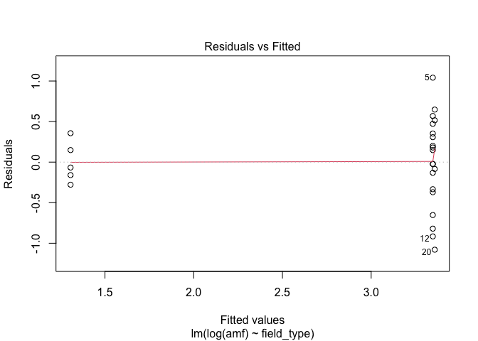
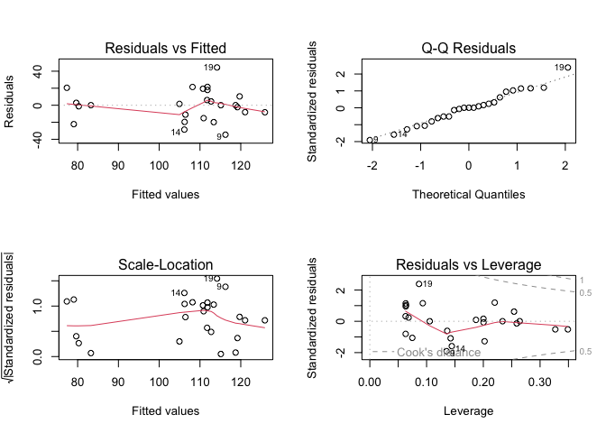
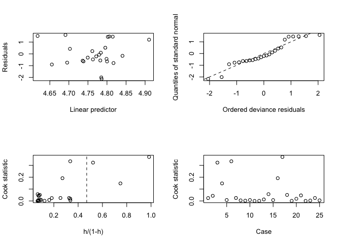
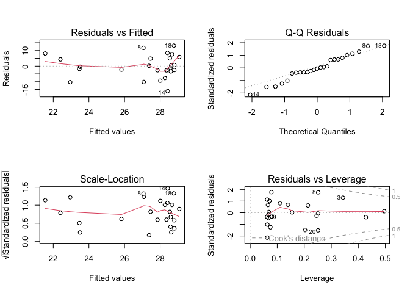
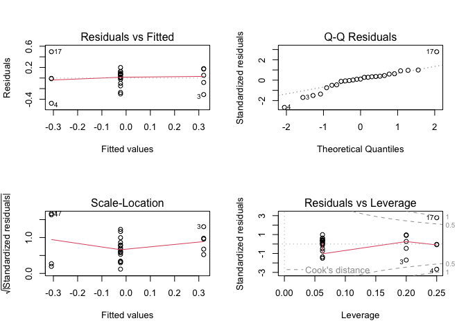

Results: Soil Fungal Communities
================
Beau Larkin

Last updated: 27 October, 2025

- [Description](#description)
- [Packages and libraries](#packages-and-libraries)
  - [Root path function](#root-path-function)
- [Data](#data)
  - [Site metadata and design](#site-metadata-and-design)
  - [Sites-species tables](#sites-species-tables)
  - [Microbial species metadata](#microbial-species-metadata)
  - [Plant data](#plant-data)
  - [Soil properties](#soil-properties)
- [Data wrangling](#data-wrangling)
  - [Grass-forb index](#grass-forb-index)
  - [Fatty Acids: Biomass](#fatty-acids-biomass)
- [Functions](#functions)
- [Whole Soil Fungi](#whole-soil-fungi-1)
  - [Diversity Indices](#diversity-indices)
  - [PLFA](#plfa)
  - [Beta Diversity](#beta-diversity)
  - [Unified figure](#unified-figure)
  - [Constrained Analysis](#constrained-analysis)
- [Arbuscular mycorrhizal fungi](#arbuscular-mycorrhizal-fungi)
  - [Diversity Indices](#diversity-indices-1)
  - [NLFA](#nlfa)
  - [Beta Diversity](#beta-diversity-1)
  - [Unified figure](#unified-figure-1)
  - [AMF abundance in families](#amf-abundance-in-families)
- [Putative plant pathogens](#putative-plant-pathogens)
  - [Diversity Indices](#diversity-indices-2)
  - [Sequence abundance](#sequence-abundance)
  - [Beta Diversity](#beta-diversity-2)
  - [Unified figure](#unified-figure-2)
  - [Pathogen Indicator Species](#pathogen-indicator-species)
  - [Pathogen—Plant Correlations](#pathogenplant-correlations)
- [Putative saprotrophs](#putative-saprotrophs)
  - [Diversity Indices](#diversity-indices-3)
  - [Sequence abundance](#sequence-abundance-1)
  - [Beta Diversity](#beta-diversity-3)
  - [Unified figure](#unified-figure-3)
  - [Saprotroph Indicator Species](#saprotroph-indicator-species)

# Description

**Scope** – Biomass (PLFA/NLFA), OTU richness and diversity, and
β‑diversity of soil fungi across corn, restored, and remnant prairie
fields.

**Alpha diversity** – 97 %-OTUs (ITS & 18S); site means are replicates;
means separation model selection based on response and residuals
distributions; √‑transformation of sequencing depth used as covariate
per [Bálint
2015](https://onlinelibrary.wiley.com/doi/abs/10.1111/mec.13018);
pairwise LSMs via *emmeans*.

**Beta diversity** – Workflow after [Song
2015](https://doi.org/10.1371/journal.pone.0127234):  
1. PCoA of Bray (ITS) or UNIFRAC (18S) distances 1. homogeneity test
diagnostics 1. PERMANOVA (+ pairwise)

Cartesian inter‑site distance enters models as a covariate per [Redondo
2020](https://doi.org/10.1093/femsec/fiaa082).

# Packages and libraries

``` r
# Libraries ———————— ####
```

``` r
packages_needed <- c(
  "colorspace", "emmeans", "gridExtra", "knitr", "tidyverse", "vegan",
  "rprojroot", "phyloseq", "ape", "phangorn", "geosphere", "conflicted",
  "ggpubr", "patchwork", "car", "performance", "broom", "boot", "indicspecies",
  "MASS", "DHARMa"
)

to_install <- setdiff(packages_needed, rownames(installed.packages()))
if (length(to_install)) install.packages(to_install)
invisible(lapply(packages_needed, library, character.only = TRUE))
```

## Root path function

``` r
root_path <- function(...) rprojroot::find_rstudio_root_file(...)
```

``` r
conflict_prefer("filter", "dplyr")
conflict_prefer("select", "dplyr")
conflict_prefer("diversity", "vegan")
```

``` r
source(root_path("resources", "styles.R"))
```

# Data

``` r
# Data ———————— ####
```

## Site metadata and design

``` r
sites <- read_csv(root_path("clean_data/sites.csv"), show_col_types = FALSE) %>% 
  mutate(field_type = factor(field_type, levels = c("corn", "restored", "remnant")))
```

### Wrangle site metadata

Intersite geographic distance will be used as a covariate in clustering.
Raw coordinates in data file aren’t distances; convert to distance
matrix and summarize with PCoA

``` r
field_dist <- as.dist(distm(sites[, c("long", "lat")], fun = distHaversine))
field_dist_pcoa <- pcoa(field_dist)
field_dist_pcoa$values[c(1,2), c(1,2)] %>% 
    kable(format = "pandoc")
```

|  Eigenvalues | Relative_eig |
|-------------:|-------------:|
| 146898426293 |    0.9053961 |
|  15349390146 |    0.0946047 |

First axis of geographic distance PCoA explains 91% of the variation
among sites.

``` r
sites$dist_axis_1 <- field_dist_pcoa$vectors[, 1]
```

## Sites-species tables

CSV files were produced in `sequence_data.R`. Amf_avg_uni table is in
species-samples format to enable use of `Unifrac()` later.

``` r
spe <- list(
    its_avg     = read_csv(root_path("clean_data/spe_ITS_avg.csv"), show_col_types = FALSE),
    amf_avg     = read_csv(root_path("clean_data/spe_18S_avg.csv"), show_col_types = FALSE),
    amf_avg_uni = read_delim(root_path("otu_tables/18S/18S_avg_4unifrac.tsv"), show_col_types = FALSE)
)
```

## Microbial species metadata

``` r
spe_meta <- list(
    its = read_csv(root_path("clean_data/spe_ITS_metadata.csv"), show_col_types = FALSE) %>% 
      mutate(primary_lifestyle = case_when(str_detect(primary_lifestyle, "_saprotroph$") ~ "saprotroph", 
                                           TRUE ~ primary_lifestyle)),
    amf = read_csv(root_path("clean_data/spe_18S_metadata.csv"), show_col_types = FALSE),
    amf_avg_uni = read_delim(root_path("otu_tables/18S/18S_avg_4unifrac.tsv"), show_col_types = FALSE)
) %>% 
  map(. %>% mutate(across(everything(), ~ replace_na(., "unidentified"))))
```

## Plant data

Abundance in functional groups and by species are only available from
Wisconsin sites. Only C4_grass and forbs are used. Others: C3_grass,
legume, and shrubTree were found previously to have high VIF in models
or were not chosen in forward selection.

``` r
pfg <- read_csv(root_path("clean_data", "plant_traits.csv"), show_col_types = FALSE) %>% 
  select(field_name, C4_grass, forb)
```

## Soil properties

``` r
soil <- read_csv(root_path("clean_data/soil.csv"), show_col_types = FALSE)[-c(26:27), ]
```

# Data wrangling

``` r
# Data wrangling ———————— ####
```

- C4 grass and forb cover are transformed into a single index using PCA
  in restored sites only.
- The OTU abundance tables must be wrangled to perform a log-ratio
  transformation, which reduces data skewness and compositionality bias
  (Aitchison 1986, Gloor et al. 2017). The transformation will be
  applied across guilds for whole soil fungi and families for AMF. Raw
  abundances are kept for plotting. Abundance data are also joined with
  site and env paramaters to facilitate downstream analyses.

## Grass-forb index

C4 grass and forb cover are highly correlated (*r* = -0.91) in restored
prairies. In models or constrained ordinations, they are collinear and
cannot be used simultaneously. An index of grass-forb cover is created
to solve this problem.

``` r
pfg_pca <- 
  pfg %>% 
  left_join(sites %>% select(field_name, field_type), by = join_by(field_name)) %>% 
  filter(field_type == "restored") %>% 
  select(-field_type) %>% 
  column_to_rownames(var = "field_name") %>% 
  decostand(method = "standardize") %>% 
  rda()
pfg_pca %>% summary() # 92% variation on first axis
```

    ## 
    ## Call:
    ## rda(X = .) 
    ## 
    ## Partitioning of variance:
    ##               Inertia Proportion
    ## Total               2          1
    ## Unconstrained       2          1
    ## 
    ## Eigenvalues, and their contribution to the variance 
    ## 
    ## Importance of components:
    ##                          PC1     PC2
    ## Eigenvalue            1.8482 0.15184
    ## Proportion Explained  0.9241 0.07592
    ## Cumulative Proportion 0.9241 1.00000

``` r
gf_index = scores(pfg_pca, choices = 1, display = "sites") %>% 
  data.frame() %>% 
  rename(gf_index = PC1) %>% 
  rownames_to_column(var = "field_name")
```

### Wrangle species and metadata

Raw and log ratio transformed abundances

#### Whole soil fungi

``` r
its_guab <- 
  spe$its_avg %>% 
  pivot_longer(starts_with("otu"), names_to = "otu_num", values_to = "abund") %>% 
  left_join(spe_meta$its %>% select(otu_num, primary_lifestyle), by = join_by(otu_num)) %>% 
  group_by(field_name, primary_lifestyle) %>% summarize(abund = sum(abund), .groups = "drop") %>% 
  arrange(field_name, -abund) %>% 
  pivot_wider(names_from = "primary_lifestyle", values_from = "abund") %>% 
  select(field_name, unidentified, saprotroph, plant_pathogen, everything())
its_guab_pfg <- 
  its_guab %>% 
  left_join(pfg, by = join_by(field_name)) %>% 
  left_join(gf_index, by = join_by(field_name)) %>% 
  left_join(sites %>% select(field_name, field_type, region, yr_since), by = join_by(field_name)) %>% 
  select(field_name, field_type, yr_since, region, everything())
its_gulr_pfg <- 
  its_guab %>% 
  column_to_rownames(var = "field_name") %>% 
  decostand("rclr", MARGIN = 2) %>%
  rownames_to_column(var = "field_name") %>% 
  as_tibble() %>% 
  left_join(pfg, by = join_by(field_name)) %>% 
  left_join(gf_index, by = join_by(field_name)) %>% 
  left_join(sites %>% select(field_name, field_type, region, yr_since), by = join_by(field_name)) %>% 
  select(field_name, field_type, yr_since, region, everything())
```

#### AMF

``` r
amf_fmab <- 
  spe$amf_avg %>% 
  pivot_longer(starts_with("otu"), names_to = "otu_num", values_to = "abund") %>% 
  left_join(spe_meta$amf %>% select(otu_num, family), by = join_by(otu_num)) %>% 
  group_by(field_name, family) %>% summarize(abund = sum(abund), .groups = "drop") %>% 
  arrange(field_name, -abund) %>% 
  pivot_wider(names_from = "family", values_from = "abund")
amf_fmab_pfg <- 
  amf_fmab %>% 
  left_join(pfg, by = join_by(field_name)) %>% 
  left_join(gf_index, by = join_by(field_name)) %>% 
  left_join(sites %>% select(field_name, field_type, region, yr_since), by = join_by(field_name)) %>% 
  select(field_name, field_type, yr_since, region, everything())
amf_fmlr_pfg <- 
  amf_fmab %>% 
  column_to_rownames(var = "field_name") %>% 
  decostand("rclr", MARGIN = 2) %>% 
  rownames_to_column(var = "field_name") %>% 
  as_tibble() %>% 
  left_join(pfg, by = join_by(field_name)) %>% 
  left_join(gf_index, by = join_by(field_name)) %>% 
  left_join(sites %>% select(field_name, field_type, region, yr_since), by = join_by(field_name)) %>% 
  select(field_name, field_type, yr_since, region, everything())
```

### Phyloseq databases

Only AMF needed here for UNIFRAC distance in PCoA

``` r
amf_ps <- phyloseq(
    otu_table(data.frame(spe$amf_avg_uni, row.names = 1) %>%
                decostand(method = "total", MARGIN = 2),
              taxa_are_rows = TRUE),
    tax_table(as.matrix(data.frame(spe_meta$amf, row.names = 2))),
    read.dna(root_path("otu_tables/18S/18S_sequences.fasta"), format = "fasta") %>%
        phyDat(type = "DNA") %>% dist.hamming() %>% NJ(),
    sample_data(sites %>% column_to_rownames(var = "field_name"))
)
```

## Fatty Acids: Biomass

Use only 18.2 for soil fungi

``` r
fa <- read_csv(root_path("clean_data/plfa.csv"), show_col_types = FALSE) %>% 
    rename(fungi_18.2 = fa_18.2) %>% 
    select(field_name, fungi_18.2, amf) %>%
    left_join(
        sites %>% select(field_name, field_type),
        by = join_by(field_name)
    )
```

# Functions

Executed from a separate script to save lines here; to view the function
navigate to `functions.R` in the code folder, accessible from the root
dir of the repo.

``` r
# Functions ———————— ####
source(root_path("code", "functions.R"))
```

# Whole Soil Fungi

``` r
# Whole soil fungi ———————— ####
```

## Diversity Indices

``` r
its_div <- calc_div(spe$its_avg, sites)
```

### Richness

Account for sequencing depth as a covariate

``` r
its_rich_lm <- lm(richness ~ sqrt(depth) + field_type, data = its_div)
```

Diagnostics

``` r
par(mfrow = c(2,2))
plot(its_rich_lm) # variance similar in groups
```

<!-- -->

``` r
distribution_prob(its_rich_lm)
```

    ## 
    ## 
    ## Distribution    p_Residuals
    ## -------------  ------------
    ## cauchy              0.65625
    ## normal              0.15625
    ## lognormal           0.06250
    ## 
    ## 
    ## Distribution                  p_Response
    ## ---------------------------  -----------
    ## lognormal                         0.3750
    ## neg. binomial (zero-infl.)        0.3125
    ## beta-binomial                     0.1250

residuals distribution normal or close, response log

``` r
leveneTest(richness ~ field_type, data = its_div) %>% as.data.frame() %>% kable(format = "pandoc")
```

|       |  Df |   F value |   Pr(\>F) |
|-------|----:|----------:|----------:|
| group |   2 | 0.4909782 | 0.6185753 |
|       |  22 |        NA |        NA |

``` r
leveneTest(residuals(its_rich_lm) ~ its_div$field_type) %>% as.data.frame() %>% kable(format = "pandoc")
```

|       |  Df |   F value |   Pr(\>F) |
|-------|----:|----------:|----------:|
| group |   2 | 0.0881621 | 0.9159343 |
|       |  22 |        NA |        NA |

Residuals/response distributions do not suggest the need for
transformation. Levene’s p \> 0.05 → fail to reject = variances can be
considered equal. Model results, group means, and post-hoc

``` r
summary(its_rich_lm)
```

    ## 
    ## Call:
    ## lm(formula = richness ~ sqrt(depth) + field_type, data = its_div)
    ## 
    ## Residuals:
    ##     Min      1Q  Median      3Q     Max 
    ## -78.214 -31.058   2.703  37.756  59.136 
    ## 
    ## Coefficients:
    ##                    Estimate Std. Error t value Pr(>|t|)    
    ## (Intercept)        -142.687    195.509  -0.730 0.473561    
    ## sqrt(depth)           5.897      2.141   2.755 0.011868 *  
    ## field_typerestored  109.687     23.314   4.705 0.000121 ***
    ## field_typeremnant   164.161     31.136   5.272 3.16e-05 ***
    ## ---
    ## Signif. codes:  0 '***' 0.001 '**' 0.01 '*' 0.05 '.' 0.1 ' ' 1
    ## 
    ## Residual standard error: 45.5 on 21 degrees of freedom
    ## Multiple R-squared:  0.633,  Adjusted R-squared:  0.5806 
    ## F-statistic: 12.08 on 3 and 21 DF,  p-value: 8.275e-05

Sequence depth is significant, less so than field type. Check
relationship of depth and field type.

``` r
its_div %>% 
    group_by(field_type) %>% 
    summarize(across(c(depth, richness), ~ round(mean(.x), 0))) %>% 
    kable(format = "pandoc")
```

| field_type | depth | richness |
|:-----------|------:|---------:|
| corn       |  8257 |      393 |
| restored   |  8266 |      502 |
| remnant    |  7750 |      540 |

Sequence depth isn’t obviously related to field type. Proceed with means
separation by obtaining estimated marginal means for field type.
Arithmetic means calculated in this case.

``` r
its_rich_em <- emmeans(its_rich_lm, ~ field_type, type = "response")
```

Results tables below show the emmeans summary of group means and
confidence intervals, with sequencing depth as a covariate, and the post
hoc contrast of richness among field types.

| field_type |   emmean |       SE |  df | lower.CL | upper.CL |
|:-----------|---------:|---------:|----:|---------:|---------:|
| corn       | 390.7190 | 20.36691 |  21 | 348.3637 | 433.0743 |
| restored   | 500.4064 | 11.39846 |  21 | 476.7020 | 524.1108 |
| remnant    | 554.8798 | 23.36359 |  21 | 506.2926 | 603.4670 |

Confidence level used: 0.95

| contrast           |   estimate |       SE |  df |   t.ratio |   p.value |
|:-------------------|-----------:|---------:|----:|----------:|----------:|
| corn - restored    | -109.68738 | 23.31421 |  21 | -4.704743 | 0.0003415 |
| corn - remnant     | -164.16080 | 31.13618 |  21 | -5.272348 | 0.0000903 |
| restored - remnant |  -54.47342 | 26.14137 |  21 | -2.083801 | 0.1174883 |

P value adjustment: tukey method for comparing a family of 3 estimates

OTU richness in cornfields is significantly less than in restored or
remnant fields (p\<0.001), which don’t differ.

``` r
its_rich_fig <- 
  ggplot(summary(its_rich_em), aes(x = field_type, y = emmean)) +
  geom_col(aes(fill = field_type), color = "black", width = 0.5, linewidth = lw) +
  geom_errorbar(aes(ymin = emmean, ymax = upper.CL), width = 0, linewidth = lw) +
  geom_text(aes(y = upper.CL, label = c("a", "b", "b")), vjust = -1.5, family = "serif", size = 4) +
  labs(x = NULL, y = "Richness") +
  lims(y = c(0, 760)) +
  scale_fill_manual(values = c("gray", "black", "white")) +
  theme_cor +
  theme(legend.position = "none",
        plot.tag = element_text(size = 14, face = 1),
        plot.tag.position = c(0, 1))
```

### Shannon’s diversity

Account for sequencing depth as a covariate

``` r
its_shan_lm <- lm(shannon ~ sqrt(depth) + field_type, data = its_div)
```

Diagnostics

``` r
par(mfrow = c(2,2))
plot(its_shan_lm) # variance similar in groups 
```

<!-- -->

``` r
distribution_prob(its_shan_lm)
```

    ## 
    ## 
    ## Distribution    p_Residuals
    ## -------------  ------------
    ## cauchy               0.5625
    ## normal               0.4375
    ## bernoulli            0.0000
    ## 
    ## 
    ## Distribution    p_Response
    ## -------------  -----------
    ## gamma              0.31250
    ## lognormal          0.31250
    ## chi                0.15625

residuals distribution most likely cauchy/normal; symmetric but long
tails residuals distribution normal or close, response gamma

``` r
leveneTest(shannon ~ field_type, data = its_div) %>% as.data.frame() %>% kable(format = "pandoc")
```

|       |  Df |  F value |   Pr(\>F) |
|-------|----:|---------:|----------:|
| group |   2 | 2.742412 | 0.0864225 |
|       |  22 |       NA |        NA |

``` r
leveneTest(residuals(its_shan_lm) ~ its_div$field_type) %>% as.data.frame() %>% kable(format = "pandoc")
```

|       |  Df |  F value |   Pr(\>F) |
|-------|----:|---------:|----------:|
| group |   2 | 2.265973 | 0.1274059 |
|       |  22 |       NA |        NA |

Residuals distribution does not suggest the need for transformation.
Levene’s p \> 0.05 → fail to reject = variances can be considered equal.
Residuals distribution does not suggest the need for transformation.
Response more suspicious. Examine CV in groups to assess changes in
variance.

``` r
augment(its_shan_lm) %>%
  mutate(field_type = factor(field_type, levels = c("corn", "restored", "remnant"))) %>% 
  group_by(field_type) %>%
  summarise(
    mean_fitted = mean(.fitted),
    sd_resid    = sd(.resid),
    cv_resid    = sd_resid / mean_fitted
  ) %>% 
  mutate(across(where(is.numeric), ~ round(.x, 2))) %>% 
  kable(format = "pandoc", caption = "CV of residuals and fitted means in groups")
```

| field_type | mean_fitted | sd_resid | cv_resid |
|:-----------|------------:|---------:|---------:|
| corn       |       79.92 |    15.20 |     0.19 |
| restored   |      111.36 |    21.39 |     0.19 |
| remnant    |      120.89 |     7.76 |     0.06 |

CV of residuals and fitted means in groups

CV constant to declining. Relatively low p value likely due to unequal
variance in restored and remnant despite similar means. Model results,
group means, and post-hoc

``` r
summary(its_shan_lm)
```

    ## 
    ## Call:
    ## lm(formula = shannon ~ sqrt(depth) + field_type, data = its_div)
    ## 
    ## Residuals:
    ##     Min      1Q  Median      3Q     Max 
    ## -34.587 -11.045   0.081  10.383  44.408 
    ## 
    ## Coefficients:
    ##                    Estimate Std. Error t value Pr(>|t|)   
    ## (Intercept)          2.4537    83.6852   0.029  0.97689   
    ## sqrt(depth)          0.8528     0.9163   0.931  0.36258   
    ## field_typerestored  31.4846     9.9794   3.155  0.00478 **
    ## field_typeremnant   43.4207    13.3275   3.258  0.00376 **
    ## ---
    ## Signif. codes:  0 '***' 0.001 '**' 0.01 '*' 0.05 '.' 0.1 ' ' 1
    ## 
    ## Residual standard error: 19.48 on 21 degrees of freedom
    ## Multiple R-squared:  0.3888, Adjusted R-squared:  0.3015 
    ## F-statistic: 4.453 on 3 and 21 DF,  p-value: 0.0143

Sequence depth is not a significant predictor of Shannon diversity.
Proceed with means separation by obtaining estimated marginal means for
field type. Arithmetic means calculated in this case.

``` r
its_shan_em <- emmeans(its_shan_lm, ~ field_type, type = "response")
```

Results tables below show the emmeans summary of group means and
confidence intervals, with sequencing depth as a covariate, and the post
hoc contrast of richness among field types.

| field_type |    emmean |        SE |  df |  lower.CL |  upper.CL |
|:-----------|----------:|----------:|----:|----------:|----------:|
| corn       |  79.58797 |  8.717825 |  21 |  61.45826 |  97.71768 |
| restored   | 111.07255 |  4.878981 |  21 | 100.92616 | 121.21895 |
| remnant    | 123.00864 | 10.000519 |  21 | 102.21142 | 143.80586 |

Confidence level used: 0.95

| contrast           |  estimate |        SE |  df |   t.ratio |   p.value |
|:-------------------|----------:|----------:|----:|----------:|----------:|
| corn - restored    | -31.48458 |  9.979385 |  21 | -3.154962 | 0.0127116 |
| corn - remnant     | -43.42067 | 13.327491 |  21 | -3.257978 | 0.0100752 |
| restored - remnant | -11.93609 | 11.189520 |  21 | -1.066720 | 0.5445052 |

P value adjustment: tukey method for comparing a family of 3 estimates

Shannon’s diversity in cornfields is significantly less than in restored
or remnant fields, which don’t differ.

``` r
its_shan_fig <- 
  ggplot(summary(its_shan_em), aes(x = field_type, y = emmean)) +
  geom_col(aes(fill = field_type), color = "black", width = 0.5, linewidth = lw) +
  geom_errorbar(aes(ymin = emmean, ymax = upper.CL), width = 0, linewidth = lw) +
  geom_text(aes(y = upper.CL, label = c("a", "b", "b")), vjust = -1.5, family = "serif", size = 4) +
  labs(x = NULL, y = "Shannon diversity") +
  lims(y = c(0, 160)) +
  scale_fill_manual(values = c("gray", "black", "white")) +
  theme_cor +
  theme(legend.position = "none",
        plot.tag = element_text(size = 14, face = 1, hjust = 0),
        plot.tag.position = c(0, 1))
```

## PLFA

``` r
plfa_lm <- lm(fungi_18.2 ~ field_type, data = fa)
par(mfrow = c(2,2))
plot(plfa_lm) # variance differs slightly in groups. Tails on qq plot diverge, lots of groups structure
```

<!-- -->

``` r
distribution_prob(plfa_lm)
```

    ## 
    ## 
    ## Distribution    p_Residuals
    ## -------------  ------------
    ## normal              0.62500
    ## cauchy              0.12500
    ## gamma               0.09375
    ## 
    ## 
    ## Distribution     p_Response
    ## --------------  -----------
    ## weibull             0.21875
    ## normal              0.18750
    ## beta-binomial       0.12500

Residuals distribution fits normal, response normal-ish

``` r
leveneTest(residuals(plfa_lm) ~ fa$field_type) %>% as.data.frame() %>% kable(format = "pandoc") # No covariate, response and residuals tests equivalent
```

|       |  Df |   F value |   Pr(\>F) |
|-------|----:|----------:|----------:|
| group |   2 | 0.9749963 | 0.3929075 |
|       |  22 |        NA |        NA |

Residuals distribution does not suggest the need for transformation.
Levene’s p \> 0.05 → fail to reject = variances can be considered equal.
Model results, group means, and post-hoc, with arithmetic means from
emmeans

``` r
summary(plfa_lm)
```

    ## 
    ## Call:
    ## lm(formula = fungi_18.2 ~ field_type, data = fa)
    ## 
    ## Residuals:
    ##     Min      1Q  Median      3Q     Max 
    ## -2.3873 -1.6030  0.0933  1.4457  3.6109 
    ## 
    ## Coefficients:
    ##                    Estimate Std. Error t value Pr(>|t|)   
    ## (Intercept)          3.0947     0.8323   3.718   0.0012 **
    ## field_typerestored   2.0351     0.9536   2.134   0.0442 * 
    ## field_typeremnant    1.9170     1.2485   1.535   0.1389   
    ## ---
    ## Signif. codes:  0 '***' 0.001 '**' 0.01 '*' 0.05 '.' 0.1 ' ' 1
    ## 
    ## Residual standard error: 1.861 on 22 degrees of freedom
    ## Multiple R-squared:  0.1756, Adjusted R-squared:  0.1006 
    ## F-statistic: 2.343 on 2 and 22 DF,  p-value: 0.1196

``` r
plfa_em <- emmeans(plfa_lm, ~ field_type, type = "response")
```

| field_type |   emmean |        SE |  df | lower.CL | upper.CL |
|:-----------|---------:|----------:|----:|---------:|---------:|
| corn       | 3.094661 | 0.8323383 |  22 | 1.368497 | 4.820825 |
| restored   | 5.129779 | 0.4652913 |  22 | 4.164824 | 6.094734 |
| remnant    | 5.011704 | 0.9305825 |  22 | 3.081794 | 6.941614 |

Confidence level used: 0.95

| contrast           |   estimate |        SE |  df |    t.ratio |   p.value |
|:-------------------|-----------:|----------:|----:|-----------:|----------:|
| corn - restored    | -2.0351183 | 0.9535633 |  22 | -2.1342246 | 0.1058898 |
| corn - remnant     | -1.9170436 | 1.2485075 |  22 | -1.5354682 | 0.2943078 |
| restored - remnant |  0.1180747 | 1.0404229 |  22 |  0.1134873 | 0.9929269 |

P value adjustment: tukey method for comparing a family of 3 estimates

``` r
plfa_fig <- 
  ggplot(summary(plfa_em), aes(x = field_type, y = emmean)) +
  geom_col(aes(fill = field_type), color = "black", width = 0.5, linewidth = lw) +
  geom_errorbar(aes(ymin = emmean, ymax = upper.CL), width = 0, linewidth = lw) +
  labs(x = NULL, y = expression(PLFA~(nmol%*%g[soil]^-1))) +
  scale_fill_manual(values = c("gray", "black", "white")) +
  theme_cor +
  theme(legend.position = "none",
        plot.tag = element_text(size = 14, face = 1),
        plot.tag.position = c(0, 1.02))
```

## Beta Diversity

Abundances were transformed by row proportions in sites before producing
a distance matrix per [McKnight et
al.](https://besjournals.onlinelibrary.wiley.com/doi/full/10.1111/2041-210X.13115)

``` r
d_its <- spe$its_avg %>% 
    data.frame(row.names = 1) %>% 
    decostand("total") %>%
    vegdist("bray")
mva_its <- mva(d = d_its, env = sites)
```

``` r
mva_its$dispersion_test
```

    ## 
    ## Permutation test for homogeneity of multivariate dispersions
    ## Permutation: free
    ## Number of permutations: 1999
    ## 
    ## Response: Distances
    ##           Df   Sum Sq   Mean Sq      F N.Perm Pr(>F)  
    ## Groups     2 0.018698 0.0093489 3.2104   1999 0.0625 .
    ## Residuals 22 0.064065 0.0029121                       
    ## ---
    ## Signif. codes:  0 '***' 0.001 '**' 0.01 '*' 0.05 '.' 0.1 ' ' 1
    ## 
    ## Pairwise comparisons:
    ## (Observed p-value below diagonal, permuted p-value above diagonal)
    ##              corn restored remnant
    ## corn              0.071500  0.1315
    ## restored 0.068726           0.1260
    ## remnant  0.126039 0.135570

``` r
mva_its$permanova
```

    ## Permutation test for adonis under reduced model
    ## Terms added sequentially (first to last)
    ## Permutation: free
    ## Number of permutations: 1999
    ## 
    ## adonis2(formula = d ~ dist_axis_1 + field_type, data = env, permutations = nperm, by = "terms")
    ##             Df SumOfSqs      R2      F Pr(>F)    
    ## dist_axis_1  1   0.4225 0.06253 1.7391 0.0280 *  
    ## field_type   2   1.2321 0.18236 2.5358 0.0005 ***
    ## Residual    21   5.1017 0.75510                  
    ## Total       24   6.7563 1.00000                  
    ## ---
    ## Signif. codes:  0 '***' 0.001 '**' 0.01 '*' 0.05 '.' 0.1 ' ' 1

``` r
mva_its$pairwise_contrasts[c(1,3,2), c(1,2,4,3,8)] %>% 
    kable(format = "pandoc", caption = "Pairwise permanova contrasts")
```

|     | group1   | group2  | F_value |    R2 | p_value_adj |
|-----|:---------|:--------|--------:|------:|------------:|
| 1   | restored | corn    |   3.913 | 0.164 |      0.0015 |
| 3   | corn     | remnant |   2.858 | 0.281 |      0.0067 |
| 2   | restored | remnant |   1.062 | 0.054 |      0.3370 |

Pairwise permanova contrasts

No eignevalue correction was needed. Two relative eigenvalues exceeded
broken stick model. Based on the homogeneity of variance test, the null
hypothesis of equal variance among groups is accepted across all
clusters and in pairwise comparison of clusters (both p\>0.05),
supporting the application of a PERMANOVA test.

Clustering revealed that community variation was related to geographic
distance, the covariate in the model. With geographic distance accounted
for, the test variable ‘field type’ significantly explained variation in
fungal communities, with a post-hoc test revealing that communities in
corn fields differed from communities in restored and remnant fields.

Plotting results:

``` r
its_ord_data <- mva_its$ordination_scores %>% mutate(field_type = factor(field_type, levels = c("corn", "restored", "remnant")))
p_its_centers <- its_ord_data %>% 
    group_by(field_type) %>% 
    summarize(across(starts_with("Axis"), list(mean = mean, ci_l = ci_l, ci_u = ci_u), .names = "{.fn}_{.col}"), .groups = "drop") %>% 
    mutate(across(c(ci_l_Axis.1, ci_u_Axis.1), ~ mean_Axis.1 + .x),
           across(c(ci_l_Axis.2, ci_u_Axis.2), ~ mean_Axis.2 + .x))
its_ord <- 
    ggplot(its_ord_data, aes(x = Axis.1, y = Axis.2)) +
    geom_point(aes(fill = field_type), size = sm_size, stroke = lw, shape = 21) +
    geom_text(aes(label = yr_since), size = yrtx_size, family = "serif", fontface = 2, color = "white") +
    geom_linerange(data = p_its_centers, aes(x = mean_Axis.1, y = mean_Axis.2, xmin = ci_l_Axis.1, xmax = ci_u_Axis.1), linewidth = lw) +
    geom_linerange(data = p_its_centers, aes(x = mean_Axis.1, y = mean_Axis.2, ymin = ci_l_Axis.2, ymax = ci_u_Axis.2), linewidth = lw) +
    geom_point(data = p_its_centers, aes(x = mean_Axis.1, y = mean_Axis.2, fill = field_type), size = lg_size, stroke = lw, shape = 21) +
    scale_fill_manual(values = c("gray", "black", "white")) +
    labs(
        x = paste0("Axis 1 (", mva_its$axis_pct[1], "%)"),
        y = paste0("Axis 2 (", mva_its$axis_pct[2], "%)")) +
    theme_ord +
    theme(legend.position = "none",
          plot.tag = element_text(size = 14, face = 1),
          plot.tag.position = c(0, 1.01))
    # guides(fill = guide_legend(position = "inside")) +
    # theme(legend.justification = c(0.03, 0.98))
```

## Unified figure

``` r
fig2_ls <- (its_rich_fig / plot_spacer() / plfa_fig) +
    plot_layout(heights = c(1,0.01,1)) 
fig2 <- (fig2_ls | plot_spacer() | its_ord) +
    plot_layout(widths = c(0.35, 0.01, 0.64)) +
    plot_annotation(tag_levels = 'a') 
```

``` r
fig2
```

<!-- -->

**Fig 2.** Whole-soil fungal communities in **corn**, **restored**, and
**remnant** prairie fields. **a** OTU richness and **b** fungal biomass
(PLFA) are shown as columns with 95 % CIs; lowercase letters mark
significant pairwise differences (P \< 0.001). **c**
Principal-coordinate (PCoA) ordination of ITS-based (97 % OTU) community
distances: small points = sites, large circles = field-type centroids
(error bars = 95 % CI). Cornfields cluster apart from restored or
remnant prairies (P \< 0.01). Numbers in black circles give years since
restoration. Axis labels show the percent variation explained.
Colours/shading: corn = grey, restored = black, remnant = white.

## Constrained Analysis

Test explanatory variables for correlation with site ordination. Using
plant data, so the analysis is restricted to Wisconsin sites. Edaphic
variables are too numerous to include individually, so transform micro
nutrients using PCA. Forb and grass cover is highly collinear; use the
grass-forb index produced previously with PCA.

``` r
soil_micro_pca <- 
  soil %>% 
  left_join(sites %>% select(field_name, field_type, region), by = join_by(field_name)) %>% 
  filter(field_type == "restored", !(region %in% "FL")) %>% 
  select(field_name, SO4, Zn, Fe, Mn, Cu, Ca, Mg, Na, -field_key, -field_type, -region) %>% 
  column_to_rownames(var = "field_name") %>% 
  decostand(method = "standardize") %>% 
  rda()
summary(soil_micro_pca) # 70% on first two axes
```

    ## 
    ## Call:
    ## rda(X = .) 
    ## 
    ## Partitioning of variance:
    ##               Inertia Proportion
    ## Total               8          1
    ## Unconstrained       8          1
    ## 
    ## Eigenvalues, and their contribution to the variance 
    ## 
    ## Importance of components:
    ##                          PC1    PC2    PC3     PC4     PC5     PC6     PC7       PC8
    ## Eigenvalue            3.4066 2.1821 1.0440 0.74927 0.38143 0.17796 0.05328 0.0054225
    ## Proportion Explained  0.4258 0.2728 0.1305 0.09366 0.04768 0.02225 0.00666 0.0006778
    ## Cumulative Proportion 0.4258 0.6986 0.8291 0.92274 0.97042 0.99266 0.99932 1.0000000

``` r
soil_micro_index <- scores(soil_micro_pca, choices = c(1, 2), display = "sites") %>% 
  data.frame() %>% 
  rename(soil_micro_1 = PC1, soil_micro_2 = PC2) %>% 
  rownames_to_column(var = "field_name")

soil_macro <- 
  soil %>% 
  left_join(sites %>% select(field_name, field_type, region), by = join_by(field_name)) %>% 
  filter(field_type == "restored", !(region %in% "FL")) %>% 
  select(-c(field_key, field_type, region, SO4, Zn, Fe, Mn, Cu, Ca, Mg, Na))
```

Assemble explanatory variables and begin iterative selection process.
Check the VIF for each explanatory variable to test for collinearity if
model overfitting is detected. Then run forward selection in `dbrda()`.

``` r
env_vars <- sites %>% 
  filter(field_type == "restored", !(region %in% "FL")) %>% 
  select(field_name, dist_axis_1) %>% # 90% on axis 1
  left_join(soil_micro_index, by = join_by(field_name)) %>% # 70% on first two axes
  left_join(soil_macro, by = join_by(field_name)) %>% 
  left_join(gf_index, by = join_by(field_name)) %>% # 92% on axis 1
  select(-starts_with("field_key"), -soil_micro_1, -K) %>% # soil_micro_1 removed based on initial VIF check
  column_to_rownames(var = "field_name") %>% 
  as.data.frame()
env_cov <- env_vars[,"dist_axis_1", drop = TRUE]
env_expl <- env_vars[, setdiff(colnames(env_vars), "dist_axis_1"), drop = FALSE] %>% 
  decostand("standardize")
```

Check VIF

``` r
env_expl %>% 
  cor() %>% 
  solve() %>% 
  diag() %>% 
  sort()
```

    ##     gf_index           pH soil_micro_2            P           OM          NO3 
    ##     1.545341     1.729468     1.918068     3.334750     3.510308     3.788485

OM, K, and soil_micro_1 with high VIF in initial VIF check. Removed
soil_micro_1 and K to maintain OM in the model. No overfitting detected
in full model; proceed with forward selection.

``` r
spe_its_wi_resto <- spe$its_avg %>% 
  filter(field_name %in% rownames(env_expl)) %>% 
  column_to_rownames(var = "field_name") %>% 
  decostand("total")

mod_null <- dbrda(spe_its_wi_resto ~ 1 + Condition(env_cov), data = env_expl, distance = "bray")
mod_full <- dbrda(spe_its_wi_resto ~ . + Condition(env_cov), data = env_expl, distance = "bray")
mod_step <- ordistep(mod_null, 
                     scope = formula(mod_full), 
                     direction = "forward", 
                     permutations = 1999, 
                     trace = FALSE)
```

### Constrained Analysis Results

``` r
mod_step
```

    ## Call: dbrda(formula = spe_its_wi_resto ~ Condition(env_cov) + gf_index + pH, data = env_expl,
    ## distance = "bray")
    ## 
    ## -- Model Summary --
    ## 
    ##               Inertia Proportion Rank
    ## Total          2.2700     1.0000     
    ## Conditional    0.3158     0.1391    1
    ## Constrained    0.8117     0.3576    2
    ## Unconstrained  1.1425     0.5033    6
    ## 
    ## Inertia is squared Bray distance
    ## 
    ## -- Eigenvalues --
    ## 
    ## Eigenvalues for constrained axes:
    ## dbRDA1 dbRDA2 
    ## 0.4888 0.3229 
    ## 
    ## Eigenvalues for unconstrained axes:
    ##    MDS1    MDS2    MDS3    MDS4    MDS5    MDS6 
    ## 0.31363 0.24812 0.19149 0.15625 0.12863 0.10442

``` r
(mod_glax <- anova(mod_step, permutations = 1999))
```

    ## Permutation test for dbrda under reduced model
    ## Permutation: free
    ## Number of permutations: 1999
    ## 
    ## Model: dbrda(formula = spe_its_wi_resto ~ Condition(env_cov) + gf_index + pH, data = env_expl, distance = "bray")
    ##          Df SumOfSqs      F Pr(>F)    
    ## Model     2   0.8117 2.1313  5e-04 ***
    ## Residual  6   1.1425                  
    ## ---
    ## Signif. codes:  0 '***' 0.001 '**' 0.01 '*' 0.05 '.' 0.1 ' ' 1

``` r
(mod_inax <- anova(mod_step, by = "axis", permutations = 1999))
```

    ## Permutation test for dbrda under reduced model
    ## Forward tests for axes
    ## Permutation: free
    ## Number of permutations: 1999
    ## 
    ## Model: dbrda(formula = spe_its_wi_resto ~ Condition(env_cov) + gf_index + pH, data = env_expl, distance = "bray")
    ##          Df SumOfSqs      F Pr(>F)   
    ## dbRDA1    1  0.48877 2.5668 0.0015 **
    ## dbRDA2    1  0.32293 1.6959 0.0450 * 
    ## Residual  6  1.14253                 
    ## ---
    ## Signif. codes:  0 '***' 0.001 '**' 0.01 '*' 0.05 '.' 0.1 ' ' 1

``` r
(mod_r2   <- RsquareAdj(mod_step, permutations = 1999))
```

    ## $r.squared
    ## [1] 0.3575747
    ## 
    ## $adj.r.squared
    ## [1] 0.2135283

``` r
mod_step$anova %>% kable(, format = "pandoc")
```

|             |  Df |      AIC |        F | Pr(\>F) |
|-------------|----:|---------:|---------:|--------:|
| \+ gf_index |   1 | 8.953285 | 2.163394 |  0.0040 |
| \+ pH       |   1 | 8.278852 | 1.839718 |  0.0205 |

Based on permutation tests with n=1999 permutations, the model shows a
significant correlation between the site ordination on fungal
communities and the selected explanatory variables (p=0.001). The first
two constrained axes are also significant (p\<0.05). The selected
variables explain $R^{2}_{\text{Adj}}$=21.3% of the community variation.
Selected explanatory variables are pH and the grass-forb index; see
table for individual p values and statistics.

Create the figure, combine with pathogen-plant correlation figure in
patchwork later:

``` r
mod_pars <- 
  dbrda(
    spe_its_wi_resto ~ gf_index + pH + Condition(env_cov),
    data = env_expl,
    distance = "bray"
  )
mod_pars_eig <- round(mod_pars$CCA$eig * 100, 1)

mod_scor <- scores(
  mod_pars,
  choices = c(1, 2),
  display = c("bp", "sites"),
  tidy = FALSE
)
mod_scor_site <- mod_scor$sites %>% 
  data.frame() %>%
  rownames_to_column(var = "field_name") %>% 
  left_join(sites, by = join_by(field_name))
mod_scor_bp <- mod_scor$biplot %>% 
  data.frame() %>% 
  rownames_to_column(var = "envvar") %>% 
  mutate(
    origin = 0,
    m = dbRDA2 / dbRDA1, 
    d = sqrt(dbRDA1^2 + dbRDA2^2), 
    dadd = sqrt((max(dbRDA1)-min(dbRDA2))^2 + (max(dbRDA2)-min(dbRDA2))^2)*0.1,
    labx = ((d+dadd)*cos(atan(m)))*(dbRDA1/abs(dbRDA1)), 
    laby = ((d+dadd)*sin(atan(m)))*(dbRDA1/abs(dbRDA1)))
```

``` r
fig6 <- 
  ggplot(mod_scor_site, aes(x = dbRDA1, y = dbRDA2)) +
  geom_hline(yintercept = 0, linetype = "dashed", color = "gray50", linewidth = 0.3) +
  geom_vline(xintercept = 0, linetype = "dashed", color = "gray50", linewidth = 0.3) +
  geom_point(fill = "black", size = sm_size, stroke = lw, shape = 21) +
  geom_text(aes(label = yr_since), size = yrtx_size, family = "serif", fontface = 2, color = "white") +
  geom_segment(data = mod_scor_bp, 
               aes(x = origin, xend = dbRDA1, y = origin, yend = dbRDA2), 
               arrow = arrow(length = unit(2, "mm"), type = "closed"),
               color = "gray20") +
  geom_text(data = mod_scor_bp, 
            aes(x = labx, y = laby, label = c("grass—forb\nindex", "pH")), 
            nudge_x = c(-0.2,-0.06), nudge_y = c(0.08,0.1),
            size = 3, color = "gray20") +
  labs(
    x = paste0("Constr. Axis 1 (", mod_pars_eig[1], "%)"),
    y = paste0("Constr. Axis 2 (", mod_pars_eig[2], "%)")) +
  theme_ord
```

# Arbuscular mycorrhizal fungi

``` r
# AMF ———————— ####
```

## Diversity Indices

``` r
amf_div <- calc_div(spe$amf_avg, sites)
```

### Richness

``` r
amf_rich_lm <- lm(richness ~ sqrt(depth) + field_type, data = amf_div)
```

Diagnostics

``` r
par(mfrow = c(2,2))
plot(amf_rich_lm) # variance similar in groups with an outlier
```

<!-- -->

``` r
distribution_prob(amf_rich_lm)
```

    ## 
    ## 
    ## Distribution    p_Residuals
    ## -------------  ------------
    ## normal              0.40625
    ## cauchy              0.34375
    ## chi                 0.18750
    ## 
    ## 
    ## Distribution                  p_Response
    ## ---------------------------  -----------
    ## beta-binomial                    0.46875
    ## neg. binomial (zero-infl.)       0.25000
    ## normal                           0.09375

Residuals distribution most likely normal, response bimodal (ignore)

``` r
leveneTest(richness ~ field_type, data = amf_div) %>% as.data.frame() %>% kable(format = "pandoc")
```

|       |  Df |   F value |   Pr(\>F) |
|-------|----:|----------:|----------:|
| group |   2 | 0.7049808 | 0.5049423 |
|       |  22 |        NA |        NA |

``` r
leveneTest(residuals(amf_rich_lm) ~ amf_div$field_type) %>% as.data.frame() %>% kable(format = "pandoc")
```

|       |  Df |   F value |   Pr(\>F) |
|-------|----:|----------:|----------:|
| group |   2 | 0.6933442 | 0.5104973 |
|       |  22 |        NA |        NA |

Residuals/response distributions do not suggest the need for
transformation. Levene’s p \> 0.05 → fail to reject = variances can be
considered equal. Model results, group means, and post-hoc

``` r
summary(amf_rich_lm)
```

    ## 
    ## Call:
    ## lm(formula = richness ~ sqrt(depth) + field_type, data = amf_div)
    ## 
    ## Residuals:
    ##     Min      1Q  Median      3Q     Max 
    ## -9.5555 -3.7311 -0.8008  3.6281 17.7242 
    ## 
    ## Coefficients:
    ##                    Estimate Std. Error t value Pr(>|t|)   
    ## (Intercept)         34.6381    12.8381   2.698  0.01347 * 
    ## sqrt(depth)          0.1196     0.2086   0.573  0.57260   
    ## field_typerestored  10.9814     3.3822   3.247  0.00386 **
    ## field_typeremnant   11.6106     4.4321   2.620  0.01601 * 
    ## ---
    ## Signif. codes:  0 '***' 0.001 '**' 0.01 '*' 0.05 '.' 0.1 ' ' 1
    ## 
    ## Residual standard error: 6.594 on 21 degrees of freedom
    ## Multiple R-squared:  0.3593, Adjusted R-squared:  0.2678 
    ## F-statistic: 3.926 on 3 and 21 DF,  p-value: 0.02271

Sequencing depth not a significant predictor of amf richness

``` r
amf_rich_em <- emmeans(amf_rich_lm, ~ field_type, type = "response")
```

Results tables below show the emmeans summary of group arithmetic means
and confidence intervals, and the post hoc contrast of richness among
field types.

| field_type |   emmean |       SE |  df | lower.CL | upper.CL |
|:-----------|---------:|---------:|----:|---------:|---------:|
| corn       | 41.87438 | 2.951648 |  21 | 35.73609 | 48.01267 |
| restored   | 52.85581 | 1.648766 |  21 | 49.42701 | 56.28460 |
| remnant    | 53.48495 | 3.322235 |  21 | 46.57598 | 60.39391 |

Confidence level used: 0.95

| contrast           |    estimate |       SE |  df |    t.ratio |   p.value |
|:-------------------|------------:|---------:|----:|-----------:|----------:|
| corn - restored    | -10.9814262 | 3.382210 |  21 | -3.2468195 | 0.0103332 |
| corn - remnant     | -11.6105667 | 4.432053 |  21 | -2.6196815 | 0.0407168 |
| restored - remnant |  -0.6291405 | 3.712563 |  21 | -0.1694626 | 0.9843046 |

P value adjustment: tukey method for comparing a family of 3 estimates

OTU richness in cornfields is significantly less than in restored or
remnant fields, which don’t differ. Plot the results

``` r
amf_rich_fig <- 
  ggplot(summary(amf_rich_em), aes(x = field_type, y = emmean)) +
  geom_col(aes(fill = field_type), color = "black", width = 0.5, linewidth = lw) +
  geom_errorbar(aes(ymin = emmean, ymax = upper.CL), width = 0, linewidth = lw) +
  geom_text(aes(y = upper.CL, label = c("a", "b", "b")), vjust = -1.5, family = "serif", size = 4) +
  labs(x = NULL, y = "Richness") +
  lims(y = c(0, 75)) +
  scale_fill_manual(values = c("gray", "black", "white")) +
  theme_cor +
  theme(legend.position = "none",
        plot.tag = element_text(size = 14, face = 1),
        plot.tag.position = c(0, 1.02))
```

### Shannon diversity

``` r
amf_shan_lm <- lm(shannon ~ sqrt(depth) + field_type, data = amf_div)
```

Diagnostics

``` r
par(mfrow = c(2,2))
plot(amf_shan_lm) 
```

<!-- -->

Variance somewhat non-constant in groups, qqplot fit is poor, one
leverage point (Cook’s \> 0.5)

``` r
distribution_prob(amf_shan_lm)
```

    ## 
    ## 
    ## Distribution    p_Residuals
    ## -------------  ------------
    ## normal              0.68750
    ## cauchy              0.18750
    ## chi                 0.03125
    ## 
    ## 
    ## Distribution    p_Response
    ## -------------  -----------
    ## normal             0.25000
    ## uniform            0.15625
    ## pareto             0.12500

Residuals/response distributions most likely normal.

``` r
leveneTest(shannon ~ field_type, data = amf_div) %>% as.data.frame() %>% kable(format = "pandoc")
```

|       |  Df |   F value |   Pr(\>F) |
|-------|----:|----------:|----------:|
| group |   2 | 0.2896534 | 0.7513336 |
|       |  22 |        NA |        NA |

``` r
leveneTest(residuals(amf_shan_lm) ~ amf_div$field_type) %>% as.data.frame() %>% kable(format = "pandoc")
```

|       |  Df |   F value |   Pr(\>F) |
|-------|----:|----------:|----------:|
| group |   2 | 0.3022751 | 0.7421555 |
|       |  22 |        NA |        NA |

Residuals/response distributions do not suggest the need for
transformation. Covariate adds little added explanatory value. Levene’s
p \> 0.05 → fail to reject = variances can be considered equal. Model
results, group means, and post-hoc

``` r
summary(amf_shan_lm)
```

    ## 
    ## Call:
    ## lm(formula = shannon ~ sqrt(depth) + field_type, data = amf_div)
    ## 
    ## Residuals:
    ##     Min      1Q  Median      3Q     Max 
    ## -6.6186 -1.4410  0.5701  1.3624  6.5064 
    ## 
    ## Coefficients:
    ##                    Estimate Std. Error t value Pr(>|t|)    
    ## (Intercept)        15.38884    6.07433   2.533 0.019328 *  
    ## sqrt(depth)        -0.01111    0.09871  -0.113 0.911484    
    ## field_typerestored  6.80431    1.60029   4.252 0.000356 ***
    ## field_typeremnant  10.12638    2.09703   4.829 8.99e-05 ***
    ## ---
    ## Signif. codes:  0 '***' 0.001 '**' 0.01 '*' 0.05 '.' 0.1 ' ' 1
    ## 
    ## Residual standard error: 3.12 on 21 degrees of freedom
    ## Multiple R-squared:  0.5588, Adjusted R-squared:  0.4957 
    ## F-statistic: 8.864 on 3 and 21 DF,  p-value: 0.0005433

Sequencing depth not a significant predictor of Shannon diversity.
Produce arithmetic means in groups and post hoc contrasts

``` r
amf_shan_em <- emmeans(amf_shan_lm, ~ field_type, type = "response")
```

Results tables below show the emmeans summary of group means and
confidence intervals, with sequencing depth as a covariate, and the post
hoc contrast of richness among field types.

| field_type |   emmean |        SE |  df | lower.CL | upper.CL |
|:-----------|---------:|----------:|----:|---------:|---------:|
| corn       | 14.71675 | 1.3965723 |  21 | 11.81242 | 17.62108 |
| restored   | 21.52106 | 0.7801138 |  21 | 19.89873 | 23.14340 |
| remnant    | 24.84314 | 1.5719154 |  21 | 21.57416 | 28.11211 |

Confidence level used: 0.95

| contrast           |   estimate |       SE |  df |   t.ratio |   p.value |
|:-------------------|-----------:|---------:|----:|----------:|----------:|
| corn - restored    |  -6.804309 | 1.600293 |  21 | -4.251915 | 0.0009952 |
| corn - remnant     | -10.126384 | 2.097026 |  21 | -4.828927 | 0.0002549 |
| restored - remnant |  -3.322075 | 1.756599 |  21 | -1.891197 | 0.1659595 |

P value adjustment: tukey method for comparing a family of 3 estimates

Shannon’s diversity in cornfields is significantly less than in restored
or remnant fields, which don’t differ.

``` r
amf_shan_fig <- 
  ggplot(summary(amf_shan_em), aes(x = field_type, y = emmean)) +
  geom_col(aes(fill = field_type), color = "black", width = 0.5, linewidth = lw) +
  geom_errorbar(aes(ymin = emmean, ymax = upper.CL), width = 0, linewidth = lw) +
  geom_text(aes(y = upper.CL, label = c("a", "b", "b")), vjust = -1.5, family = "serif", size = 4) +
  labs(x = NULL, y = NULL) +
  lims(y = c(0, 32)) +
  scale_fill_manual(values = c("gray", "black", "white")) +
  theme_cor +
  theme(legend.position = "none",
        plot.tag = element_text(size = 14, face = 1, hjust = 0),
        plot.tag.position = c(-0.05, 1))
```

### Shannon’s diversity figure

Includes both ITS and AMF for supplemental figure

``` r
FigS1 <- (its_shan_fig | plot_spacer() | amf_shan_fig) +
    plot_layout(widths = c(1, 0.01, 1)) +
    plot_annotation(tag_levels = 'a')
```

``` r
FigS1
```

<!-- -->

``` r
ggsave(
    root_path("figs", "figS1.png"),
    plot = FigS1,
    height = 3,
    width = 6,
    units = "in",
    dpi = 600
)
```

## NLFA

``` r
nlfa_lm <- lm(amf ~ field_type, data = fa)
```

Diagnostics

``` r
par(mfrow = c(2,2))
plot(nlfa_lm) # variance obviously not constant in groups
```

<!-- -->

``` r
distribution_prob(nlfa_lm)
```

    ## 
    ## 
    ## Distribution    p_Residuals
    ## -------------  ------------
    ## cauchy              0.62500
    ## normal              0.15625
    ## chi                 0.06250
    ## 
    ## 
    ## Distribution    p_Response
    ## -------------  -----------
    ## gamma              0.40625
    ## chi                0.12500
    ## half-cauchy        0.12500

``` r
# response distribution gamma; resids likely normal
leveneTest(residuals(nlfa_lm) ~ fa$field_type) # No covariate, response and residuals tests equivalent
```

    ## Levene's Test for Homogeneity of Variance (center = median)
    ##       Df F value  Pr(>F)  
    ## group  2  3.3372 0.05423 .
    ##       22                  
    ## ---
    ## Signif. codes:  0 '***' 0.001 '**' 0.01 '*' 0.05 '.' 0.1 ' ' 1

Residuals distribution variance may not be equal in groups. Levene’s p =
0.054, close to rejecting the null of equal variance. Check CV in
groups.

``` r
fa %>%
  mutate(field_type = factor(field_type, levels = c("corn", "restored", "remnant"))) %>%
  group_by(field_type) %>%
  summarize(mean = mean(amf),
            cv = sd(amf) / mean) %>%
  mutate(across(mean:cv, ~ round(.x, 2))) %>%
  kable(format = "pandoc", caption = "Mean and CV relationship in groups")
```

| field_type |  mean |   cv |
|:-----------|------:|-----:|
| corn       |  3.79 | 0.26 |
| restored   | 32.27 | 0.54 |
| remnant    | 34.82 | 0.59 |

Mean and CV relationship in groups

CV increases with mean, suggesting \> proportional mean/variance
relationship. Determine best model choice of log-transformed response or
gamma glm.

``` r
nlfa_lm_log   <- lm(log(amf) ~ field_type, data = fa)
plot(nlfa_lm_log) # qqplot ok, one high leverage point in remnants
```

<!-- --><!-- --><!-- --><!-- -->

``` r
ncvTest(nlfa_lm_log) # p=0.16, null of constant variance not rejected
```

    ## Non-constant Variance Score Test 
    ## Variance formula: ~ fitted.values 
    ## Chisquare = 1.989836, Df = 1, p = 0.15836

``` r
nlfa_glm  <- glm(amf ~ field_type, family = Gamma(link = "log"), data = fa)
nlfa_glm_diag <- glm.diag(nlfa_glm)
glm.diag.plots(nlfa_glm, nlfa_glm_diag) # qqplot shows strong fit; no leverage >0.5
```

<!-- -->

``` r
performance::check_overdispersion(nlfa_glm) # not detected
```

    ## # Overdispersion test
    ## 
    ##  dispersion ratio = 1.259
    ##           p-value =  0.48

    ## No overdispersion detected.

Gamma glm is the best choice; no high-leverage point Model results,
group means, and post-hoc

``` r
summary(nlfa_glm)
```

    ## 
    ## Call:
    ## glm(formula = amf ~ field_type, family = Gamma(link = "log"), 
    ##     data = fa)
    ## 
    ## Coefficients:
    ##                    Estimate Std. Error t value Pr(>|t|)    
    ## (Intercept)          1.3323     0.2262   5.890 6.30e-06 ***
    ## field_typerestored   2.1418     0.2591   8.266 3.42e-08 ***
    ## field_typeremnant    2.2178     0.3393   6.537 1.42e-06 ***
    ## ---
    ## Signif. codes:  0 '***' 0.001 '**' 0.01 '*' 0.05 '.' 0.1 ' ' 1
    ## 
    ## (Dispersion parameter for Gamma family taken to be 0.2557978)
    ## 
    ##     Null deviance: 17.7149  on 24  degrees of freedom
    ## Residual deviance:  5.8538  on 22  degrees of freedom
    ## AIC: 190.67
    ## 
    ## Number of Fisher Scoring iterations: 5

``` r
anova(nlfa_glm) # Decline in residual deviance worth the cost in df
```

    ## Analysis of Deviance Table
    ## 
    ## Model: Gamma, link: log
    ## 
    ## Response: amf
    ## 
    ## Terms added sequentially (first to last)
    ## 
    ## 
    ##            Df Deviance Resid. Df Resid. Dev      F   Pr(>F)    
    ## NULL                          24    17.7149                    
    ## field_type  2   11.861        22     5.8538 23.184 3.83e-06 ***
    ## ---
    ## Signif. codes:  0 '***' 0.001 '**' 0.01 '*' 0.05 '.' 0.1 ' ' 1

``` r
nlfa_em <- emmeans(nlfa_glm, ~ field_type, type = "response")
```

| field_type |  response |        SE |  df |  lower.CL | upper.CL |
|:-----------|----------:|----------:|----:|----------:|---------:|
| corn       |  3.789798 | 0.8571948 |  22 |  2.370816 |  6.05807 |
| restored   | 32.269772 | 4.0802271 |  22 | 24.826411 | 41.94477 |
| remnant    | 34.817071 | 8.8046212 |  22 | 20.607643 | 58.82422 |

Confidence level used: 0.95. Intervals are back-transformed from the log
scale

| contrast           |     ratio |        SE |  df | null |   t.ratio |   p.value |
|:-------------------|----------:|----------:|----:|-----:|----------:|----------:|
| corn / restored    | 0.1174411 | 0.0304322 |  22 |    1 | -8.265507 | 0.0000001 |
| corn / remnant     | 0.1088489 | 0.0369299 |  22 |    1 | -6.536823 | 0.0000041 |
| restored / remnant | 0.9268376 | 0.2620457 |  22 |    1 | -0.268725 | 0.9610443 |

P value adjustment: tukey method for comparing a family of 3 estimates.
Tests are performed on the log scale

``` r
nlfa_fig <-
  ggplot(summary(nlfa_em), aes(x = field_type, y = response)) +
  geom_col(aes(fill = field_type), color = "black", width = 0.5, linewidth = lw) +
  geom_errorbar(aes(ymin = response, ymax = upper.CL), width = 0, linewidth = lw) +
  geom_text(aes(y = upper.CL, label = c("a", "b", "b")), vjust = -1.5, family = "serif", size = 4) +
  labs(x = NULL, y = expression(NLFA~(nmol%*%g[soil]^-1))) +
  scale_fill_manual(values = c("gray", "black", "white")) +
  lims(y = c(0, 75)) +
  theme_cor +
  theme(legend.position = "none",
        plot.tag = element_text(size = 14, face = 1),
        plot.tag.position = c(0, 1.02))
```

## Beta Diversity

AMF (18S sequences)

Abundances were transformed by row proportions in sites before producing
a distance matrix per [McKnight et
al.](https://besjournals.onlinelibrary.wiley.com/doi/full/10.1111/2041-210X.13115).
Row proportions were calculated on the raw abundance data before
creating the phyloseq data (see above). UNIFRAC distance matrix is
created on the standardized abundance data.

``` r
d_amf <- UniFrac(amf_ps, weighted = TRUE)
mva_amf <- mva(d = d_amf, env = sites, corr = "lingoes")
```

``` r
mva_amf$dispersion_test
```

    ## 
    ## Permutation test for homogeneity of multivariate dispersions
    ## Permutation: free
    ## Number of permutations: 1999
    ## 
    ## Response: Distances
    ##           Df   Sum Sq   Mean Sq      F N.Perm Pr(>F)
    ## Groups     2 0.000418 0.0002089 0.0647   1999 0.9375
    ## Residuals 22 0.071014 0.0032279                     
    ## 
    ## Pairwise comparisons:
    ## (Observed p-value below diagonal, permuted p-value above diagonal)
    ##             corn restored remnant
    ## corn              0.85950  0.9080
    ## restored 0.85873           0.7125
    ## remnant  0.89944  0.71823

``` r
mva_amf$permanova
```

    ## Permutation test for adonis under reduced model
    ## Terms added sequentially (first to last)
    ## Permutation: free
    ## Number of permutations: 1999
    ## 
    ## adonis2(formula = d ~ dist_axis_1 + field_type, data = env, permutations = nperm, by = "terms")
    ##             Df SumOfSqs      R2      F Pr(>F)    
    ## dist_axis_1  1  0.04776 0.05566 1.6777 0.1290    
    ## field_type   2  0.21243 0.24757 3.7307 0.0005 ***
    ## Residual    21  0.59788 0.69677                  
    ## Total       24  0.85808 1.00000                  
    ## ---
    ## Signif. codes:  0 '***' 0.001 '**' 0.01 '*' 0.05 '.' 0.1 ' ' 1

``` r
mva_amf$pairwise_contrasts[c(1,3,2), c(1,2,4,3,8)] %>% 
  kable(format = "pandoc", caption = "Pairwise permanova contrasts")
```

|     | group1   | group2  | F_value |    R2 | p_value_adj |
|-----|:---------|:--------|--------:|------:|------------:|
| 1   | restored | corn    |   6.478 | 0.250 |      0.0015 |
| 3   | corn     | remnant |   4.655 | 0.355 |      0.0015 |
| 2   | restored | remnant |   0.442 | 0.023 |      0.8645 |

Pairwise permanova contrasts

Lingoes eigenvalue correction was used. The first three relative
eigenvalues exceeded broken stick model. Based on the homogeneity of
variance test, the null hypothesis of equal variance among groups is
accepted across all clusters and in pairwise comparison of clusters
(both p\>0.05), supporting the application of a PERMANOVA test.

Clustering revealed that geographic distance among sites did not
significantly explain AMF community variation. With geographic distance
accounted for, the test variable field type significantly explained
variation in AMF communities, with a post-hoc test revealing that
communities in corn fields differed from communities in restored and
remnant fields.

Plotting the result:

``` r
amf_ord_data <- mva_amf$ordination_scores %>% mutate(field_type = factor(field_type, levels = c("corn", "restored", "remnant")))
p_amf_centers <- amf_ord_data %>% 
  group_by(field_type) %>% 
  summarize(across(starts_with("Axis"), list(mean = mean, ci_l = ci_l, ci_u = ci_u), .names = "{.fn}_{.col}"), .groups = "drop") %>% 
  mutate(across(c(ci_l_Axis.1, ci_u_Axis.1), ~ mean_Axis.1 + .x),
         across(c(ci_l_Axis.2, ci_u_Axis.2), ~ mean_Axis.2 + .x))
amf_ord <- 
  ggplot(amf_ord_data, aes(x = Axis.1, y = Axis.2)) +
  geom_point(aes(fill = field_type), size = sm_size, stroke = lw, shape = 21) +
  geom_text(aes(label = yr_since), size = yrtx_size, family = "serif", fontface = 2, color = "white") +
  geom_linerange(data = p_amf_centers, aes(x = mean_Axis.1, y = mean_Axis.2, xmin = ci_l_Axis.1, xmax = ci_u_Axis.1), linewidth = lw) +
  geom_linerange(data = p_amf_centers, aes(x = mean_Axis.1, y = mean_Axis.2, ymin = ci_l_Axis.2, ymax = ci_u_Axis.2), linewidth = lw) +
  geom_point(data = p_amf_centers, aes(x = mean_Axis.1, y = mean_Axis.2, fill = field_type), size = lg_size, stroke = lw, shape = 21) +
  scale_fill_manual(values = c("gray", "black", "white")) +
  labs(
    x = paste0("Axis 1 (", mva_amf$axis_pct[1], "%)"),
    y = paste0("Axis 2 (", mva_amf$axis_pct[2], "%)")) +
  theme_ord +
  theme(legend.position = "none",
        plot.tag = element_text(size = 14, face = 1),
        plot.tag.position = c(0, 1.01))
```

## Unified figure

``` r
fig3_ls <- (amf_rich_fig / plot_spacer() / nlfa_fig) +
  plot_layout(heights = c(1,0.01,1)) 
fig3 <- (fig3_ls | plot_spacer() | amf_ord) +
  plot_layout(widths = c(0.35, 0.01, 0.64)) +
  plot_annotation(tag_levels = 'a') 
```

``` r
fig3
```

<!-- -->

**Fig 3.** AMF communities in corn, restored, and remnant prairie
fields. OTU richness **a**; NLFA biomass **b** (95 % CI, letters = Tukey
groups; P \< 0.05 / 0.0001). PCoA of weighted‑UniFrac distances (18S, 97
% OTUs) **c**: small points = sites, large rings = field‑type centroids
±95 % CI. Numbers in points give years since restoration. Axes show %
variance. Corn clusters apart from both prairie types (P \< 0.01).
Shading: corn grey, restored black, remnant white.

## AMF abundance in families

Display raw abundances in a table but separate means with log ratio
transformed data

``` r
amf_fmab_ft <- 
  amf_fmab_pfg %>% 
  pivot_longer(Glomeraceae:Gigasporaceae, names_to = "family", values_to = "abund") %>% 
  group_by(field_type, family) %>% 
  summarize(abund = mean(abund), .groups = "drop") %>% 
  pivot_wider(names_from = field_type, values_from = abund) %>% 
  mutate(total = rowSums(across(where(is.numeric))), across(where(is.numeric), ~ round(.x, 1))) %>% 
  arrange(-total)
kable(amf_fmab_ft, format = "pandoc", caption = "AMF abundance in families and field types")
```

| family               |   corn | restored | remnant |  total |
|:---------------------|-------:|---------:|--------:|-------:|
| Glomeraceae          | 3001.3 |   2924.2 |  2952.1 | 8877.5 |
| Claroideoglomeraceae |  151.2 |    455.5 |   367.4 |  974.1 |
| Paraglomeraceae      |  330.9 |    228.6 |    89.8 |  649.4 |
| Diversisporaceae     |  110.1 |     81.7 |    61.1 |  252.9 |
| Gigasporaceae        |    3.5 |     17.5 |    10.9 |   31.9 |

AMF abundance in families and field types

Test RCLR transformed abundances across field types for each family

``` r
glom_lm <- lm(Glomeraceae ~ field_type, data = amf_fmlr_pfg)
summary(glom_lm)
```

    ## 
    ## Call:
    ## lm(formula = Glomeraceae ~ field_type, data = amf_fmlr_pfg)
    ## 
    ## Residuals:
    ##      Min       1Q   Median       3Q      Max 
    ## -0.46762 -0.12054  0.03023  0.18259  0.30843 
    ## 
    ## Coefficients:
    ##                    Estimate Std. Error t value Pr(>|t|)
    ## (Intercept)         0.03598    0.10567   0.340    0.737
    ## field_typerestored -0.04618    0.12106  -0.381    0.707
    ## field_typeremnant  -0.04014    0.15850  -0.253    0.802
    ## 
    ## Residual standard error: 0.2363 on 22 degrees of freedom
    ## Multiple R-squared:  0.006636,   Adjusted R-squared:  -0.08367 
    ## F-statistic: 0.07349 on 2 and 22 DF,  p-value: 0.9294

NS

``` r
clar_lm <- lm(Claroideoglomeraceae ~ field_type, data = amf_fmlr_pfg)
summary(clar_lm)
```

    ## 
    ## Call:
    ## lm(formula = Claroideoglomeraceae ~ field_type, data = amf_fmlr_pfg)
    ## 
    ## Residuals:
    ##     Min      1Q  Median      3Q     Max 
    ## -1.2116 -0.3921  0.0490  0.2913  1.3191 
    ## 
    ## Coefficients:
    ##                    Estimate Std. Error t value Pr(>|t|)   
    ## (Intercept)         -0.7689     0.2870  -2.679  0.01372 * 
    ## field_typerestored   1.0087     0.3288   3.067  0.00564 **
    ## field_typeremnant    0.7708     0.4305   1.790  0.08717 . 
    ## ---
    ## Signif. codes:  0 '***' 0.001 '**' 0.01 '*' 0.05 '.' 0.1 ' ' 1
    ## 
    ## Residual standard error: 0.6418 on 22 degrees of freedom
    ## Multiple R-squared:  0.2996, Adjusted R-squared:  0.2359 
    ## F-statistic: 4.704 on 2 and 22 DF,  p-value: 0.01991

``` r
distribution_prob(clar_lm)
```

    ## 
    ## 
    ## Distribution    p_Residuals
    ## -------------  ------------
    ## normal              0.71875
    ## cauchy              0.18750
    ## gamma               0.09375
    ## 
    ## 
    ## Distribution    p_Response
    ## -------------  -----------
    ## normal             0.71875
    ## cauchy             0.18750
    ## gamma              0.06250

``` r
leveneTest(Claroideoglomeraceae ~ field_type, data = amf_fmlr_pfg) %>% as.data.frame() %>% kable(format = "pandoc")
```

|       |  Df |   F value |   Pr(\>F) |
|-------|----:|----------:|----------:|
| group |   2 | 0.2616302 | 0.7721571 |
|       |  22 |        NA |        NA |

``` r
TukeyHSD(aov(Claroideoglomeraceae ~ field_type, data = amf_fmlr_pfg))
```

    ##   Tukey multiple comparisons of means
    ##     95% family-wise confidence level
    ## 
    ## Fit: aov(formula = Claroideoglomeraceae ~ field_type, data = amf_fmlr_pfg)
    ## 
    ## $field_type
    ##                        diff        lwr      upr     p adj
    ## restored-corn     1.0086676  0.1826065 1.834729 0.0149598
    ## remnant-corn      0.7708261 -0.3107418 1.852394 0.1960301
    ## remnant-restored -0.2378415 -1.1391481 0.663465 0.7870933

Model R2_adj 0.24, p\<0.02

``` r
ggplot(amf_fmlr_pfg, aes(x = field_type, y = Paraglomeraceae)) + geom_boxplot()
```

<!-- -->

``` r
para_lm <- lm(Paraglomeraceae ~ field_type, data = amf_fmlr_pfg)
summary(para_lm)
```

    ## 
    ## Call:
    ## lm(formula = Paraglomeraceae ~ field_type, data = amf_fmlr_pfg)
    ## 
    ## Residuals:
    ##     Min      1Q  Median      3Q     Max 
    ## -2.1910 -1.0760  0.2353  0.9508  2.2856 
    ## 
    ## Coefficients:
    ##                    Estimate Std. Error t value Pr(>|t|)
    ## (Intercept)          0.3096     0.5922   0.523    0.606
    ## field_typerestored  -0.2269     0.6785  -0.334    0.741
    ## field_typeremnant   -1.0270     0.8884  -1.156    0.260
    ## 
    ## Residual standard error: 1.324 on 22 degrees of freedom
    ## Multiple R-squared:  0.06421,    Adjusted R-squared:  -0.02087 
    ## F-statistic: 0.7547 on 2 and 22 DF,  p-value: 0.4819

NS

``` r
dive_lm <- lm(Diversisporaceae ~ field_type, data = amf_fmlr_pfg)
summary(dive_lm)
```

    ## 
    ## Call:
    ## lm(formula = Diversisporaceae ~ field_type, data = amf_fmlr_pfg)
    ## 
    ## Residuals:
    ##     Min      1Q  Median      3Q     Max 
    ## -3.0799 -0.6190  0.1989  0.8105  2.0707 
    ## 
    ## Coefficients:
    ##                    Estimate Std. Error t value Pr(>|t|)
    ## (Intercept)          0.3472     0.5047   0.688    0.499
    ## field_typerestored  -0.4499     0.5782  -0.778    0.445
    ## field_typeremnant   -0.3706     0.7570  -0.490    0.629
    ## 
    ## Residual standard error: 1.129 on 22 degrees of freedom
    ## Multiple R-squared:  0.02687,    Adjusted R-squared:  -0.0616 
    ## F-statistic: 0.3037 on 2 and 22 DF,  p-value: 0.7411

NS

``` r
giga_lm <- lm(Gigasporaceae ~ field_type, data = amf_fmlr_pfg)
summary(giga_lm)
```

    ## 
    ## Call:
    ## lm(formula = Gigasporaceae ~ field_type, data = amf_fmlr_pfg)
    ## 
    ## Residuals:
    ##     Min      1Q  Median      3Q     Max 
    ## -2.7186 -0.9071  0.3179  0.9320  2.2616 
    ## 
    ## Coefficients:
    ##                    Estimate Std. Error t value Pr(>|t|)
    ## (Intercept)         -0.4378     0.5768  -0.759    0.456
    ## field_typerestored   0.5587     0.6608   0.846    0.407
    ## field_typeremnant    0.5012     0.8652   0.579    0.568
    ## 
    ## Residual standard error: 1.29 on 22 degrees of freedom
    ## Multiple R-squared:  0.03196,    Adjusted R-squared:  -0.05604 
    ## F-statistic: 0.3632 on 2 and 22 DF,  p-value: 0.6995

NS

# Putative plant pathogens

``` r
# Putative plant pathogens ———————— ####
```

Retrieve pathogen sequence abundance

``` r
patho <- guildseq(spe$its_avg, spe_meta$its, "plant_pathogen")
```

## Diversity Indices

``` r
patho_div <- calc_div(patho, sites)
```

### Richness

Account for sequencing depth as a covariate

``` r
patho_rich_lm <- lm(richness ~ sqrt(depth) + field_type, data = patho_div)
```

Diagnostics

``` r
par(mfrow = c(2,2))
plot(patho_rich_lm) # variance similar in groups
```

<!-- -->

``` r
distribution_prob(patho_rich_lm)
```

    ## 
    ## 
    ## Distribution    p_Residuals
    ## -------------  ------------
    ## normal              0.75000
    ## cauchy              0.15625
    ## chi                 0.03125
    ## 
    ## 
    ## Distribution                  p_Response
    ## ---------------------------  -----------
    ## beta-binomial                    0.50000
    ## neg. binomial (zero-infl.)       0.25000
    ## chi                              0.09375

residuals distribution normal or close, response showing group divisions

``` r
leveneTest(richness ~ field_type, data = patho_div) %>% as.data.frame() %>% 
  kable(format = "pandoc", caption = "Response var in groups")
```

|       |  Df |  F value |   Pr(\>F) |
|-------|----:|---------:|----------:|
| group |   2 | 1.455231 | 0.2549471 |
|       |  22 |       NA |        NA |

Response var in groups

``` r
leveneTest(residuals(patho_rich_lm) ~ patho_div$field_type) %>% as.data.frame() %>% 
  kable(format = "pandoc", caption = "Residuals var in groups")
```

|       |  Df |   F value |   Pr(\>F) |
|-------|----:|----------:|----------:|
| group |   2 | 0.6950833 | 0.5096629 |
|       |  22 |        NA |        NA |

Residuals var in groups

Residuals/response distributions do not suggest the need for
transformation. Levene’s p \> 0.05 → fail to reject = variances can be
considered equal. Model results, group means, and post-hoc

``` r
summary(patho_rich_lm)
```

    ## 
    ## Call:
    ## lm(formula = richness ~ sqrt(depth) + field_type, data = patho_div)
    ## 
    ## Residuals:
    ##     Min      1Q  Median      3Q     Max 
    ## -10.125  -2.848  -1.673   3.606   9.184 
    ## 
    ## Coefficients:
    ##                    Estimate Std. Error t value Pr(>|t|)    
    ## (Intercept)         18.2292     5.3177   3.428 0.002526 ** 
    ## sqrt(depth)          0.5727     0.1346   4.255 0.000353 ***
    ## field_typerestored   3.9477     2.6523   1.488 0.151499    
    ## field_typeremnant    1.5077     3.5368   0.426 0.674234    
    ## ---
    ## Signif. codes:  0 '***' 0.001 '**' 0.01 '*' 0.05 '.' 0.1 ' ' 1
    ## 
    ## Residual standard error: 5.176 on 21 degrees of freedom
    ## Multiple R-squared:  0.5171, Adjusted R-squared:  0.4482 
    ## F-statistic: 7.497 on 3 and 21 DF,  p-value: 0.001354

Sequence depth is highly significant; richness doesn’t vary in groups.
Calculate confidence intervals for figure. Arithmetic means calculated
in this case.

``` r
patho_rich_em <- emmeans(patho_rich_lm, ~ field_type, type = "response")
```

| field_type |   emmean |       SE |  df | lower.CL | upper.CL |
|:-----------|---------:|---------:|----:|---------:|---------:|
| corn       | 38.58081 | 2.314987 |  21 | 33.76653 | 43.39509 |
| restored   | 42.52855 | 1.294292 |  21 | 39.83693 | 45.22018 |
| remnant    | 40.08852 | 2.672812 |  21 | 34.53011 | 45.64694 |

Confidence level used: 0.95

| contrast           |  estimate |       SE |  df |    t.ratio |   p.value |
|:-------------------|----------:|---------:|----:|-----------:|----------:|
| corn - restored    | -3.947746 | 2.652273 |  21 | -1.4884390 | 0.3164509 |
| corn - remnant     | -1.507716 | 3.536821 |  21 | -0.4262911 | 0.9051329 |
| restored - remnant |  2.440031 | 2.964889 |  21 |  0.8229754 | 0.6932381 |

P value adjustment: tukey method for comparing a family of 3 estimates

``` r
patho_rich_fig <- 
  ggplot(summary(patho_rich_em), aes(x = field_type, y = emmean)) +
  geom_col(aes(fill = field_type), color = "black", width = 0.5, linewidth = lw) +
  geom_errorbar(aes(ymin = emmean, ymax = upper.CL), width = 0, linewidth = lw) +
  labs(x = NULL, y = "Richness") +
  # lims(y = c(0, 760)) +
  scale_fill_manual(values = c("gray", "black", "white")) +
  theme_cor +
  theme(legend.position = "none",
        plot.tag = element_text(size = 14, face = 1),
        plot.tag.position = c(0, 1))
```

### Shannon’s diversity

Account for sequencing depth as a covariate

``` r
patho_shan_lm <- lm(shannon ~ sqrt(depth) + field_type, data = patho_div)
```

Diagnostics

``` r
par(mfrow = c(2,2))
plot(its_shan_lm) # variance similar in groups 
```

<!-- -->

``` r
distribution_prob(patho_shan_lm)
```

    ## 
    ## 
    ## Distribution    p_Residuals
    ## -------------  ------------
    ## normal              0.84375
    ## cauchy              0.12500
    ## pareto              0.03125
    ## 
    ## 
    ## Distribution    p_Response
    ## -------------  -----------
    ## normal             0.40625
    ## weibull            0.15625
    ## pareto             0.12500

residuals distribution most likely cauchy/normal; symmetric but long
tails response normal

``` r
leveneTest(shannon ~ field_type, data = patho_div) %>% as.data.frame() %>% kable(format = "pandoc")
```

|       |  Df |   F value |   Pr(\>F) |
|-------|----:|----------:|----------:|
| group |   2 | 0.0061893 | 0.9938316 |
|       |  22 |        NA |        NA |

``` r
leveneTest(residuals(patho_shan_lm) ~ patho_div$field_type) %>% as.data.frame() %>% kable(format = "pandoc")
```

|       |  Df |   F value |   Pr(\>F) |
|-------|----:|----------:|----------:|
| group |   2 | 0.1904989 | 0.8278957 |
|       |  22 |        NA |        NA |

Residuals distribution does not suggest the need for transformation.
Levene’s p \> 0.05 → fail to reject = variances can be considered equal.
Model results, group means, and post-hoc

``` r
summary(patho_shan_lm)
```

    ## 
    ## Call:
    ## lm(formula = shannon ~ sqrt(depth) + field_type, data = patho_div)
    ## 
    ## Residuals:
    ##     Min      1Q  Median      3Q     Max 
    ## -4.4522 -1.4543 -0.0679  0.7511  4.6287 
    ## 
    ## Coefficients:
    ##                    Estimate Std. Error t value Pr(>|t|)   
    ## (Intercept)         8.20224    2.44421   3.356  0.00299 **
    ## sqrt(depth)         0.12056    0.06186   1.949  0.06477 . 
    ## field_typerestored -2.00480    1.21909  -1.645  0.11496   
    ## field_typeremnant  -1.63299    1.62567  -1.005  0.32657   
    ## ---
    ## Signif. codes:  0 '***' 0.001 '**' 0.01 '*' 0.05 '.' 0.1 ' ' 1
    ## 
    ## Residual standard error: 2.379 on 21 degrees of freedom
    ## Multiple R-squared:  0.2459, Adjusted R-squared:  0.1382 
    ## F-statistic: 2.283 on 3 and 21 DF,  p-value: 0.1086

Sequence depth is not a significant predictor of Shannon diversity, nor
field type

``` r
patho_shan_em <- emmeans(patho_shan_lm, ~ field_type, type = "response")
```

Results tables below show the emmeans summary of group means and
confidence intervals, with sequencing depth as a covariate, and the post
hoc contrast of richness among field types.

| field_type |   emmean |        SE |  df |  lower.CL | upper.CL |
|:-----------|---------:|----------:|----:|----------:|---------:|
| corn       | 12.48697 | 1.0640630 |  21 | 10.274131 | 14.69981 |
| restored   | 10.48217 | 0.5949095 |  21 |  9.244987 | 11.71935 |
| remnant    | 10.85398 | 1.2285337 |  21 |  8.299105 | 13.40886 |

Confidence level used: 0.95

| contrast           |   estimate |       SE |  df |    t.ratio |   p.value |
|:-------------------|-----------:|---------:|----:|-----------:|----------:|
| corn - restored    |  2.0048015 | 1.219093 |  21 |  1.6445023 | 0.2497492 |
| corn - remnant     |  1.6329897 | 1.625668 |  21 |  1.0045038 | 0.5822155 |
| restored - remnant | -0.3718118 | 1.362784 |  21 | -0.2728324 | 0.9598747 |

P value adjustment: tukey method for comparing a family of 3 estimates

``` r
patho_shan_fig <- 
  ggplot(summary(patho_shan_em), aes(x = field_type, y = emmean)) +
  geom_col(aes(fill = field_type), color = "black", width = 0.5, linewidth = lw) +
  geom_errorbar(aes(ymin = emmean, ymax = upper.CL), width = 0, linewidth = lw) +
  labs(x = NULL, y = "Shannon diversity") +
  # lims(y = c(0, 160)) +
  scale_fill_manual(values = c("gray", "black", "white")) +
  theme_cor +
  theme(legend.position = "none",
        plot.tag = element_text(size = 14, face = 1, hjust = 0),
        plot.tag.position = c(0, 1))
```

## Sequence abundance

Use log ratio transformed data, which handles composition bias so depth
not needed as a covariate.

``` r
patho_ab_lm <- lm(plant_pathogen ~ field_type, data = its_gulr_pfg)
par(mfrow = c(2,2))
plot(patho_ab_lm) # variance differs slightly in groups. Tails on qq plot diverge
```

<!-- -->

``` r
distribution_prob(patho_ab_lm)
```

    ## 
    ## 
    ## Distribution    p_Residuals
    ## -------------  ------------
    ## normal              0.53125
    ## cauchy              0.15625
    ## gamma               0.12500
    ## 
    ## 
    ## Distribution    p_Response
    ## -------------  -----------
    ## normal             0.68750
    ## cauchy             0.15625
    ## gamma              0.09375

Residuals distribution fits normal

``` r
leveneTest(residuals(patho_ab_lm) ~ patho_div$field_type) %>% as.data.frame() %>% kable(format = "pandoc") # No covariate, response and residuals tests equivalent
```

|       |  Df |   F value |   Pr(\>F) |
|-------|----:|----------:|----------:|
| group |   2 | 0.7509095 | 0.4836523 |
|       |  22 |        NA |        NA |

Residuals distribution does not suggest the need for transformation.
Levene’s p \> 0.05 → fail to reject = variances can be considered equal.
Model results, group means, and post-hoc, with arithmetic means from
emmeans

``` r
summary(patho_ab_lm)
```

    ## 
    ## Call:
    ## lm(formula = plant_pathogen ~ field_type, data = its_gulr_pfg)
    ## 
    ## Residuals:
    ##      Min       1Q   Median       3Q      Max 
    ## -0.78137 -0.30407 -0.00819  0.35188  0.73548 
    ## 
    ## Coefficients:
    ##                    Estimate Std. Error t value Pr(>|t|)
    ## (Intercept)         0.08181    0.20946   0.391    0.700
    ## field_typerestored -0.04447    0.23996  -0.185    0.855
    ## field_typeremnant  -0.33344    0.31418  -1.061    0.300
    ## 
    ## Residual standard error: 0.4684 on 22 degrees of freedom
    ## Multiple R-squared:  0.06018,    Adjusted R-squared:  -0.02525 
    ## F-statistic: 0.7044 on 2 and 22 DF,  p-value: 0.5052

``` r
patho_ab_em <- emmeans(patho_ab_lm, ~ field_type, type = "response")
```

Figure could show raw abundances or rclr transformed. The latter is less
intuitive, but the former may not match the results of statistical
tests. Try a dot and line plot to handle negative values and show rclr
means…

``` r
patho_ab_fig <- 
  # patho_div %>% 
  # group_by(field_type) %>% 
  # summarize(seq_ab = mean(depth), upper.CL = seq_ab + ci_u(depth), .groups = "drop") %>% 
  ggplot(summary(patho_ab_em), aes(x = field_type, y = emmean)) +
  # geom_col(aes(fill = field_type), color = "black", width = 0.5, linewidth = lw) +
  geom_errorbar(aes(ymin = lower.CL, ymax = upper.CL), width = 0, linewidth = lw) +
  geom_point(aes(fill = field_type), shape = 21, size = sm_size) +
  labs(x = NULL, y = "Seq. abund. (LRT)") +
  scale_fill_manual(values = c("gray", "black", "white")) +
  theme_cor +
  theme(legend.position = "none",
        plot.tag = element_text(size = 14, face = 1),
        plot.tag.position = c(0, 1.02))
```

## Beta Diversity

Abundances were transformed by row proportions in sites before producing
a distance matrix per [McKnight et
al.](https://besjournals.onlinelibrary.wiley.com/doi/full/10.1111/2041-210X.13115)

``` r
d_patho <- patho %>% 
  data.frame(row.names = 1) %>% 
  decostand("total") %>%
  vegdist("bray")
mva_patho <- mva(d = d_patho, env = sites, corr = "lingoes")
```

``` r
mva_patho$dispersion_test
```

    ## 
    ## Permutation test for homogeneity of multivariate dispersions
    ## Permutation: free
    ## Number of permutations: 1999
    ## 
    ## Response: Distances
    ##           Df   Sum Sq   Mean Sq      F N.Perm Pr(>F)
    ## Groups     2 0.015563 0.0077814 1.4865   1999 0.2515
    ## Residuals 22 0.115164 0.0052347                     
    ## 
    ## Pairwise comparisons:
    ## (Observed p-value below diagonal, permuted p-value above diagonal)
    ##             corn restored remnant
    ## corn              0.10300  0.3125
    ## restored 0.10559           0.7830
    ## remnant  0.30990  0.77814

``` r
mva_patho$permanova
```

    ## Permutation test for adonis under reduced model
    ## Terms added sequentially (first to last)
    ## Permutation: free
    ## Number of permutations: 1999
    ## 
    ## adonis2(formula = d ~ dist_axis_1 + field_type, data = env, permutations = nperm, by = "terms")
    ##             Df SumOfSqs      R2      F Pr(>F)    
    ## dist_axis_1  1   0.1805 0.05290 1.6072 0.1220    
    ## field_type   2   0.8732 0.25589 3.8872 0.0005 ***
    ## Residual    21   2.3587 0.69121                  
    ## Total       24   3.4124 1.00000                  
    ## ---
    ## Signif. codes:  0 '***' 0.001 '**' 0.01 '*' 0.05 '.' 0.1 ' ' 1

``` r
mva_patho$pairwise_contrasts[c(1,3,2), c(1,2,4,3,8)] %>% 
  kable(format = "pandoc", caption = "Pairwise permanova contrasts")
```

|     | group1   | group2  | F_value |    R2 | p_value_adj |
|-----|:---------|:--------|--------:|------:|------------:|
| 1   | restored | corn    |   6.418 | 0.246 |      0.0015 |
| 3   | corn     | remnant |   5.690 | 0.453 |      0.0105 |
| 2   | restored | remnant |   0.768 | 0.040 |      0.6235 |

Pairwise permanova contrasts

Lingoes correction was needed. Based on the homogeneity of variance
test, the null hypothesis of equal variance among groups is accepted
across all clusters and in pairwise comparison of clusters (both
p\>0.05), supporting the application of a PERMANOVA test.

An effect of geographic distance (covariate) on pathogen communities was
not supported. With geographic distance accounted for, the test variable
‘field type’ significantly explained variation in fungal communities,
with a post-hoc test revealing that communities in corn fields differed
from communities in restored and remnant fields.

Plotting results:

``` r
patho_ord_data <- mva_patho$ordination_scores %>% mutate(field_type = factor(field_type, levels = c("corn", "restored", "remnant")))
p_patho_centers <- patho_ord_data %>% 
  group_by(field_type) %>% 
  summarize(across(starts_with("Axis"), list(mean = mean, ci_l = ci_l, ci_u = ci_u), .names = "{.fn}_{.col}"), .groups = "drop") %>% 
  mutate(across(c(ci_l_Axis.1, ci_u_Axis.1), ~ mean_Axis.1 + .x),
         across(c(ci_l_Axis.2, ci_u_Axis.2), ~ mean_Axis.2 + .x))
patho_ord <- 
  ggplot(patho_ord_data, aes(x = Axis.1, y = Axis.2)) +
  geom_point(aes(fill = field_type), size = sm_size, stroke = lw, shape = 21) +
  geom_text(aes(label = yr_since), size = yrtx_size, family = "serif", fontface = 2, color = "white") +
  geom_linerange(data = p_patho_centers, aes(x = mean_Axis.1, y = mean_Axis.2, xmin = ci_l_Axis.1, xmax = ci_u_Axis.1), linewidth = lw) +
  geom_linerange(data = p_patho_centers, aes(x = mean_Axis.1, y = mean_Axis.2, ymin = ci_l_Axis.2, ymax = ci_u_Axis.2), linewidth = lw) +
  geom_point(data = p_patho_centers, aes(x = mean_Axis.1, y = mean_Axis.2, fill = field_type), size = lg_size, stroke = lw, shape = 21) +
  scale_fill_manual(values = c("gray", "black", "white")) +
  labs(
    x = paste0("Axis 1 (", mva_patho$axis_pct[1], "%)"),
    y = paste0("Axis 2 (", mva_patho$axis_pct[2], "%)")) +
  theme_ord +
  theme(legend.position = "none",
        plot.tag = element_text(size = 14, face = 1),
        plot.tag.position = c(0, 1.01))
# guides(fill = guide_legend(position = "inside")) +
# theme(legend.justification = c(0.03, 0.98))
```

## Unified figure

``` r
fig4_ls <- (patho_rich_fig / plot_spacer() / patho_ab_fig) +
  plot_layout(heights = c(1,0.01,1)) 
fig4 <- (fig4_ls | plot_spacer() | patho_ord) +
  plot_layout(widths = c(0.35, 0.01, 0.64)) +
  plot_annotation(tag_levels = 'a') 
```

``` r
fig4
```

<!-- -->

**Fig 4.** Putative plant pathogen communities in **corn**,
**restored**, and **remnant** prairie fields. **a** OTU richness and
**b** sequence abundance are shown as columns with 95 % CIs. **c**
Principal-coordinate (PCoA) ordination of ITS-based (97 % OTU) community
distances: small points = sites, large circles = field-type centroids
(error bars = 95 % CI). Cornfields cluster apart from restored or
remnant prairies (P \< 0.01). Numbers in black circles give years since
restoration. Axis labels show the percent variation explained.
Colours/shading: corn = grey, restored = black, remnant = white.

## Pathogen Indicator Species

Use as a tool to find species for discussion. Unbalanced design and bias
to agricultural soil research may make the indicator stats less
appropriate for other use.

``` r
patho_ind <- inspan(spe$its_avg, spe_meta$its, "plant_pathogen", sites)
patho_ind %>% 
  select(-otu_num, -primary_lifestyle, -p.value) %>% 
  arrange(field_type, p_val_adj) %>% 
  kable(format = "pandoc", caption = paste("Indicator species analysis, plant pathogens"))
```

| A | B | stat | p_val_adj | field_type | phylum | class | order | family | genus | species |
|---:|---:|---:|---:|:---|:---|:---|:---|:---|:---|:---|
| 0.9812387 | 1.00 | 0.9905749 | 0.0183000 | corn | Ascomycota | Dothideomycetes | Pleosporales | Corynesporascaceae | Corynespora | Corynespora_cassiicola |
| 0.9553209 | 1.00 | 0.9774052 | 0.0183000 | corn | Ascomycota | Dothideomycetes | Pleosporales | Phaeosphaeriaceae | Ophiosphaerella | unidentified |
| 0.9023836 | 1.00 | 0.9499387 | 0.0183000 | corn | Ascomycota | Dothideomycetes | Pleosporales | Phaeosphaeriaceae | Setophoma | Setophoma_terrestris |
| 1.0000000 | 0.80 | 0.8944272 | 0.0183000 | corn | Ascomycota | Sordariomycetes | Diaporthales | Diaporthaceae | Diaporthe | unidentified |
| 1.0000000 | 0.80 | 0.8944272 | 0.0183000 | corn | Ascomycota | Sordariomycetes | Glomerellales | Plectosphaerellaceae | Plectosphaerella | unidentified |
| 0.9552239 | 0.80 | 0.8741734 | 0.0457500 | corn | Ascomycota | Dothideomycetes | Pleosporales | Pleosporaceae | Curvularia | unidentified |
| 0.9918904 | 0.80 | 0.8907931 | 0.0571875 | corn | Ascomycota | Sordariomycetes | Glomerellales | Glomerellaceae | Colletotrichum | unidentified |
| 0.8861696 | 1.00 | 0.9413658 | 0.1016667 | corn | Ascomycota | Sordariomycetes | Magnaporthales | Magnaporthaceae | Gaeumannomyces | unidentified |
| 0.7371032 | 1.00 | 0.8585472 | 0.1580455 | corn | Ascomycota | Sordariomycetes | Glomerellales | Plectosphaerellaceae | Plectosphaerella | Plectosphaerella_cucumerina |
| 1.0000000 | 0.60 | 0.7745967 | 0.1580455 | corn | Ascomycota | Dothideomycetes | Pleosporales | Dictyosporiaceae | Pseudocoleophoma | Pseudocoleophoma_polygonicola |
| 0.7457627 | 1.00 | 0.8635755 | 0.1753750 | corn | Ascomycota | Dothideomycetes | Pleosporales | Torulaceae | Dendryphion | unidentified |
| 0.8630287 | 0.80 | 0.8309169 | 0.1759615 | corn | Ascomycota | Dothideomycetes | Capnodiales | Mycosphaerellaceae | Cercospora | unidentified |
| 0.9658793 | 0.60 | 0.7612671 | 0.2867000 | corn | Ascomycota | Sordariomycetes | Glomerellales | Plectosphaerellaceae | Lectera | unidentified |
| 0.6271511 | 0.80 | 0.7083226 | 0.4318800 | corn | Ascomycota | Sordariomycetes | Hypocreales | Nectriaceae | Fusarium | unidentified |
| 1.0000000 | 0.40 | 0.6324555 | 0.4318800 | corn | Ascomycota | Sordariomycetes | Diaporthales | Diaporthaceae | Stenocarpella | unidentified |
| 0.7444885 | 1.00 | 0.8628374 | 0.0571875 | remnant | Ascomycota | Sordariomycetes | Hypocreales | Nectriaceae | Ilyonectria | unidentified |
| 0.7768055 | 1.00 | 0.8813657 | 0.2810357 | remnant | Ascomycota | Dothideomycetes | Pleosporales | Massarinaceae | Stagonospora | unidentified |
| 0.8965517 | 0.50 | 0.6695341 | 0.4198235 | remnant | Ascomycota | Sordariomycetes | Xylariales | Diatrypaceae | Monosporascus | Monosporascus_eutypoides |
| 0.5818028 | 1.00 | 0.7627600 | 0.3431250 | restored | Ascomycota | Sordariomycetes | Hypocreales | Nectriaceae | Fusarium | unidentified |
| 0.7660806 | 0.75 | 0.7579977 | 0.4318800 | restored | Ascomycota | Dothideomycetes | Pleosporales | Didymosphaeriaceae | Pseudopithomyces | unidentified |

Indicator species analysis, plant pathogens

``` r
patho_abund_ft <- 
  guildseq(spe$its_avg, spe_meta$its, "plant_pathogen") %>% 
  pivot_longer(starts_with("otu"), names_to = "otu_num", values_to = "abund") %>% 
  left_join(spe_meta$its, by = join_by(otu_num)) %>% 
  left_join(sites %>% select(field_name, field_type), by = join_by(field_name)) %>% 
  select(-otu_ID, -otu_num, -primary_lifestyle, -field_name) %>%
  filter(species != "unidentified", abund > 0) %>% 
  pivot_wider(names_from = "field_type", values_from = "abund", values_fn = ~ round(mean(.x), 1), values_fill = 0) %>% 
  select(phylum:species, corn, restored, remnant) %>% 
  rowwise() %>% 
  mutate(avg = mean(c_across(corn:remnant)) %>% round(., 1)) %>% 
  arrange(-corn)
patho_abund_ft %>% 
  filter(avg >= 1) %>%
  kable(format = "pandoc", caption = "Named pathogen species and abundances in field types\n(Mean abundance >= 1 shown)")
```

| phylum | class | order | family | genus | species | corn | restored | remnant | avg |
|:---|:---|:---|:---|:---|:---|---:|---:|---:|---:|
| Ascomycota | Dothideomycetes | Pleosporales | Phaeosphaeriaceae | Setophoma | Setophoma_terrestris | 214.9 | 26.1 | 7.4 | 82.8 |
| Ascomycota | Sordariomycetes | Hypocreales | Nectriaceae | Fusarium | Fusarium_oxysporum | 213.9 | 340.1 | 295.0 | 283.0 |
| Ascomycota | Sordariomycetes | Glomerellales | Plectosphaerellaceae | Plectosphaerella | Plectosphaerella_cucumerina | 134.4 | 30.1 | 16.0 | 60.2 |
| Ascomycota | Sordariomycetes | Hypocreales | Nectriaceae | Nectria | Nectria_ramulariae | 119.8 | 59.5 | 58.8 | 79.4 |
| Ascomycota | Sordariomycetes | Hypocreales | Nectriaceae | Fusarium | Fusarium_chlamydosporum | 64.1 | 51.9 | 30.1 | 48.7 |
| Ascomycota | Sordariomycetes | Hypocreales | Nectriaceae | Fusarium | Fusarium_concentricum | 33.2 | 37.1 | 43.6 | 38.0 |
| Ascomycota | Sordariomycetes | Glomerellales | Glomerellaceae | Colletotrichum | Colletotrichum_spaethianum | 31.8 | 10.0 | 1.7 | 14.5 |
| Ascomycota | Dothideomycetes | Pleosporales | Corynesporascaceae | Corynespora | Corynespora_cassiicola | 30.4 | 2.3 | 0.0 | 10.9 |
| Ascomycota | Sordariomycetes | Hypocreales | Nectriaceae | Gibberella | Gibberella_baccata | 30.2 | 15.4 | 13.1 | 19.6 |
| Ascomycota | Dothideomycetes | Pleosporales | Dictyosporiaceae | Pseudocoleophoma | Pseudocoleophoma_polygonicola | 10.7 | 0.0 | 0.0 | 3.6 |
| Ascomycota | Dothideomycetes | Pleosporales | Phaeosphaeriaceae | Paraphoma | Paraphoma_radicina | 8.4 | 4.0 | 8.2 | 6.9 |
| Ascomycota | Sordariomycetes | Glomerellales | Glomerellaceae | Colletotrichum | Colletotrichum_chlorophyti | 8.2 | 0.0 | 0.0 | 2.7 |
| Ascomycota | Sordariomycetes | Hypocreales | Nectriaceae | Fusarium | Fusarium_solani | 7.1 | 0.6 | 0.0 | 2.6 |
| Basidiomycota | Agaricomycetes | Agaricales | Typhulaceae | Typhula | Typhula_phacorrhiza | 5.9 | 0.0 | 0.0 | 2.0 |
| Ascomycota | Sordariomycetes | Hypocreales | Nectriaceae | Fusarium | Fusarium_nematophilum | 4.3 | 0.8 | 0.0 | 1.7 |
| Ascomycota | Sordariomycetes | Hypocreales | Nectriaceae | Fusarium | Fusarium_algeriense | 3.1 | 10.9 | 33.5 | 15.8 |
| Ascomycota | Sordariomycetes | Xylariales | Microdochiaceae | Microdochium | Microdochium_colombiense | 2.8 | 0.7 | 0.0 | 1.2 |
| Basidiomycota | Exobasidiomycetes | Tilletiales | Tilletiaceae | Tilletia | Tilletia_maclaganii | 1.3 | 3.7 | 0.0 | 1.7 |
| Ascomycota | Dothideomycetes | Pleosporales | Periconiaceae | Periconia | Periconia_neobrittanica | 1.1 | 76.8 | 8.9 | 28.9 |
| Basidiomycota | Agaricomycetes | Cantharellales | Ceratobasidiaceae | Rhizoctonia | Rhizoctonia_fusispora | 1.0 | 20.9 | 23.0 | 15.0 |
| Ascomycota | Dothideomycetes | Pleosporales | Leptosphaeriaceae | Leptosphaeria | Leptosphaeria_sclerotioides | 0.9 | 6.8 | 2.7 | 3.5 |
| Ascomycota | Dothideomycetes | Pleosporales | Didymellaceae | Neoascochyta | Neoascochyta_argentina | 0.8 | 1.6 | 2.3 | 1.6 |
| Basidiomycota | Agaricomycetes | Cantharellales | Ceratobasidiaceae | Thanatephorus | Thanatephorus_cucumeris | 0.7 | 5.1 | 8.0 | 4.6 |
| Ascomycota | Pezizomycetes | Pezizales | Sarcosomataceae | Urnula | Urnula_craterium | 0.6 | 0.6 | 5.0 | 2.1 |
| Ascomycota | Dothideomycetes | Pleosporales | Leptosphaeriaceae | Plenodomus | Plenodomus_biglobosus | 0.3 | 20.9 | 13.8 | 11.7 |
| Basidiomycota | Ustilaginomycetes | Ustilaginales | Ustilaginaceae | Ustilago | Ustilago_nunavutica | 0.3 | 29.4 | 6.6 | 12.1 |
| Ascomycota | Dothideomycetes | Pleosporales | Periconiaceae | Periconia | Periconia_pseudodigitata | 0.0 | 3.0 | 1.7 | 1.6 |
| Ascomycota | Dothideomycetes | Capnodiales | Teratosphaeriaceae | Devriesia | Devriesia_pseudoamericana | 0.0 | 18.7 | 0.4 | 6.4 |
| Basidiomycota | Tremellomycetes | Cystofilobasidiales | Mrakiaceae | Itersonilia | Itersonilia_perplexans | 0.0 | 4.7 | 0.0 | 1.6 |
| Ascomycota | Dothideomycetes | Pleosporales | Phaeosphaeriaceae | Paraphoma | Paraphoma_chlamydocopiosa | 0.0 | 4.4 | 2.2 | 2.2 |
| Ascomycota | Sordariomycetes | Glomerellales | Plectosphaerellaceae | Gibellulopsis | Gibellulopsis_nigrescens | 0.0 | 13.0 | 0.0 | 4.3 |
| Ascomycota | Dothideomycetes | Pleosporales | Didymellaceae | Neoascochyta | Neoascochyta_paspali | 0.0 | 2.9 | 0.0 | 1.0 |
| Ascomycota | Dothideomycetes | Pleosporales | Didymellaceae | Didymella | Didymella_glomerata | 0.0 | 9.9 | 0.0 | 3.3 |
| Basidiomycota | Agaricomycetes | Corticiales | Corticiaceae | Limonomyces | Limonomyces_culmigenus | 0.0 | 15.4 | 0.0 | 5.1 |
| Ascomycota | Dothideomycetes | Pleosporales | Phaeosphaeriaceae | Ophiosphaerella | Ophiosphaerella_korrae | 0.0 | 1.1 | 19.1 | 6.7 |
| Ascomycota | Dothideomycetes | Pleosporales | Periconiaceae | Periconia | Periconia_homothallica | 0.0 | 32.0 | 2.9 | 11.6 |
| Ascomycota | Dothideomycetes | Capnodiales | Teratosphaeriaceae | Devriesia | Devriesia_americana | 0.0 | 8.4 | 0.0 | 2.8 |
| Ascomycota | Dothideomycetes | Pleosporales | Leptosphaeriaceae | Leptosphaeria | Leptosphaeria_avenaria | 0.0 | 4.0 | 0.0 | 1.3 |
| Ascomycota | Sordariomycetes | Xylariales | Microdochiaceae | Microdochium | Microdochium_seminicola | 0.0 | 12.2 | 0.2 | 4.1 |
| Ascomycota | Dothideomycetes | Pleosporales | Pleosporaceae | Pyrenophora | Pyrenophora_tritici-repentis | 0.0 | 22.0 | 0.0 | 7.3 |
| Ascomycota | Sordariomycetes | Hypocreales | Nectriaceae | Fusarium | Fusarium_polyphialidicum | 0.0 | 5.5 | 0.0 | 1.8 |

Named pathogen species and abundances in field types (Mean abundance \>=
1 shown)

## Pathogen—Plant Correlations

Whole-soil fungi correlated with grass and forbs; investigate whether
pathogens do specifically.

``` r
ggplot(its_guab_pfg %>% filter(field_type == "restored", region != "FL"), aes(x = gf_index, y = plant_pathogen)) +
  geom_smooth(method = "lm") +
  geom_point(shape = 1, size = 7) +
  geom_text(aes(label = yr_since)) +
  labs(x = "Index: C4_grass <—> Forb abundance", y = "Sequence abundance, plant pathogens") +
  theme_classic()
```

    ## `geom_smooth()` using formula = 'y ~ x'

<!-- -->

Model the relationship

``` r
gf_patho_lm <- lm(plant_pathogen ~ gf_index, data = its_gulr_pfg %>% filter(field_type == "restored", region != "FL"))
```

Diagnostics

``` r
par(mfrow = c(2,2))
plot(gf_patho_lm) 
```

<!-- -->

Some residual structure, but a smooth qq fit. Minor leverage with point
4 pulls the slope to more level, risking a type II error rather than
type I. Model is still significant with point 4 removed.

``` r
distribution_prob(gf_patho_lm)
```

    ## 
    ## 
    ## Distribution    p_Residuals
    ## -------------  ------------
    ## normal              0.50000
    ## cauchy              0.18750
    ## beta                0.15625
    ## 
    ## 
    ## Distribution    p_Response
    ## -------------  -----------
    ## normal             0.56250
    ## cauchy             0.15625
    ## beta               0.09375

Response and residuals normal, no transformations warranted and linear
model appropriate.

``` r
summary(gf_patho_lm)
```

    ## 
    ## Call:
    ## lm(formula = plant_pathogen ~ gf_index, data = its_gulr_pfg %>% 
    ##     filter(field_type == "restored", region != "FL"))
    ## 
    ## Residuals:
    ##      Min       1Q   Median       3Q      Max 
    ## -0.33142 -0.15670  0.03228  0.16276  0.33424 
    ## 
    ## Coefficients:
    ##             Estimate Std. Error t value Pr(>|t|)    
    ## (Intercept)  0.25081    0.07504   3.342 0.010196 *  
    ## gf_index     0.62189    0.11521   5.398 0.000647 ***
    ## ---
    ## Signif. codes:  0 '***' 0.001 '**' 0.01 '*' 0.05 '.' 0.1 ' ' 1
    ## 
    ## Residual standard error: 0.2373 on 8 degrees of freedom
    ## Multiple R-squared:  0.7846, Adjusted R-squared:  0.7577 
    ## F-statistic: 29.14 on 1 and 8 DF,  p-value: 0.0006475

# Putative saprotrophs

``` r
# Putative saprotrophs ———————— ####
```

Retrieve pathogen sequence abundance

``` r
sapro <- guildseq(spe$its_avg, spe_meta$its, "saprotroph")
```

## Diversity Indices

``` r
sapro_div <- calc_div(sapro, sites)
```

### Richness

Account for sequencing depth as a covariate

``` r
sapro_rich_lm <- lm(richness ~ sqrt(depth) + field_type, data = sapro_div)
```

Diagnostics

``` r
par(mfrow = c(2,2))
plot(sapro_rich_lm) # heavy residual structure, poor qq alignment, borderline leverage
```

<!-- -->

``` r
distribution_prob(sapro_rich_lm)
```

    ## 
    ## 
    ## Distribution    p_Residuals
    ## -------------  ------------
    ## normal              0.53125
    ## cauchy              0.31250
    ## gamma               0.06250
    ## 
    ## 
    ## Distribution                  p_Response
    ## ---------------------------  -----------
    ## neg. binomial (zero-infl.)       0.37500
    ## beta-binomial                    0.34375
    ## weibull                          0.09375

residuals distribution normal or close, response showing group divisions
and count overdispersion (binomial family)

``` r
leveneTest(richness ~ field_type, data = sapro_div) %>% as.data.frame() %>% 
  kable(format = "pandoc", caption = "Response var in groups")
```

|       |  Df |   F value |   Pr(\>F) |
|-------|----:|----------:|----------:|
| group |   2 | 0.3571473 | 0.7036516 |
|       |  22 |        NA |        NA |

Response var in groups

``` r
leveneTest(residuals(sapro_rich_lm) ~ sapro_div$field_type) %>% as.data.frame() %>% 
  kable(format = "pandoc", caption = "Residuals var in groups")
```

|       |  Df |  F value |   Pr(\>F) |
|-------|----:|---------:|----------:|
| group |   2 | 0.582445 | 0.5669135 |
|       |  22 |       NA |        NA |

Residuals var in groups

Levene’s p \> 0.05 → fail to reject = variances can be considered equal.
LM-log transformation did not improve fit (not shown). Despite lack of
unequal variance, does gamma glm improve other diagnostics?

``` r
sapro_rich_glm  <- glm(richness ~ sqrt(depth) + field_type, family = Gamma(link = "log"), data = sapro_div)
sapro_glm_diag <- glm.diag(sapro_rich_glm)
glm.diag.plots(sapro_rich_glm, sapro_glm_diag) 
```

<!-- -->

scale-location much more uniform but still a little heavy tails, qqplot
shows much better fit; leverage point now ~0.3

``` r
performance::check_overdispersion(sapro_rich_glm) # not detected
```

    ## # Overdispersion test
    ## 
    ##  dispersion ratio = 1.077
    ##           p-value = 0.688

    ## No overdispersion detected.

``` r
sapro_glm_sim <- simulateResiduals(sapro_rich_glm)
plot(sapro_glm_sim) # DHARMa passes all tests
```

<!-- -->

Gamma glm is the best choice; no high-leverage point Model results,
group means, and post-hoc

``` r
summary(sapro_rich_glm)
```

    ## 
    ## Call:
    ## glm(formula = richness ~ sqrt(depth) + field_type, family = Gamma(link = "log"), 
    ##     data = sapro_div)
    ## 
    ## Coefficients:
    ##                    Estimate Std. Error t value Pr(>|t|)    
    ## (Intercept)         4.01301    0.33583  11.950 7.87e-11 ***
    ## sqrt(depth)         0.01320    0.00615   2.147   0.0436 *  
    ## field_typerestored  0.16985    0.08468   2.006   0.0579 .  
    ## field_typeremnant   0.23528    0.12262   1.919   0.0687 .  
    ## ---
    ## Signif. codes:  0 '***' 0.001 '**' 0.01 '*' 0.05 '.' 0.1 ' ' 1
    ## 
    ## (Dispersion parameter for Gamma family taken to be 0.01675549)
    ## 
    ##     Null deviance: 0.44813  on 24  degrees of freedom
    ## Residual deviance: 0.35321  on 21  degrees of freedom
    ## AIC: 212.54
    ## 
    ## Number of Fisher Scoring iterations: 5

Sequence depth is significant; richness doesn’t vary in groups. View
trend:

``` r
sapro_div %>% 
  group_by(field_type) %>% 
  summarize(avg_richness = mean(richness),
            avg_depth = mean(depth), .groups = "drop") %>% 
  mutate(across(starts_with("avg"), ~ round(.x, 1))) %>% 
  kable(format = "pandoc")
```

| field_type | avg_richness | avg_depth |
|:-----------|-------------:|----------:|
| corn       |        111.8 |    2915.9 |
| restored   |        119.3 |    2054.2 |
| remnant    |        119.5 |    1624.2 |

depth and richness in a negative relationship; depth not driving
richness… Calculate confidence intervals for figure. Arithmetic means
calculated in this case, back-transformed.

``` r
sapro_rich_em <- emmeans(sapro_rich_glm, ~ field_type, type = "response")
```

| field_type | response |       SE |  df |  lower.CL | upper.CL |
|:-----------|---------:|---------:|----:|----------:|---------:|
| corn       | 102.1351 | 7.496535 |  21 |  87.67671 | 118.9777 |
| restored   | 121.0435 | 4.021861 |  21 | 112.96196 | 129.7031 |
| remnant    | 129.2279 | 9.932297 |  21 | 110.13878 | 151.6256 |

Confidence level used: 0.95

| contrast           |     ratio |        SE |  df | null |    t.ratio |   p.value |
|:-------------------|----------:|----------:|----:|-----:|-----------:|----------:|
| corn / restored    | 0.8437886 | 0.0714555 |  21 |    1 | -2.0057276 | 0.1354949 |
| corn / remnant     | 0.7903484 | 0.0969126 |  21 |    1 | -1.9187832 | 0.1581606 |
| restored / remnant | 0.9366664 | 0.0748543 |  21 |    1 | -0.8187154 | 0.6958171 |

P value adjustment: tukey method for comparing a family of 3 estimates

``` r
sapro_rich_fig <- 
  ggplot(summary(sapro_rich_em), aes(x = field_type, y = response)) +
  geom_col(aes(fill = field_type), color = "black", width = 0.5, linewidth = lw) +
  geom_errorbar(aes(ymin = response, ymax = upper.CL), width = 0, linewidth = lw) +
  labs(x = NULL, y = "Richness") +
  # lims(y = c(0, 760)) +
  scale_fill_manual(values = c("gray", "black", "white")) +
  theme_cor +
  theme(legend.position = "none",
        plot.tag = element_text(size = 14, face = 1),
        plot.tag.position = c(0, 1))
```

### Shannon’s diversity

Account for sequencing depth as a covariate

``` r
sapro_shan_lm <- lm(shannon ~ sqrt(depth) + field_type, data = sapro_div)
```

Diagnostics

``` r
par(mfrow = c(2,2))
plot(sapro_shan_lm) # variance similar in groups 
```

<!-- -->

``` r
distribution_prob(sapro_shan_lm)
```

    ## 
    ## 
    ## Distribution    p_Residuals
    ## -------------  ------------
    ## normal              0.84375
    ## cauchy              0.12500
    ## gamma               0.03125
    ## 
    ## 
    ## Distribution    p_Response
    ## -------------  -----------
    ## chi                 0.2500
    ## gamma               0.2500
    ## weibull             0.1875

residuals distribution most likely cauchy/normal; symmetric but long
tails response non-normal, check variance in groups though

``` r
leveneTest(shannon ~ field_type, data = sapro_div) %>% as.data.frame() %>% kable(format = "pandoc")
```

|       |  Df |   F value |   Pr(\>F) |
|-------|----:|----------:|----------:|
| group |   2 | 0.3384785 | 0.7165013 |
|       |  22 |        NA |        NA |

``` r
leveneTest(residuals(sapro_shan_lm) ~ sapro_div$field_type) %>% as.data.frame() %>% kable(format = "pandoc")
```

|       |  Df |   F value |   Pr(\>F) |
|-------|----:|----------:|----------:|
| group |   2 | 0.0967895 | 0.9081315 |
|       |  22 |        NA |        NA |

Residuals distribution does not suggest the need for transformation.
Levene’s p \> 0.05 → fail to reject = variances can be considered equal.
Model results, group means, and post-hoc

``` r
summary(sapro_shan_lm)
```

    ## 
    ## Call:
    ## lm(formula = shannon ~ sqrt(depth) + field_type, data = sapro_div)
    ## 
    ## Residuals:
    ##      Min       1Q   Median       3Q      Max 
    ## -16.0683  -2.7170  -0.4009   4.9857  13.1550 
    ## 
    ## Coefficients:
    ##                    Estimate Std. Error t value Pr(>|t|)
    ## (Intercept)         14.4961    20.1203   0.720    0.479
    ## sqrt(depth)          0.1539     0.3685   0.418    0.680
    ## field_typerestored   6.9051     5.0736   1.361    0.188
    ## field_typeremnant    6.5844     7.3464   0.896    0.380
    ## 
    ## Residual standard error: 7.755 on 21 degrees of freedom
    ## Multiple R-squared:  0.093,  Adjusted R-squared:  -0.03657 
    ## F-statistic: 0.7178 on 3 and 21 DF,  p-value: 0.5524

Sequence depth is not a significant predictor of Shannon diversity, nor
field type

``` r
sapro_shan_em <- emmeans(sapro_shan_lm, ~ field_type, type = "response")
```

Results tables below show the emmeans summary of group means and
confidence intervals, with sequencing depth as a covariate, and the post
hoc contrast of richness among field types.

``` r
sapro_shan_fig <- 
  ggplot(summary(sapro_shan_em), aes(x = field_type, y = emmean)) +
  geom_col(aes(fill = field_type), color = "black", width = 0.5, linewidth = lw) +
  geom_errorbar(aes(ymin = emmean, ymax = upper.CL), width = 0, linewidth = lw) +
  labs(x = NULL, y = "Shannon diversity") +
  # lims(y = c(0, 160)) +
  scale_fill_manual(values = c("gray", "black", "white")) +
  theme_cor +
  theme(legend.position = "none",
        plot.tag = element_text(size = 14, face = 1, hjust = 0),
        plot.tag.position = c(0, 1))
```

## Sequence abundance

Use log ratio transformed data to detrend compositional data before
differential analysis. Transformation also corrects for different sample
depths; no covariate needed.

``` r
sapro_ab_lm <- lm(saprotroph ~ field_type, data = its_gulr_pfg)
par(mfrow = c(2,2))
plot(sapro_ab_lm) 
```

<!-- -->

variance differs slightly in groups. Tails on qq plot diverge. Variance
unequal but not bad, two leverage points.

``` r
distribution_prob(sapro_ab_lm)
```

    ## 
    ## 
    ## Distribution    p_Residuals
    ## -------------  ------------
    ## normal              0.37500
    ## cauchy              0.28125
    ## beta                0.15625
    ## 
    ## 
    ## Distribution    p_Response
    ## -------------  -----------
    ## normal             0.43750
    ## cauchy             0.28125
    ## beta               0.09375

Residuals distribution fits normal, so do residuals

``` r
leveneTest(residuals(sapro_ab_lm) ~ sapro_div$field_type) %>% as.data.frame() %>% kable(format = "pandoc") # No covariate, response and residuals tests equivalent
```

|       |  Df |  F value |   Pr(\>F) |
|-------|----:|---------:|----------:|
| group |   2 | 1.632722 | 0.2181992 |
|       |  22 |       NA |        NA |

Residuals distribution does not suggest the need for transformation.
Levene’s p \> 0.05 → fail to reject = variances can be considered equal
(aka homoscedastic by group).

Try a model that handles the heavy tails on the residual distribution
better? Transformed data has values \< 0, so gamma glm is not available.
Try robust regression (robust M-estimator with bisquare ψ).

``` r
sapro_ab_rlm <- rlm(saprotroph ~ field_type, data = its_gulr_pfg)
par(mfrow = c(2,2))
plot(sapro_ab_rlm) 
```

<!-- -->

Minor visual improvements to fit

``` r
distribution_prob(sapro_ab_rlm)
```

    ## 
    ## 
    ## Distribution    p_Residuals
    ## -------------  ------------
    ## normal              0.37500
    ## cauchy              0.28125
    ## beta                0.18750
    ## 
    ## 
    ## Distribution    p_Response
    ## -------------  -----------
    ## normal             0.43750
    ## cauchy             0.28125
    ## beta               0.09375

Residuals distribution fits normal, so do residuals

``` r
leveneTest(residuals(sapro_ab_rlm) ~ sapro_div$field_type) %>% as.data.frame() %>% kable(format = "pandoc")
```

|       |  Df |  F value |   Pr(\>F) |
|-------|----:|---------:|----------:|
| group |   2 | 1.632722 | 0.2181992 |
|       |  22 |       NA |        NA |

``` r
broom::tidy(sapro_ab_lm, conf.int = TRUE)
```

    ## # A tibble: 3 × 7
    ##   term               estimate std.error statistic  p.value conf.low conf.high
    ##   <chr>                 <dbl>     <dbl>     <dbl>    <dbl>    <dbl>     <dbl>
    ## 1 (Intercept)           0.320    0.0921      3.47 0.00215     0.129     0.511
    ## 2 field_typerestored   -0.343    0.106      -3.25 0.00367    -0.562    -0.124
    ## 3 field_typeremnant    -0.628    0.138      -4.55 0.000159   -0.915    -0.342

``` r
broom::tidy(sapro_ab_rlm, conf.int = TRUE) # rlm produces a better fit
```

    ## # A tibble: 3 × 6
    ##   term               estimate std.error statistic conf.low conf.high
    ##   <chr>                 <dbl>     <dbl>     <dbl>    <dbl>     <dbl>
    ## 1 (Intercept)           0.344    0.0786      4.38    0.190     0.498
    ## 2 field_typerestored   -0.357    0.0901     -3.96   -0.534    -0.181
    ## 3 field_typeremnant    -0.662    0.118      -5.61   -0.894    -0.431

Points with a high Cook’s statistic remain high, but have less leverage.
Iteratively re-weighted least squares (rlm) lowers leverage for the two
extreme sites, but their Cook’s distances remain ≈ 0.5 because the
robust fit reduces the residual scale estimate, inflating studentised
residuals. Coefficient estimates changed little, confirming results are
not driven by those points.

Produce model results, group means, and post-hoc, with arithmetic means
from emmeans

``` r
summary(sapro_ab_rlm)
```

    ## 
    ## Call: rlm(formula = saprotroph ~ field_type, data = its_gulr_pfg)
    ## Residuals:
    ##      Min       1Q   Median       3Q      Max 
    ## -0.46643 -0.10841  0.01117  0.07956  0.50632 
    ## 
    ## Coefficients:
    ##                    Value   Std. Error t value
    ## (Intercept)         0.3441  0.0786     4.3761
    ## field_typerestored -0.3571  0.0901    -3.9635
    ## field_typeremnant  -0.6624  0.1180    -5.6150
    ## 
    ## Residual standard error: 0.1607 on 22 degrees of freedom

``` r
sapro_ab_em <- emmeans(sapro_ab_rlm, ~ field_type, type = "response", vcov. = vcov(sapro_ab_rlm))
```

| field_type |     emmean |        SE |  df |  asymp.LCL |  asymp.UCL |
|:-----------|-----------:|----------:|----:|-----------:|-----------:|
| corn       |  0.3441472 | 0.0786424 |  NA |  0.1900110 |  0.4982835 |
| restored   | -0.0129481 | 0.0439624 |  NA | -0.0991129 |  0.0732167 |
| remnant    | -0.3182172 | 0.0879249 |  NA | -0.4905467 | -0.1458876 |

Confidence level used: 0.95

| contrast           |  estimate |        SE |  df |  z.ratio |   p.value |
|:-------------------|----------:|----------:|----:|---------:|----------:|
| corn - restored    | 0.3570953 | 0.0900962 |  NA | 3.963491 | 0.0002180 |
| corn - remnant     | 0.6623644 | 0.1179636 |  NA | 5.614991 | 0.0000001 |
| restored - remnant | 0.3052691 | 0.0983030 |  NA | 3.105390 | 0.0053973 |

P value adjustment: tukey method for comparing a family of 3 estimates

Aligning statistical result with visual appearance requires a dot line
plot

``` r
sapro_ab_fig <- 
  # sapro_div %>% 
  # group_by(field_type) %>% 
  # summarize(seq_ab = mean(depth), upper.CL = seq_ab + ci_u(depth), .groups = "drop") %>% 
  ggplot(summary(sapro_ab_em), aes(x = field_type, y = emmean)) +
  # geom_col(aes(fill = field_type), color = "black", width = 0.5, linewidth = lw) +
  geom_errorbar(aes(ymin = asymp.LCL, ymax = asymp.UCL), width = 0, linewidth = lw) +
  geom_point(aes(fill = field_type), shape = 21, size = sm_size) +
  geom_text(aes(y = asymp.UCL, label = c("a", "b", "c")), vjust = -1.5, family = "serif", size = 4) + 
  labs(x = NULL, y = "Seq. abund. (LRT)") +
  scale_fill_manual(values = c("gray", "black", "white")) +
  lims(y = c(-0.6, 0.7)) +
  theme_cor +
  theme(legend.position = "none",
        plot.tag = element_text(size = 14, face = 1),
        plot.tag.position = c(0, 1.02))
```

## Beta Diversity

Abundances were transformed by row proportions in sites before producing
a distance matrix per [McKnight et
al.](https://besjournals.onlinelibrary.wiley.com/doi/full/10.1111/2041-210X.13115)

``` r
d_sapro <- sapro %>% 
  data.frame(row.names = 1) %>% 
  decostand("total") %>%
  vegdist("bray")
mva_sapro <- mva(d = d_sapro, env = sites)
```

``` r
mva_sapro$dispersion_test
```

    ## 
    ## Permutation test for homogeneity of multivariate dispersions
    ## Permutation: free
    ## Number of permutations: 1999
    ## 
    ## Response: Distances
    ##           Df  Sum Sq   Mean Sq     F N.Perm Pr(>F)
    ## Groups     2 0.01522 0.0076101 1.229   1999 0.2935
    ## Residuals 22 0.13623 0.0061922                    
    ## 
    ## Pairwise comparisons:
    ## (Observed p-value below diagonal, permuted p-value above diagonal)
    ##             corn restored remnant
    ## corn              0.93550  0.3370
    ## restored 0.94409           0.0985
    ## remnant  0.34863  0.10783

``` r
mva_sapro$permanova
```

    ## Permutation test for adonis under reduced model
    ## Terms added sequentially (first to last)
    ## Permutation: free
    ## Number of permutations: 1999
    ## 
    ## adonis2(formula = d ~ dist_axis_1 + field_type, data = env, permutations = nperm, by = "terms")
    ##             Df SumOfSqs      R2      F Pr(>F)    
    ## dist_axis_1  1   0.5499 0.07873 2.1652 0.0045 ** 
    ## field_type   2   1.1017 0.15773 2.1691 0.0005 ***
    ## Residual    21   5.3330 0.76354                  
    ## Total       24   6.9845 1.00000                  
    ## ---
    ## Signif. codes:  0 '***' 0.001 '**' 0.01 '*' 0.05 '.' 0.1 ' ' 1

``` r
mva_sapro$pairwise_contrasts[c(1,3,2), c(1,2,4,3,8)] %>% 
  kable(format = "pandoc", caption = "Pairwise permanova contrasts")
```

|     | group1   | group2  | F_value |    R2 | p_value_adj |
|-----|:---------|:--------|--------:|------:|------------:|
| 1   | restored | corn    |   3.196 | 0.136 |      0.0015 |
| 3   | corn     | remnant |   1.947 | 0.208 |      0.0037 |
| 2   | restored | remnant |   1.231 | 0.061 |      0.1875 |

Pairwise permanova contrasts

Lingoes correction was not necessary. Based on the homogeneity of
variance test, the null hypothesis of equal variance among groups is
accepted across all clusters and in pairwise comparison of clusters
(both p\>0.05), supporting the application of a PERMANOVA test.

An effect of geographic distance (covariate) on pathogen communities was
not supported. With geographic distance accounted for, the test variable
‘field type’ significantly explained variation in fungal communities,
with a post-hoc test revealing that communities in corn fields differed
from communities in restored and remnant fields.

Plotting results:

``` r
sapro_ord_data <- mva_sapro$ordination_scores %>% mutate(field_type = factor(field_type, levels = c("corn", "restored", "remnant")))
p_sapro_centers <- sapro_ord_data %>% 
  group_by(field_type) %>% 
  summarize(across(starts_with("Axis"), list(mean = mean, ci_l = ci_l, ci_u = ci_u), .names = "{.fn}_{.col}"), .groups = "drop") %>% 
  mutate(across(c(ci_l_Axis.1, ci_u_Axis.1), ~ mean_Axis.1 + .x),
         across(c(ci_l_Axis.2, ci_u_Axis.2), ~ mean_Axis.2 + .x))
sapro_ord <- 
  ggplot(sapro_ord_data, aes(x = Axis.1, y = Axis.2)) +
  geom_point(aes(fill = field_type), size = sm_size, stroke = lw, shape = 21) +
  geom_text(aes(label = yr_since), size = yrtx_size, family = "serif", fontface = 2, color = "white") +
  geom_linerange(data = p_sapro_centers, aes(x = mean_Axis.1, y = mean_Axis.2, xmin = ci_l_Axis.1, xmax = ci_u_Axis.1), linewidth = lw) +
  geom_linerange(data = p_sapro_centers, aes(x = mean_Axis.1, y = mean_Axis.2, ymin = ci_l_Axis.2, ymax = ci_u_Axis.2), linewidth = lw) +
  geom_point(data = p_sapro_centers, aes(x = mean_Axis.1, y = mean_Axis.2, fill = field_type), size = lg_size, stroke = lw, shape = 21) +
  scale_fill_manual(values = c("gray", "black", "white")) +
  labs(
    x = paste0("Axis 1 (", mva_sapro$axis_pct[1], "%)"),
    y = paste0("Axis 2 (", mva_sapro$axis_pct[2], "%)")) +
  theme_ord +
  theme(legend.position = "none",
        plot.tag = element_text(size = 14, face = 1),
        plot.tag.position = c(0, 1.01))
# guides(fill = guide_legend(position = "inside")) +
# theme(legend.justification = c(0.03, 0.98))
```

## Unified figure

``` r
fig5_ls <- (sapro_rich_fig / plot_spacer() / sapro_ab_fig) +
  plot_layout(heights = c(1,0.01,1)) 
fig5 <- (fig5_ls | plot_spacer() | sapro_ord) +
  plot_layout(widths = c(0.35, 0.01, 0.64)) +
  plot_annotation(tag_levels = 'a') 
```

``` r
fig5
```

<!-- -->

**Fig 4.** Putative plant pathogen communities in **corn**,
**restored**, and **remnant** prairie fields. **a** OTU richness and
**b** sequence abundance are shown as columns with 95 % CIs. **c**
Principal-coordinate (PCoA) ordination of ITS-based (97 % OTU) community
distances: small points = sites, large circles = field-type centroids
(error bars = 95 % CI). Cornfields cluster apart from restored or
remnant prairies (P \< 0.01). Numbers in black circles give years since
restoration. Axis labels show the percent variation explained.
Colours/shading: corn = grey, restored = black, remnant = white.

## Saprotroph Indicator Species

``` r
sapro_ind <- inspan(spe$its_avg, spe_meta$its, "saprotroph", sites)
sapro_ind_table <- 
  sapro_ind %>% 
  select(-otu_num, -primary_lifestyle, -p.value) %>%
  arrange(field_type, p_val_adj)
sapro_ind_table[1:20, ] %>% 
  kable(format = "pandoc", caption = paste("Indicator species analysis, saprotrophs\n(First 20 rows shown)"))
```

| A | B | stat | p_val_adj | field_type | phylum | class | order | family | genus | species |
|---:|---:|---:|---:|:---|:---|:---|:---|:---|:---|:---|
| 1.0000000 | 1.0 | 1.0000000 | 0.0900000 | corn | Basidiomycota | Agaricomycetes | Agaricales | Bolbitiaceae | Conocybe | Conocybe_apala |
| 0.9978110 | 1.0 | 0.9989049 | 0.0900000 | corn | Basidiomycota | Agaricomycetes | Agaricales | Bolbitiaceae | Bolbitius | Bolbitius_titubans |
| 0.9605279 | 1.0 | 0.9800653 | 0.0900000 | corn | Mortierellomycota | Mortierellomycetes | Mortierellales | Mortierellaceae | Mortierella | unidentified |
| 0.9880823 | 0.8 | 0.8890815 | 0.0900000 | corn | Ascomycota | Sordariomycetes | Coniochaetales | Coniochaetaceae | Lecythophora | unidentified |
| 0.9711102 | 1.0 | 0.9854492 | 0.1800000 | corn | Basidiomycota | Tremellomycetes | Cystofilobasidiales | Mrakiaceae | Tausonia | Tausonia_pullulans |
| 0.8996070 | 1.0 | 0.9484762 | 0.1800000 | corn | Mortierellomycota | Mortierellomycetes | Mortierellales | Mortierellaceae | Mortierella | unidentified |
| 0.9516129 | 0.8 | 0.8725195 | 0.3150000 | corn | Ascomycota | Sordariomycetes | Hypocreales | Stachybotryaceae | Stachybotrys | Stachybotrys_limonispora |
| 0.8389182 | 1.0 | 0.9159248 | 0.3600000 | corn | Ascomycota | Sordariomycetes | Sordariales | Chaetomiaceae | Chaetomium | unidentified |
| 1.0000000 | 0.6 | 0.7745967 | 0.3600000 | corn | Chytridiomycota | Spizellomycetes | Spizellomycetales | Spizellomycetaceae | Kochiomyces | unidentified |
| 0.9879341 | 0.8 | 0.8890148 | 0.3876923 | corn | Mortierellomycota | Mortierellomycetes | Mortierellales | Mortierellaceae | Mortierella | unidentified |
| 1.0000000 | 0.6 | 0.7745967 | 0.3876923 | corn | Ascomycota | Dothideomycetes | Pleosporales | Amniculicolaceae | Murispora | Murispora_galii |
| 1.0000000 | 0.6 | 0.7745967 | 0.3876923 | corn | Ascomycota | Sordariomycetes | Coniochaetales | Coniochaetaceae | Coniochaeta | unidentified |
| 0.7826463 | 1.0 | 0.8846730 | 0.4114286 | corn | Ascomycota | Sordariomycetes | Sordariales | Chaetomiaceae | Humicola | Humicola_grisea |
| 0.6738526 | 1.0 | 0.8208852 | 0.4560000 | corn | Mortierellomycota | Mortierellomycetes | Mortierellales | Mortierellaceae | Mortierella | Mortierella_minutissima |
| 0.8157966 | 1.0 | 0.9032146 | 0.6258462 | corn | Ascomycota | Dothideomycetes | Pleosporales | Phaeosphaeriaceae | Neosetophoma | unidentified |
| 0.7997837 | 1.0 | 0.8943062 | 0.6258462 | corn | Basidiomycota | Tremellomycetes | Cystofilobasidiales | Mrakiaceae | Mrakia | unidentified |
| 0.9687471 | 0.8 | 0.8803395 | 0.6258462 | corn | Basidiomycota | Agaricomycetes | Phallales | Phallaceae | Phallus | Phallus_rugulosus |
| 0.9854665 | 0.6 | 0.7689472 | 0.6258462 | corn | Ascomycota | Eurotiomycetes | Chaetothyriales | Cyphellophoraceae | Cyphellophora | Cyphellophora_suttonii |
| 0.5800218 | 1.0 | 0.7615916 | 0.6258462 | corn | Ascomycota | Sordariomycetes | Hypocreales | Bionectriaceae | Clonostachys | unidentified |
| 0.9644979 | 0.6 | 0.7607225 | 0.6258462 | corn | Basidiomycota | Agaricomycetes | Agaricales | Psathyrellaceae | Psathyrella | unidentified |

Indicator species analysis, saprotrophs (First 20 rows shown)

``` r
sapro_abund_ft <- 
  guildseq(spe$its_avg, spe_meta$its, "saprotroph") %>% 
  pivot_longer(starts_with("otu"), names_to = "otu_num", values_to = "abund") %>% 
  left_join(spe_meta$its, by = join_by(otu_num)) %>% 
  left_join(sites %>% select(field_name, field_type), by = join_by(field_name)) %>% 
  select(-otu_ID, -otu_num, -primary_lifestyle, -field_name) %>%
  filter(species != "unidentified", abund > 0) %>% 
  pivot_wider(names_from = "field_type", values_from = "abund", values_fn = ~ round(mean(.x), 1)) %>% 
  select(phylum:species, corn, restored, remnant) %>% 
  rowwise() %>% 
  mutate(avg = mean(c_across(corn:remnant)) %>% round(., 1)) %>% 
  arrange(-avg)
sapro_abund_ft %>% 
  filter(avg >= 10) %>% 
  kable(format = "pandoc", caption = "Named saprotroph species and abundances in field types\n(Mean abundance >= 10 shown)")
```

| phylum | class | order | family | genus | species | corn | restored | remnant | avg |
|:---|:---|:---|:---|:---|:---|---:|---:|---:|---:|
| Basidiomycota | Tremellomycetes | Cystofilobasidiales | Mrakiaceae | Tausonia | Tausonia_pullulans | 377.3 | 11.7 | 6.2 | 131.7 |
| Mortierellomycota | Mortierellomycetes | Mortierellales | Mortierellaceae | Mortierella | Mortierella_exigua | 71.0 | 186.0 | 118.3 | 125.1 |
| Ascomycota | Dothideomycetes | Pleosporales | Sporormiaceae | Preussia | Preussia_flanaganii | 210.8 | 91.8 | 28.5 | 110.4 |
| Ascomycota | Sordariomycetes | Sordariales | Chaetomiaceae | Humicola | Humicola_grisea | 215.2 | 52.2 | 14.5 | 94.0 |
| Ascomycota | Sordariomycetes | Sordariales | Lasiosphaeriaceae | Apodus | Apodus_deciduus | 94.2 | 80.9 | 40.6 | 71.9 |
| Ascomycota | Sordariomycetes | Hypocreales | Nectriaceae | Mariannaea | Mariannaea_punicea | 35.2 | 53.1 | 35.8 | 41.4 |
| Basidiomycota | Agaricomycetes | Phallales | Phallaceae | Phallus | Phallus_rugulosus | 113.6 | 7.8 | 0.7 | 40.7 |
| Mortierellomycota | Mortierellomycetes | Mortierellales | Mortierellaceae | Mortierella | Mortierella_minutissima | 81.7 | 12.8 | 26.8 | 40.4 |
| Ascomycota | Sordariomycetes | Sordariales | Lasiosphaeriaceae | Cercophora | Cercophora_coronata | 74.0 | 7.9 | 3.4 | 28.4 |
| Basidiomycota | Agaricomycetes | Agaricales | Psathyrellaceae | Coprinopsis | Coprinopsis_lagopides | 1.9 | 60.0 | 1.3 | 21.1 |
| Ascomycota | Sordariomycetes | Chaetosphaeriales | Chaetosphaeriaceae | Chloridium | Chloridium_aseptatum | 31.9 | 19.9 | 5.3 | 19.0 |
| Ascomycota | Sordariomycetes | Hypocreales | Stachybotryaceae | Albifimbria | Albifimbria_verrucaria | 1.3 | 8.0 | 44.2 | 17.8 |
| Basidiomycota | Tremellomycetes | Filobasidiales | Piskurozymaceae | Solicoccozyma | Solicoccozyma_terricola | 14.9 | 28.4 | 6.9 | 16.7 |
| Basidiomycota | Agaricomycetes | Agaricales | Psathyrellaceae | Coprinellus | Coprinellus_verrucispermus | 40.7 | 5.1 | 2.0 | 15.9 |
| Mortierellomycota | Mortierellomycetes | Mortierellales | Mortierellaceae | Mortierella | Mortierella_alpina | 9.6 | 21.6 | 10.9 | 14.0 |
| Ascomycota | Dothideomycetes | Pleosporales | Lindgomycetaceae | Clohesyomyces | Clohesyomyces_aquaticus | 7.6 | 26.7 | 5.0 | 13.1 |
| Ascomycota | Sordariomycetes | Hypocreales | Stachybotryaceae | Achroiostachys | Achroiostachys_betulicola | 4.3 | 14.7 | 16.9 | 12.0 |
| Basidiomycota | Agaricomycetes | Agaricales | Strophariaceae | Deconica | Deconica_xeroderma | 2.2 | 29.5 | 0.5 | 10.7 |
| Basidiomycota | Tremellomycetes | Tremellales | Trimorphomycetaceae | Saitozyma | Saitozyma_podzolica | 1.5 | 17.1 | 13.2 | 10.6 |

Named saprotroph species and abundances in field types (Mean abundance
\>= 10 shown)
