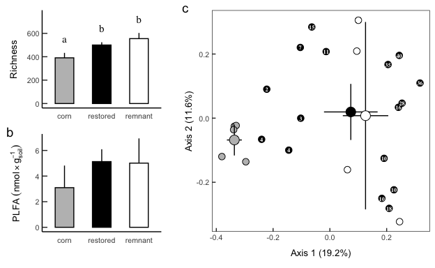
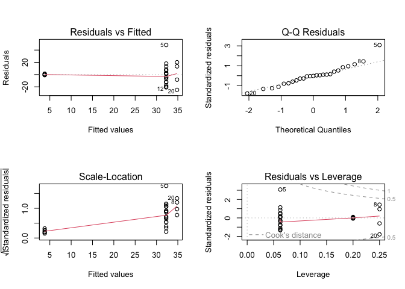
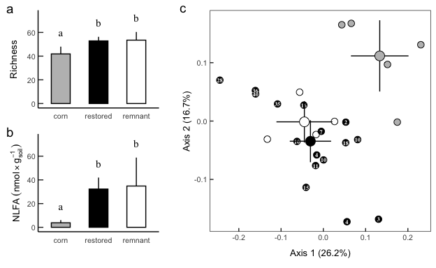

Results: Soil Fungal Communities
================
Beau Larkin

Last updated: 15 May, 2025

- [Description —](#description-)
- [Packages and libraries](#packages-and-libraries)
  - [Root path function](#root-path-function)
- [Data](#data)
  - [Site metadata and design](#site-metadata-and-design)
  - [Sites-species tables](#sites-species-tables)
  - [Microbial species metadata](#microbial-species-metadata)
  - [Fatty Acids: Biomass](#fatty-acids-biomass)
- [Functions](#functions)
  - [Alpha diversity calculations](#alpha-diversity-calculations)
  - [Confidence intervals](#confidence-intervals)
  - [Multivariate analysis](#multivariate-analysis)
  - [Multivariate analysis](#multivariate-analysis-1)
- [Whole Soil Fungi](#whole-soil-fungi)
  - [Diversity Indices](#diversity-indices)
  - [PLFA](#plfa)
  - [Beta Diversity](#beta-diversity)
  - [Unified figure](#unified-figure)
- [Arbuscular mycorrhizal fungi](#arbuscular-mycorrhizal-fungi)
  - [Diversity Indices](#diversity-indices-1)
  - [NLFA](#nlfa)
  - [Beta Diversity](#beta-diversity-1)
  - [Unified figure](#unified-figure-1)

# Description —

**Scope** – Biomass (PLFA/NLFA), OTU richness and diversity, and
β‑diversity of soil fungi across corn, restored, and remnant prairie
fields.

**Alpha diversity** – 97 %-OTUs (ITS & 18S); site means are replicates;
Gaussian GLM with log‑link and √‑depth covariate per [Bálint
2015](https://onlinelibrary.wiley.com/doi/abs/10.1111/mec.13018);
pairwise LSMs via *emmeans*.

**Beta diversity** – Workflow after [Song
2015](https://doi.org/10.1371/journal.pone.0127234):  
1 PCoA of Bray (ITS) or UNIFRAC (18S) distances,  
2 homogeneity test → PERMANOVA (+ pairwise),  
3 post‑hoc *envfit* of restoration age.  
Cartesian inter‑site distance enters models as a covariate [Redondo
2020](https://doi.org/10.1093/femsec/fiaa082).

# Packages and libraries

``` r
# Libraries ———————— ####
```

``` r
packages_needed <- c(
  "colorspace", "emmeans", "gridExtra", "knitr", "tidyverse", "vegan",
  "rprojroot", "phyloseq", "ape", "phangorn", "geosphere", "conflicted",
  "ggpubr", "patchwork", "car", "performance", "broom", "boot"
)

to_install <- setdiff(packages_needed, rownames(installed.packages()))
if (length(to_install)) install.packages(to_install)
invisible(lapply(packages_needed, library, character.only = TRUE))
```

## Root path function

``` r
root_path <- function(...) rprojroot::find_rstudio_root_file(...)
```

``` r
conflict_prefer("filter", "dplyr")
conflict_prefer("select", "dplyr")
conflict_prefer("diversity", "vegan")
```

``` r
source(root_path("resources", "styles.R"))
```

# Data

``` r
# Data ———————— ####
```

## Site metadata and design

``` r
sites <- read_csv(paste0(getwd(), "/clean_data/sites.csv"), show_col_types = FALSE) %>% 
  mutate(field_type = factor(field_type, levels = c("corn", "restored", "remnant")))
```

### Wrangle site metadata

Intersite geographic distance will be used as a covariate in clustering.
Raw coordinates in data file aren’t distances; convert to distance
matrix and summarize with PCoA

``` r
field_dist <- as.dist(distm(sites[, c("long", "lat")], fun = distHaversine))
field_dist_pcoa <- pcoa(field_dist)
field_dist_pcoa$values[c(1,2), c(1,2)] %>% 
    kable(format = "pandoc")
```

|  Eigenvalues | Relative_eig |
|-------------:|-------------:|
| 146898426293 |    0.9053961 |
|  15349390146 |    0.0946047 |

First axis of geographic distance PCoA explains 91% of the variation
among sites.

``` r
sites$dist_axis_1 = field_dist_pcoa$vectors[, 1]
```

## Sites-species tables

List *spe* holds average sequence abundances for the top 6 samples per
field. CSV files were produced in `process_data.R`

``` r
spe <- list(
    its_avg   = read_csv(root_path("clean_data/spe_ITS_avg.csv"), show_col_types = FALSE),
    amf_avg   = read_csv(root_path("clean_data/spe_18S_avg.csv"), show_col_types = FALSE),
    amf_avg_uni = read_delim(root_path("otu_tables/18S/18S_avg_4unifrac.tsv"), show_col_types = FALSE)
)
```

## Microbial species metadata

``` r
spe_meta <- list(
    its = read_csv(root_path("clean_data/spe_ITS_metadata.csv"), show_col_types = FALSE),
    amf = read_csv(root_path("clean_data/spe_18S_metadata.csv"), show_col_types = FALSE)
) %>% 
  map(. %>% mutate(across(everything(), ~ replace_na(., "unidentified"))))
```

### Phyloseq databases

Sequence abundance data aren’t standardized here; they will be after the
data are subsetted by guilds or taxonomic ranks. \#### Whole soil fungi

``` r
its_ps <- phyloseq(
    otu_table(data.frame(spe$its_avg, row.names = 1), taxa_are_rows = FALSE),
    sample_data(sites %>% column_to_rownames(var = "field_name")),
    tax_table(data.frame(spe_meta$its, row.names = 1) %>% as.matrix())
)
```

#### AMF

``` r
amf_avg_ps <- phyloseq(
    otu_table(data.frame(spe$amf_avg_uni, row.names = 1) %>% 
                decostand(method = "total", MARGIN = 2),
              taxa_are_rows = TRUE),
    read.dna(root_path("otu_tables/18S/18S_sequences.fasta"), format = "fasta") %>%
        phyDat(type = "DNA") %>% dist.hamming() %>% NJ(),
    sample_data(sites %>% column_to_rownames(var = "field_name"))
)
```

## Fatty Acids: Biomass

Use only 18.2 for soil fungi

``` r
fa <- read_csv(file.path(getwd(), "clean_data/plfa.csv"), show_col_types = FALSE) %>% 
    rename(fungi_18.2 = fa_18.2) %>% 
    select(field_name, fungi_18.2, amf) %>%
    left_join(
        sites %>% select(field_name, field_type),
        by = join_by(field_name)
    )
```

# Functions

``` r
# Functions ———————— ####
```

## Alpha diversity calculations

Returns a dataframe of alpha diversity (richness, Shannon’s) for
analysis and plotting.

``` r
calc_div <- function(spe) {
    div_data <- 
        spe %>% 
        rowwise() %>% 
        mutate(
            depth = sum(c_across(starts_with("otu"))),
            richness = sum(c_across(starts_with("otu")) > 0),
            shannon = exp(diversity(c_across(starts_with("otu"))))
        ) %>% 
        select(-starts_with("otu")) %>% 
        as_tibble() %>% 
        left_join(sites %>% select(field_type, field_name), by = join_by(field_name)) %>% 
        mutate(across(starts_with("field"), ~ factor(.x, ordered = FALSE)))
    
    return(div_data)
    
}
```

## Confidence intervals

Calculate upper and lower confidence intervals with alpha=0.05

``` r
ci_u <- function(x) {(sd(x) / sqrt(length(x))) * qnorm(0.975)}
ci_l <- function(x) {(sd(x) / sqrt(length(x))) * qnorm(0.025)}
```

## Multivariate analysis

## Multivariate analysis

Ordination → dispersion check → global & pairwise PERMANOVA → envfit.
Args: *d* dist, *env* metadata, *corr* PCoA correction, *nperm*
permutations.

``` r
mva <- function(d, env=sites, corr="none", nperm=1999) {
    # Ordination
    p <- pcoa(d, correction = corr)
    p_vals <- data.frame(p$values) %>% 
        rownames_to_column(var = "Dim") %>% 
        mutate(Dim = as.integer(Dim))
    p_eig <- p_vals[1:2, grep("Rel", colnames(p_vals))] %>% round(., 3) * 100
    p_vec <- data.frame(p$vectors)
    p_sco <-
        p_vec[, 1:2] %>%
        rownames_to_column(var = "field_name") %>%
        left_join(env, by = join_by(field_name))
    p_fit <- envfit(
        p_vec ~ yr_since, 
        data.frame(env, row.names = 1), 
        choices = c(1,2),
        na.rm = TRUE,
        permutations = nperm)
    p_fit_sco <- scores(p_fit, display = "bp")
    # Test multivariate dispersions
    disper <- betadisper(d, env$field_type, bias.adjust = TRUE)
    mvdisper <- permutest(disper, pairwise = TRUE, permutations = nperm)
    # Global PERMANOVA
    gl_permtest <- adonis2(
        d ~ dist_axis_1 + field_type,
        data = env,
        permutations = nperm,
        by = "terms")
    # Pairwise PERMANOVA
    group_var <- as.character(env$field_type)
    groups <- as.data.frame(t(combn(unique(group_var), m = 2)))
    contrasts <- data.frame(
        group1 = groups$V1,
        group2 = groups$V2,
        R2 = NA,
        F_value = NA,
        df1 = NA,
        df2 = NA,
        p_value = NA
    )
    for (i in seq(nrow(contrasts))) {
        group_subset <-
            group_var == contrasts$group1[i] |
            group_var == contrasts$group2[i]
        # Contrast matrices for Unifrac and Bray distance aren't compatible
        contrast_matrix <- as.matrix(d)[group_subset, group_subset]
        fit <- adonis2(
            contrast_matrix ~ env$dist_axis_1[group_subset] + group_var[group_subset],
            permutations = nperm,
            by = "terms")
        # Prepare contrasts table
        contrasts$R2[i] <- round(fit[grep("group_var", rownames(fit)), "R2"], digits = 3)
        contrasts$F_value[i] <- round(fit[grep("group_var", rownames(fit)), "F"], digits = 3)
        contrasts$df1[i] <- fit[grep("group_var", rownames(fit)), "Df"]
        contrasts$df2[i] <- fit[grep("Residual", rownames(fit)), "Df"]
        contrasts$p_value[i] <- fit[grep("group_var", rownames(fit)), 5]
    }
    contrasts$p_value_adj <- p.adjust(contrasts$p_value, method = "fdr") %>% round(., 4)
    
    # Results
    out <- list(
        correction_note    = p$note,
        ordination_values  = p_vals[1:10, ],
        axis_pct           = p_eig,
        ordination_scores  = p_sco,
        dispersion_test    = mvdisper,
        permanova          = gl_permtest,
        pairwise_contrasts = contrasts,
        vector_fit_result  = p_fit,
        vector_fit_scores  = p_fit_sco
    )
    
    return(out)
    
}
```

# Whole Soil Fungi

``` r
# Whole soil fungi ———————— ####
```

## Diversity Indices

``` r
its_div <- calc_div(spe$its_avg)
```

### Richness

Account for sequencing depth as a covariate

``` r
its_rich_lm <- lm(richness ~ sqrt(depth) + field_type, data = its_div)
```

Diagnostics

``` r
par(mfrow = c(2,2))
plot(its_rich_lm) # variance similar in groups
```

<!-- -->

``` r
performance::check_distribution(its_rich_lm) 
```

    ## # Distribution of Model Family
    ## 
    ## Predicted Distribution of Residuals
    ## 
    ##  Distribution Probability
    ##        cauchy         66%
    ##        normal         16%
    ##     lognormal          6%
    ## 
    ## Predicted Distribution of Response
    ## 
    ##                Distribution Probability
    ##                   lognormal         38%
    ##  neg. binomial (zero-infl.)         31%
    ##               beta-binomial         12%

residuals distribution normal or close, response log

``` r
leveneTest(richness ~ field_type, data = its_div)
```

    ## Levene's Test for Homogeneity of Variance (center = median)
    ##       Df F value Pr(>F)
    ## group  2   0.491 0.6186
    ##       22

``` r
leveneTest(residuals(its_rich_lm) ~ its_div$field_type)
```

    ## Levene's Test for Homogeneity of Variance (center = median)
    ##       Df F value Pr(>F)
    ## group  2  0.0882 0.9159
    ##       22

Residuals/response distributions do not suggest the need for
transformation. Levene’s p \> 0.05 → fail to reject = variances can be
considered equal. Model results, group means, and post-hoc

``` r
summary(its_rich_lm)
```

    ## 
    ## Call:
    ## lm(formula = richness ~ sqrt(depth) + field_type, data = its_div)
    ## 
    ## Residuals:
    ##     Min      1Q  Median      3Q     Max 
    ## -78.214 -31.058   2.703  37.756  59.136 
    ## 
    ## Coefficients:
    ##                    Estimate Std. Error t value Pr(>|t|)    
    ## (Intercept)        -142.687    195.509  -0.730 0.473561    
    ## sqrt(depth)           5.897      2.141   2.755 0.011868 *  
    ## field_typerestored  109.687     23.314   4.705 0.000121 ***
    ## field_typeremnant   164.161     31.136   5.272 3.16e-05 ***
    ## ---
    ## Signif. codes:  0 '***' 0.001 '**' 0.01 '*' 0.05 '.' 0.1 ' ' 1
    ## 
    ## Residual standard error: 45.5 on 21 degrees of freedom
    ## Multiple R-squared:  0.633,  Adjusted R-squared:  0.5806 
    ## F-statistic: 12.08 on 3 and 21 DF,  p-value: 8.275e-05

Sequence depth is significant, less so than field type. Check
relationship of depth and field type.

``` r
its_div %>% 
    group_by(field_type) %>% 
    summarize(across(c(depth, richness), ~ round(mean(.x), 0))) %>% 
    kable(format = "pandoc")
```

| field_type | depth | richness |
|:-----------|------:|---------:|
| corn       |  8257 |      393 |
| restored   |  8266 |      502 |
| remnant    |  7750 |      540 |

Sequence depth isn’t obviously related to field type. Proceed with means
separation by obtaining estimated marginal means for field type.
Arithmetic means calculated in this case.

``` r
its_rich_em <- emmeans(its_rich_lm, ~ field_type, type = "response")
```

Results tables below show the emmeans summary of group means and
confidence intervals, with sequencing depth as a covariate, and the post
hoc contrast of richness among field types.

| field_type |   emmean |       SE |  df | lower.CL | upper.CL |
|:-----------|---------:|---------:|----:|---------:|---------:|
| corn       | 390.7190 | 20.36691 |  21 | 348.3637 | 433.0743 |
| restored   | 500.4064 | 11.39846 |  21 | 476.7020 | 524.1108 |
| remnant    | 554.8798 | 23.36359 |  21 | 506.2926 | 603.4670 |

Confidence level used: 0.95

| contrast           |   estimate |       SE |  df |   t.ratio |   p.value |
|:-------------------|-----------:|---------:|----:|----------:|----------:|
| corn - restored    | -109.68738 | 23.31421 |  21 | -4.704743 | 0.0003415 |
| corn - remnant     | -164.16080 | 31.13618 |  21 | -5.272348 | 0.0000903 |
| restored - remnant |  -54.47342 | 26.14137 |  21 | -2.083801 | 0.1174883 |

P value adjustment: tukey method for comparing a family of 3 estimates

OTU richness in cornfields is significantly less than in restored or
remnant fields (p\<0.001), which don’t differ.

``` r
its_rich_fig <- 
  ggplot(summary(its_rich_em), aes(x = field_type, y = emmean)) +
  geom_col(aes(fill = field_type), color = "black", width = 0.5, linewidth = lw) +
  geom_errorbar(aes(ymin = emmean, ymax = upper.CL), width = 0, linewidth = lw) +
  geom_text(aes(y = upper.CL, label = c("a", "b", "b")), vjust = -1.5, family = "serif", size = 4) +
  labs(x = NULL, y = "Richness") +
  lims(y = c(0, 760)) +
  scale_fill_manual(values = c("gray", "black", "white")) +
  theme_cor +
  theme(legend.position = "none",
        plot.tag = element_text(size = 14, face = 1),
        plot.tag.position = c(2, 0.98))
```

### Shannon’s diversity

Account for sequencing depth as a covariate

``` r
its_shan_lm <- lm(shannon ~ sqrt(depth) + field_type, data = its_div)
```

Diagnostics

``` r
par(mfrow = c(2,2))
plot(its_shan_lm) # variance similar in groups 
```

<!-- -->

``` r
performance::check_distribution(its_shan_lm) 
```

    ## # Distribution of Model Family
    ## 
    ## Predicted Distribution of Residuals
    ## 
    ##  Distribution Probability
    ##        cauchy         56%
    ##        normal         44%
    ## 
    ## Predicted Distribution of Response
    ## 
    ##  Distribution Probability
    ##         gamma         31%
    ##     lognormal         31%
    ##           chi         16%

residuals distribution most likely cauchy/normal; symmetric but long
tails residuals distribution normal or close, response gamma

``` r
leveneTest(shannon ~ field_type, data = its_div)
```

    ## Levene's Test for Homogeneity of Variance (center = median)
    ##       Df F value  Pr(>F)  
    ## group  2  2.7424 0.08642 .
    ##       22                  
    ## ---
    ## Signif. codes:  0 '***' 0.001 '**' 0.01 '*' 0.05 '.' 0.1 ' ' 1

``` r
leveneTest(residuals(its_shan_lm) ~ its_div$field_type)
```

    ## Levene's Test for Homogeneity of Variance (center = median)
    ##       Df F value Pr(>F)
    ## group  2   2.266 0.1274
    ##       22

Residuals distribution does not suggest the need for transformation.
Levene’s p \> 0.05 → fail to reject = variances can be considered equal.
Residuals distribution does not suggest the need for transformation.
Response more suspicious. Examine CV in groups to assess changes in
variance.

``` r
augment(its_shan_lm) %>%
  mutate(field_type = factor(field_type, levels = c("corn", "restored", "remnant"))) %>% 
  group_by(field_type) %>%
  summarise(
    mean_fitted = mean(.fitted),
    sd_resid    = sd(.resid),
    cv_resid    = sd_resid / mean_fitted
  ) %>% 
  mutate(across(where(is.numeric), ~ round(.x, 2))) %>% 
  kable(format = "pandoc", caption = "CV of residuals and fitted means in groups")
```

| field_type | mean_fitted | sd_resid | cv_resid |
|:-----------|------------:|---------:|---------:|
| corn       |       79.92 |    15.20 |     0.19 |
| restored   |      111.36 |    21.39 |     0.19 |
| remnant    |      120.89 |     7.76 |     0.06 |

CV of residuals and fitted means in groups

CV constant to declining. Relatively low p value likely due to unequal
variance in restored and remnant despite similar means. Model results,
group means, and post-hoc

``` r
summary(its_shan_lm)
```

    ## 
    ## Call:
    ## lm(formula = shannon ~ sqrt(depth) + field_type, data = its_div)
    ## 
    ## Residuals:
    ##     Min      1Q  Median      3Q     Max 
    ## -34.587 -11.045   0.081  10.383  44.408 
    ## 
    ## Coefficients:
    ##                    Estimate Std. Error t value Pr(>|t|)   
    ## (Intercept)          2.4537    83.6852   0.029  0.97689   
    ## sqrt(depth)          0.8528     0.9163   0.931  0.36258   
    ## field_typerestored  31.4846     9.9794   3.155  0.00478 **
    ## field_typeremnant   43.4207    13.3275   3.258  0.00376 **
    ## ---
    ## Signif. codes:  0 '***' 0.001 '**' 0.01 '*' 0.05 '.' 0.1 ' ' 1
    ## 
    ## Residual standard error: 19.48 on 21 degrees of freedom
    ## Multiple R-squared:  0.3888, Adjusted R-squared:  0.3015 
    ## F-statistic: 4.453 on 3 and 21 DF,  p-value: 0.0143

Sequence depth is not a significant predictor of Shannon diversity
Proceed with means separation by obtaining estimated marginal means for
field type. Arithmetic means calculated in this case.

``` r
its_shan_em <- emmeans(its_shan_lm, ~ field_type, type = "response")
```

Results tables below show the emmeans summary of group means and
confidence intervals, with sequencing depth as a covariate, and the post
hoc contrast of richness among field types.

| field_type |    emmean |        SE |  df |  lower.CL |  upper.CL |
|:-----------|----------:|----------:|----:|----------:|----------:|
| corn       |  79.58797 |  8.717825 |  21 |  61.45826 |  97.71768 |
| restored   | 111.07255 |  4.878981 |  21 | 100.92616 | 121.21895 |
| remnant    | 123.00864 | 10.000519 |  21 | 102.21142 | 143.80586 |

Confidence level used: 0.95

| contrast           |  estimate |        SE |  df |   t.ratio |   p.value |
|:-------------------|----------:|----------:|----:|----------:|----------:|
| corn - restored    | -31.48458 |  9.979385 |  21 | -3.154962 | 0.0127116 |
| corn - remnant     | -43.42067 | 13.327491 |  21 | -3.257978 | 0.0100752 |
| restored - remnant | -11.93609 | 11.189520 |  21 | -1.066720 | 0.5445052 |

P value adjustment: tukey method for comparing a family of 3 estimates

Shannon’s diversity in cornfields is significantly less than in restored
or remnant fields, which don’t differ.

``` r
its_shan_fig <- 
  ggplot(summary(its_shan_em), aes(x = field_type, y = emmean)) +
  geom_col(aes(fill = field_type), color = "black", width = 0.5, linewidth = lw) +
  geom_errorbar(aes(ymin = emmean, ymax = upper.CL), width = 0, linewidth = lw) +
  geom_text(aes(y = upper.CL, label = c("a", "b", "b")), vjust = -1.5, family = "serif", size = 4) +
  labs(x = NULL, y = "Shannon diversity") +
  lims(y = c(0, 160)) +
  scale_fill_manual(values = c("gray", "black", "white")) +
  theme_cor +
  theme(legend.position = "none",
        plot.tag = element_text(size = 14, face = 1, hjust = 0),
        plot.tag.position = c(0, 1))
```

## PLFA

``` r
plfa_lm <- lm(fungi_18.2 ~ field_type, data = fa)
par(mfrow = c(2,2))
plot(plfa_lm) # variance differs slightly in groups. Tails on qq plot diverge, lots of groups structure
```

<!-- -->

``` r
performance::check_distribution(plfa_lm) 
```

    ## # Distribution of Model Family
    ## 
    ## Predicted Distribution of Residuals
    ## 
    ##  Distribution Probability
    ##        normal         62%
    ##        cauchy         12%
    ##         gamma          9%
    ## 
    ## Predicted Distribution of Response
    ## 
    ##   Distribution Probability
    ##        weibull         22%
    ##         normal         19%
    ##  beta-binomial         12%

Residuals distribution fits normal, response normal-ish

``` r
leveneTest(residuals(plfa_lm) ~ fa$field_type) # No covariate, response and residuals tests equivalent
```

    ## Levene's Test for Homogeneity of Variance (center = median)
    ##       Df F value Pr(>F)
    ## group  2   0.975 0.3929
    ##       22

Residuals distribution does not suggest the need for transformation.
Levene’s p \> 0.05 → fail to reject = variances can be considered equal.
Model results, group means, and post-hoc, with arithmetic means from
emmeans

``` r
summary(plfa_lm)
```

    ## 
    ## Call:
    ## lm(formula = fungi_18.2 ~ field_type, data = fa)
    ## 
    ## Residuals:
    ##     Min      1Q  Median      3Q     Max 
    ## -2.3873 -1.6030  0.0933  1.4457  3.6109 
    ## 
    ## Coefficients:
    ##                    Estimate Std. Error t value Pr(>|t|)   
    ## (Intercept)          3.0947     0.8323   3.718   0.0012 **
    ## field_typerestored   2.0351     0.9536   2.134   0.0442 * 
    ## field_typeremnant    1.9170     1.2485   1.535   0.1389   
    ## ---
    ## Signif. codes:  0 '***' 0.001 '**' 0.01 '*' 0.05 '.' 0.1 ' ' 1
    ## 
    ## Residual standard error: 1.861 on 22 degrees of freedom
    ## Multiple R-squared:  0.1756, Adjusted R-squared:  0.1006 
    ## F-statistic: 2.343 on 2 and 22 DF,  p-value: 0.1196

``` r
plfa_em <- emmeans(plfa_lm, ~ field_type, type = "response")
```

| field_type |   emmean |        SE |  df | lower.CL | upper.CL |
|:-----------|---------:|----------:|----:|---------:|---------:|
| corn       | 3.094661 | 0.8323383 |  22 | 1.368497 | 4.820825 |
| restored   | 5.129779 | 0.4652913 |  22 | 4.164824 | 6.094734 |
| remnant    | 5.011704 | 0.9305825 |  22 | 3.081794 | 6.941614 |

Confidence level used: 0.95

| contrast           |   estimate |        SE |  df |    t.ratio |   p.value |
|:-------------------|-----------:|----------:|----:|-----------:|----------:|
| corn - restored    | -2.0351183 | 0.9535633 |  22 | -2.1342246 | 0.1058898 |
| corn - remnant     | -1.9170436 | 1.2485075 |  22 | -1.5354682 | 0.2943078 |
| restored - remnant |  0.1180747 | 1.0404229 |  22 |  0.1134873 | 0.9929269 |

P value adjustment: tukey method for comparing a family of 3 estimates

``` r
plfa_fig <- 
  ggplot(summary(plfa_em), aes(x = field_type, y = emmean)) +
  geom_col(aes(fill = field_type), color = "black", width = 0.5, linewidth = lw) +
  geom_errorbar(aes(ymin = emmean, ymax = upper.CL), width = 0, linewidth = lw) +
  labs(x = NULL, y = expression(PLFA~(nmol%*%g[soil]^-1))) +
  scale_fill_manual(values = c("gray", "black", "white")) +
  theme_cor +
  theme(legend.position = "none",
        plot.tag = element_text(size = 14, face = 1),
        plot.tag.position = c(0, 1.02))
```

## Beta Diversity

``` r
d_its <- spe$its_avg %>% 
    data.frame(row.names = 1) %>% 
    decostand("total") %>%
    vegdist("bray")
mva_its <- mva(d = d_its)
```

``` r
mva_its$dispersion_test
```

    ## 
    ## Permutation test for homogeneity of multivariate dispersions
    ## Permutation: free
    ## Number of permutations: 1999
    ## 
    ## Response: Distances
    ##           Df   Sum Sq   Mean Sq      F N.Perm Pr(>F)  
    ## Groups     2 0.018698 0.0093489 3.2104   1999 0.0575 .
    ## Residuals 22 0.064065 0.0029121                       
    ## ---
    ## Signif. codes:  0 '***' 0.001 '**' 0.01 '*' 0.05 '.' 0.1 ' ' 1
    ## 
    ## Pairwise comparisons:
    ## (Observed p-value below diagonal, permuted p-value above diagonal)
    ##              corn restored remnant
    ## corn              0.063000   0.128
    ## restored 0.068726            0.137
    ## remnant  0.126039 0.135570

``` r
mva_its$permanova
```

    ## Permutation test for adonis under reduced model
    ## Terms added sequentially (first to last)
    ## Permutation: free
    ## Number of permutations: 1999
    ## 
    ## adonis2(formula = d ~ dist_axis_1 + field_type, data = env, permutations = nperm, by = "terms")
    ##             Df SumOfSqs      R2      F Pr(>F)    
    ## dist_axis_1  1   0.4225 0.06253 1.7391 0.0210 *  
    ## field_type   2   1.2321 0.18236 2.5358 0.0005 ***
    ## Residual    21   5.1017 0.75510                  
    ## Total       24   6.7563 1.00000                  
    ## ---
    ## Signif. codes:  0 '***' 0.001 '**' 0.01 '*' 0.05 '.' 0.1 ' ' 1

``` r
mva_its$pairwise_contrasts[c(1,3,2), c(1,2,4,3,8)] %>% 
    kable(format = "pandoc", caption = "Pairwise permanova contrasts")
```

|     | group1   | group2  | F_value |    R2 | p_value_adj |
|-----|:---------|:--------|--------:|------:|------------:|
| 1   | restored | corn    |   3.913 | 0.164 |      0.0015 |
| 3   | corn     | remnant |   2.858 | 0.281 |      0.0030 |
| 2   | restored | remnant |   1.062 | 0.054 |      0.3420 |

Pairwise permanova contrasts

No eignevalue correction was needed. Two relative eigenvalues exceeded
broken stick model. Based on the homogeneity of variance test, the null
hypothesis of equal variance among groups is accepted across all
clusters and in pairwise comparison of clusters (both p\>0.05),
supporting the application of a PERMANOVA test.

Clustering revealed that community variation was related to geographic
distance, the covariate in the model. With geographic distance accounted
for, the test variable ‘field type’ significantly explained variation in
fungal communities, with a post-hoc test revealing that communities in
corn fields differed from communities in restored and remnant fields.

Plotting results:

``` r
its_ord_data <- mva_its$ordination_scores %>% mutate(field_type = factor(field_type, levels = c("corn", "restored", "remnant")))
p_its_centers <- its_ord_data %>% 
    group_by(field_type) %>% 
    summarize(across(starts_with("Axis"), list(mean = mean, ci_l = ci_l, ci_u = ci_u), .names = "{.fn}_{.col}"), .groups = "drop") %>% 
    mutate(across(c(ci_l_Axis.1, ci_u_Axis.1), ~ mean_Axis.1 + .x),
           across(c(ci_l_Axis.2, ci_u_Axis.2), ~ mean_Axis.2 + .x))
its_ord <- 
    ggplot(its_ord_data, aes(x = Axis.1, y = Axis.2)) +
    geom_point(aes(fill = field_type), size = sm_size, stroke = lw, shape = 21) +
    geom_text(aes(label = yr_since), size = yrtx_size, family = "serif", fontface = 2, color = "white") +
    geom_linerange(data = p_its_centers, aes(x = mean_Axis.1, y = mean_Axis.2, xmin = ci_l_Axis.1, xmax = ci_u_Axis.1), linewidth = lw) +
    geom_linerange(data = p_its_centers, aes(x = mean_Axis.1, y = mean_Axis.2, ymin = ci_l_Axis.2, ymax = ci_u_Axis.2), linewidth = lw) +
    geom_point(data = p_its_centers, aes(x = mean_Axis.1, y = mean_Axis.2, fill = field_type), size = lg_size, stroke = lw, shape = 21) +
    scale_fill_manual(values = c("gray", "black", "white")) +
    labs(
        x = paste0("Axis 1 (", mva_its$axis_pct[1], "%)"),
        y = paste0("Axis 2 (", mva_its$axis_pct[2], "%)")) +
    theme_ord +
    theme(legend.position = "none",
          plot.tag = element_text(size = 14, face = 1),
          plot.tag.position = c(0, 1.01))
    # guides(fill = guide_legend(position = "inside")) +
    # theme(legend.justification = c(0.03, 0.98))
```

## Unified figure

``` r
fig2_ls <- (its_rich_fig / plot_spacer() / plfa_fig) +
    plot_layout(heights = c(1,0.01,1)) 
fig2 <- (fig2_ls | plot_spacer() | its_ord) +
    plot_layout(widths = c(0.35, 0.01, 0.64)) +
    plot_annotation(tag_levels = 'a') 
```

``` r
fig2
```

<!-- -->

**Fig 2.** Whole-soil fungal communities in **corn**, **restored**, and
**remnant** prairie fields. **a** OTU richness and **b** fungal biomass
(PLFA) are shown as columns with 95 % CIs; lowercase letters mark
significant pairwise differences (P \< 0.001). **c**
Principal-coordinate (PCoA) ordination of ITS-based (97 % OTU) community
distances: small points = sites, large circles = field-type centroids
(error bars = 95 % CI). Cornfields cluster apart from restored or
remnant prairies (P \< 0.01). Numbers in black circles give years since
restoration. Axis labels show the percent variation explained.
Colours/shading: corn = grey, restored = black, remnant = white.

# Arbuscular mycorrhizal fungi

``` r
# AMF ———————— ####
```

## Diversity Indices

``` r
amf_div <- calc_div(spe$amf_avg)
```

### Richness

``` r
amf_rich_lm <- lm(richness ~ sqrt(depth) + field_type, data = amf_div)
```

Diagnostics

``` r
par(mfrow = c(2,2))
plot(amf_rich_lm) # variance similar in groups with an outlier
```

<!-- -->

``` r
performance::check_distribution(amf_rich_lm) 
```

    ## # Distribution of Model Family
    ## 
    ## Predicted Distribution of Residuals
    ## 
    ##  Distribution Probability
    ##        normal         41%
    ##        cauchy         34%
    ##           chi         19%
    ## 
    ## Predicted Distribution of Response
    ## 
    ##                Distribution Probability
    ##               beta-binomial         47%
    ##  neg. binomial (zero-infl.)         25%
    ##                      normal          9%

Residuals distribution most likely normal, response bimodal (ignore)

``` r
leveneTest(richness ~ field_type, data = amf_div)
```

    ## Levene's Test for Homogeneity of Variance (center = median)
    ##       Df F value Pr(>F)
    ## group  2   0.705 0.5049
    ##       22

``` r
leveneTest(residuals(amf_rich_lm) ~ amf_div$field_type)
```

    ## Levene's Test for Homogeneity of Variance (center = median)
    ##       Df F value Pr(>F)
    ## group  2  0.6933 0.5105
    ##       22

Residuals/response distributions do not suggest the need for
transformation. Levene’s p \> 0.05 → fail to reject = variances can be
considered equal. Model results, group means, and post-hoc

``` r
summary(amf_rich_lm)
```

    ## 
    ## Call:
    ## lm(formula = richness ~ sqrt(depth) + field_type, data = amf_div)
    ## 
    ## Residuals:
    ##     Min      1Q  Median      3Q     Max 
    ## -9.5555 -3.7311 -0.8008  3.6281 17.7242 
    ## 
    ## Coefficients:
    ##                    Estimate Std. Error t value Pr(>|t|)   
    ## (Intercept)         34.6381    12.8381   2.698  0.01347 * 
    ## sqrt(depth)          0.1196     0.2086   0.573  0.57260   
    ## field_typerestored  10.9814     3.3822   3.247  0.00386 **
    ## field_typeremnant   11.6106     4.4321   2.620  0.01601 * 
    ## ---
    ## Signif. codes:  0 '***' 0.001 '**' 0.01 '*' 0.05 '.' 0.1 ' ' 1
    ## 
    ## Residual standard error: 6.594 on 21 degrees of freedom
    ## Multiple R-squared:  0.3593, Adjusted R-squared:  0.2678 
    ## F-statistic: 3.926 on 3 and 21 DF,  p-value: 0.02271

Sequencing depth not a significant predictor of amf richness

``` r
amf_rich_em <- emmeans(amf_rich_lm, ~ field_type, type = "response")
```

Results tables below show the emmeans summary of group arithmetic means
and confidence intervals, and the post hoc contrast of richness among
field types.

| field_type |   emmean |       SE |  df | lower.CL | upper.CL |
|:-----------|---------:|---------:|----:|---------:|---------:|
| corn       | 41.87438 | 2.951648 |  21 | 35.73609 | 48.01267 |
| restored   | 52.85581 | 1.648766 |  21 | 49.42701 | 56.28460 |
| remnant    | 53.48495 | 3.322235 |  21 | 46.57598 | 60.39391 |

Confidence level used: 0.95

| contrast           |    estimate |       SE |  df |    t.ratio |   p.value |
|:-------------------|------------:|---------:|----:|-----------:|----------:|
| corn - restored    | -10.9814262 | 3.382210 |  21 | -3.2468195 | 0.0103332 |
| corn - remnant     | -11.6105667 | 4.432053 |  21 | -2.6196815 | 0.0407168 |
| restored - remnant |  -0.6291405 | 3.712563 |  21 | -0.1694626 | 0.9843046 |

P value adjustment: tukey method for comparing a family of 3 estimates

OTU richness in cornfields is significantly less than in restored or
remnant fields, which don’t differ. Plot the results

``` r
amf_rich_fig <- 
  ggplot(summary(amf_rich_em), aes(x = field_type, y = emmean)) +
  geom_col(aes(fill = field_type), color = "black", width = 0.5, linewidth = lw) +
  geom_errorbar(aes(ymin = emmean, ymax = upper.CL), width = 0, linewidth = lw) +
  geom_text(aes(y = upper.CL, label = c("a", "b", "b")), vjust = -1.5, family = "serif", size = 4) +
  labs(x = NULL, y = "Richness") +
  lims(y = c(0, 75)) +
  scale_fill_manual(values = c("gray", "black", "white")) +
  theme_cor +
  theme(legend.position = "none",
        plot.tag = element_text(size = 14, face = 1),
        plot.tag.position = c(0, 1.02))
```

### Shannon diversity

``` r
amf_shan_lm <- lm(shannon ~ sqrt(depth) + field_type, data = amf_div)
```

Diagnostics

``` r
par(mfrow = c(2,2))
plot(amf_shan_lm) 
```

<!-- -->

Variance somewhat non-constant in groups, qqplot fit is poor, one
leverage point (Cook’s \> 0.5)

``` r
performance::check_distribution(amf_shan_lm) 
```

    ## # Distribution of Model Family
    ## 
    ## Predicted Distribution of Residuals
    ## 
    ##  Distribution Probability
    ##        normal         69%
    ##        cauchy         19%
    ##           chi          3%
    ## 
    ## Predicted Distribution of Response
    ## 
    ##  Distribution Probability
    ##        normal         25%
    ##       uniform         16%
    ##        pareto         12%

Residuals/response distributions most likely normal.

``` r
leveneTest(shannon ~ field_type, data = amf_div)
```

    ## Levene's Test for Homogeneity of Variance (center = median)
    ##       Df F value Pr(>F)
    ## group  2  0.2897 0.7513
    ##       22

``` r
leveneTest(residuals(amf_shan_lm) ~ amf_div$field_type)
```

    ## Levene's Test for Homogeneity of Variance (center = median)
    ##       Df F value Pr(>F)
    ## group  2  0.3023 0.7422
    ##       22

Residuals/response distributions do not suggest the need for
transformation. Covariate adds little added explanatory value. Levene’s
p \> 0.05 → fail to reject = variances can be considered equal. Model
results, group means, and post-hoc

``` r
summary(amf_shan_lm)
```

    ## 
    ## Call:
    ## lm(formula = shannon ~ sqrt(depth) + field_type, data = amf_div)
    ## 
    ## Residuals:
    ##     Min      1Q  Median      3Q     Max 
    ## -6.6186 -1.4410  0.5701  1.3624  6.5064 
    ## 
    ## Coefficients:
    ##                    Estimate Std. Error t value Pr(>|t|)    
    ## (Intercept)        15.38884    6.07433   2.533 0.019328 *  
    ## sqrt(depth)        -0.01111    0.09871  -0.113 0.911484    
    ## field_typerestored  6.80431    1.60029   4.252 0.000356 ***
    ## field_typeremnant  10.12638    2.09703   4.829 8.99e-05 ***
    ## ---
    ## Signif. codes:  0 '***' 0.001 '**' 0.01 '*' 0.05 '.' 0.1 ' ' 1
    ## 
    ## Residual standard error: 3.12 on 21 degrees of freedom
    ## Multiple R-squared:  0.5588, Adjusted R-squared:  0.4957 
    ## F-statistic: 8.864 on 3 and 21 DF,  p-value: 0.0005433

Sequencing depth not a significant predictor of Shannon diversity.
Produce arithmetic means in groups and post hoc contrasts

``` r
amf_shan_em <- emmeans(amf_shan_lm, ~ field_type, type = "response")
```

Results tables below show the emmeans summary of group means and
confidence intervals, with sequencing depth as a covariate, and the post
hoc contrast of richness among field types.

| field_type |   emmean |        SE |  df | lower.CL | upper.CL |
|:-----------|---------:|----------:|----:|---------:|---------:|
| corn       | 14.71675 | 1.3965723 |  21 | 11.81242 | 17.62108 |
| restored   | 21.52106 | 0.7801138 |  21 | 19.89873 | 23.14340 |
| remnant    | 24.84314 | 1.5719154 |  21 | 21.57416 | 28.11211 |

Confidence level used: 0.95

| contrast           |   estimate |       SE |  df |   t.ratio |   p.value |
|:-------------------|-----------:|---------:|----:|----------:|----------:|
| corn - restored    |  -6.804309 | 1.600293 |  21 | -4.251915 | 0.0009952 |
| corn - remnant     | -10.126384 | 2.097026 |  21 | -4.828927 | 0.0002549 |
| restored - remnant |  -3.322075 | 1.756599 |  21 | -1.891197 | 0.1659595 |

P value adjustment: tukey method for comparing a family of 3 estimates

Shannon’s diversity in cornfields is significantly less than in restored
or remnant fields, which don’t differ.

``` r
amf_shan_fig <- 
  ggplot(summary(amf_shan_em), aes(x = field_type, y = emmean)) +
  geom_col(aes(fill = field_type), color = "black", width = 0.5, linewidth = lw) +
  geom_errorbar(aes(ymin = emmean, ymax = upper.CL), width = 0, linewidth = lw) +
  geom_text(aes(y = upper.CL, label = c("a", "b", "b")), vjust = -1.5, family = "serif", size = 4) +
  labs(x = NULL, y = NULL) +
  lims(y = c(0, 32)) +
  scale_fill_manual(values = c("gray", "black", "white")) +
  theme_cor +
  theme(legend.position = "none",
        plot.tag = element_text(size = 14, face = 1, hjust = 0),
        plot.tag.position = c(-0.05, 1))
```

### Shannon’s diversity figure

Includes both ITS and AMF for supplemental figure

``` r
FigS1 <- (its_shan_fig | plot_spacer() | amf_shan_fig) +
    plot_layout(widths = c(1, 0.01, 1)) +
    plot_annotation(tag_levels = 'a')
```

``` r
ggsave(
    root_path("figs", "figS1.png"),
    plot = FigS1,
    height = 3,
    width = 6,
    units = "in",
    dpi = 600
)
```

## NLFA

``` r
nlfa_lm <- lm(amf ~ field_type, data = fa)
```

Diagnostics

``` r
par(mfrow = c(2,2))
plot(nlfa_lm) # variance obviously not constant in groups
```

<!-- -->

``` r
performance::check_distribution(nlfa_lm) 
```

    ## # Distribution of Model Family
    ## 
    ## Predicted Distribution of Residuals
    ## 
    ##  Distribution Probability
    ##        cauchy         62%
    ##        normal         16%
    ##           chi          6%
    ## 
    ## Predicted Distribution of Response
    ## 
    ##  Distribution Probability
    ##         gamma         41%
    ##           chi         12%
    ##   half-cauchy         12%

``` r
# response distribution gamma; resids likely normal
leveneTest(residuals(nlfa_lm) ~ fa$field_type) # No covariate, response and residuals tests equivalent
```

    ## Levene's Test for Homogeneity of Variance (center = median)
    ##       Df F value  Pr(>F)  
    ## group  2  3.3372 0.05423 .
    ##       22                  
    ## ---
    ## Signif. codes:  0 '***' 0.001 '**' 0.01 '*' 0.05 '.' 0.1 ' ' 1

Residuals distribution does not suggest the need for transformation.
Levene’s p ~ 0.05 → reject the null of equal variance. Check CV in
groups.

``` r
fa %>%
  mutate(field_type = factor(field_type, levels = c("corn", "restored", "remnant"))) %>%
  group_by(field_type) %>%
  summarize(mean = mean(amf),
            cv = sd(amf) / mean) %>%
  mutate(across(mean:cv, ~ round(.x, 2))) %>%
  kable(format = "pandoc", caption = "Mean and CV relationship in groups")
```

| field_type |  mean |   cv |
|:-----------|------:|-----:|
| corn       |  3.79 | 0.26 |
| restored   | 32.27 | 0.54 |
| remnant    | 34.82 | 0.59 |

Mean and CV relationship in groups

CV increases with mean, suggesting \> proportional mean/variance
relationship. Determine best model choice of log-transformed response or
gamma glm.

``` r
nlfa_lm_log   <- lm(log(amf) ~ field_type, data = fa)
plot(nlfa_lm_log) # qqplot ok, one high leverage point in remnants
```

<!-- --><!-- --><!-- --><!-- -->

``` r
ncvTest(nlfa_lm_log) # p=0.16, null of constant variance not rejected
```

    ## Non-constant Variance Score Test 
    ## Variance formula: ~ fitted.values 
    ## Chisquare = 1.989836, Df = 1, p = 0.15836

``` r
nlfa_glm  <- glm(amf ~ field_type, family = Gamma(link = "log"), data = fa)
nlfa_glm_diag <- glm.diag(nlfa_glm)
glm.diag.plots(nlfa_glm, nlfa_glm_diag) # qqplot shows strong fit; no leverage >0.5
```

<!-- -->

``` r
performance::check_overdispersion(nlfa_glm) # not detected
```

    ## # Overdispersion test
    ## 
    ##  dispersion ratio = 1.259
    ##           p-value =  0.48

    ## No overdispersion detected.

Gamma glm is the best choice; no high-leverage point Model results,
group means, and post-hoc

``` r
summary(nlfa_glm)
```

    ## 
    ## Call:
    ## glm(formula = amf ~ field_type, family = Gamma(link = "log"), 
    ##     data = fa)
    ## 
    ## Coefficients:
    ##                    Estimate Std. Error t value Pr(>|t|)    
    ## (Intercept)          1.3323     0.2262   5.890 6.30e-06 ***
    ## field_typerestored   2.1418     0.2591   8.266 3.42e-08 ***
    ## field_typeremnant    2.2178     0.3393   6.537 1.42e-06 ***
    ## ---
    ## Signif. codes:  0 '***' 0.001 '**' 0.01 '*' 0.05 '.' 0.1 ' ' 1
    ## 
    ## (Dispersion parameter for Gamma family taken to be 0.2557978)
    ## 
    ##     Null deviance: 17.7149  on 24  degrees of freedom
    ## Residual deviance:  5.8538  on 22  degrees of freedom
    ## AIC: 190.67
    ## 
    ## Number of Fisher Scoring iterations: 5

``` r
anova(nlfa_glm) # Decline in residual deviance worth the cost in df
```

    ## Analysis of Deviance Table
    ## 
    ## Model: Gamma, link: log
    ## 
    ## Response: amf
    ## 
    ## Terms added sequentially (first to last)
    ## 
    ## 
    ##            Df Deviance Resid. Df Resid. Dev      F   Pr(>F)    
    ## NULL                          24    17.7149                    
    ## field_type  2   11.861        22     5.8538 23.184 3.83e-06 ***
    ## ---
    ## Signif. codes:  0 '***' 0.001 '**' 0.01 '*' 0.05 '.' 0.1 ' ' 1

``` r
nlfa_em <- emmeans(nlfa_glm, ~ field_type, type = "response")
```

| field_type |  response |        SE |  df |  lower.CL | upper.CL |
|:-----------|----------:|----------:|----:|----------:|---------:|
| corn       |  3.789798 | 0.8571948 |  22 |  2.370816 |  6.05807 |
| restored   | 32.269772 | 4.0802271 |  22 | 24.826411 | 41.94477 |
| remnant    | 34.817071 | 8.8046212 |  22 | 20.607643 | 58.82422 |

Confidence level used: 0.95. Intervals are back-transformed from the log
scale

| contrast           |     ratio |        SE |  df | null |   t.ratio |   p.value |
|:-------------------|----------:|----------:|----:|-----:|----------:|----------:|
| corn / restored    | 0.1174411 | 0.0304322 |  22 |    1 | -8.265507 | 0.0000001 |
| corn / remnant     | 0.1088489 | 0.0369299 |  22 |    1 | -6.536823 | 0.0000041 |
| restored / remnant | 0.9268376 | 0.2620457 |  22 |    1 | -0.268725 | 0.9610443 |

P value adjustment: tukey method for comparing a family of 3 estimates.
Tests are performed on the log scale

``` r
nlfa_fig <-
  ggplot(summary(nlfa_em), aes(x = field_type, y = response)) +
  geom_col(aes(fill = field_type), color = "black", width = 0.5, linewidth = lw) +
  geom_errorbar(aes(ymin = response, ymax = upper.CL), width = 0, linewidth = lw) +
  geom_text(aes(y = upper.CL, label = c("a", "b", "b")), vjust = -1.5, family = "serif", size = 4) +
  labs(x = NULL, y = expression(NLFA~(nmol%*%g[soil]^-1))) +
  scale_fill_manual(values = c("gray", "black", "white")) +
  lims(y = c(0, 75)) +
  theme_cor +
  theme(legend.position = "none",
        plot.tag = element_text(size = 14, face = 1),
        plot.tag.position = c(0, 1.02))
```

## Beta Diversity

AMF (18S sequences), UNIFRAC distance matrix must be created.

``` r
d_amf <- UniFrac(amf_avg_ps, weighted = TRUE)
mva_amf <- mva(d = d_amf, corr = "lingoes")
```

``` r
mva_amf$dispersion_test
```

    ## 
    ## Permutation test for homogeneity of multivariate dispersions
    ## Permutation: free
    ## Number of permutations: 1999
    ## 
    ## Response: Distances
    ##           Df   Sum Sq   Mean Sq      F N.Perm Pr(>F)
    ## Groups     2 0.000418 0.0002089 0.0647   1999  0.925
    ## Residuals 22 0.071014 0.0032279                     
    ## 
    ## Pairwise comparisons:
    ## (Observed p-value below diagonal, permuted p-value above diagonal)
    ##             corn restored remnant
    ## corn              0.85750  0.8920
    ## restored 0.85873           0.7015
    ## remnant  0.89942  0.71821

``` r
mva_amf$permanova
```

    ## Permutation test for adonis under reduced model
    ## Terms added sequentially (first to last)
    ## Permutation: free
    ## Number of permutations: 1999
    ## 
    ## adonis2(formula = d ~ dist_axis_1 + field_type, data = env, permutations = nperm, by = "terms")
    ##             Df SumOfSqs      R2      F Pr(>F)    
    ## dist_axis_1  1  0.04776 0.05566 1.6777 0.1090    
    ## field_type   2  0.21243 0.24757 3.7307 0.0005 ***
    ## Residual    21  0.59788 0.69677                  
    ## Total       24  0.85808 1.00000                  
    ## ---
    ## Signif. codes:  0 '***' 0.001 '**' 0.01 '*' 0.05 '.' 0.1 ' ' 1

``` r
mva_amf$pairwise_contrasts
```

    ##     group1  group2    R2 F_value df1 df2 p_value p_value_adj
    ## 1 restored    corn 0.250   6.478   1  18  0.0005      0.0008
    ## 2 restored remnant 0.023   0.442   1  17  0.8825      0.8825
    ## 3     corn remnant 0.355   4.655   1   6  0.0005      0.0008

Lingoes eigenvalue correction was used. The first three relative
eigenvalues exceeded broken stick model. Based on the homogeneity of
variance test, the null hypothesis of equal variance among groups is
accepted across all clusters and in pairwise comparison of clusters
(both p\>0.05), supporting the application of a PERMANOVA test.

Clustering revealed that geographic distance among sites did not
significantly explain AMF community variation. With geographic distance
accounted for, the test variable field type significantly explained
variation in AMF communities, with a post-hoc test revealing that
communities in corn fields differed from communities in restored and
remnant fields.

Plotting the result:

``` r
amf_ord_data <- mva_amf$ordination_scores %>% mutate(field_type = factor(field_type, levels = c("corn", "restored", "remnant")))
p_amf_centers <- amf_ord_data %>% 
  group_by(field_type) %>% 
  summarize(across(starts_with("Axis"), list(mean = mean, ci_l = ci_l, ci_u = ci_u), .names = "{.fn}_{.col}"), .groups = "drop") %>% 
  mutate(across(c(ci_l_Axis.1, ci_u_Axis.1), ~ mean_Axis.1 + .x),
         across(c(ci_l_Axis.2, ci_u_Axis.2), ~ mean_Axis.2 + .x))
amf_ord <- 
  ggplot(amf_ord_data, aes(x = Axis.1, y = Axis.2)) +
  geom_point(aes(fill = field_type), size = sm_size, stroke = lw, shape = 21) +
  geom_text(aes(label = yr_since), size = yrtx_size, family = "serif", fontface = 2, color = "white") +
  geom_linerange(data = p_amf_centers, aes(x = mean_Axis.1, y = mean_Axis.2, xmin = ci_l_Axis.1, xmax = ci_u_Axis.1), linewidth = lw) +
  geom_linerange(data = p_amf_centers, aes(x = mean_Axis.1, y = mean_Axis.2, ymin = ci_l_Axis.2, ymax = ci_u_Axis.2), linewidth = lw) +
  geom_point(data = p_amf_centers, aes(x = mean_Axis.1, y = mean_Axis.2, fill = field_type), size = lg_size, stroke = lw, shape = 21) +
  scale_fill_manual(values = c("gray", "black", "white")) +
  labs(
    x = paste0("Axis 1 (", mva_amf$axis_pct[1], "%)"),
    y = paste0("Axis 2 (", mva_amf$axis_pct[2], "%)")) +
  theme_ord +
  theme(legend.position = "none",
        plot.tag = element_text(size = 14, face = 1),
        plot.tag.position = c(0, 1.01))
```

## Unified figure

``` r
fig3_ls <- (amf_rich_fig / plot_spacer() / nlfa_fig) +
  plot_layout(heights = c(1,0.01,1)) 
fig3 <- (fig3_ls | plot_spacer() | amf_ord) +
  plot_layout(widths = c(0.35, 0.01, 0.64)) +
  plot_annotation(tag_levels = 'a') 
```

``` r
fig3
```

<!-- -->

**Fig 3.** AMF communities in corn, restored, and remnant prairie
fields.  
**a** OTU richness; **b** NLFA biomass (95 % CI, letters = Tukey groups;
P \< 0.05 / 0.0001).  
**c** PCoA of weighted‑UniFrac distances (18S, 97 % OTUs): small points
= sites, large rings = field‑type centroids ±95 % CI. Numbers in rings
give years since restoration. Axes show % variance. Corn clusters apart
from both prairie types (P \< 0.01). Shading: corn grey, restored black,
remnant white.
