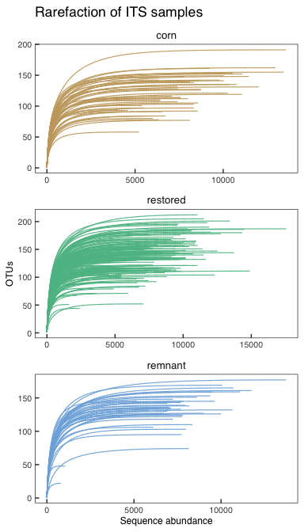
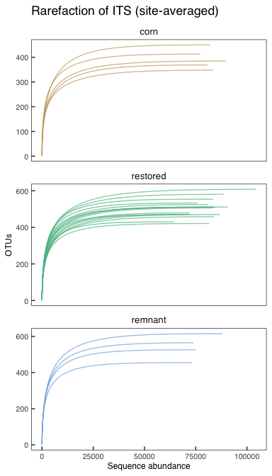
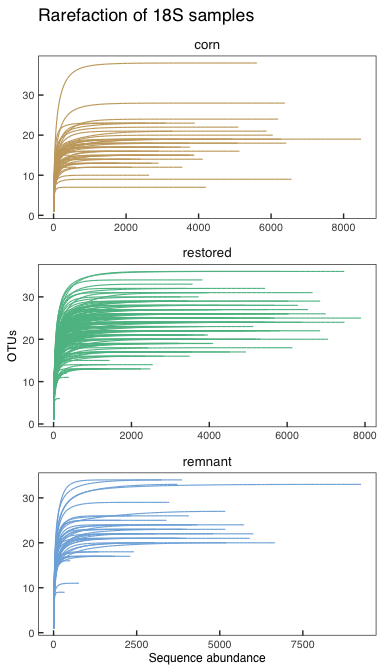
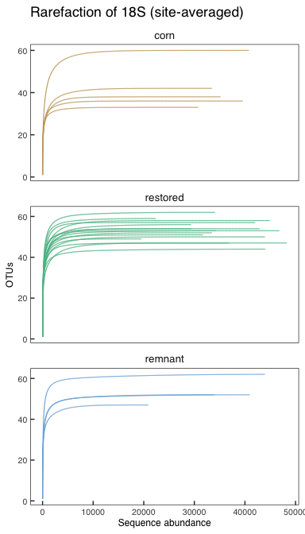
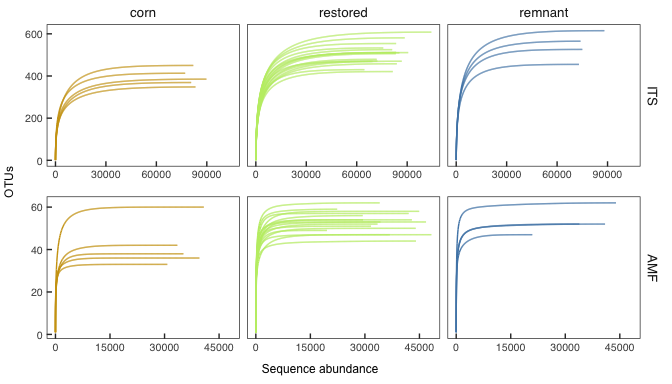
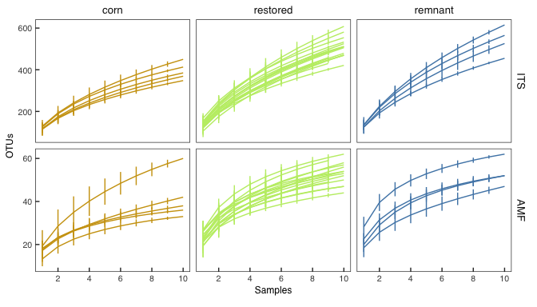

Species Data: ETL and Diagnostics
================
Beau Larkin

Last updated: 03 November, 2025

- [Description](#description)
- [Resources](#resources)
  - [Packages](#packages)
- [Functions](#functions)
  - [Root path function](#root-path-function)
  - [Styles](#styles)
  - [ETL: clean OTU data and return formatted
    objects](#etl-clean-otu-data-and-return-formatted-objects)
  - [Species accumulation](#species-accumulation)
  - [Confidence interval helper](#confidence-interval-helper)
- [Load and process data](#load-and-process-data)
  - [Import data](#import-data)
  - [ETL processing](#etl-processing)
  - [UNIFRAC tables for AMF](#unifrac-tables-for-amf)
- [Sampling depth and coverage](#sampling-depth-and-coverage)
  - [Rarefaction: ITS site-averaged](#rarefaction-its-site-averaged)
  - [Rarefaction: AMF sample](#rarefaction-amf-sample)
  - [Rarefaction: AMF site-averaged](#rarefaction-amf-site-averaged)
- [Figure data](#figure-data)
- [Output figures](#output-figures)

# Description

- Load and clean QIIME2 sequence data
- Apply fungal traits
- Create sample and site OTU tables
- Export UNIFRAC tables for AMF
- Evaluate sampling effort with rarefaction and accumulation

# Resources

## Packages

``` r
packages_needed <- c("tidyverse", "vegan", "knitr", "colorspace", "plotrix", "rprojroot", 
                     "rlang", "patchwork", "cowplot")

to_install <- setdiff(packages_needed, rownames(installed.packages()))
if (length(to_install)) install.packages(to_install)
invisible(lapply(packages_needed, library, character.only = TRUE))
```

# Functions

## Root path function

``` r
root_path <- function(...) rprojroot::find_rstudio_root_file(...)
```

## Styles

``` r
source(root_path("resources", "styles.R"))
```

## ETL: clean OTU data and return formatted objects

``` r
etl <- function(spe, env = sites, taxa, traits = NULL, varname, gene, cluster_type = "otu",
                colname_prefix, folder) {
    varname <- enquo(varname)
    data <- spe %>% left_join(taxa, by = join_by(`#OTU ID`))
    
    meta <- if (gene == "ITS") {
        data %>%
            mutate(!!varname := paste0(cluster_type, "_", row_number())) %>%
            select(!starts_with(gene)) %>%
            rename(otu_ID = `#OTU ID`) %>%
            select(!!varname, everything()) %>%
            separate_wider_delim(taxonomy, delim = ";",
                                 names = c("kingdom", "phylum", "class", "order", "family", "genus", "species"),
                                 too_few = "align_start") %>%
            mutate(across(kingdom:species, ~ str_sub(.x, 4))) %>%
            left_join(traits, by = join_by(phylum, class, order, family, genus)) %>%
            select(-kingdom, -Confidence)
    } else {
        data %>%
            mutate(!!varname := paste0(cluster_type, "_", row_number())) %>%
            select(!starts_with(gene)) %>%
            rename(otu_ID = `#OTU ID`) %>%
            select(!!varname, everything()) %>%
            separate(taxonomy,
                     into = c("class", "order", "family", "genus", "taxon", "accession"),
                     sep = ";", fill = "right") %>%
            select(-Confidence)
    }
    
    spe_samps <- data %>%
        mutate(!!varname := paste0(cluster_type, "_", row_number())) %>%
        select(!!varname, starts_with(gene)) %>%
        column_to_rownames(var = as_name(varname)) %>%
        t() %>% as.data.frame() %>% rownames_to_column("rowname") %>%
        mutate(rowname = str_remove(rowname, colname_prefix)) %>%
        separate_wider_delim("rowname", delim = "_", names = c("field_key", "sample")) %>%
        mutate(across(c(field_key, sample), as.numeric)) %>%
        left_join(env %>% select(field_key, field_name), by = join_by(field_key)) %>%
        select(field_name, sample, everything(), -field_key) %>%
        arrange(field_name, sample)
    
    spe_avg <- spe_samps %>%
        group_by(field_name) %>%
        summarize(across(starts_with(cluster_type), mean), .groups = "drop") %>%
        arrange(field_name)
    
    samples_fields <- spe_samps %>%
        count(field_name, name = "n") %>%
        left_join(sites, by = join_by(field_name)) %>%
        select(field_name, region, n) %>%
        arrange(n, field_name) %>%
        kable(format = "pandoc", caption = paste("Number of samples per field", gene, sep = ",\n"))
    
    write_csv(meta, root_path(folder, paste("spe", gene, "metadata.csv", sep = "_")))
    write_csv(spe_samps, root_path(folder, paste("spe", gene, "samples.csv", sep = "_")))
    write_csv(spe_avg, root_path(folder, paste("spe", gene, "avg.csv", sep = "_")))
    
    list(samples_fields = samples_fields, spe_meta = meta, spe_samps = spe_samps, spe_avg = spe_avg)
}
```

## Species accumulation

``` r
spe_accum <- function(data) {
    df <- data.frame(
        samples = specaccum(data[, -c(1, 2)], method = "exact")$site,
        richness = specaccum(data[, -c(1, 2)], method = "exact")$richness,
        sd = specaccum(data[, -c(1, 2)], method = "exact")$sd
    )
    df
}
```

## Confidence interval helper

``` r
ci <- function(x) std.error(x) * qnorm(0.975)
```

# Load and process data

## Import data

``` r
its_otu <- read_delim(root_path("otu_tables/ITS/ITS_otu_raw.txt"), show_col_types = FALSE)
its_taxa <- read_delim(root_path("otu_tables/ITS/ITS_otu_taxonomy.txt"), show_col_types = FALSE)
amf_otu <- read_delim(root_path("otu_tables/18S/18S_otu_raw.txt"), show_col_types = FALSE) %>% select(-last_col())
amf_taxa <- read_delim(root_path("otu_tables/18S/18S_otu_taxonomy.txt"), show_col_types = FALSE)
traits <- read_csv(root_path("otu_tables/2023-02-23_fungal_traits.csv"), show_col_types = FALSE) %>%
    select(phylum:primary_lifestyle)
```

``` r
sites <- read_csv(root_path("clean_data/sites.csv"), show_col_types = FALSE) %>%
    mutate(field_type = factor(field_type, levels = c("corn", "restored", "remnant"))) %>%
    select(-lat, -long, -yr_restore)
```

## ETL processing

``` r
its <- etl(spe = its_otu, taxa = its_taxa, traits = traits, varname = "otu_num", gene = "ITS",
           colname_prefix = "ITS_TGP_", folder = "clean_data")
```

``` r
amf <- etl(spe = amf_otu, taxa = amf_taxa, varname = "otu_num", gene = "18S",
           colname_prefix = "18S_TGP_", folder = "clean_data")
```

## UNIFRAC tables for AMF

``` r
amf$spe_samps %>%
    mutate(field_sample = paste(field_name, sample, sep = "_")) %>%
    select(field_sample, everything(), -field_name, -sample) %>%
    column_to_rownames("field_sample") %>%
    t() %>% as.data.frame() %>% rownames_to_column("otu_num") %>%
    left_join(amf$spe_meta %>% select(otu_num, otu_ID), by = "otu_num") %>%
    select(otu_ID, everything(), -otu_num) %>%
    write_tsv(root_path("otu_tables/18S/18S_samps_4unifrac.tsv"))
```

``` r
amf$spe_avg %>%
    column_to_rownames("field_name") %>%
    t() %>% as.data.frame() %>% rownames_to_column("otu_num") %>%
    left_join(amf$spe_meta %>% select(otu_num, otu_ID), by = "otu_num") %>%
    select(otu_ID, everything(), -otu_num) %>%
    write_tsv(root_path("otu_tables/18S/18S_avg_4unifrac.tsv"))
```

# Sampling depth and coverage

Script running `rarecurve()` is commented out because it takes so long
to execute. Data were saved to the wd and are used for making figures.
These files are too large to upload to GitHub and are ignored. Please
run these calls to `rarecurve()` to create your own rarefaction and
species accumulation data files. \## Rarefaction: ITS sample

``` r
# its_rc <- rarecurve(
#     its$spe_samps %>%
#         mutate(field_sample = paste(field_name, sample, sep = "_")) %>%
#         column_to_rownames("field_sample") %>%
#         select(-field_name, -sample),
#     step = 1, tidy = TRUE)
# write_csv(its_rc, root_path("clean_data", "its_rare_samp.csv"))

its_rc <- read_csv(root_path("clean_data", "its_rare_samp.csv"), show_col_types = FALSE)
```

``` r
its_rc %>%
    separate_wider_delim(Site, delim = "_", names = c("field_name", "sample_key"), cols_remove = FALSE) %>% 
    rename(seq_abund = Sample, otus = Species, field_sample = Site) %>%
    left_join(sites, by = "field_name") %>%
    ggplot(aes(x = seq_abund, y = otus, group = field_sample)) +
    facet_wrap(vars(field_type), ncol = 1, scales = "free") +
    geom_line(aes(color = field_type), linewidth = 0.4) +
    scale_color_discrete_qualitative(palette = "Harmonic") +
    labs(x = "Sequence abundance", y = "OTUs", title = "Rarefaction of ITS samples") +
    theme_corf +
    theme(legend.position = "none")
```

<!-- -->

## Rarefaction: ITS site-averaged

``` r
# its_rc_site <- rarecurve(
#     its$spe_samps %>%
#         group_by(field_name) %>%
#         summarize(across(starts_with("otu"), sum), .groups = "drop") %>%
#         column_to_rownames("field_name"),
#     step = 1, tidy = TRUE)
# write_csv(its_rc_site, root_path("clean_data", "its_rare_site.csv"))

its_rc_site <- read_csv(root_path("clean_data", "its_rare_site.csv"), show_col_types = FALSE)
```

``` r
its_rc_site %>%
    rename(seq_abund = Sample, otus = Species, field_name = Site) %>%
    left_join(sites, by = "field_name") %>%
    ggplot(aes(x = seq_abund, y = otus, group = field_name)) +
    facet_wrap(vars(field_type), ncol = 1, scales = "free_y") +
    geom_line(aes(color = field_type), linewidth = 0.4) +
  scale_color_discrete_qualitative(palette = "Harmonic") +
    labs(x = "Sequence abundance", y = "OTUs", title = "Rarefaction of ITS (site-averaged)") +
    theme_corf +
    theme(legend.position = "none")
```

<!-- -->

## Rarefaction: AMF sample

``` r
# amf_rc <- rarecurve(
#     amf$spe_samps %>%
#         mutate(field_sample = paste(field_name, sample, sep = "_")) %>%
#         column_to_rownames("field_sample") %>%
#         select(-field_name, -sample),
#     step = 1, tidy = TRUE)
# write_csv(amf_rc, root_path("clean_data", "amf_rare_samp.csv"))

amf_rc <- read_csv(root_path("clean_data", "amf_rare_samp.csv"), show_col_types = FALSE)
```

``` r
amf_rc %>%
    separate_wider_delim(Site, delim = "_", names = c("field_name", "sample_key"), cols_remove = FALSE) %>% 
    rename(seq_abund = Sample, otus = Species, field_sample = Site) %>%
    left_join(sites, by = "field_name") %>%
    ggplot(aes(x = seq_abund, y = otus, group = field_sample)) +
    facet_wrap(vars(field_type), ncol = 1, scales = "free") +
    geom_line(aes(color = field_type), linewidth = 0.4) +
  scale_color_discrete_qualitative(palette = "Harmonic") +
    labs(x = "Sequence abundance", y = "OTUs", title = "Rarefaction of 18S samples") +
    theme_corf +
    theme(legend.position = "none")
```

<!-- -->

## Rarefaction: AMF site-averaged

``` r
# amf_rc_site <- rarecurve(
#     amf$spe_samps %>%
#         group_by(field_name) %>%
#         summarize(across(starts_with("otu"), sum), .groups = "drop") %>%
#         column_to_rownames("field_name"),
#     step = 1, tidy = TRUE)
# write_csv(amf_rc_site, root_path("clean_data", "amf_rare_site.csv"))

amf_rc_site <- read_csv(root_path("clean_data", "amf_rare_site.csv"), show_col_types = FALSE)
```

``` r
amf_rc_site %>%
    rename(seq_abund = Sample, otus = Species, field_name = Site) %>%
    left_join(sites, by = "field_name") %>%
    ggplot(aes(x = seq_abund, y = otus, group = field_name)) +
    facet_wrap(vars(field_type), ncol = 1, scales = "free_y") +
    geom_line(aes(color = field_type), linewidth = 0.4) +
  scale_color_discrete_qualitative(palette = "Harmonic") +
    labs(x = "Sequence abundance", y = "OTUs", title = "Rarefaction of 18S (site-averaged)") +
    theme_corf +
    theme(legend.position = "none")
```

<!-- -->

# Figure data

``` r
accum <- bind_rows(
    list(
        ITS = bind_rows(split(its$spe_samps, ~ field_name) %>% map(spe_accum), .id = "field_name"),
        AMF = bind_rows(split(amf$spe_samps, ~ field_name) %>% map(spe_accum), .id = "field_name")
    ),
    .id = "dataset"
) %>%
    mutate(dataset = factor(dataset, levels = c("ITS", "AMF"), ordered = TRUE)) %>%
    left_join(sites, by = "field_name")
```

``` r
rarefac <- bind_rows(
  list(
    ITS = its_rc_site,
    AMF = amf_rc_site
  ),
  .id = "dataset"
) %>%
  select(field_name = Site, everything()) %>% 
  mutate(dataset = factor(dataset, levels = c("ITS", "AMF"), ordered = TRUE)) %>%
  left_join(sites, by = "field_name")
```

# Output figures

``` r
its_rare_fig <- ggplot(rarefac %>% filter(dataset == "ITS"), aes(x = Sample, y = Species, group = field_name)) +
  facet_grid(rows = vars(dataset), cols = vars(field_type), scales = "free") +
  geom_line(aes(color = field_type)) +
  scale_color_discrete_qualitative(palette = "Harmonic") +
  labs(
    x = NULL,
    y = NULL) +
  theme_corf +
  scale_x_continuous(n.breaks = 5) +
  theme(legend.position = "none")
amf_rare_fig <- ggplot(rarefac %>% filter(dataset == "AMF"), aes(x = Sample, y = Species, group = field_name)) +
  facet_grid(rows = vars(dataset), cols = vars(field_type), scales = "free") +
  geom_line(aes(color = field_type)) +
  scale_color_discrete_qualitative(palette = "Harmonic") +
  labs(
    x = NULL,
    y = NULL) +
  theme_corf +
  scale_x_continuous(n.breaks = 5) +
  theme(legend.position = "none")
```

Create figure panels

``` r
rare_panels <- (its_rare_fig / plot_spacer() / amf_rare_fig) +
  plot_layout(heights = c(1,0.01,1))
x_lab <- ggdraw() + draw_label("Sequence abundance", hjust = 0.5, vjust = 0.5)
y_lab <- ggdraw() + draw_label("OTUs", angle = 90, hjust = 0.5, vjust = 0.5)
rare_fig_h <- (y_lab | rare_panels) + plot_layout(widths = c(0.04, 1))
rare_fig <- rare_fig_h / x_lab + plot_layout(heights = c(1, 0.10))
```

``` r
rare_fig
```

<!-- -->

``` r
ggplot(accum, aes(x = samples, y = richness, group = field_name)) +
    facet_grid(rows = vars(dataset), cols = vars(field_type), scales = "free_y") +
    geom_line(aes(color = field_type)) +
    geom_segment(aes(xend = samples, y = richness - sd, yend = richness + sd, color = field_type)) +
  scale_color_discrete_qualitative(palette = "Harmonic") +
    labs(
        x = "Samples",
        y = expression(N[0]),
        caption = "Species accumulation using exact method; error = moment-based SD"
    ) +
    scale_x_continuous(breaks = c(0, 2, 4, 6, 8, 10)) +
    theme_corf +
    theme(legend.position = "none")
```

<!-- -->
