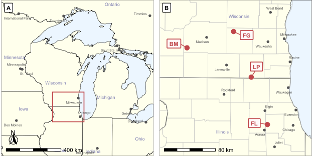

Site locations and pairwise distances
================
Beau Larkin

Last updated: 24 October, 2025

- [Description](#description)
- [Package and library installation](#package-and-library-installation)
  - [Root path function](#root-path-function)
- [Functions](#functions)
- [Sites](#sites)
  - [Site types](#site-types)
  - [Site pairwise distances](#site-pairwise-distances)
- [Maps](#maps)
  - [Map data](#map-data)
  - [Regional map](#regional-map)
  - [Area map](#area-map)
  - [Final map](#final-map)

# Description

- Calculate inter-site pairwise distances and summarize
- Produce continental and area views in a two-panel map

# Package and library installation

``` r
packages_needed = c(
    "tidyverse", "colorspace", "ggmap", "knitr", "conflicted", "gridExtra",
    "geosphere", "ggrepel", "sf", "rnaturalearth","rnaturalearthdata", 
    "rnaturalearthhires", "ggspatial", "maps", "ggpubr", "grid", "ggpmisc"
)

to_install <- setdiff(packages_needed, rownames(installed.packages()))
if (length(to_install)) install.packages(to_install)
invisible(lapply(packages_needed, library, character.only = TRUE))
```

## Root path function

``` r
root_path <- function(...) rprojroot::find_rstudio_root_file(...)
```

``` r
conflict_prefer("filter", "dplyr")
conflict_prefer("select", "dplyr")
conflict_prefer("map", "purrr")
conflict_prefer("annotate", "ggpp")
```

``` r
source(root_path("resources", "styles.R"))
```

# Functions

Executed from a separate script to save lines here; to view the function
navigate to `functions.R` in the code folder, accessible from the root
dir of the repo.

``` r
# Functions ———————— ####
source(root_path("code", "functions.R"))
```

# Sites

``` r
sites <-
    read_csv(root_path("clean_data/sites.csv"), show_col_types = FALSE) %>%
    glimpse() # Any reason to not recode field_type to factor here?
```

    ## Rows: 25
    ## Columns: 8
    ## $ field_key  <dbl> 1, 2, 3, 4, 5, 6, 7, 8, 9, 10, 11, 12, 13, 14, 15, 16, 17, 18, 19, 20, 21, 22, 23, 24, 25
    ## $ field_name <chr> "BBRP1", "ERRP1", "FGC1", "FGREM1", "FGRP1", "FLC1", "FLC2", "FLREM1", "FLRP1", "FLRP4", "FLRP5", "FLRSP1", "FLRSP2", …
    ## $ region     <chr> "BM", "BM", "FG", "FG", "FG", "FL", "FL", "FL", "FL", "FL", "FL", "FL", "FL", "FL", "BM", "LP", "LP", "LP", "LP", "BM"…
    ## $ lat        <dbl> 43.09989, 43.06588, 43.16087, 43.16172, 43.14381, 41.85941, 41.84370, 41.86043, 41.83457, 41.83491, 41.83439, 41.84074…
    ## $ long       <dbl> -89.72517, -89.80358, -88.89045, -88.88973, -88.88175, -88.25148, -88.22913, -88.25288, -88.25159, -88.25050, -88.2531…
    ## $ field_type <chr> "restored", "restored", "corn", "remnant", "restored", "corn", "corn", "remnant", "restored", "restored", "restored", …
    ## $ yr_restore <dbl> 2000, 2013, NA, NA, 2001, NA, NA, NA, 1976, 1980, 1981, 2006, 2006, 2006, 1988, NA, NA, 2012, 2012, NA, 1998, 2009, 20…
    ## $ yr_since   <dbl> 16, 3, NA, NA, 15, NA, NA, NA, 40, 36, 35, 10, 10, 10, 28, NA, NA, 4, 4, NA, 18, 7, 2, NA, 11

Calculate region locations

``` r
region_locs <- sites %>%
    group_by(region) %>%
    summarize(long_cen = mean(long),
              lat_cen = mean(lat),
              .groups = "drop")
```

## Site types

How many sites are in each field type?

``` r
field_types <- sites %>% 
  group_by(region, field_type) %>% 
  summarize(n = n(), yr_min = min(yr_since), yr_max = max(yr_since), .groups = "drop") %>% 
  pivot_wider(names_from = field_type, values_from = n:yr_max) %>% 
  select(region, starts_with("n"), yr_min_restored, yr_max_restored)
kable(field_types,
      format = "pandoc",
      caption = "Count of sites by type in each area & age of restored fields:\nBM = Blue Mounds, FG = Faville Grove,\nFL = Fermilab, LP = Lake Petite")
```

| region | n_corn | n_remnant | n_restored | yr_min_restored | yr_max_restored |
|:-------|-------:|----------:|-----------:|----------------:|----------------:|
| BM     |      1 |         1 |          7 |               2 |              28 |
| FG     |      1 |         1 |          1 |              15 |              15 |
| FL     |      2 |         1 |          6 |              10 |              40 |
| LP     |      1 |         1 |          2 |               4 |               4 |

Count of sites by type in each area & age of restored fields: BM = Blue
Mounds, FG = Faville Grove, FL = Fermilab, LP = Lake Petite

## Site pairwise distances

Convert site coordinates to distances using the haversine method
(package geosphere).

``` r
field_dist <- as.dist(distm(sites[, c("long", "lat")], fun = distHaversine))
```

Stats, pairwise distances in regions

``` r
rbind(
    split(sites, sites$region) %>% 
        map(\(df) as.dist(distm(df[, c("long", "lat")], fun = distHaversine))) %>% 
        map(
            \(df) data.frame(
                minimum = min(df),
                median = median(df),
                maximum = max(df)
            ) %>% map( ~ round(. / 1000, 1))
        ) %>% 
        bind_rows(.id = "region"),
    data.frame(
        minimum = min(field_dist),
        median = median(field_dist),
        maximum = max(field_dist)
    ) %>% map( ~ round(. / 1000, 1)) %>% 
        bind_rows() %>% 
        mutate(region = "All") %>% 
        select(region, everything())
) %>% 
    kable(format = "pandoc", caption = "Summary of intra-region and overall pairwise distances (km)")
```

| region | minimum | median | maximum |
|:-------|--------:|-------:|--------:|
| BM     |     0.1 |   21.3 |    38.7 |
| FG     |     0.1 |    2.0 |     2.1 |
| FL     |     0.1 |    2.1 |     2.9 |
| LP     |     0.2 |    0.5 |     0.9 |
| All    |     0.1 |   87.7 |   187.9 |

Summary of intra-region and overall pairwise distances (km)

Use function `reg_dist_stats()` to produce pairwise summaries in regions
and with field types

``` r
reg_ft_stats <- 
  list(
    BM = reg_dist_stats(field_dist, sites, "BM"),
    FG = reg_dist_stats(field_dist, sites, "FG"),
    FL = reg_dist_stats(field_dist, sites, "FL"),
    LP = reg_dist_stats(field_dist, sites, "LP")
  ) %>% 
  bind_rows(.id = "region") %>% 
  arrange(median_dist)
kable(reg_ft_stats, format = "pandoc", caption = "Summary of intra-region and field type pairwise distances (km)")
```

| region | group_pair        | min_dist | median_dist | max_dist |
|:-------|:------------------|---------:|------------:|---------:|
| FG     | corn-remnant      |      0.1 |        0.10 |      0.1 |
| LP     | restored-restored |      0.2 |        0.20 |      0.2 |
| LP     | remnant-restored  |      0.3 |        0.35 |      0.4 |
| LP     | corn-remnant      |      0.5 |        0.50 |      0.5 |
| LP     | corn-restored     |      0.8 |        0.85 |      0.9 |
| FL     | corn-remnant      |      0.2 |        1.45 |      2.7 |
| FL     | restored-restored |      0.1 |        1.90 |      2.2 |
| FG     | corn-restored     |      2.0 |        2.00 |      2.0 |
| FG     | remnant-restored  |      2.1 |        2.10 |      2.1 |
| FL     | corn-restored     |      0.2 |        2.40 |      2.8 |
| FL     | corn-corn         |      2.5 |        2.50 |      2.5 |
| FL     | remnant-restored  |      2.8 |        2.90 |      2.9 |
| BM     | remnant-restored  |      0.1 |       17.40 |     21.4 |
| BM     | corn-remnant      |     21.3 |       21.30 |     21.3 |
| BM     | restored-restored |      0.1 |       21.40 |     38.7 |
| BM     | corn-restored     |      0.2 |       22.50 |     33.4 |

Summary of intra-region and field type pairwise distances (km)

``` r
ft_stats <- 
  reg_ft_stats %>% 
  group_by(group_pair) %>% 
  summarize(median_dist = round(median(median_dist), 1), .groups = "drop") %>% 
  arrange(median_dist)
kable(ft_stats, format = "pandoc", caption = "Summary of field type pairwise distances")
```

| group_pair        | median_dist |
|:------------------|------------:|
| corn-remnant      |         1.0 |
| restored-restored |         1.9 |
| corn-restored     |         2.2 |
| corn-corn         |         2.5 |
| remnant-restored  |         2.5 |

Summary of field type pairwise distances

# Maps

## Map data

Create two panel map with regional and area views. \### Regional map
data Retrieve layer for US states and Canadian provinces.

``` r
regions <- ne_states(country = c("United States of America", "Canada"),
                     returnclass = "sf")
```

Retrieve metadata for populated places (cities)

``` r
cities <- ne_download(
    scale = 50,
    type = "populated_places",
    category = "cultural",
    returnclass = "sf"
)
```

    ## Reading layer `ne_50m_populated_places' from data source 
    ##   `/private/var/folders/f2/v4gkwmsn0nbd3fmypfh2wl740000gp/T/RtmpzBWibN/ne_50m_populated_places.shp' using driver `ESRI Shapefile'
    ## Simple feature collection with 1251 features and 137 fields
    ## Geometry type: POINT
    ## Dimension:     XY
    ## Bounding box:  xmin: -175.2206 ymin: -90 xmax: 179.2166 ymax: 78.22097
    ## Geodetic CRS:  WGS 84

Regional mapping objects

``` r
regional_box <- st_bbox(c(
    xmin = -95,
    ymin = 39.25,
    xmax = -81,
    ymax = 49.5
), crs = 4326)
sf_use_s2(FALSE)
regions_crop <- st_crop(regions, regional_box)
```

    ## although coordinates are longitude/latitude, st_intersection assumes that they are planar

    ## Warning: attribute variables are assumed to be spatially constant throughout all geometries

``` r
cities_crop <- st_crop(cities, regional_box)
```

    ## although coordinates are longitude/latitude, st_intersection assumes that they are planar

    ## Warning: attribute variables are assumed to be spatially constant throughout all geometries

### Area map data

Retrieve populated places (cities)

``` r
area_cities <- ne_download(
    scale = 10,
    type = "populated_places",
    category = "cultural",
    returnclass = "sf"
)
```

    ## Reading layer `ne_10m_populated_places' from data source 
    ##   `/private/var/folders/f2/v4gkwmsn0nbd3fmypfh2wl740000gp/T/RtmpzBWibN/ne_10m_populated_places.shp' using driver `ESRI Shapefile'
    ## Simple feature collection with 7342 features and 137 fields
    ## Geometry type: POINT
    ## Dimension:     XY
    ## Bounding box:  xmin: -179.59 ymin: -90 xmax: 179.3833 ymax: 82.48332
    ## Geodetic CRS:  WGS 84

``` r
counties <- st_as_sf(maps::map("county", plot = FALSE, fill = TRUE))
```

Area mapping objects

``` r
area_box <- st_bbox(c(
    xmin = -90.3,
    ymin = 41.4,
    xmax = -87.4,
    ymax = 43.6
), crs = 4326)
sf_use_s2(FALSE)
area_crop <- st_crop(regions, area_box)
```

    ## although coordinates are longitude/latitude, st_intersection assumes that they are planar

    ## Warning: attribute variables are assumed to be spatially constant throughout all geometries

``` r
area_cities_crop <- st_crop(area_cities, area_box)
```

    ## although coordinates are longitude/latitude, st_intersection assumes that they are planar

    ## Warning: attribute variables are assumed to be spatially constant throughout all geometries

``` r
counties_crop <- st_crop(st_transform(counties, 4326), area_box)
```

    ## although coordinates are longitude/latitude, st_intersection assumes that they are planar

    ## Warning: attribute variables are assumed to be spatially constant throughout all geometries

### Map styles

``` r
state_lab_size <- 2.4
city_lab_size <- 1.8
city_pt_size <- 1.2
city_col <- "grey40"
panel_lab_x <- 0.02
panel_lab_y <- 0.98
```

## Regional map

``` r
regional_map <-
    ggplot() +
    geom_sf(
        data = regions_crop,
        fill = "ivory",
        color = "black",
        size = 0.5
    ) +
    geom_rect(
        aes(
            xmin = -90.3,
            ymin = 41.5,
            xmax = -87.4,
            ymax = 43.45
        ),
        fill = NA,
        color = "indianred",
        linewidth = 0.6
    ) +
    geom_text_repel(
        data = regions_crop %>% filter(
            name %in% c(
                "Minnesota",
                "Iowa",
                "Ontario",
                "Michigan",
                "Ohio",
                "Illinois",
                "Wisconsin",
                "Indiana"
            )
        ),
        aes(x = longitude, y = latitude, label = name),
        size = state_lab_size,
        alpha = 0.5,
        color = "darkblue",
        segment.color = NA
    ) +
    geom_point(
        data = cities_crop,
        aes(x = LONGITUDE, y = LATITUDE),
        color = city_col,
        size = city_pt_size
    ) +
    geom_text_repel(
        data = cities_crop,
        aes(x = LONGITUDE, y = LATITUDE, label = NAME),
        size = city_lab_size,
        color = city_col,
        nudge_y = 0
    ) +
    annotation_scale(location = "bl", 
                     width_hint = 0.4,
                     height = unit(0.15, "cm")) +
    annotation_north_arrow(
        location = "bl",
        which_north = "true",
        height = unit(0.75, "cm"),
        width = unit(0.75, "cm"),
        pad_x = unit(0.25, "cm"),
        pad_y = unit(0.55, "cm"),
        style = north_arrow_fancy_orienteering()
    ) +
    geom_label_npc(
        aes(npcx = panel_lab_x, npcy = panel_lab_y, label = "A"), 
        hjust = "left",
        vjust = "top",
        size = 3,
        fontface = "bold",
        label.r = unit(0.3, "mm"),
        label.size = 0.4,
        label.padding = unit(c(0.4, 0.3, 0.15, 0.3), "lines")
    ) +
    coord_sf(
        xlim = c(regional_box$xmin, regional_box$xmax),
        ylim = c(regional_box$ymin, regional_box$ymax),
        expand = FALSE
    ) +
    theme_void() +
    theme(#aspect.ratio = 1,
        panel.grid.major = element_blank(),
        panel.background = element_rect(fill = "aliceblue"))
```

## Area map

``` r
area_map <-
    ggplot() +
    geom_sf(
        data = area_crop,
        fill = "ivory",
        color = "black",
        size = 0.5
    ) +
    geom_sf(data = counties,
            fill = NA,
            color = "gray80") +
    geom_point(
        data = region_locs,
        aes(x = long_cen, y = lat_cen),
        color = "indianred",
        size = 3
    ) +
    geom_label_repel(
        data = region_locs,
        aes(x = long_cen, y = lat_cen, label = region),
        color = "indianred",
        fill = "snow",
        size = 3,
        fontface = "bold",
        label.r = unit(0.3, "mm"),
        label.size = 0.6,
        label.padding = unit(1.3, "mm"),
        nudge_x = c(-0.25, 0.25, -0.25, 0.10),
        nudge_y = c(0.06, -0.05, 0.02, 0.15)
    ) +
    geom_text_repel(
        data = area_crop %>%
            filter(name %in% c("Wisconsin", "Illinois")),
        aes(x = longitude, y = latitude, label = name),
        size = state_lab_size,
        alpha = 0.5,
        color = "darkblue",
        nudge_x = c(0.8, 0.1),
        nudge_y = c(-1, 1.8),
        segment.color = NA
    ) +
    geom_point(
        data = area_cities_crop,
        aes(x = LONGITUDE, y = LATITUDE),
        color = city_col,
        size = city_pt_size
    ) +
    geom_text_repel(
        data = area_cities_crop,
        aes(x = LONGITUDE, y = LATITUDE, label = NAME),
        size = city_lab_size,
        color = city_col,
        nudge_y = 0
    ) +
    annotation_scale(location = "bl", 
                     width_hint = 0.4,
                     height = unit(0.15, "cm")) +
    geom_label_npc(
        aes(npcx = panel_lab_x, npcy = panel_lab_y, label = "B"), 
        hjust = "left",
        vjust = "top",
        size = 3,
        fontface = "bold",
        label.r = unit(0.3, "mm"),
        label.size = 0.4,
        label.padding = unit(c(0.4, 0.3, 0.15, 0.3), "lines")
    ) +
    coord_sf(
        xlim = c(area_box$xmin, area_box$xmax),
        ylim = c(area_box$ymin, area_box$ymax),
        expand = FALSE
    ) +
    theme_void() +
    theme(#aspect.ratio = 1,
        panel.grid.major = element_blank(),
        panel.background = element_rect(fill = "aliceblue"))
```

## Final map

``` r
maps_fig <-
    ggarrange(
        regional_map,
        NULL,
        area_map,
        nrow = 1,
        ncol = 3,
        align = "h",
        widths = c(1, 0.02, 1)
    )
```

    ## Scale on map varies by more than 10%, scale bar may be inaccurate

``` r
maps_fig
```



``` r
ggsave(
    root_path("figs/fig1.png"),
    width = 6.5,
    height = 3.25,
    units = "in",
    dpi = 600
)
```
