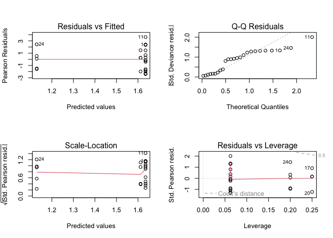
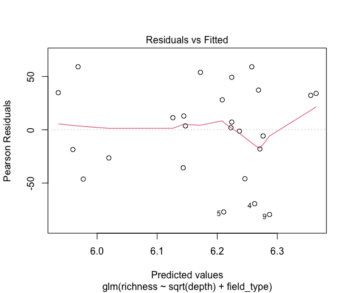
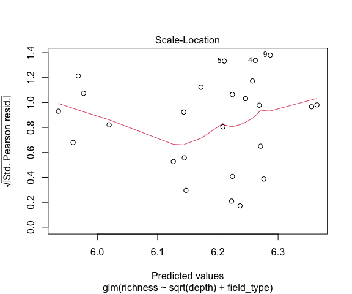
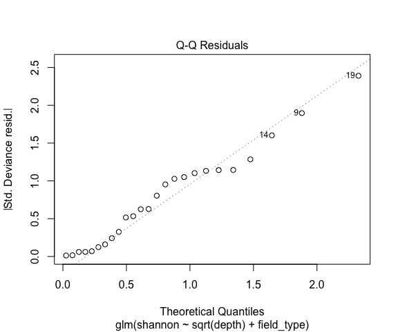
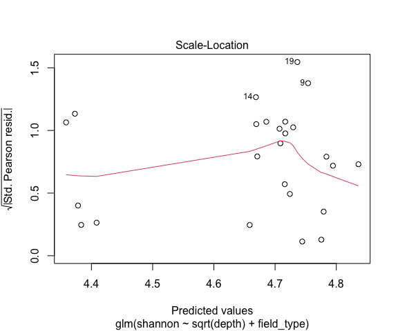
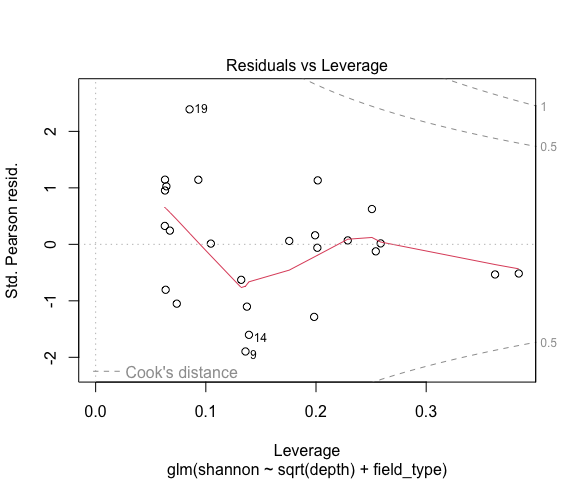
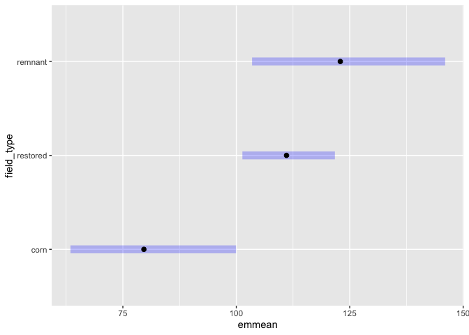

Results: Soil Fungal Communities
================
Beau Larkin

Last updated: 12 May, 2025

- [Description](#description)
- [Packages and libraries](#packages-and-libraries)
  - [Root path function](#root-path-function)
- [Data](#data)
  - [Site metadata and design](#site-metadata-and-design)
  - [Sites-species tables](#sites-species-tables)
  - [Microbial species metadata](#microbial-species-metadata)
  - [Fatty Acids: Biomass](#fatty-acids-biomass)
- [Functions](#functions)
  - [Alpha diversity calculations](#alpha-diversity-calculations)
  - [Confidence intervals](#confidence-intervals)
  - [Multivariate analysis](#multivariate-analysis)
- [All Soil Fungi](#all-soil-fungi)
  - [PLFA](#plfa)
  - [Diversity Indices](#diversity-indices)
  - [Beta Diversity](#beta-diversity)

# Description

Main results analysis and figures - Biomass: PLFA/NLFA - OTU richness
and diversity - Beta diversity - Beta diversity is tested with
multivariate analysis, conducted using species abundances averaged in
replicate sites. Pooling abundances from multiple subsamples has been
shown to increase recovery of microbial richness [Song et
al. 2015](https://doi.org/10.1371/journal.pone.0127234) The analysis
flow is:

1.  Ordination of sites (PCoA)
2.  ITS-based abundances are standardized to proportions within sites
    and converted into a bray-curtis distance matrix [McKnight et
    al. 2019](https://besjournals.onlinelibrary.wiley.com/doi/full/10.1111/2041-210X.13115).
3.  18S-based abundances are standardized to proportions within sites
    and converted into a UNIFRAC distance matrix
4.  Clustering by field type (corn, restored, remnant)
5.  Multivariate homogeneity test
6.  Global PERMANOVA
7.  Pairwise PERMANOVA
8.  Post-hoc fitting of restored site age (Envfit)

Beta diverstiy could depend on intersite distance, which may limit
propagule dispersal [Redondo et
al. 2020](https://doi.org/10.1093/femsec/fiaa082). We use cartesian
intersite distance as a covariate in statistical tests to account for
this.

# Packages and libraries

``` r
packages_needed = c(
    "colorspace",
    "emmeans",
    "gridExtra",
    "knitr",
    "tidyverse",
    "vegan",
    "rprojroot",
    "phyloseq", 
    "ape", 
    "phangorn", 
    "geosphere", 
    "conflicted",
    "ggpubr",
    "patchwork"
)
packages_installed = packages_needed %in% rownames(installed.packages())
```

``` r
if (any(!packages_installed)) {
    install.packages(packages_needed[!packages_installed])
}
```

``` r
for (i in 1:length(packages_needed)) {
    library(packages_needed[i], character.only = T)
}
```

## Root path function

``` r
root_path <- function(...) rprojroot::find_rstudio_root_file(...)
```

``` r
conflict_prefer("filter", "dplyr")
conflict_prefer("select", "dplyr")
conflict_prefer("diversity", "vegan")
```

``` r
source(root_path("resources", "styles.txt"))
```

# Data

## Site metadata and design

``` r
sites <- read_csv(paste0(getwd(), "/clean_data/sites.csv"), show_col_types = FALSE) %>% 
    mutate(field_type = factor(field_type, ordered = TRUE, levels = c("corn", "restored", "remnant")))
```

### Wrangle site metadata

Intersite geographic distance will be used as a covariate in clustering.
Raw coordinates in data file aren’t distances; convert to distance
matrix and summarize with PCoA

``` r
field_dist <- as.dist(distm(sites[, c("long", "lat")], fun = distHaversine))
field_dist_pcoa <- pcoa(field_dist)
field_dist_pcoa$values[c(1,2), c(1,2)] %>% 
    kable(format = "pandoc")
```

|  Eigenvalues | Relative_eig |
|-------------:|-------------:|
| 146898426293 |    0.9053961 |
|  15349390146 |    0.0946047 |

First axis of geographic distance PCoA explains 91% of the variation
among sites.

``` r
sites$dist_axis_1 = field_dist_pcoa$vectors[, 1]
```

## Sites-species tables

List *spe* holds average sequence abundances for the top 6 samples per
field. CSV files were produced in `process_data.R`

``` r
spe <- list(
    its_avg   = read_csv(root_path("clean_data/spe_ITS_avg.csv"), 
                         show_col_types = FALSE),
    amf_avg   = read_csv(root_path("clean_data/spe_18S_avg.csv"), 
                         show_col_types = FALSE),
    amf_avg_uni = read_delim(root_path("otu_tables/18S/18S_avg_4unifrac.tsv"),
                         show_col_types = FALSE)
)
```

## Microbial species metadata

``` r
spe_meta <- list(
    its = read_csv(root_path("clean_data/spe_ITS_metadata.csv"),
                   show_col_types = FALSE),
    amf = read_csv(root_path("clean_data/spe_18S_metadata.csv"),
                   show_col_types = FALSE)
) %>% map(. %>% mutate(across(everything(), ~ replace_na(., "unidentified"))))
```

### Phyloseq databases

Sequence abundance data aren’t standardized here; they will be after the
data are subsetted by guilds or taxonomic ranks. \#### Whole soil fungi

``` r
its_ps <- phyloseq(
    otu_table(
        data.frame(spe$its_avg, row.names = 1),
        taxa_are_rows = FALSE
    ),
    sample_data(
        sites %>% column_to_rownames(var = "field_name")
    ),
    tax_table(
        data.frame(spe_meta$its, row.names = 1) %>% 
            as.matrix()
    )
)
```

#### AMF

``` r
amf_avg_ps <- phyloseq(
    otu_table(
        data.frame(spe$amf_avg_uni, row.names = 1) %>%
            decostand(method = "total", MARGIN = 2),
        taxa_are_rows = TRUE
    ),
    read.dna(
        root_path("otu_tables/18S/18S_sequences.fasta"),
        format = "fasta"
    ) %>%
        phyDat(type = "DNA") %>%
        dist.hamming() %>%
        NJ(),
    sample_data(
        sites %>% column_to_rownames(var = "field_name")
    )
)
```

## Fatty Acids: Biomass

Use only 18.2 for soil fungi

``` r
fa <- read_csv(file.path(getwd(), "clean_data/plfa.csv"), show_col_types = FALSE) %>% 
    rename(fungi_18.2 = fa_18.2) %>% 
    select(field_name, fungi_18.2, amf) %>%
    left_join(
        sites %>% select(field_name, field_type),
        by = join_by(field_name)
    )
```

# Functions

## Alpha diversity calculations

Returns a dataframe of alpha diversity (richness, Shannon’s) for
analysis and plotting.

``` r
calc_div <- function(spe) {
    div_data <- 
        spe %>% 
        rowwise() %>% 
        mutate(
            depth = sum(c_across(starts_with("otu"))),
            richness = sum(c_across(starts_with("otu")) > 0),
            shannon = exp(diversity(c_across(starts_with("otu"))))
        ) %>% 
        select(-starts_with("otu")) %>% 
        as_tibble() %>% 
        left_join(sites %>% select(field_type, field_name), by = join_by(field_name)) %>% 
        mutate(across(starts_with("field"), ~ factor(.x, ordered = FALSE)))
    
    return(div_data)
    
}
```

## Confidence intervals

Calculate upper and lower confidence intervals with alpha=0.05

``` r
ci_u <- function(x) {(sd(x) / sqrt(length(x))) * qnorm(0.975)}
ci_l <- function(x) {(sd(x) / sqrt(length(x))) * qnorm(0.025)}
```

## Multivariate analysis

Perform ordination, diagnostics, PERMANOVA, and post-hoc

1.  d = object of class dist
2.  s = species abundance matrix
3.  env = site metadata
4.  corr = any correction used in `pcoa()`
5.  distype = distance method, unifrac or other
6.  nperm = number of permutations for tests

``` r
mva <- function(d, env=sites, corr="none", nperm=1999) {
    # Ordination
    p <- pcoa(d, correction = corr)
    p_vals <- data.frame(p$values) %>% 
        rownames_to_column(var = "Dim") %>% 
        mutate(Dim = as.integer(Dim))
    p_eig <- p_vals[1:2, grep("Rel", colnames(p_vals))] %>% round(., 3) * 100
    p_vec <- data.frame(p$vectors)
    p_sco <-
        p_vec[, 1:2] %>%
        rownames_to_column(var = "field_name") %>%
        left_join(env, by = join_by(field_name))
    p_fit <- envfit(
        p_vec ~ yr_since, 
        data.frame(env, row.names = 1), 
        choices = c(1,2),
        na.rm = TRUE,
        permutations = nperm)
    p_fit_sco <- scores(p_fit, display = "bp")
    # Test multivariate dispersions
    disper <- betadisper(d, env$field_type, bias.adjust = TRUE)
    mvdisper <- permutest(disper, pairwise = TRUE, permutations = nperm)
    # Global PERMANOVA
    gl_permtest <- adonis2(
        d ~ dist_axis_1 + field_type,
        data = env,
        permutations = nperm,
        by = "terms")
    # Pairwise PERMANOVA
    group_var <- as.character(env$field_type)
    groups <- as.data.frame(t(combn(unique(group_var), m = 2)))
    contrasts <- data.frame(
        group1 = groups$V1,
        group2 = groups$V2,
        R2 = NA,
        F_value = NA,
        df1 = NA,
        df2 = NA,
        p_value = NA
    )
    for (i in seq(nrow(contrasts))) {
        group_subset <-
            group_var == contrasts$group1[i] |
            group_var == contrasts$group2[i]
        # Contrast matrices for Unifrac and Bray distance aren't compatible
        contrast_matrix <- as.matrix(d)[group_subset, group_subset]
        fit <- adonis2(
            contrast_matrix ~ env$dist_axis_1[group_subset] + group_var[group_subset],
            permutations = nperm,
            by = "terms")
        # Prepare contrasts table
        contrasts$R2[i] <- round(fit[grep("group_var", rownames(fit)), "R2"], digits = 3)
        contrasts$F_value[i] <- round(fit[grep("group_var", rownames(fit)), "F"], digits = 3)
        contrasts$df1[i] <- fit[grep("group_var", rownames(fit)), "Df"]
        contrasts$df2[i] <- fit[grep("Residual", rownames(fit)), "Df"]
        contrasts$p_value[i] <- fit[grep("group_var", rownames(fit)), 5]
    }
    contrasts$p_value_adj <- p.adjust(contrasts$p_value, method = "fdr") %>% round(., 4)
    
    # Results
    out <- list(
        correction_note    = p$note,
        ordination_values  = p_vals[1:10, ],
        axis_pct           = p_eig,
        ordination_scores  = p_sco,
        dispersion_test    = mvdisper,
        permanova          = gl_permtest,
        pairwise_contrasts = contrasts,
        vector_fit_result  = p_fit,
        vector_fit_scores  = p_fit_sco
    )
    
    return(out)
    
}
```

# All Soil Fungi

## PLFA

Based on previous histograms (not shown), log transformation is
warranted.

``` r
plfa_glm <- glm(
    fungi_18.2 ~ field_type,
    family = gaussian(link = "log"),
    data = fa %>% mutate(field_type = factor(field_type, ordered = FALSE)))

par(mfrow = c(2,2))
plot(plfa_glm)
```

<!-- -->

``` r
summary(plfa_glm)
```

    ## 
    ## Call:
    ## glm(formula = fungi_18.2 ~ field_type, family = gaussian(link = "log"), 
    ##     data = fa %>% mutate(field_type = factor(field_type, ordered = FALSE)))
    ## 
    ## Coefficients:
    ##                    Estimate Std. Error t value Pr(>|t|)    
    ## (Intercept)          1.1297     0.2690   4.200  0.00037 ***
    ## field_typerestored   0.5054     0.2838   1.781  0.08881 .  
    ## field_typeremnant    0.4821     0.3268   1.475  0.15436    
    ## ---
    ## Signif. codes:  0 '***' 0.001 '**' 0.01 '*' 0.05 '.' 0.1 ' ' 1
    ## 
    ## (Dispersion parameter for gaussian family taken to be 3.463936)
    ## 
    ##     Null deviance: 92.436  on 24  degrees of freedom
    ## Residual deviance: 76.207  on 22  degrees of freedom
    ## AIC: 106.81
    ## 
    ## Number of Fisher Scoring iterations: 5

``` r
plfa_em <- emmeans(plfa_glm, ~ field_type, type = "response")
```

| field_type | response |        SE |  df | lower.CL | upper.CL |
|:-----------|---------:|----------:|----:|---------:|---------:|
| corn       | 3.094661 | 0.8323382 |  22 | 1.771613 | 5.405765 |
| restored   | 5.129779 | 0.4652913 |  22 | 4.250149 | 6.191461 |
| remnant    | 5.011704 | 0.9305826 |  22 | 3.409943 | 7.365866 |

Confidence level used: 0.95 - Intervals are back-transformed from the
log scale

| contrast           |     ratio |        SE |  df | null |   t.ratio |   p.value |
|:-------------------|----------:|----------:|----:|-----:|----------:|----------:|
| corn / restored    | 0.6032737 | 0.1712345 |  22 |    1 | -1.780512 | 0.1992906 |
| corn / remnant     | 0.6174867 | 0.2018123 |  22 |    1 | -1.475078 | 0.3217937 |
| restored / remnant | 1.0235598 | 0.2115205 |  22 |    1 |  0.112685 | 0.9930261 |

P value adjustment: tukey method for comparing a family of 3 estimates.
Tests are performed on the log scale

``` r
plfa_fig <- 
    ggplot(data.frame(summary(plfa_em)), aes(x = field_type, y = response)) +
    geom_col(aes(fill = field_type), color = "black", width = 0.5) +
    geom_errorbar(aes(ymin = response, ymax = upper.CL), width = 0) +
    labs(x = NULL, y = expression(PLFA~(nmol%*%g[soil]^-1))) +
    scale_fill_manual(values = c("gray", "black", "white")) +
    theme_cor +
    theme(legend.position = "none",
          plot.tag = element_text(size = 14, face = 1),
          plot.tag.position = c(0, 1.02))
```

## Diversity Indices

``` r
its_div <- calc_div(spe$its_avg)
```

### Richness

Predict OTU richness by field type with sequencing depth per field as a
covariate. Log link function warranted based on visual interpretation of
histograms (not shown).

``` r
its_rich_glm <- glm(richness ~ sqrt(depth) + field_type, family = gaussian(link = "log"), data = its_div)
par(mfrow = c(2,2))
```

``` r
plot(its_rich_glm)
```



``` r
shapiro.test(residuals(its_rich_glm))
```

    ## 
    ##  Shapiro-Wilk normality test
    ## 
    ## data:  residuals(its_rich_glm)
    ## W = 0.94817, p-value = 0.2279

Residuals are relatively well distributed above and below zero and
little evidence of heteroscedasticity is apparent. Based on Shapiro
test, the null that the residuals fit a normal distribution is not
rejected.

``` r
summary(its_rich_glm)
```

    ## 
    ## Call:
    ## glm(formula = richness ~ sqrt(depth) + field_type, family = gaussian(link = "log"), 
    ##     data = its_div)
    ## 
    ## Coefficients:
    ##                    Estimate Std. Error t value Pr(>|t|)    
    ## (Intercept)        4.868152   0.377278  12.903 1.89e-11 ***
    ## sqrt(depth)        0.012152   0.004109   2.957 0.007521 ** 
    ## field_typerestored 0.245927   0.055789   4.408 0.000245 ***
    ## field_typeremnant  0.355750   0.066712   5.333 2.74e-05 ***
    ## ---
    ## Signif. codes:  0 '***' 0.001 '**' 0.01 '*' 0.05 '.' 0.1 ' ' 1
    ## 
    ## (Dispersion parameter for gaussian family taken to be 2013.358)
    ## 
    ##     Null deviance: 118498  on 24  degrees of freedom
    ## Residual deviance:  42281  on 21  degrees of freedom
    ## AIC: 266.78
    ## 
    ## Number of Fisher Scoring iterations: 4

Sequence depth is a significant predictor of richness, but less so than
field type. Does depth confound interpretation of OTU richness in field
types?

``` r
its_div %>% 
    group_by(field_type) %>% 
    summarize(across(c(depth, richness), ~ round(mean(.x), 0))) %>% 
    kable(format = "pandoc")
```

| field_type | depth | richness |
|:-----------|------:|---------:|
| corn       |  8257 |      393 |
| restored   |  8266 |      502 |
| remnant    |  7750 |      540 |

Sequence depth is similar in corn and restored fields, but richness in
restored fields is approx 28% higher in restored fields. Sequence depth
was lowest in remnant fields, where richness was the highest. This
suggests that sequence depth isn’t confounding the signal of field type,
but it was appropriate to treat it as a covariate in the model because
it has it’s own relationship to field type.

Proceed with means separation by obtaining estimated marginal means for
field type

``` r
its_rich_em <- emmeans(its_rich_glm, ~ field_type, type = "response")
```

Results tables below show the emmeans summary of group means and
confidence intervals, with sequencing depth as a covariate, and the post
hoc contrast of richness among field types.

| field_type | response |       SE |  df | lower.CL | upper.CL |
|:-----------|---------:|---------:|----:|---------:|---------:|
| corn       | 390.4588 | 19.97430 |  21 | 351.0532 | 434.2877 |
| restored   | 499.3211 | 11.29236 |  21 | 476.3810 | 523.3659 |
| remnant    | 557.2825 | 23.61556 |  21 | 510.2731 | 608.6227 |

Confidence level used: 0.95 - Intervals are back-transformed from the
log scale

| contrast           |     ratio |        SE |  df | null |   t.ratio |   p.value |
|:-------------------|----------:|----------:|----:|-----:|----------:|----------:|
| corn / restored    | 0.7819794 | 0.0436258 |  21 |    1 | -4.408169 | 0.0006879 |
| corn / remnant     | 0.7006479 | 0.0467417 |  21 |    1 | -5.332609 | 0.0000785 |
| restored / remnant | 0.8959928 | 0.0436672 |  21 |    1 | -2.253422 | 0.0852268 |

P value adjustment: tukey method for comparing a family of 3 estimates.
Tests are performed on the log scale

OTU richness in cornfields is significantly less than in restored or
remnant fields, which don’t differ. Plot the results, for now as a
barplot with letters indicating significance at a\<0.05.

``` r
its_rich <- 
    its_div %>% 
    group_by(field_type) %>% 
    summarize(avg_rich = mean(richness), .groups = "drop",
              ci_u = avg_rich + (qnorm(0.975) * sd(richness) / sqrt(n())),
              ci_l = avg_rich + (qnorm(0.025) * sd(richness) / sqrt(n())))
```

``` r
its_rich_fig <- 
    ggplot(its_rich, aes(x = field_type, y = avg_rich)) +
    geom_col(aes(fill = field_type), color = "black", width = 0.5) +
    geom_errorbar(aes(ymin = avg_rich, ymax = ci_u), width = 0) +
    geom_text(aes(y = ci_u, label = c("a", "b", "b")), vjust = -1.5, family = "serif", size = 4) +
    labs(x = NULL, y = "Richness") +
    lims(y = c(0, 760)) +
    scale_fill_manual(values = c("gray", "black", "white")) +
    theme_cor +
    theme(legend.position = "none",
          plot.tag = element_text(size = 14, face = 1),
          plot.tag.position = c(0, 1.02))
```

### Shannon’s diversity

Tabular data will be included in supplemental… Predict Shannon’s
diversity by field type with sequencing depth as a covariate

``` r
its_shan_glm <- glm(shannon ~ sqrt(depth) + field_type, family = gaussian(link = "log"), data = its_div)
par(mfrow = c(2,2))
```

``` r
plot(its_shan_glm)
```



``` r
shapiro.test(residuals(its_shan_glm))
```

    ## 
    ##  Shapiro-Wilk normality test
    ## 
    ## data:  residuals(its_shan_glm)
    ## W = 0.97615, p-value = 0.7999

Residuals are relatively well distributed above and below zero and
little evidence of heteroscedasticity is apparent. Residuals don’t
deviate from normal

``` r
summary(its_shan_glm)
```

    ## 
    ## Call:
    ## glm(formula = shannon ~ sqrt(depth) + field_type, family = gaussian(link = "log"), 
    ##     data = its_div)
    ## 
    ## Coefficients:
    ##                    Estimate Std. Error t value Pr(>|t|)    
    ## (Intercept)        3.725818   0.748786   4.976 6.35e-05 ***
    ## sqrt(depth)        0.007205   0.008148   0.884  0.38661    
    ## field_typerestored 0.332650   0.117586   2.829  0.01005 *  
    ## field_typeremnant  0.434078   0.137584   3.155  0.00478 ** 
    ## ---
    ## Signif. codes:  0 '***' 0.001 '**' 0.01 '*' 0.05 '.' 0.1 ' ' 1
    ## 
    ## (Dispersion parameter for gaussian family taken to be 380.0471)
    ## 
    ##     Null deviance: 13034  on 24  degrees of freedom
    ## Residual deviance:  7981  on 21  degrees of freedom
    ## AIC: 225.1
    ## 
    ## Number of Fisher Scoring iterations: 4

Sequence depth is not a significant predictor of richness. Proceed with
means separation by obtaining estimated marginal means for field type

``` r
its_shan_em <- emmeans(its_shan_glm, ~ field_type, type = "response")
```

Results tables below show the emmeans summary of group means and
confidence intervals, with sequencing depth as a covariate, and the post
hoc contrast of richness among field types.

| field_type |  response |        SE |  df |  lower.CL |  upper.CL |
|:-----------|----------:|----------:|----:|----------:|----------:|
| corn       |  79.63767 |  8.696938 |  21 |  63.45813 |  99.94242 |
| restored   | 111.06739 |  4.894756 |  21 | 101.34072 | 121.72764 |
| remnant    | 122.92384 | 10.182765 |  21 | 103.47127 | 146.03350 |

Confidence level used: 0.95 - Intervals are back-transformed from the
log scale

| contrast           |     ratio |        SE |  df | null |   t.ratio |   p.value |
|:-------------------|----------:|----------:|----:|-----:|----------:|----------:|
| corn / restored    | 0.7170212 | 0.0843119 |  21 |    1 | -2.828983 | 0.0260878 |
| corn / remnant     | 0.6478619 | 0.0891357 |  21 |    1 | -3.154991 | 0.0127107 |
| restored / remnant | 0.9035464 | 0.0857777 |  21 |    1 | -1.068398 | 0.5434961 |

P value adjustment: tukey method for comparing a family of 3 estimates.
Tests are performed on the log scale

Shannon’s diversity in cornfields is significantly less than in restored
or remnant fields, which don’t differ. Plot the results, for now as a
barplot with letters indicating significance at a\<0.05.

``` r
plot(its_shan_em)
```

<!-- -->

## Beta Diversity

Beta diversity is tested with general soil fungi (ITS-based 97% OTUs),
subsets of general fungi, which belong to saprotrophic and putative
pathogenic guilds, and AMF (18S-based 97% OTUs). Multivariate analysis
is conducted using species abundances averaged in replicate sites.
Pooling abundances from multiple subsamples has been shown to increase
recovery of microbial richness [Song et
al. 2015](https://doi.org/10.1371/journal.pone.0127234) The analysis
flow is:

1.  Ordination of sites (PCoA)
2.  ITS-based abundances are standardized to proportions within sites
    and converted into a bray-curtis distance matrix [McKnight et
    al. 2019](https://besjournals.onlinelibrary.wiley.com/doi/full/10.1111/2041-210X.13115).
3.  18S-based abundances are standardized to proportions within sites
    and converted into a UNIFRAC distance matrix
4.  Clustering by field type (corn, restored, remnant)
5.  Multivariate homogeneity test
6.  Global PERMANOVA
7.  Pairwise PERMANOVA
8.  Post-hoc fitting of restored site age (Envfit)

Beta diverstiy could depend on intersite distance, which may limit
propagule dispersal [Redondo et
al. 2020](https://doi.org/10.1093/femsec/fiaa082). We use cartesian
intersite distance as a covariate in statistical tests to account for
this. \### Whole fungal microbiome (ITS gene sequences)

``` r
d_its <- spe$its_avg %>% 
    data.frame(row.names = 1) %>% 
    decostand("total") %>%
    vegdist("bray")
mva_its <- mva(d = d_its)
```

``` r
mva_its$dispersion_test
```

    ## 
    ## Permutation test for homogeneity of multivariate dispersions
    ## Permutation: free
    ## Number of permutations: 1999
    ## 
    ## Response: Distances
    ##           Df   Sum Sq   Mean Sq      F N.Perm Pr(>F)  
    ## Groups     2 0.018698 0.0093489 3.2104   1999  0.059 .
    ## Residuals 22 0.064065 0.0029121                       
    ## ---
    ## Signif. codes:  0 '***' 0.001 '**' 0.01 '*' 0.05 '.' 0.1 ' ' 1
    ## 
    ## Pairwise comparisons:
    ## (Observed p-value below diagonal, permuted p-value above diagonal)
    ##              corn restored remnant
    ## corn              0.061500  0.1095
    ## restored 0.068726           0.1230
    ## remnant  0.126039 0.135570

``` r
mva_its$permanova
```

    ## Permutation test for adonis under reduced model
    ## Terms added sequentially (first to last)
    ## Permutation: free
    ## Number of permutations: 1999
    ## 
    ## adonis2(formula = d ~ dist_axis_1 + field_type, data = env, permutations = nperm, by = "terms")
    ##             Df SumOfSqs      R2      F Pr(>F)    
    ## dist_axis_1  1   0.4225 0.06253 1.7391 0.0245 *  
    ## field_type   2   1.2321 0.18236 2.5358 0.0005 ***
    ## Residual    21   5.1017 0.75510                  
    ## Total       24   6.7563 1.00000                  
    ## ---
    ## Signif. codes:  0 '***' 0.001 '**' 0.01 '*' 0.05 '.' 0.1 ' ' 1

``` r
mva_its$pairwise_contrasts[c(1,3,2), c(1,2,4,3,8)] %>% 
    kable(format = "pandoc", caption = "Pairwise permanova contrasts")
```

|     | group1   | group2  | F_value |    R2 | p_value_adj |
|-----|:---------|:--------|--------:|------:|------------:|
| 1   | restored | corn    |   3.913 | 0.164 |      0.0015 |
| 3   | corn     | remnant |   2.858 | 0.281 |      0.0030 |
| 2   | restored | remnant |   1.062 | 0.054 |      0.3225 |

Pairwise permanova contrasts

No eignevalue correction was needed. Two relative eigenvalues exceeded
broken stick model. Based on the homogeneity of variance test, the null
hypothesis of equal variance among groups is accepted across all
clusters and in pairwise comparison of clusters (both p\>0.05),
supporting the application of a PERMANOVA test.

Clustering revealed that community variation was related to geographic
distance, the covariate in the model. With geographic distance accounted
for, the test variable ‘field type’ significantly explained variation in
fungal communities, with a post-hoc test revealing that communities in
corn fields differed from communities in restored and remnant fields.

Plotting results:

``` r
p_its_centers <- mva_its$ordination_scores %>% 
    group_by(field_type) %>% 
    summarize(across(starts_with("Axis"), list(mean = mean, ci_l = ci_l, ci_u = ci_u), .names = "{.fn}_{.col}"), .groups = "drop") %>% 
    mutate(across(c(ci_l_Axis.1, ci_u_Axis.1), ~ mean_Axis.1 + .x),
           across(c(ci_l_Axis.2, ci_u_Axis.2), ~ mean_Axis.2 + .x))
its_ord <- 
    ggplot(mva_its$ordination_scores, aes(x = Axis.1, y = Axis.2)) +
    # geom_hline(yintercept = 0, linetype = "dotted") +
    # geom_vline(xintercept = 0, linetype = "dotted") +
    geom_point(aes(fill = field_type), size = sm_size, stroke = lw, shape = 21) +
    geom_text(aes(label = yr_since), size = yrtx_size, family = "serif", fontface = 2, color = "white") +
    geom_linerange(data = p_its_centers, aes(x = mean_Axis.1, y = mean_Axis.2, xmin = ci_l_Axis.1, xmax = ci_u_Axis.1), linewidth = lw) +
    geom_linerange(data = p_its_centers, aes(x = mean_Axis.1, y = mean_Axis.2, ymin = ci_l_Axis.2, ymax = ci_u_Axis.2), linewidth = lw) +
    geom_point(data = p_its_centers, aes(x = mean_Axis.1, y = mean_Axis.2, fill = field_type), size = lg_size, stroke = lw, shape = 21) +
    scale_fill_manual(values = c("gray", "black", "white")) +
    labs(
        x = paste0("Axis 1 (", mva_its$axis_pct[1], "%)"),
        y = paste0("Axis 2 (", mva_its$axis_pct[2], "%)")) +
    theme_ord +
    theme(legend.position = "none",
          plot.tag = element_text(size = 14, face = 1),
          plot.tag.position = c(0, 1.01))
    # guides(fill = guide_legend(position = "inside")) +
    # theme(legend.justification = c(0.03, 0.98))


## Unified figure
```

``` r
ls <- (its_rich_fig / plot_spacer() / plfa_fig) +
    plot_layout(heights = c(1,0.01,1)) 
fig2 <- (ls | plot_spacer() | its_ord) +
    plot_layout(widths = c(0.35, 0.01, 0.64)) +
    plot_annotation(tag_levels = 'a') 
```

NEED TO UPDATE THE FIGURE CAPTION **Fig 2** Whole soil fungal
communities from cornfields, restored, or remnant prairies, with column
charts showing **a** OTU richness and **b** fungal biomass (PLFA). Error
bars show 95% confidence intervals and lowercase letters show
significant pairwise contrasts (P \< 0.001). An ordination of community
data **c** shows a principal coordinate analysis of soil fungal
composition as inferred by clustering ITS sequences into 97% similar
OTUs. Small circles depict individual sites and large circles show
centroids of clusters based on field type. Horizontal and vertical error
bars around centroids encompass 95% confidence intervals around the mean
location of sites in the cluster. In pairwise contrasts, cornfields
clustered separately from restored or remnant prairies (P \< 0.01). Text
within the black circles indicates the number of years between
restoration and collection of field samples. Percentages included in the
axis titles indicate the percent of community variation explained on
each axis out of the entire ordination. Across all plots, shading
represents field type, with corn shaded gray, restored shaded black, and
remnant shaded white.
